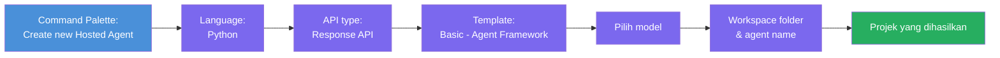
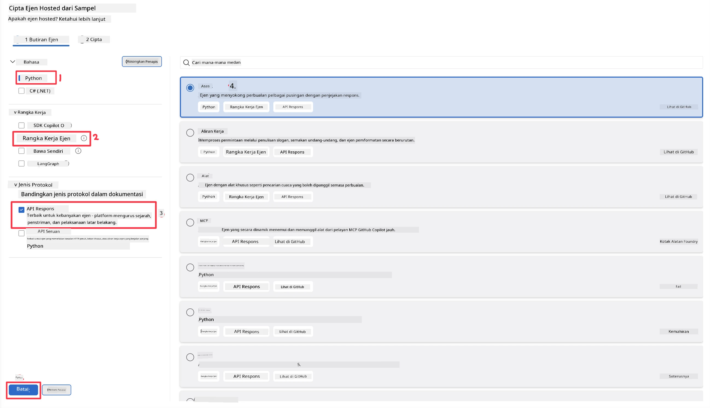
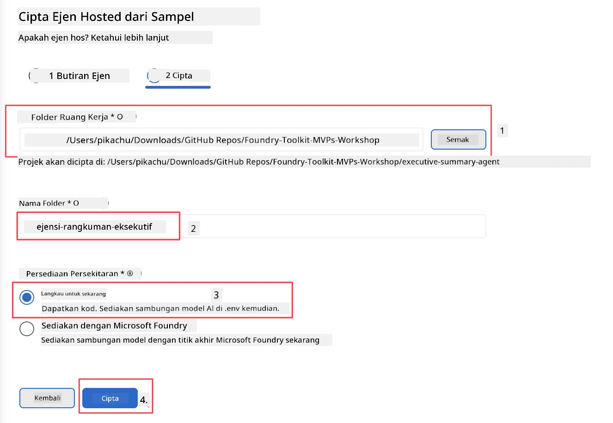

# Modul 2 - Cipta Ejen Terhos Baru

⏱️ ~5 min

Dalam modul ini, anda menggunakan Foundry Toolkit untuk **membina projek ejen terhos**. Scaffold menjana struktur projek penuh - `agent.yaml`, `main.py`, `Dockerfile`, `requirements.txt`, dan konfigurasi debug VS Code - supaya anda boleh memberi tumpuan untuk menyesuaikan tingkah laku ejen.

> **Konsep utama:** Folder `agent/` dalam makmal ini adalah contoh apa yang dihasilkan oleh Foundry Toolkit. Anda tidak menulis fail-fail ini dari awal.

### Aliran wizard scaffold



---

## Langkah 1: Buka wizard Cipta Ejen Terhos

1. Tekan `Ctrl+Shift+P` untuk membuka **Command Palette**.
2. Taip: **Foundry Toolkit: Create new Hosted Agent** dan pilih.

> **Alternatif: Cipta melalui Foundry Portal**
> Jika anda lebih suka menggunakan pelayar, anda boleh mencipta projek anda di [https://ai.azure.com](https://ai.azure.com). Setelah projek disediakan, kembali ke VS Code dan gunakan bar sisi **Foundry Toolkit** untuk menyambung kepadanya.

> **Alternatif:** Klik ikon **+** di sebelah **Hosted Agents (Preview)** dalam bar sisi Foundry Toolkit.

## Langkah 2: Pilih tetapan



1. Pada bahagian navigasi/pilihan kiri pilih yang berikut:

| Menu | Pilihan | Nota |
|--------|-----------|-------|
| **Language** | Python | C# juga disokong |
| **Framework** | Agent Framework | Titik permulaan mudah menggunakan Agent Framework SDK |
| **API type** | Response API | `POST /responses` - perbualan, dengan sejarah diurus platform |
| **Template** | Basic | Titik permulaan mudah menggunakan Agent Framework SDK |

2. Setelah dipilih, klik **Next**



3. Dalam tetingkap seterusnya, pilih yang berikut:

| Menu | Pilihan | Nota |
|--------|-----------|-------|
| **Workspace folder** | Pilih folder sasaran | contohnya, `/workspace/Foundry_Toolkit_for_VSCode_Lab/` atau subfolder dalam repo ini |
| **Agent name** | Masukkan nama | contohnya, `executive-summary-agent` |
| **Environment Setup** | langkau persediaan buat masa ini |  |

Klik **create** untuk mencipta ejen kita. Folder baru akan diwujudkan dengan nama ejen terhos itu.

## Langkah 3: Periksa projek yang dijana

Selepas scaffolding selesai, sahkan anda melihat fail-fail ini dalam Explorer (`Ctrl+Shift+E`):

```
📂 my-agent/
├── .env                ← Environment variables (placeholders)
├── .vscode/
│   ├── launch.json     ← Debug config (F5 → run + Agent Inspector)
│   └── tasks.json      ← VS Code task definitions
├── agent.yaml          ← Agent definition (kind: hosted)
├── Dockerfile          ← Container config for deployment
├── main.py             ← Agent entry point (your main code)
└── requirements.txt    ← Python dependencies
```

### Penjelasan fail utama

| Fail | Tujuan |
|------|---------|
| `agent.yaml` | Mengisytiharkan ejen sebagai `kind: hosted`, memetakan pembolehubah persekitaran, mentakrifkan protokol `/responses` |
| `main.py` | Mencipta `FoundryChatClient` → membungkusnya dalam `Agent` dengan arahan → menyajikan melalui `ResponsesHostServer` di port 8088 |
| `Dockerfile` | Menggunakan `python:3.12-slim`, memasang kebergantungan, mendedahkan port 8088, menjalankan `main.py` |
| `requirements.txt` | `agent-framework-foundry`, `agent-framework-foundry-hosting`, `mcp`, `debugpy` |

> **Penting:** Buka folder ejen scaffolded terus dalam VS Code (folder `agent/` itu sendiri) supaya `.vscode/launch.json` dan `tasks.json` berfungsi dengan betul untuk debugging F5.

---

### ✅ Titik semak

- [ ] Projek scaffolded dicipta dengan semua fail yang dijangka
- [ ] `agent.yaml` menunjukkan `kind: hosted` dan `protocol: responses`
- [ ] `main.py` mengimport `Agent`, `FoundryChatClient`, `ResponsesHostServer`
- [ ] Folder ejen dibuka dalam VS Code sebagai akar workspace

---

**Sebelum:** [01 - Persediaan](01-setup.md) · **Seterusnya:** [03 - Konfig & Kod →](03-configure-and-code.md)

---

<!-- CO-OP TRANSLATOR DISCLAIMER START -->
**Penafian**:
Dokumen ini telah diterjemahkan menggunakan perkhidmatan terjemahan AI [Co-op Translator](https://github.com/Azure/co-op-translator). Walaupun kami berusaha untuk ketepatan, sila ambil maklum bahawa terjemahan automatik mungkin mengandungi kesilapan atau ketidaktepatan. Dokumen asal dalam bahasa asalnya harus dianggap sebagai sumber yang sahih. Untuk maklumat penting, terjemahan oleh manusia profesional adalah disyorkan. Kami tidak bertanggungjawab terhadap sebarang salah faham atau salah tafsir yang timbul daripada penggunaan terjemahan ini.
<!-- CO-OP TRANSLATOR DISCLAIMER END -->