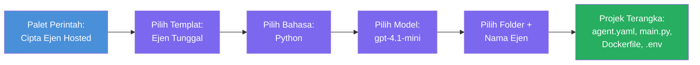

# Modul 3 - Cipta Ejen Hosted Baharu (Auto-Scaffolded oleh Sambungan Foundry)

Dalam modul ini, anda menggunakan sambungan Microsoft Foundry untuk **menghasilkan projek [ejen hosted](https://learn.microsoft.com/azure/foundry/agents/concepts/hosted-agents) baru**. Sambungan ini menjana keseluruhan struktur projek untuk anda - termasuk `agent.yaml`, `main.py`, `Dockerfile`, `requirements.txt`, fail `.env`, dan konfigurasi debug VS Code. Selepas scaffold, anda menyesuaikan fail-fail ini dengan arahan, peralatan, dan konfigurasi ejen anda.

> **Konsep utama:** Folder `agent/` dalam makmal ini adalah contoh apa yang dijana oleh sambungan Foundry apabila anda menjalankan arahan scaffold ini. Anda tidak menulis fail ini daripada awal - sambungan yang menciptanya, kemudian anda mengubah suainya.

### Aliran wizard scaffold


---

## Langkah 1: Buka wizard Cipta Ejen Hosted

1. Tekan `Ctrl+Shift+P` untuk membuka **Command Palette**.
2. Taip: **Microsoft Foundry: Create a New Hosted Agent** dan pilihnya.
3. Wizard penciptaan ejen hosted dibuka.

> **Jalan alternatif:** Anda juga boleh mencapai wizard ini dari bar sisi Microsoft Foundry → klik ikon **+** di sebelah **Agents** atau klik kanan dan pilih **Create New Hosted Agent**.

---

## Langkah 2: Pilih templat anda

Wizard meminta anda memilih templat. Anda akan melihat pilihan seperti:

| Templat | Penerangan | Bila digunakan |
|---------|------------|----------------|
| **Single Agent** | Satu ejen dengan model, arahan, dan peralatan opsyenal sendiri | Bengkel ini (Makmal 01) |
| **Multi-Agent Workflow** | Pelbagai ejen yang bekerjasama secara berurutan | Makmal 02 |

1. Pilih **Single Agent**.
2. Klik **Next** (atau pemilihan berjalan secara automatik).

---

## Langkah 3: Pilih bahasa pengaturcaraan

1. Pilih **Python** (disyorkan untuk bengkel ini).
2. Klik **Next**.

> **C# juga disokong** jika anda lebih suka .NET. Struktur scaffold adalah serupa (menggunakan `Program.cs` bukannya `main.py`).

---

## Langkah 4: Pilih model anda

1. Wizard menunjukkan model-model yang telah dideploy dalam projek Foundry anda (dari Modul 2).
2. Pilih model yang anda deploy - contoh, **gpt-4.1-mini**.
3. Klik **Next**.

> Jika anda tidak melihat model, kembali ke [Modul 2](02-create-foundry-project.md) dan deploy satu dahulu.

---

## Langkah 5: Pilih lokasi folder dan nama ejen

1. Dialog fail dibuka - pilih **folder sasaran** di mana projek akan dibuat. Untuk bengkel ini:
   - Jika bermula baru: pilih mana-mana folder (contoh, `C:\Projects\my-agent`)
   - Jika bekerja dalam repo bengkel: buat subfolder baru di bawah `workshop/lab01-single-agent/agent/`
2. Masukkan **nama** untuk ejen hosted (contoh, `executive-summary-agent` atau `my-first-agent`).
3. Klik **Create** (atau tekan Enter).

---

## Langkah 6: Tunggu scaffold selesai

1. VS Code membuka **tingkap baru** dengan projek yang telah discaffold.
2. Tunggu beberapa saat untuk projek dimuatkan sepenuhnya.
3. Anda harus melihat fail berikut dalam panel Explorer (`Ctrl+Shift+E`):

```
📂 my-first-agent/
├── .env                ← Environment variables (auto-generated with placeholders)
├── .vscode/
│   └── launch.json     ← Debug configuration (F5 to run + Agent Inspector)
├── agent.yaml          ← Agent definition (kind: hosted)
├── Dockerfile          ← Container configuration for deployment
├── main.py             ← Agent entry point (your main code file)
└── requirements.txt    ← Python dependencies
```

> **Ini adalah struktur yang sama seperti folder `agent/`** dalam makmal ini. Sambungan Foundry menjana fail-fail ini secara automatik - anda tidak perlu buat secara manual.

> **Nota bengkel:** Dalam repositori bengkel ini, folder `.vscode/` berada di **akar ruang kerja** (bukan dalam setiap projek). Ia mengandungi `launch.json` dan `tasks.json` yang dikongsi dengan dua konfigurasi debug - **"Lab01 - Single Agent"** dan **"Lab02 - Multi-Agent"** - masing-masing menunjuk ke `cwd` lab yang betul. Apabila anda tekan F5, pilih konfigurasi yang sesuai dengan lab yang sedang anda gunakan dari menu dropdown.

---

## Langkah 7: Fahami setiap fail yang dijana

Luangkan masa untuk memeriksa setiap fail yang wizard hasilkan. Memahaminya penting untuk Modul 4 (penyesuaian).

### 7.1 `agent.yaml` - Definisi Ejen

Buka `agent.yaml`. Ia kelihatan seperti berikut:

```yaml
# yaml-language-server: $schema=https://raw.githubusercontent.com/microsoft/AgentSchema/refs/heads/main/schemas/v1.0/ContainerAgent.yaml

kind: hosted
name: my-first-agent
description: >
  A hosted agent deployed to Microsoft Foundry Agent Service.
metadata:
  authors:
    - Microsoft
  tags:
    - Azure AI AgentServer
    - Microsoft Agent Framework
    - Hosted Agent
protocols:
  - protocol: responses
    version: v1
environment_variables:
  - name: AZURE_AI_PROJECT_ENDPOINT
    value: ${PROJECT_ENDPOINT}
  - name: AZURE_AI_MODEL_DEPLOYMENT_NAME
    value: ${MODEL_DEPLOYMENT_NAME}
dockerfile_path: Dockerfile
resources:
  cpu: '0.25'
  memory: 0.5Gi
```

**Medan utama:**

| Medan | Tujuan |
|-------|--------|
| `kind: hosted` | Menyatakan ini adalah ejen hosted (berasaskan kontena, dideploy ke [Foundry Agent Service](https://learn.microsoft.com/azure/foundry/agents/overview)) |
| `protocols: responses v1` | Ejen mendedahkan endpoint HTTP `/responses` yang serasi dengan OpenAI |
| `environment_variables` | Memetakan nilai `.env` ke pembolehubah persekitaran kontena semasa deploy |
| `dockerfile_path` | Menunjukkan ke Dockerfile yang digunakan untuk bina imej kontena |
| `resources` | Peruntukan CPU dan memori untuk kontena (0.25 CPU, 0.5Gi memori) |

### 7.2 `main.py` - Titik masuk Ejen

Buka `main.py`. Ini adalah fail Python utama di mana logik ejen anda berada. Scaffold termasuk:

```python
from agent_framework.azure import AzureAIAgentClient
from azure.ai.agentserver.agentframework import from_agent_framework
from azure.identity.aio import DefaultAzureCredential
```

**Import utama:**

| Import | Tujuan |
|--------|--------|
| `AzureAIAgentClient` | Sambung ke projek Foundry anda dan cipta ejen melalui `.as_agent()` |
| [`DefaultAzureCredential`](https://learn.microsoft.com/azure/developer/python/sdk/authentication/credential-chains#defaultazurecredential-overview) | Mengendalikan pengesahan (Azure CLI, log masuk VS Code, managed identity, atau service principal) |
| `from_agent_framework` | Membalut ejen sebagai pelayan HTTP yang mendedahkan endpoint `/responses` |

Aliran utama adalah:
1. Buat credential → buat client → panggil `.as_agent()` untuk dapatkan ejen (pengurus konteks async) → balut sebagai pelayan → jalankan

### 7.3 `Dockerfile` - Imej kontena

```dockerfile
FROM python:3.14-slim

WORKDIR /app

COPY ./ .

RUN pip install --upgrade pip && \
    if [ -f requirements.txt ]; then \
        pip install -r requirements.txt; \
    else \
        echo "No requirements.txt found" >&2; exit 1; \
    fi

EXPOSE 8088

CMD ["python", "main.py"]
```

**Perincian utama:**
- Menggunakan `python:3.14-slim` sebagai imej asas.
- Menyalin semua fail projek ke dalam `/app`.
- Mengemaskini `pip`, memasang kebergantungan dari `requirements.txt`, dan gagal segera jika fail itu tiada.
- **Mendedahkan port 8088** - ini port yang diperlukan untuk ejen hosted. Jangan ubah.
- Memulakan ejen dengan `python main.py`.

### 7.4 `requirements.txt` - Kebergantungan

```
agent-framework-azure-ai==1.0.0rc3
agent-framework-core==1.0.0rc3
azure-ai-agentserver-agentframework==1.0.0b16
azure-ai-agentserver-core==1.0.0b16
debugpy
agent-dev-cli
```

| Pakej | Tujuan |
|--------|--------|
| `agent-framework-azure-ai` | Integrasi Azure AI untuk Microsoft Agent Framework |
| `agent-framework-core` | Runtime teras untuk bina ejen (termasuk `python-dotenv`) |
| `azure-ai-agentserver-agentframework` | Runtime pelayan ejen hosted untuk Foundry Agent Service |
| `azure-ai-agentserver-core` | Abstraksi pelayan ejen teras |
| `debugpy` | Sokongan debugging Python (membolehkan debug F5 di VS Code) |
| `agent-dev-cli` | CLI pembangunan tempatan untuk menguji ejen (digunakan oleh konfigurasi debug/jalankan) |

---

## Memahami protokol ejen

Ejen hosted berkomunikasi melalui protokol **OpenAI Responses API**. Ketika beroperasi (secara lokal atau di awan), ejen mendedahkan satu endpoint HTTP sahaja:

```
POST http://localhost:8088/responses
Content-Type: application/json

{
  "input": "Your prompt here",
  "stream": false
}
```

Foundry Agent Service memanggil endpoint ini untuk menghantar prompt pengguna dan menerima respons ejen. Ini adalah protokol yang sama digunakan oleh API OpenAI, jadi ejen anda serasi dengan sebarang klien yang menggunakan format OpenAI Responses.

---

### Titik Semak

- [ ] Wizard scaffold selesai dengan jayanya dan **tingkap VS Code baru** dibuka
- [ ] Anda dapat melihat semua 5 fail: `agent.yaml`, `main.py`, `Dockerfile`, `requirements.txt`, `.env`
- [ ] Fail `.vscode/launch.json` wujud (membolehkan debug F5 - dalam bengkel ini ia berada di akar ruang kerja dengan konfigurasi khas lab)
- [ ] Anda telah membaca setiap fail dan faham tujuannya
- [ ] Anda faham bahawa port `8088` diperlukan dan endpoint `/responses` adalah protokol

---

**Sebelum ini:** [02 - Create Foundry Project](02-create-foundry-project.md) · **Seterusnya:** [04 - Configure & Code →](04-configure-and-code.md)

---

<!-- CO-OP TRANSLATOR DISCLAIMER START -->
**Penafian**:
Dokumen ini telah diterjemahkan menggunakan perkhidmatan terjemahan AI [Co-op Translator](https://github.com/Azure/co-op-translator). Walaupun kami berusaha untuk ketepatan, sila sedar bahawa terjemahan automatik mungkin mengandungi kesilapan atau ketidaktepatan. Dokumen asal dalam bahasa asalnya harus dianggap sebagai sumber yang sahih. Untuk maklumat penting, terjemahan manusia profesional adalah disyorkan. Kami tidak bertanggungjawab terhadap sebarang salah faham atau salah tafsir yang timbul daripada penggunaan terjemahan ini.
<!-- CO-OP TRANSLATOR DISCLAIMER END -->