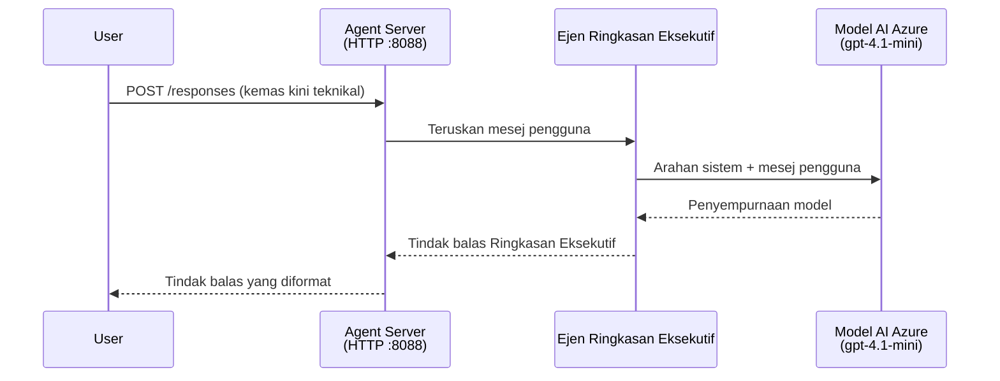
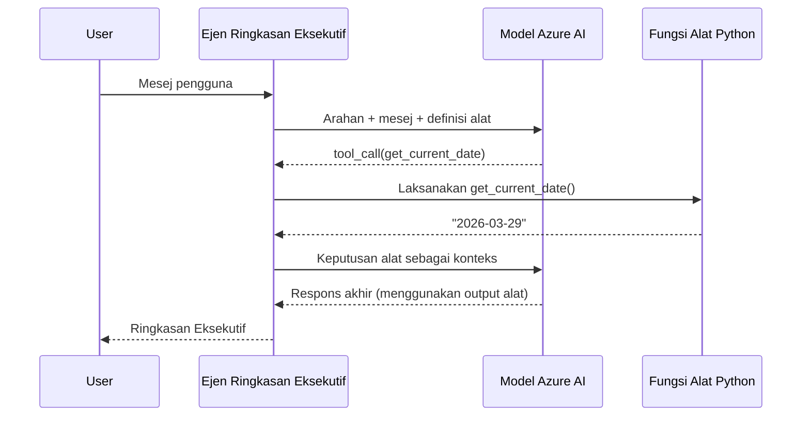

# Modul 4 - Konfigurasikan Arahan, Persekitaran & Pasang Kebergantungan

Dalam modul ini, anda menyesuaikan fail ejen yang dibina secara automatik dari Modul 3. Di sinilah anda mengubah radas generik menjadi **ejen anda** - dengan menulis arahan, menetapkan pembolehubah persekitaran, menambah alat secara pilihan, dan memasang kebergantungan.

> **Peringatan:** Sambungan Foundry menjana fail projek anda secara automatik. Kini anda ubah suai. Lihat folder [`agent/`](../../../../../workshop/lab01-single-agent/agent) untuk contoh lengkap ejen yang disesuaikan dan berfungsi.

---

## Bagaimana komponen saling berkaitan

### Kitaran hayat permintaan (ejen tunggal)


> **Dengan alat:** Jika ejen mempunyai alat yang didaftarkan, model mungkin mengembalikan panggilan alat dan bukannya penyudahan langsung. Rangka kerja menjalankan alat itu secara tempatan, memberi maklum balas hasil kepada model, dan model kemudian menghasilkan tindak balas akhir.


---

## Langkah 1: Konfigurasikan pembolehubah persekitaran

Radas mencipta fail `.env` dengan nilai tempat letak. Anda perlu mengisi nilai sebenar dari Modul 2.

1. Dalam projek yang di-radas, buka fail **`.env`** (ia berada di akar projek).
2. Gantikan nilai tempat letak dengan maklumat projek Foundry anda yang sebenar:

   ```env
   PROJECT_ENDPOINT=https://<your-account>.services.ai.azure.com/api/projects/<your-project>
   MODEL_DEPLOYMENT_NAME=gpt-4.1-mini
   ```

3. Simpan fail tersebut.

### Di mana untuk mencari nilai-nilai ini

| Nilai | Cara mencarinya |
|-------|-----------------|
| **Titik akhir projek** | Buka bar sisi **Microsoft Foundry** dalam VS Code → klik projek anda → URL titik akhir dipaparkan dalam pandangan butiran. Ia kelihatan seperti `https://<account-name>.services.ai.azure.com/api/projects/<project-name>` |
| **Nama penyebaran model** | Dalam bar sisi Foundry, kembangkan projek anda → lihat di bawah **Models + endpoints** → nama disenaraikan bersebelahan model yang dikerahkan (contohnya, `gpt-4.1-mini`) |

> **Keselamatan:** Jangan sekali-kali komit fail `.env` ke kawalan versi. Ia sudah termasuk dalam `.gitignore` secara default. Jika tidak ada, tambahkan:
> ```
> .env
> ```

### Bagaimana pembolehubah persekitaran mengalir

Rantai pemetaan adalah: `.env` → `main.py` (membaca melalui `os.getenv`) → `agent.yaml` (memetak ke pembolehubah persekitaran kontena semasa masa penyebaran).

Dalam `main.py`, radas membaca nilai-nilai ini seperti berikut:

```python
PROJECT_ENDPOINT = os.getenv("AZURE_AI_PROJECT_ENDPOINT") or os.getenv("PROJECT_ENDPOINT")
MODEL_DEPLOYMENT_NAME = os.getenv("AZURE_AI_MODEL_DEPLOYMENT_NAME", os.getenv("MODEL_DEPLOYMENT_NAME", "gpt-4.1-mini"))
```

Kedua-dua `AZURE_AI_PROJECT_ENDPOINT` dan `PROJECT_ENDPOINT` diterima (fail `agent.yaml` menggunakan awalan `AZURE_AI_*`).

---

## Langkah 2: Tulis arahan ejen

Ini adalah langkah penyesuaian yang paling penting. Arahan mendefinisikan personaliti, tingkah laku, format output, dan sekatan keselamatan ejen anda.

1. Buka `main.py` dalam projek anda.
2. Cari rentetan arahan (radas memasukkan satu arahan lalai/generik).
3. Gantikannya dengan arahan terperinci dan berstruktur.

### Apa yang termasuk dalam arahan yang baik

| Komponen | Tujuan | Contoh |
|----------|--------|--------|
| **Peranan** | Apa ejen itu dan apa yang dilakukannya | "Anda adalah ejen ringkasan eksekutif" |
| **Penonton** | Siapa penerima jawapan tersebut | "Pemimpin kanan dengan latar belakang teknikal terhad" |
| **Definisi input** | Jenis prompt yang ditangani | "Laporan insiden teknikal, kemas kini operasi" |
| **Format output** | Struktur tepat jawapan | "Ringkasan Eksekutif: - Apa yang berlaku: ... - Impak perniagaan: ... - Langkah seterusnya: ..." |
| **Peraturan** | Sekatan dan syarat penolakan | "Jangan tambah maklumat selain yang diberikan" |
| **Keselamatan** | Elakkan penyalahgunaan dan halusinasi | "Jika input tidak jelas, minta penjelasan" |
| **Contoh** | Pasangan input/output untuk mengarah tingkah laku | Sertakan 2-3 contoh dengan input yang berbeza |

### Contoh: Arahan Ejen Ringkasan Eksekutif

Ini adalah arahan yang digunakan dalam [`agent/main.py`](../../../../../workshop/lab01-single-agent/agent/main.py) bengkel:

```python
AGENT_INSTRUCTIONS = """You are an "Explain Like I'm an Executive" agent.

Purpose:
Your job is to translate complex technical or operational information into
clear, concise, and outcome-focused summaries that can be easily understood
by non-technical executives.

Audience:
Senior leaders with limited technical background who care about impact,
risk, and what happens next.

What you must do:
- Rephrase the input so it is understandable to a non-technical audience
- Prioritize clarity, brevity, and outcomes over technical accuracy
- Remove technical jargon, logs, metrics, stack traces, and deep root-cause details
- Translate technical causes into simple cause-and-effect statements
- Explicitly call out business impact
- Always include a clear next step or action
- Maintain a neutral, factual, and calm executive tone
- Do NOT add new facts or speculate beyond the input

Standard Output Structure (always use this wording):

Executive Summary:
- What happened: <plain-language description>
- Business impact: <clear, non-technical impact>
- Next step: <clear action or mitigation>

Rules:
- Keep responses under 100 words
- Do NOT add facts beyond the input
- If input is unclear, ask for clarification
"""
```

4. Gantikan rentetan arahan sedia ada dalam `main.py` dengan arahan khusus anda.
5. Simpan fail tersebut.

---

## Langkah 3: (Pilihan) Tambah alat khusus

Ejen hos boleh menjalankan **fungsi Python tempatan** sebagai [alat](https://learn.microsoft.com/azure/foundry/agents/concepts/tool-catalog). Ini adalah kelebihan utama agen berasaskan kod berbanding agen hanya-prompt - ejen anda boleh menjalankan logik pelayan yang sewenang-wenangnya.

### 3.1 Definisikan fungsi alat

Tambah fungsi alat dalam `main.py`:

```python
from agent_framework import tool

@tool
def get_current_date() -> str:
    """Returns the current date in YYYY-MM-DD format."""
    from datetime import date
    return str(date.today())
```

Penghias `@tool` mengubah fungsi Python standard kepada alat ejen. Docstring menjadi penerangan alat yang model lihat.

### 3.2 Daftarkan alat dengan ejen

Apabila mencipta ejen melalui pengurus konteks `.as_agent()`, berikan alat dalam parameter `tools`:

```python
async with AzureAIAgentClient(
    project_endpoint=PROJECT_ENDPOINT,
    model_deployment_name=MODEL_DEPLOYMENT_NAME,
    credential=credential,
).as_agent(
    name="my-agent",
    instructions=AGENT_INSTRUCTIONS,
    tools=[get_current_date],
) as agent:
    server = from_agent_framework(agent)
    await server.run_async()
```

### 3.3 Bagaimana panggilan alat berfungsi

1. Pengguna menghantar prompt.
2. Model menentukan jika alat diperlukan (berdasarkan prompt, arahan, dan penerangan alat).
3. Jika alat diperlukan, rangka kerja memanggil fungsi Python anda secara tempatan (dalam kontena).
4. Nilai pulangan alat dihantar kembali kepada model sebagai konteks.
5. Model menghasilkan tindak balas akhir.

> **Alat dijalankan di pelayan** - mereka dijalankan dalam kontena anda, bukan di pelayar pengguna atau model. Ini bermakna anda boleh mengakses pangkalan data, API, sistem fail, atau mana-mana perpustakaan Python.

---

## Langkah 4: Cipta dan aktifkan persekitaran maya

Sebelum memasang kebergantungan, cipta persekitaran Python yang terasing.

### 4.1 Cipta persekitaran maya

Buka terminal dalam VS Code (`` Ctrl+` ``) dan jalankan:

```powershell
python -m venv .venv
```

Ini mencipta folder `.venv` dalam direktori projek anda.

### 4.2 Aktifkan persekitaran maya

**PowerShell (Windows):**

```powershell
.\.venv\Scripts\Activate.ps1
```

**Command Prompt (Windows):**

```cmd
.venv\Scripts\activate.bat
```

**macOS/Linux (Bash):**

```bash
source .venv/bin/activate
```

Anda sepatutnya melihat `(.venv)` muncul di awal petikan terminal, menandakan persekitaran maya telah diaktifkan.

### 4.3 Pasang kebergantungan

Dengan persekitaran maya aktif, pasang pakej yang diperlukan:

```powershell
pip install -r requirements.txt
```

Ini memasang:

| Pakej | Tujuan |
|-------|--------|
| `agent-framework-azure-ai==1.0.0rc3` | Integrasi Azure AI untuk [Microsoft Agent Framework](https://learn.microsoft.com/agent-framework/overview/) |
| `agent-framework-core==1.0.0rc3` | Runtime teras untuk membina ejen (termasuk `python-dotenv`) |
| `azure-ai-agentserver-agentframework==1.0.0b16` | Runtime pelayan ejen hos untuk [Foundry Agent Service](https://learn.microsoft.com/azure/foundry/agents/overview) |
| `azure-ai-agentserver-core==1.0.0b16` | Abstraksi pelayan ejen teras |
| `debugpy` | Debugging Python (memungkinkan debug F5 dalam VS Code) |
| `agent-dev-cli` | CLI pembangunan tempatan untuk menguji ejen |

### 4.4 Sahkan pemasangan

```powershell
pip list | Select-String "agent-framework|agentserver"
```

Output yang dijangka:
```
agent-framework-azure-ai   1.0.0rc3
agent-framework-core       1.0.0rc3
azure-ai-agentserver-agentframework 1.0.0b16
azure-ai-agentserver-core  1.0.0b16
```

---

## Langkah 5: Sahkan pengesahan

Ejen menggunakan [`DefaultAzureCredential`](https://learn.microsoft.com/azure/developer/python/sdk/authentication/credential-chains#defaultazurecredential-overview) yang mencuba pelbagai kaedah pengesahan mengikut susunan berikut:

1. **Pembolehubah persekitaran** - `AZURE_CLIENT_ID`, `AZURE_TENANT_ID`, `AZURE_CLIENT_SECRET` (prinsipal servis)
2. **Azure CLI** - mengambil sesi `az login` anda
3. **VS Code** - menggunakan akaun yang anda log masuk ke VS Code
4. **Identiti Terurus** - digunakan semasa berjalan di Azure (pada masa penyebaran)

### 5.1 Sahkan untuk pembangunan tempatan

Sekurang-kurangnya satu daripada ini harus berfungsi:

**Pilihan A: Azure CLI (disyorkan)**

```powershell
az account show --query "{name:name, id:id}" --output table
```

Jangkaan: Memaparkan nama dan ID langganan anda.

**Pilihan B: Log masuk VS Code**

1. Lihat di bahagian bawah-kiri VS Code untuk ikon **Akaun**.
2. Jika anda melihat nama akaun anda, anda telah disahkan.
3. Jika tidak, klik ikon → **Log masuk untuk menggunakan Microsoft Foundry**.

**Pilihan C: Prinsipal servis (untuk CI/CD)**

```powershell
$env:AZURE_TENANT_ID = "<your-tenant-id>"
$env:AZURE_CLIENT_ID = "<your-client-id>"
$env:AZURE_CLIENT_SECRET = "<your-client-secret>"
```

### 5.2 Masalah pengesahan biasa

Jika anda log masuk ke banyak akaun Azure, pastikan langganan yang betul dipilih:

```powershell
az account set --subscription "<your-subscription-id>"
```

---

### Titik Pemeriksaan

- [ ] Fail `.env` mempunyai `PROJECT_ENDPOINT` dan `MODEL_DEPLOYMENT_NAME` yang sah (bukan tempat letak)
- [ ] Arahan ejen disesuaikan dalam `main.py` - mendefinisikan peranan, penonton, format output, peraturan, dan sekatan keselamatan
- [ ] (Pilihan) Alat khusus ditakrifkan dan didaftarkan
- [ ] Persekitaran maya telah dicipta dan diaktifkan (`(.venv)` kelihatan di petikan terminal)
- [ ] `pip install -r requirements.txt` selesai tanpa ralat
- [ ] `pip list | Select-String "azure-ai-agentserver"` menunjukkan pakej dipasang
- [ ] Pengesahan sah - `az account show` memaparkan langganan anda ATAU anda telah log masuk ke VS Code

---

**Sebelum ini:** [03 - Cipta Ejen Hos](03-create-hosted-agent.md) · **Seterusnya:** [05 - Uji Secara Tempatan →](05-test-locally.md)

---

<!-- CO-OP TRANSLATOR DISCLAIMER START -->
**Penafian**:  
Dokumen ini telah diterjemahkan menggunakan perkhidmatan terjemahan AI [Co-op Translator](https://github.com/Azure/co-op-translator). Walaupun kami berusaha untuk ketepatan, sila ambil maklum bahawa terjemahan automatik mungkin mengandungi kesilapan atau ketidaktepatan. Dokumen asal dalam bahasa asalnya harus dianggap sebagai sumber yang sahih. Untuk maklumat kritikal, terjemahan profesional oleh manusia adalah disyorkan. Kami tidak bertanggungjawab atas sebarang salah faham atau salah tafsir yang timbul daripada penggunaan terjemahan ini.
<!-- CO-OP TRANSLATOR DISCLAIMER END -->