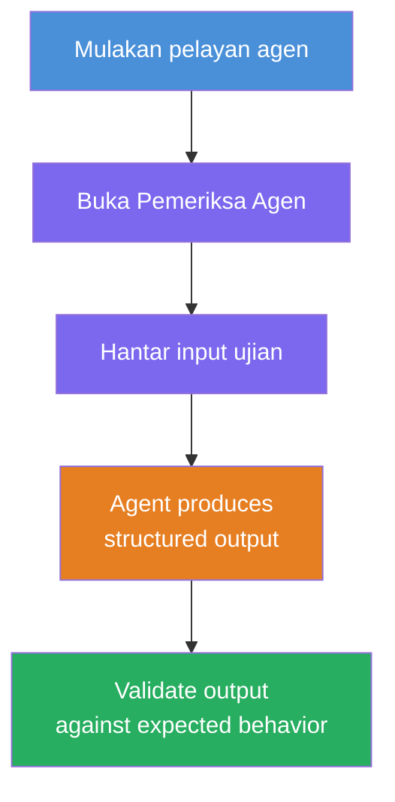
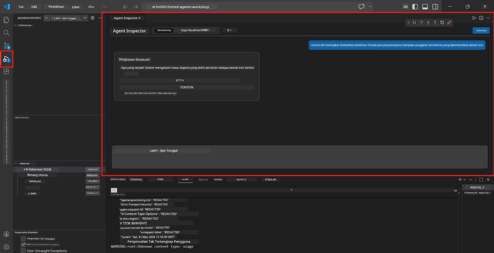
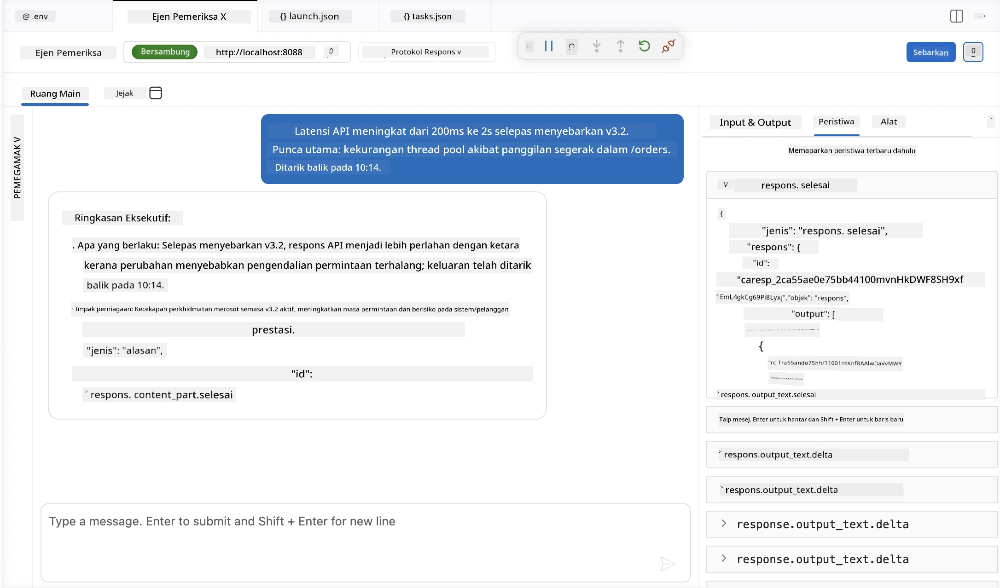

# Modul 4 - Uji Secara Tempatan

⏱️ ~10 minit

Dalam modul ini, anda menjalankan ejen anda secara tempatan dan mengesahkan ia berfungsi dengan betul menggunakan **ujian fungsi laluan bahagia**. Anda akan menggunakan Agent Inspector (UI visual) atau panggilan HTTP terus untuk mengesahkan ejen menghasilkan tindak balas berstruktur dan tepat.

### Aliran ujian tempatan



---

## Pilihan 1: Tekan F5 - Debug dengan Agent Inspector (disyorkan)

### Mulakan debugger

1. Buka folder **executive-summary-agent/** terus dalam VS Code (`File → Open Folder`).
2. Buka panel **Run and Debug** (`Ctrl+Shift+D`).
3. Pilih **Debug Local Agent Server** dari dropdown.
4. Tekan **F5** (atau klik ▶ Mula Debugging).

> ⚠️ **Kritikal: Pilih Interpreter Python anda**
> Jika anda mendapat "ModuleNotFoundError" atau debugger gagal mula, anda mesti memberitahu VS Code untuk menggunakan persekitaran maya anda:
  > 1. Tekan `Ctrl+Shift+P` $\rightarrow$ taip **Python: Select Interpreter**.
  > 2. Pilih interpreter yang terletak dalam folder `.venv` projek anda (contoh, `.\.venv\Scripts\python.exe` pada Windows).
  > 3. Mulakan semula sesi debug.
> Jika anda masih mendapat ralat, kemas kini fail `tasks.json` anda secara manual seperti berikut:
  > 1. Pergi ke fail `.vscode/tasks.json`
  > 2. Pergi ke arahan yang bertajuk: `Run Agent/Workflow HTTP Server`
  > 3. Kemas kini nilai arahan seperti berikut: `"value": "${workspaceFolder}/.venv/bin/python",`

### Apa yang berlaku

1. Pelayan HTTP bermula pada `http://localhost:8088/responses`.
2. Panel **Agent Inspector** terbuka secara automatik - antara muka sembang visual untuk ujian.
3. Breakpoint diaktifkan dalam `main.py`.

Perhatikan Terminal untuk:
```
Starting executive summary hosted agent
Executive agent server running on http://localhost:8088
```

> **Jika Agent Inspector tidak terbuka:** Tekan `Ctrl+Shift+P` → **Foundry Toolkit: Open Agent Inspector**.



> *Tangkapan skrin mungkin menunjukkan penjenamaan 'AI TOOLKIT' yang lebih lama dari versi sambungan terdahulu.*

---

## Pilihan 2: Uji melalui Terminal (alternatif)

Mulakan ejen dalam satu terminal, hantar permintaan dari terminal lain:

```bash
# Terminal 1: Mulakan ejen
cd executive-summary-agent/
source .venv/bin/activate
python main.py
```

```bash
# Terminal 2: Hantar ujian (curl)
curl -sS -X POST http://localhost:8088/responses \
  -H "Content-Type: application/json" \
  -d '{"input": "The API latency increased due to thread pool exhaustion caused by sync calls in v3.2.", "stream": false}'
```

---

## Ujian senario: pengesahan fungsi laluan bahagia

Jalankan **ketiga-tiga** senario di bawah. Ini mengesahkan yang ejen anda menghasilkan output yang betul dan berstruktur untuk input yang realistik.



### Senario 1: Insiden IT - Lonjakan latensi API

**Input:**
```
The API latency increased from 200ms to 2s after deploying v3.2.
Root cause: thread pool starvation from synchronous calls in /orders.
Rolled back at 10:14.
```

**Kelakuan dijangka:**
- ✅ Mengikuti struktur "Executive Summary" (Apa yang berlaku / Kesan perniagaan / Langkah seterusnya)
- ✅ Tiada jargon teknikal (tiada "thread pool", tiada "/orders", tiada "v3.2")
- ✅ Menyatakan dengan jelas kesan perniagaan (contoh, pengguna mengalami kelewatan)
- ✅ Termasuk langkah seterusnya (contoh, pembaikan telah dilaksanakan, pemantauan di tempat)

---

### Senario 2: Saluran Data - Kegagalan ETL

**Input:**
```
The nightly ETL job failed because the upstream schema changed. APAC dashboards show missing data.
```

**Kelakuan dijangka:**
- ✅ Merumuskan kegagalan penyegaran data dalam bahasa biasa
- ✅ Menyebut kesan papan pemuka APAC
- ✅ Termasuk langkah pembetulan
- ✅ TIDAK menyebut "ETL", "skema", atau istilah teknikal lain

---

### Senario 3: Keselamatan - Pendedahan kelayakan

**Input:**
```
Static analysis flagged a hardcoded secret in the repository.
The secret may have been exposed in commit history.
```

**Kelakuan dijangka:**
- ✅ Menggambarkan isu kelayakan/keselamatan dalam bahasa mesra eksekutif
- ✅ Menyatakan potensi risiko (akses tanpa kebenaran)
- ✅ Menyatakan tindakan pembetulan (putaran kelayakan, audit)
- ✅ TIDAK termasuk istilah seperti "analisis statik", "sejarah komit", atau "hardcoded"

---

## Kriteria pengesahan

Untuk setiap senario, periksa:

| # | Kriteria | Syarat lulus |
|---|----------|---------------|
| 1 | **Struktur** | Tindak balas menggunakan format "Executive Summary" dengan ketiga-tiga peluru |
| 2 | **Bahasa mudah** | Tiada jargon teknikal yang eksekutif tidak faham |
| 3 | **Ketepatan** | Ringkasan mencerminkan input - tiada butiran direka |
| 4 | **Ringkas** | Tindak balas kurang daripada 100 patah perkataan |
| 5 | **Langkah seterusnya** | Tindakan atau mitigasi jelas dinyatakan |

---

## Petua penyahpepijatan

| Isu | Pembetulan |
|-------|-----|
| Ejen tidak bermula | Semak nilai `.env`, sahkan venv diaktifkan, jalankan `pip install -r requirements.txt` |
| Tindak balas kosong atau umum | Semak arahan dalam `main.py` - pastikan format output dinyatakan |
| Tindak balas termasuk jargon | Perketatkan peraturan "buang istilah teknikal" dalam arahan |
| Agent Inspector tidak terbuka | `Ctrl+Shift+P` → **Foundry Toolkit: Open Agent Inspector** |
| Ralat model dalam Terminal | Sahkan `AZURE_AI_MODEL_DEPLOYMENT_NAME` tepat sama (sensitif huruf besar) |

---

### ✅ Titik semak

- [ ] Ejen bermula secara tempatan tanpa ralat
- [ ] Agent Inspector terbuka dan menunjukkan antara muka sembang (jika menggunakan F5)
- [ ] **Senario 1** (insiden IT) - Executive Summary berstruktur, tiada jargon
- [ ] **Senario 2** (saluran data) - rumusan relevan dengan kesan perniagaan
- [ ] **Senario 3** (amaran keselamatan) - komunikasi risiko sesuai
- [ ] Semua tindak balas mengikuti struktur output yang ditentukan

> **Simpan tindak balas anda** (salin atau tangkapan skrin) - anda akan bandingkan dengan keputusan awan dalam Modul 06.

---

**Sebelumnya:** [03 - Konfigurasi & Kod](03-configure-and-code.md) · **Seterusnya:** [05 - Deploy ke Foundry →](05-deploy-to-foundry.md)

---

<!-- CO-OP TRANSLATOR DISCLAIMER START -->
**Penafian**:
Dokumen ini telah diterjemahkan menggunakan perkhidmatan terjemahan AI [Co-op Translator](https://github.com/Azure/co-op-translator). Walaupun kami berusaha untuk ketepatan, sila ambil maklum bahawa terjemahan automatik mungkin mengandungi kesilapan atau ketidaktepatan. Dokumen asal dalam bahasa asalnya harus dianggap sebagai sumber yang sahih. Untuk maklumat penting, terjemahan oleh manusia profesional adalah disyorkan. Kami tidak bertanggungjawab terhadap sebarang salah faham atau salah tafsir yang timbul daripada penggunaan terjemahan ini.
<!-- CO-OP TRANSLATOR DISCLAIMER END -->