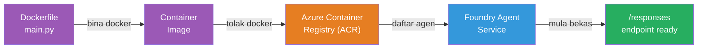
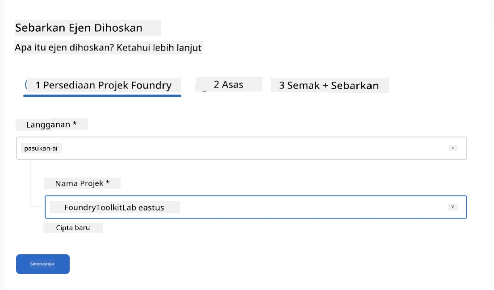
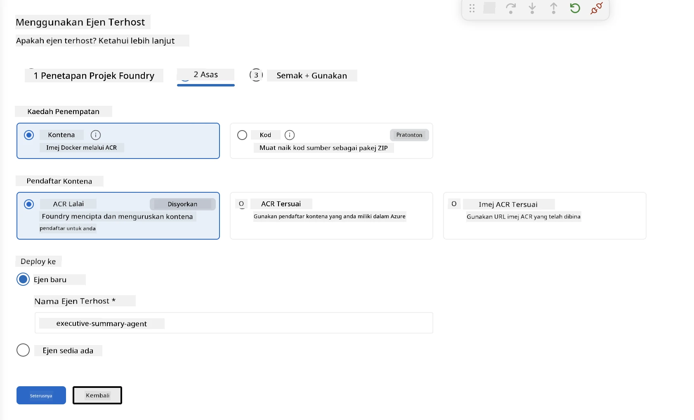
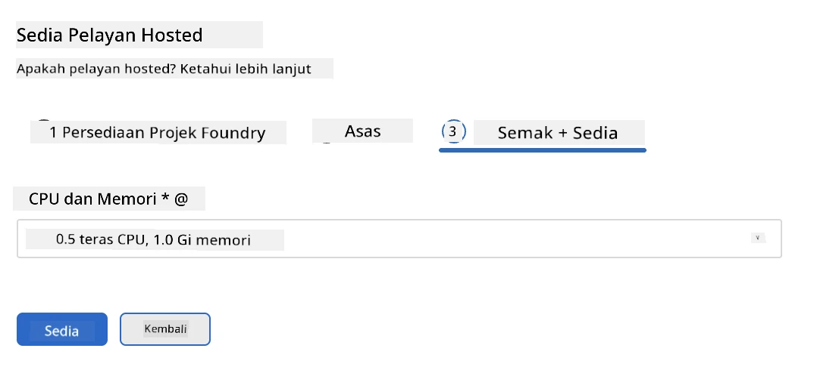
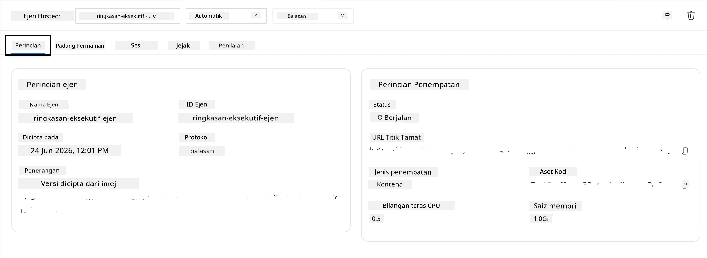

# Modul 5 - Menghantar ke Perkhidmatan Ejen Foundry

⏱️ ~10 minit

> ⚠️ **Pengguna Laluan B:** Modul ini memerlukan langganan Foundry. Jika anda menggunakan Foundry Tempatan, langkau ke [Modul 07 - Ringkasan](07-summary.md). Anda berjaya menyelesaikan aliran kerja pembangunan tempatan!

Dalam modul ini, anda menghantar ejen yang diuji secara tempatan ke Microsoft Foundry sebagai **Ejen Dihoskan**. Penghantaran membina imej kontena, menolaknya ke Azure Container Registry, dan memulakan ejen dalam infrastruktur yang diuruskan oleh Foundry.

### Saluran penghantaran

---

## Semakan prasyarat

Sebelum menghantar, sahkan:

- [ ] Ejen lulus semua 3 senario tempatan dari [Modul 04](04-test-locally.md)
- [ ] Anda mempunyai peranan **Pengguna Azure AI** di peringkat projek ([Modul 01, Tetapkan RBAC](01-setup.md#deploy-a-model--assign-rbac))
- [ ] Anda telah log masuk ke Azure di VS Code (ikon Akaun menunjukkan nama anda)

---

## Langkah 1: Mulakan penghantaran

### Pilihan A: Hantar dari Penyiasat Ejen (disyorkan)

Jika Penyiasat Ejen terbuka (dari ujian):
1. Klik butang **Hantar** di penjuru kanan atas (ikon awan ↑).

### Pilihan B: Hantar dari Palet Perintah

1. Tekan `Ctrl+Shift+P` → **Foundry Toolkit: Hantar Ejen Dihoskan**.

---

## Langkah 2: Konfigurasikan penghantaran

Penyihir akan meminta anda untuk:

| Perintah | Pilihan |
|--------|-----------|
| **Langganan** | Langganan Azure anda |
| **Projek sasaran** | Projek Foundry anda (cth, `workshop-agents`) |

Klik **seterusnya** untuk konfigurasi ejen anda.

| Perintah | Pilihan |
|--------|-----------|
| **Kaedah Penghantaran** | Kontena |
| **Daftar kontena** | **ACR Lalai** (Microsoft Foundry membuat dan menguruskannya untuk anda) |
| **Hantar ke** | Ejen Baru (nama, `executive-summary-agent`) |

Klik **seterusnya** untuk semak dan hantar ejen anda.

| Perintah | Pilihan |
|--------|-----------|
| **CPU dan memori** | **0.25 teras CPU, 0.5 Gi memori** (cukup untuk bengkel) |

---

## Langkah 3: Hantar dan pantau

1. Klik **Hantar**.
2. Tonton panel **Output** (pilih **Microsoft Foundry** dari dropdown).
3. Penghantaran melalui peringkat ini:
   - **Membina Docker** - membina kontena dari Dockerfile anda
   - **Menolak Docker** - menolak imej ke ACR (1–3 minit pada penghantaran pertama)
   - **Pendaftaran Ejen** - mencipta ejen dihoskan dalam Foundry
   - **Mula Kontena** - bermula dengan identiti diuruskan sistem

4. Apabila selesai, notifikasi muncul:
   > **my-agent berjaya dihantar.** `Lihat log` `Jalankan ejen`

5. Klik **Jalankan ejen** untuk membuka Playground Ejen.

### Nilai status penghantaran

| Status | Maksud |
|--------|---------|
| **Berjalan** | Kontena sedia, ejen memberi respons |
| **Dalam Tindakan** | Kontena mula - tunggu 30–60 saat |
| **Gagal** | Semak log (lihat penyelesaian masalah di bawah) |

---

## Ralat biasa semasa penghantaran

| Ralat | Punca utama | Penyelesaian |
|-------|-----------|-----|
| Kebenaran `agents/write` ditolak | Tiada peranan **Pengguna Azure AI** di peringkat projek | [Modul 01, Tetapkan RBAC](01-setup.md#deploy-a-model--assign-rbac) |
| Docker tidak berjalan | Docker Desktop tidak dimulakan | Mulakan Docker Desktop → sahkan `docker info` |
| Pengegahan ACR | Identiti diurus tidak boleh tarik imej | Lihat [Modul 08 - Penyelesaian Masalah](08-troubleshooting.md) |

---

### ✅ Titik semak

- [ ] Penghantaran selesai tanpa ralat
- [ ] Ejen muncul di bawah **Ejen Dihoskan (Pratonton)** dalam bar sisi Foundry
- [ ] Status kontena menunjukkan **Berjalan**
- [ ] Tab Playground Ejen dibuka menunjukkan butiran ejen dan URL titik akhir

---

**Sebelumnya:** [04 - Uji secara Tempatan](04-test-locally.md) · **Seterusnya:** [06 - Sahkan dalam Playground →](06-verify-in-playground.md)

---

<!-- CO-OP TRANSLATOR DISCLAIMER START -->
**Penafian**:
Dokumen ini telah diterjemahkan menggunakan perkhidmatan terjemahan AI [Co-op Translator](https://github.com/Azure/co-op-translator). Walaupun kami berusaha untuk ketepatan, sila ambil maklum bahawa terjemahan automatik mungkin mengandungi kesilapan atau ketidaktepatan. Dokumen asal dalam bahasa asalnya harus dianggap sebagai sumber yang sahih. Untuk maklumat penting, terjemahan oleh manusia profesional adalah disyorkan. Kami tidak bertanggungjawab terhadap sebarang salah faham atau salah tafsir yang timbul daripada penggunaan terjemahan ini.
<!-- CO-OP TRANSLATOR DISCLAIMER END -->