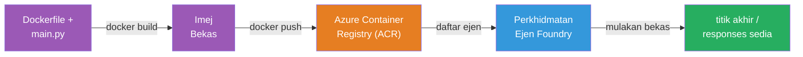
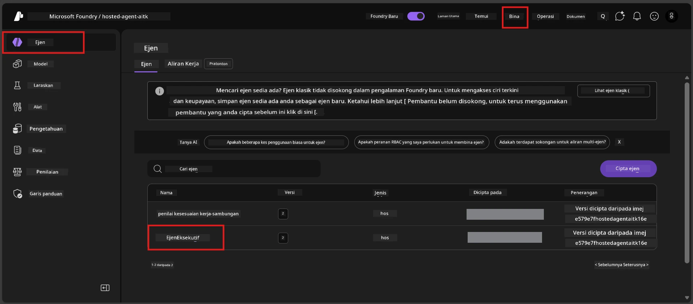

# Modul 6 - Menyiarkan ke Perkhidmatan Agen Foundry

Dalam modul ini, anda menyiarkan agen yang diuji secara tempatan anda ke Microsoft Foundry sebagai [**Hosted Agent**](https://learn.microsoft.com/azure/foundry/agents/concepts/hosted-agents). Proses penyiaraan membina imej bekas Docker dari projek anda, menolaknya ke [Azure Container Registry (ACR)](https://learn.microsoft.com/azure/container-registry/container-registry-intro), dan mencipta versi agen yang dihoskan dalam [Foundry Agent Service](https://learn.microsoft.com/azure/foundry/agents/overview).

### Saluran penyiaraan


---

## Semakan prasyarat

Sebelum menyiarkan, sahkan setiap item di bawah. Melepasinya adalah punca paling biasa kegagalan penyiaraan.

1. **Agen lulus ujian asap tempatan:**
   - Anda telah menyelesaikan semua 4 ujian dalam [Modul 5](05-test-locally.md) dan agen memberi maklum balas dengan betul.

2. **Anda mempunyai peranan [Azure AI User](https://learn.microsoft.com/azure/foundry/concepts/rbac-foundry#built-in-roles):**
   - Ini diberikan dalam [Modul 2, Langkah 3](02-create-foundry-project.md). Jika anda tidak pasti, sahkan sekarang:
   - Azure Portal → sumber projek Foundry anda → **Access control (IAM)** → tab **Role assignments** → cari nama anda → sahkan **Azure AI User** disenaraikan.

3. **Anda sudah log masuk ke Azure dalam VS Code:**
   - Semak ikon Akaun di kiri bawah VS Code. Nama akaun anda harus kelihatan.

4. **(Pilihan) Docker Desktop sedang berjalan:**
   - Docker hanya diperlukan jika sambungan Foundry meminta anda untuk bina tempatan. Dalam kebanyakan kes, sambungan mengendalikan binaan bekas secara automatik semasa penyiaraan.
   - Jika anda ada Docker dipasang, sahkan ia berjalan: `docker info`

---

## Langkah 1: Mulakan penyiaraan

Anda ada dua cara untuk menyiarkan - kedua-duanya membawa kepada hasil yang sama.

### Pilihan A: Siar dari Agent Inspector (disyorkan)

Jika anda menjalankan agen dengan debugger (F5) dan Agent Inspector terbuka:

1. Lihat pada **sudut atas kanan** panel Agent Inspector.
2. Klik butang **Deploy** (ikon awan dengan anak panah ke atas ↑).
3. Penyihir penyiaraan akan dibuka.

### Pilihan B: Siar dari Command Palette

1. Tekan `Ctrl+Shift+P` untuk buka **Command Palette**.
2. Taip: **Microsoft Foundry: Deploy Hosted Agent** dan pilih.
3. Penyihir penyiaraan akan dibuka.

---

## Langkah 2: Konfigurasikan penyiaraan

Penyihir penyiaraan akan membimbing anda melalui konfigurasi. Isikan setiap arahan:

### 2.1 Pilih projek sasaran

1. Senarai lungsur menunjukkan projek Foundry anda.
2. Pilih projek yang anda cipta dalam Modul 2 (contoh, `workshop-agents`).

### 2.2 Pilih fail agen bekas

1. Anda akan diminta memilih titik masuk agen.
2. Pilih **`main.py`** (Python) - ini adalah fail yang digunakan penyihir untuk kenal pasti projek agen anda.

### 2.3 Konfigurasikan sumber

| Tetapan | Nilai Disyorkan | Nota |
|---------|-----------------|------|
| **CPU** | `0.25` | Default, cukup untuk bengkel. Tingkatkan untuk beban kerja produksi |
| **Memori** | `0.5Gi` | Default, cukup untuk bengkel |

Ini sepadan dengan nilai dalam `agent.yaml`. Anda boleh terima nilai lalai.

---

## Langkah 3: Sahkan dan siar

1. Penyihir menunjukkan ringkasan penyiaraan dengan:
   - Nama projek sasaran
   - Nama agen (daripada `agent.yaml`)
   - Fail bekas dan sumber
2. Semak ringkasan dan klik **Confirm and Deploy** (atau **Deploy**).
3. Tonton kemajuan dalam VS Code.

### Apa yang berlaku semasa penyiaraan (langkah demi langkah)

Penyiaraan adalah proses berbilang langkah. Tonton panel **Output** VS Code (pilih "Microsoft Foundry" dari senarai lungsur) untuk mengikuti:

1. **Docker build** - VS Code membina imej bekas Docker dari `Dockerfile` anda. Anda akan lihat mesej lapisan Docker:
   ```
   Step 1/6 : FROM python:<version>-slim
   Step 2/6 : WORKDIR /app
   ...
   Successfully built abc123def456
   ```

2. **Docker push** - Imej tersebut ditolak ke **Azure Container Registry (ACR)** yang dihubungkan dengan projek Foundry anda. Ini boleh mengambil masa 1-3 minit pada penyiaraan pertama (imej asas >100MB).

3. **Pendaftaran agen** - Foundry Agent Service mencipta agen yang dihoskan baru (atau versi baru jika agen sudah wujud). Metadata agen dari `agent.yaml` digunakan.

4. **Mula bekas** - Bekas bermula dalam infrastruktur terurus Foundry. Platform menetapkan [identiti sistem terurus](https://learn.microsoft.com/azure/foundry/agents/concepts/agent-identity) dan mendedahkan endpoint `/responses`.

> **Penyiaraan pertama lebih lambat** (Docker perlu menolak semua lapisan). Penyiaraan seterusnya lebih cepat kerana Docker menyimpan cache lapisan yang tidak berubah.

---

## Langkah 4: Sahkan status penyiaraan

Selepas arahan penyiaraan selesai:

1. Buka bar sisi **Microsoft Foundry** dengan klik ikon Foundry di Bar Aktiviti.
2. Kembangkan bahagian **Hosted Agents (Preview)** di bawah projek anda.
3. Anda harus nampak nama agen anda (contoh, `ExecutiveAgent` atau nama dari `agent.yaml`).
4. **Klik pada nama agen** untuk kembangkan.
5. Anda akan lihat satu atau lebih **versi** (contoh, `v1`).
6. Klik versi untuk lihat **Container Details**.
7. Semak medan **Status**:

   | Status | Makna |
   |--------|-------|
   | **Started** atau **Running** | Bekas sedang berjalan dan agen sedia |
   | **Pending** | Bekas sedang mula (tunggu 30-60 saat) |
   | **Failed** | Bekas gagal mula (semak log - lihat penyelesaian masalah di bawah) |



> **Jika anda lihat "Pending" lebih dari 2 minit:** Bekas mungkin sedang menarik imej asas. Tunggu sedikit lagi. Jika terus pending, semak log bekas.

---

## Ralat biasa penyiaraan dan pembetulan

### Ralat 1: Kebenaran ditolak - `agents/write`

```
Error: lacks the required data action 
Microsoft.CognitiveServices/accounts/AIServices/agents/write 
to perform POST /api/projects/{projectName}/assistants operation.
```

**Punca utama:** Anda tidak mempunyai peranan `Azure AI User` di peringkat **projek**.

**Langkah pembetulan:**

1. Buka [https://portal.azure.com](https://portal.azure.com).
2. Dalam bar carian, taip nama **projek** Foundry anda dan klik.
   - **Penting:** Pastikan anda membuka sumber **projek** (jenis: "Microsoft Foundry project"), BUKAN sumber akaun/hub induk.
3. Di navigasi kiri, klik **Access control (IAM)**.
4. Klik **+ Add** → **Add role assignment**.
5. Di tab **Role**, cari [**Azure AI User**](https://learn.microsoft.com/azure/foundry/concepts/rbac-foundry#built-in-roles) dan pilih. Klik **Next**.
6. Di tab **Members**, pilih **User, group, or service principal**.
7. Klik **+ Select members**, cari nama/email anda, pilih diri anda, klik **Select**.
8. Klik **Review + assign** → sekali lagi klik **Review + assign**.
9. Tunggu 1-2 minit untuk penugasan peranan berkuat kuasa.
10. **Cuba semula penyiaraan** dari Langkah 1.

> Peranan mesti di skop **projek**, bukan hanya skop akaun. Ini adalah punca #1 kegagalan penyiaraan.

### Ralat 2: Docker tidak berjalan

```
Error: Docker build failed / Cannot connect to Docker daemon
```

**Pembetulan:**
1. Mulakan Docker Desktop (carinya dalam menu Mula atau dulang sistem anda).
2. Tunggu sehingga ia menunjukkan "Docker Desktop is running" (30-60 saat).
3. Sahkan: `docker info` di terminal.
4. **Khusus Windows:** Pastikan WSL 2 backend diaktifkan dalam tetapan Docker Desktop → **General** → **Use the WSL 2 based engine**.
5. Cuba semula penyiaraan.

### Ralat 3: Kebenaran ACR - `AcrPullUnauthorized`

```
Error: AcrPullUnauthorized
```

**Punca utama:** Identiti terurus projek Foundry tidak mempunyai akses menarik ke registri bekas.

**Pembetulan:**
1. Di Azure Portal, navigasi ke **[Container Registry](https://learn.microsoft.com/azure/container-registry/container-registry-intro)** anda (ia dalam kumpulan sumber yang sama dengan projek Foundry anda).
2. Pergi ke **Access control (IAM)** → **Add** → **Add role assignment**.
3. Pilih peranan **[AcrPull](https://learn.microsoft.com/azure/container-registry/container-registry-roles)**.
4. Di bawah Members, pilih **Managed identity** → cari identiti terurus projek Foundry.
5. **Review + assign**.

> Biasanya ini disediakan secara automatik oleh sambungan Foundry. Jika anda nampak ralat ini, mungkin setup automatik gagal.

### Ralat 4: Ketidakpadanan platform bekas (Apple Silicon)

Jika menyiarkan dari Mac Apple Silicon (M1/M2/M3), bekas mesti dibina untuk `linux/amd64`:

```bash
docker build --platform linux/amd64 -t myagent:v1 .
```

> Sambungan Foundry mengendalikan ini secara automatik untuk kebanyakan pengguna.

---

### Penanda aras

- [ ] Arahan penyiaraan selesai tanpa ralat dalam VS Code
- [ ] Agen muncul di bawah **Hosted Agents (Preview)** dalam bar sisi Foundry
- [ ] Anda klik pada agen → pilih versi → lihat **Container Details**
- [ ] Status bekas menunjukkan **Started** atau **Running**
- [ ] (Jika ada ralat) Anda mengenal pasti ralat, memakai pembetulan, dan berjaya menyiarkan semula

---

**Sebelum ini:** [05 - Uji Secara Tempatan](05-test-locally.md) · **Seterusnya:** [07 - Sahkan di Playground →](07-verify-in-playground.md)

---

<!-- CO-OP TRANSLATOR DISCLAIMER START -->
**Penafian**:  
Dokumen ini telah diterjemahkan menggunakan perkhidmatan terjemahan AI [Co-op Translator](https://github.com/Azure/co-op-translator). Walaupun kami berusaha untuk ketepatan, sila ambil maklum bahawa terjemahan automatik mungkin mengandungi kesilapan atau ketidaktepatan. Dokumen asal dalam bahasa asalnya hendaklah dianggap sebagai sumber yang sahih. Untuk maklumat kritikal, terjemahan manusia profesional adalah disyorkan. Kami tidak bertanggungjawab atas sebarang salah faham atau tafsiran yang timbul daripada penggunaan terjemahan ini.
<!-- CO-OP TRANSLATOR DISCLAIMER END -->