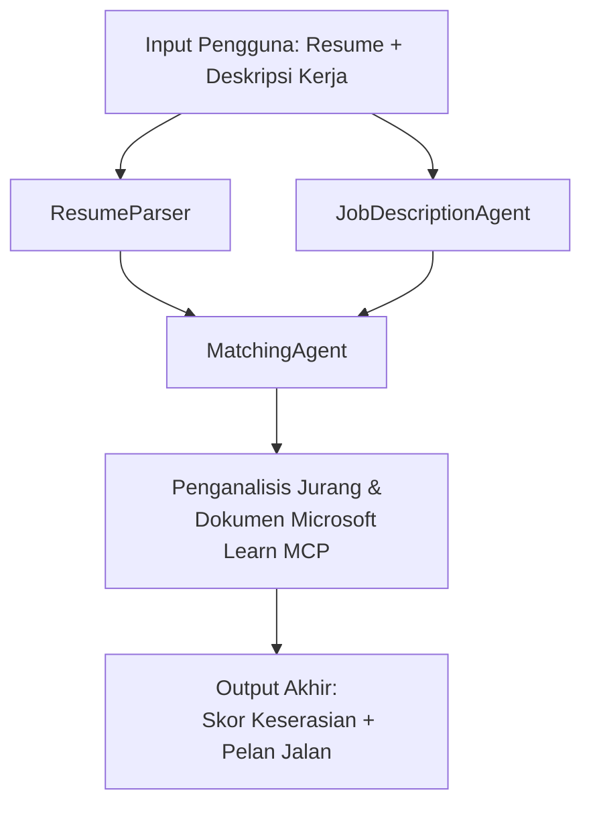

# PersonalCareerCopilot - Resume → Penilai Kesepadanan Kerja

Satu aliran kerja multi ejen yang menilai sejauh mana resume sesuai dengan penerangan kerja, kemudian menghasilkan peta pembelajaran peribadi untuk menutup jurang.

---

## Ejen

| Ejen | Peranan | Alat |
|-------|------|-------|
| **ResumeParser** | Mengekstrak kemahiran, pengalaman, sijil tersusun dari teks resume | - |
| **JobDescriptionAgent** | Mengekstrak kemahiran, pengalaman, sijil yang diperlukan/dipilih dari JD | - |
| **MatchingAgent** | Membandingkan profil vs keperluan → skor kesepadanan (0-100) + kemahiran yang padan/tiada | - |
| **GapAnalyzer** | Membina peta pembelajaran peribadi dengan sumber Microsoft Learn | `search_microsoft_learn_for_plan` (MCP) |

## Aliran Kerja


---

## Permulaan pantas

### 1. Sediakan persekitaran

```powershell
cd workshop\lab02-multi-agent\PersonalCareerCopilot
python -m venv .venv
.\.venv\Scripts\Activate.ps1          # Windows PowerShell
# sumber .venv/bin/activate            # macOS / Linux
pip install -r requirements.txt
```

### 2. Konfigurasikan kelayakan

Salin fail env contoh dan isi butiran projek Foundry anda:

```powershell
cp .env.example .env
```

Sunting `.env`:

```env
PROJECT_ENDPOINT=https://<your-account>.services.ai.azure.com/api/projects/<your-project>
MODEL_DEPLOYMENT_NAME=gpt-4.1-mini
```

| Nilai | Di mana untuk cari |
|-------|-----------------|
| `PROJECT_ENDPOINT` | Bar sisi Microsoft Foundry dalam VS Code → klik kanan projek anda → **Salin Titik Akhir Projek** |
| `MODEL_DEPLOYMENT_NAME` | Bar sisi Foundry → kembangkan projek → **Model + titik akhir** → nama penempatan |

### 3. Jalankan secara tempatan

```powershell
python -m debugpy --listen 127.0.0.1:5679 -m agentdev run main.py --verbose --port 8088
```

Atau gunakan tugasan VS Code: `Ctrl+Shift+P` → **Tugasan: Jalankan Tugasan** → **Jalankan Pelayan HTTP Lab02**.

### 4. Uji dengan Penginspek Ejen

Buka Penginspek Ejen: `Ctrl+Shift+P` → **Perkakas Foundry: Buka Penginspek Ejen**.

Tampalkan arahan ujian ini:

```
Resume:
Jane Doe
Senior Software Engineer with 5 years of experience in Python, Django, and AWS.
Built microservices handling 10K+ requests/second. Led a team of 4 developers.
Certifications: AWS Solutions Architect Associate.
Education: B.S. Computer Science, State University.

Job Description:
Senior Cloud Engineer at Contoso Ltd.
Required: Python, Azure, Kubernetes, Terraform, CI/CD pipelines.
Preferred: Go, monitoring (Prometheus/Grafana), cost optimization.
Experience: 5+ years in cloud infrastructure.
Certifications: Azure Solutions Architect Expert preferred.
```

**Jangkaan:** Skor kesepadanan (0-100), kemahiran padan/tiada, dan peta pembelajaran peribadi dengan URL Microsoft Learn.

### 5. Kerahkan ke Foundry

`Ctrl+Shift+P` → **Microsoft Foundry: Kerahkan Ejen Dihoskan** → pilih projek anda → sahkan.

---

## Struktur projek

```
PersonalCareerCopilot/
├── .env.example        ← Template for environment variables
├── .env                ← Your credentials (git-ignored)
├── agent.yaml          ← Hosted agent definition (name, resources, env vars)
├── Dockerfile          ← Container image for Foundry deployment
├── main.py             ← 4-agent workflow (instructions, MCP tool, WorkflowBuilder)
└── requirements.txt    ← Python dependencies
```

## Fail utama

### `agent.yaml`

Mentakrifkan ejen dihoskan untuk Perkhidmatan Ejen Foundry:
- `kind: hosted` - dijalankan sebagai bekas pengurusan
- `protocols: [responses v1]` - mendedahkan titik akhir HTTP `/responses`
- `environment_variables` - `PROJECT_ENDPOINT` dan `MODEL_DEPLOYMENT_NAME` disuntik semasa kerahan

### `main.py`

Mengandungi:
- **Arahan ejen** - empat pemalar `*_INSTRUCTIONS`, satu bagi setiap ejen
- **Alat MCP** - `search_microsoft_learn_for_plan()` memanggil `https://learn.microsoft.com/api/mcp` melalui HTTP Streamable
- **Penciptaan ejen** - pengurus konteks `create_agents()` menggunakan `AzureAIAgentClient.as_agent()`
- **Graf aliran kerja** - `create_workflow()` menggunakan `WorkflowBuilder` untuk menghubungkan ejen dengan corak fan-out/fan-in/sekuen
- **Permulaan pelayan** - `from_agent_framework(agent).run_async()` pada port 8088

### `requirements.txt`

| Pakej | Versi | Tujuan |
|---------|---------|---------|
| `agent-framework-azure-ai` | `1.0.0rc3` | Integrasi Azure AI untuk Microsoft Agent Framework |
| `agent-framework-core` | `1.0.0rc3` | Runtime teras (termasuk WorkflowBuilder) |
| `azure-ai-agentserver-agentframework` | `1.0.0b16` | Runtime pelayan ejen dihoskan |
| `azure-ai-agentserver-core` | `1.0.0b16` | Abstraksi pelayan ejen teras |
| `debugpy` | terkini | Penyahpepijatan Python (F5 dalam VS Code) |
| `agent-dev-cli` | `--pre` | CLI pembangunan tempatan + backend Penginspek Ejen |

---

## Penyelesaian masalah

| Isu | Penyelesaian |
|-------|-----|
| `RuntimeError: Missing required environment variable(s)` | Cipta `.env` dengan `PROJECT_ENDPOINT` dan `MODEL_DEPLOYMENT_NAME` |
| `ModuleNotFoundError: No module named 'agent_framework'` | Aktifkan venv dan jalankan `pip install -r requirements.txt` |
| Tiada URL Microsoft Learn dalam output | Periksa sambungan internet ke `https://learn.microsoft.com/api/mcp` |
| Hanya 1 kad jurang (terpotong) | Sahkan `GAP_ANALYZER_INSTRUCTIONS` termasuk blok `CRITICAL:` |
| Port 8088 digunakan | Hentikan pelayan lain: `netstat -ano \| findstr :8088` |

Untuk penyelesaian masalah terperinci, lihat [Modul 8 - Penyelesaian Masalah](../docs/08-troubleshooting.md).

---

**Panduan penuh:** [Dokumen Lab 02](../docs/README.md) · **Kembali ke:** [Lab 02 README](../README.md) · [Halaman Utama Bengkel](../../../README.md)

---

<!-- CO-OP TRANSLATOR DISCLAIMER START -->
**Penafian**:  
Dokumen ini telah diterjemahkan menggunakan perkhidmatan terjemahan AI [Co-op Translator](https://github.com/Azure/co-op-translator). Walaupun kami berusaha untuk ketepatan, sila ambil perhatian bahawa terjemahan automatik mungkin mengandungi kesilapan atau ketidaktepatan. Dokumen asal dalam bahasa asalnya harus dianggap sebagai sumber yang sahih. Untuk maklumat penting, terjemahan profesional oleh manusia adalah disyorkan. Kami tidak bertanggungjawab atas sebarang salah faham atau salah tafsir yang timbul daripada penggunaan terjemahan ini.
<!-- CO-OP TRANSLATOR DISCLAIMER END -->