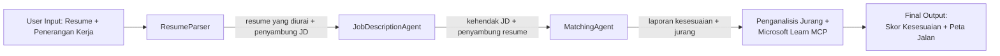

# PersonalCareerCopilot - Penilai Keserasian Resume → Kerja

Aplikasi multi-ejen berfokus aliran kerja yang menilai sejauh mana resume padan dengan deskripsi kerja, kemudian menghasilkan peta jalan pembelajaran peribadi untuk menutup jurang.

---

## Ejen

| Ejen | Peranan | Alat |
|-------|------|-------|
| **ResumeParser** | Mengekstrak kemahiran berstruktur, pengalaman, sijil dari teks resume | - |
| **JobDescriptionAgent** | Mengekstrak kemahiran, pengalaman, sijil yang diperlukan/disukai dari JD | - |
| **MatchingAgent** | Membandingkan profil vs keperluan → skor keserasian (0-100) + kemahiran yang dipadankan/hilang | - |
| **GapAnalyzer** | Membina peta jalan pembelajaran peribadi dengan sumber Microsoft Learn | `search_microsoft_learn_for_plan` (MCP) |

## Aliran Kerja


```mermaid
flowchart LR
    UserInput["User Input: Resume + Penerangan Kerja"] --> ResumeParser
    ResumeParser -- "resume yang diurai + penyambung JD" --> JobDescriptionAgent
    JobDescriptionAgent -- "kehendak JD + penyambung resume" --> MatchingAgent
    MatchingAgent -- "laporan kesesuaian + jurang" --> GapAnalyzerMCP["Penganalisis Jurang +\nMicrosoft Learn MCP"]
    GapAnalyzerMCP --> FinalOutput["Final Output:\nSkor Kesesuaian + Peta Jalan"]
```

---

## Mula dengan cepat

### 1. Sediakan persekitaran

Folder ini adalah pelaksanaan rujukan bagi rangka kerja Lab 02 berasaskan aliran kerja. `main.py` menggunakan blok arahan yang sedia ada serta `WorkflowBuilder` untuk menyambungkan keempat-empat ejen bersama.

```powershell
cd workshop\lab02-multi-agent\PersonalCareerCopilot
python -m venv .venv
.\.venv\Scripts\Activate.ps1          # Windows PowerShell
# source .venv/bin/activate            # macOS / Linux
pip install -r requirements.txt
```

### 2. Konfigurasikan kelayakan

Cipta fail `.env` dalam folder ini:

```powershell
copy .env .env.bak 2>$null; echo $null > .env
```

Sunting `.env`:

```env
FOUNDRY_PROJECT_ENDPOINT=https://<your-account>.services.ai.azure.com/api/projects/<your-project>
AZURE_AI_MODEL_DEPLOYMENT_NAME=gpt-4.1-mini
```

| Nilai | Lokasi untuk mendapatkannya |
|-------|------------------|
| `FOUNDRY_PROJECT_ENDPOINT` | Sidebar Foundry Toolkit → klik kanan projek anda → **Salin Endpoint Projek** |
| `AZURE_AI_MODEL_DEPLOYMENT_NAME` | Sidebar Foundry → perluas projek → **Model + endpoint** → nama penugasan |

### 3. Jalankan secara tempatan

```powershell
python -m debugpy --listen 127.0.0.1:5679 main.py --port 8088
```

Atau gunakan tugas VS Code: `Ctrl+Shift+P` → **Tasks: Run Task** → **Run Agent HTTP Server**.

Untuk debug F5, guna **Debug Local Agent HTTP Server**.

### 4. Uji dengan Agent Inspector

Buka Agent Inspector: `Ctrl+Shift+P` → **Foundry Toolkit: Open Agent Inspector**.

Tampal arahan ujian ini:

```
Resume:
Jane Doe
Senior Software Engineer with 5 years of experience in Python, Django, and AWS.
Built microservices handling 10K+ requests/second. Led a team of 4 developers.
Certifications: AWS Solutions Architect Associate.
Education: B.S. Computer Science, State University.

Job Description:
Senior Cloud Engineer at Contoso Ltd.
Required: Python, Azure, Kubernetes, Terraform, CI/CD pipelines.
Preferred: Go, monitoring (Prometheus/Grafana), cost optimization.
Experience: 5+ years in cloud infrastructure.
Certifications: Azure Solutions Architect Expert preferred.
```

**Dijangka:** Skor keserasian (0-100), kemahiran yang padan/hilang, dan peta jalan pembelajaran peribadi dengan URL Microsoft Learn.

### 5. Lancarkan ke Foundry

`Ctrl+Shift+P` → **Foundry Toolkit: Deploy Hosted Agent** → pilih projek anda → sahkan.

---

## Struktur projek

```
PersonalCareerCopilot/
├── .env                ← Your credentials (git-ignored)
├── agent.yaml          ← Hosted agent definition (name, resources, env vars)
├── Dockerfile          ← Container image for Foundry deployment
├── main.py             ← 4-agent workflow (instructions, MCP tool, WorkflowBuilder)
└── requirements.txt    ← Python dependencies
```

## Fail utama

### `agent.yaml`

Mendefinisikan ejen yang dihoskan untuk Foundry Agent Service:
- `kind: hosted` - dijalankan sebagai kontena terkawal
- `protocols` - protokol `responses` dengan `version: 1.0.0`, mendedahkan titik akhir HTTP `/responses`
- `environment_variables` - `AZURE_AI_MODEL_DEPLOYMENT_NAME` diisytiharkan di sini; `FOUNDRY_PROJECT_ENDPOINT` disuntik secara automatik semasa pelancaran

### `main.py`

Mengandungi:
- **Arahan Ejen** - empat pemalar `*_INSTRUCTIONS`, satu untuk setiap ejen
- **Alat MCP** - `search_microsoft_learn_for_plan()` memanggil `https://learn.microsoft.com/api/mcp` melalui HTTP Streamable
- **Penciptaan Ejen** - empat instans `Agent()` + `AgentExecutor()` yang berkongsi satu `FoundryChatClient`
- **Graf Aliran Kerja** - `WorkflowBuilder` menghubungkan ejen sebagai jalur susunan: ResumeParser → Ejen JD → MatchingAgent → GapAnalyzer
- **Permulaan Pelayan** - `ResponsesHostServer` berjalan pada port 8088

### `requirements.txt`

| Pakej | Tujuan |
|---------|----------|
| `agent-framework-foundry` | Runtime teras: `Agent`, `AgentExecutor`, `WorkflowBuilder`, `@tool`, `FoundryChatClient` |
| `agent-framework-foundry-hosting` | `ResponsesHostServer` + integrasi hos Foundry |
| `mcp<2,>=1.24.0` | Klien MCP untuk GapAnalyzer (`streamable_http_client`) |
| `debugpy` | Debugging Python (F5 dalam VS Code) |

---

## Penyelesaian Masalah

| Isu | Penyelesaian |
|-------|-----|
| `KeyError: 'FOUNDRY_PROJECT_ENDPOINT'` atau `KeyError: 'AZURE_AI_MODEL_DEPLOYMENT_NAME'` | Cipta `.env` dengan kedua-dua `FOUNDRY_PROJECT_ENDPOINT` dan `AZURE_AI_MODEL_DEPLOYMENT_NAME` ditetapkan |
| `ModuleNotFoundError: No module named 'agent_framework'` | Aktifkan venv dan jalankan `pip install -r requirements.txt` |
| Tiada URL Microsoft Learn dalam output | Semak sambungan internet ke `https://learn.microsoft.com/api/mcp` |
| Hanya 1 kad jurang (dipendekkan) | Pastikan `GAP_ANALYZER_INSTRUCTIONS` termasuk blok `CRITICAL:` |
| Port 8088 sedang digunakan | Hentikan pelayan lain: `netstat -ano \| findstr :8088` |

Untuk penyelesaian masalah terperinci, lihat [Modul 8 - Penyelesaian Masalah](../docs/08-troubleshooting.md).

---

**Laluan penuh:** [Dokumen Lab 02](../docs/README.md) · **Kembali ke:** [Lab 02 README](../README.md) · [Laman Utama Bengkel](../../../README.md)

---

<!-- CO-OP TRANSLATOR DISCLAIMER START -->
**Penafian**:
Dokumen ini telah diterjemahkan menggunakan perkhidmatan terjemahan AI [Co-op Translator](https://github.com/Azure/co-op-translator). Walaupun kami berusaha untuk ketepatan, sila ambil maklum bahawa terjemahan automatik mungkin mengandungi kesilapan atau ketidaktepatan. Dokumen asal dalam bahasa asalnya harus dianggap sebagai sumber yang sahih. Untuk maklumat penting, terjemahan oleh manusia profesional adalah disyorkan. Kami tidak bertanggungjawab terhadap sebarang salah faham atau salah tafsir yang timbul daripada penggunaan terjemahan ini.
<!-- CO-OP TRANSLATOR DISCLAIMER END -->