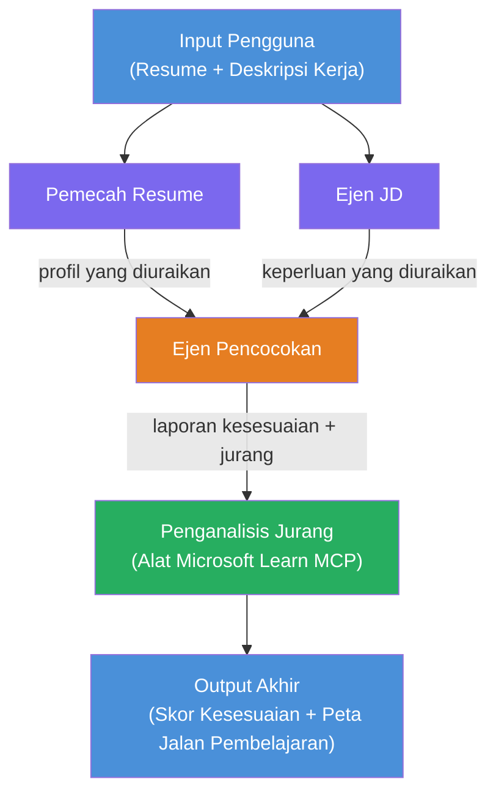

# Makmal 02 - Aliran Kerja Multi-Ejen: Penilai Sesuai Resume → Kerja

---

## Apa yang anda akan bina

**Penilai Sesuai Resume → Kerja** - aliran kerja multi-ejen di mana empat ejen pakar bekerjasama untuk menilai sejauh mana resume calon sesuai dengan deskripsi kerja, kemudian menjana pelan pembelajaran peribadi untuk menutup jurang tersebut.

### Ejen-ejen

| Ejen | Peranan |
|-------|------|
| **Pemecah Resume** | Mengekstrak kemahiran, pengalaman, sijil yang berstruktur dari teks resume |
| **Ejen Deskripsi Kerja** | Mengekstrak kemahiran dikehendaki/lebih suka, pengalaman, sijil dari JD |
| **Ejen Pemadanan** | Membandingkan profil dengan keperluan → skor sesuai (0-100) + kemahiran yang dipadankan/hilang |
| **Penganalisis Jurang** | Membina pelan pembelajaran peribadi dengan sumber, garis masa, dan projek kemenangan cepat |

### Aliran Demo

Muat naik **resume + deskripsi kerja** → dapatkan **skor sesuai + kemahiran hilang** → terima **pelan pembelajaran peribadi**.

### Seni bina Aliran Kerja

> Ungu = ejen selari | Jingga = titik pengagregatan | Hijau = ejen akhir dengan alat. Lihat [Modul 1 - Fahami Seni Bina](docs/01-understand-multi-agent.md) dan [Modul 4 - Corak Orkestrasi](docs/04-orchestration-patterns.md) untuk rajah dan aliran data terperinci.

### Topik yang diliputi

- Mencipta aliran kerja multi-ejen menggunakan **WorkflowBuilder**
- Mendefinisikan peranan ejen dan aliran orkestrasi (selari + berurutan)
- Corak komunikasi antara ejen
- Ujian tempatan dengan Agent Inspector
- Mengedar aliran kerja multi-ejen ke Foundry Agent Service

---

## Prasyarat

Selesaikan Lab 01 dahulu:

- [Lab 01 - Ejen Tunggal](../lab01-single-agent/README.md)

---

## Mula

Lihat arahan persediaan penuh, penjelasan kod, dan perintah ujian di:

- [Dokumen Lab 2 - Prasyarat](docs/00-prerequisites.md)
- [Dokumen Lab 2 - Laluan Pembelajaran Penuh](docs/README.md)
- [Panduan berjalan PersonalCareerCopilot](PersonalCareerCopilot/README.md)

## Corak orkestrasi (alternatif agentik)

Lab 2 termasuk aliran lalai **selari → pengumpul → perancang**, dan dokumen juga menerangkan corak alternatif untuk menunjukkan tingkah laku agentik yang lebih kuat:

- **Fan-out/Fan-in dengan konsensus berwajaran**
- **Pass pengulas/kritik sebelum pelan akhir**
- **Penghala bersyarat** (pemilihan laluan berdasarkan skor sesuai dan kemahiran hilang)

Lihat [docs/04-orchestration-patterns.md](docs/04-orchestration-patterns.md).

---

**Sebelumnya:** [Lab 01 - Ejen Tunggal](../lab01-single-agent/README.md) · **Kembali ke:** [Laman Utama Bengkel](../../README.md)

---

<!-- CO-OP TRANSLATOR DISCLAIMER START -->
**Penafian**:  
Dokumen ini telah diterjemahkan menggunakan perkhidmatan terjemahan AI [Co-op Translator](https://github.com/Azure/co-op-translator). Walaupun kami berusaha untuk ketepatan, sila ambil maklum bahawa terjemahan automatik mungkin mengandungi ralat atau ketidaktepatan. Dokumen asal dalam bahasa asalnya hendaklah dianggap sebagai sumber yang berwibawa. Untuk maklumat penting, terjemahan profesional oleh manusia adalah disyorkan. Kami tidak bertanggungjawab atas sebarang salah faham atau salah tafsir yang timbul daripada penggunaan terjemahan ini.
<!-- CO-OP TRANSLATOR DISCLAIMER END -->