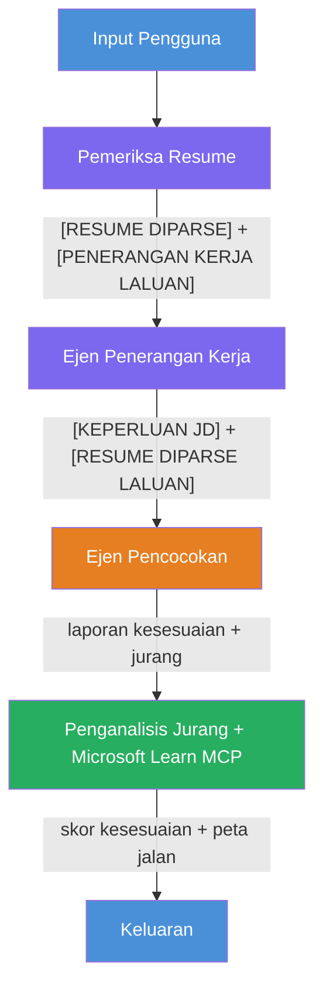

# Makmal 02 - Aliran Kerja Pengganda Agen: Resume → Penilai Kesesuaian Kerja

## Gambaran Keseluruhan

Dalam makmal praktikal ini, anda akan membina **aplikasi pelbagai agen berasaskan aliran kerja** menggunakan Foundry Toolkit dalam VS Code dan mengedarkannya ke Microsoft Foundry Agent Service.

**Apa yang anda akan bina:** Penilai Kesesuaian Resume → Kerja yang menguraikan resume dan penerangan kerja, memberikan skor padanan, dan menghasilkan peta jalan pembelajaran peribadi menggunakan sumber Microsoft Learn.

---

## Seni Bina

```mermaid
flowchart TD
    A["Input Pengguna"] --> B["Pemeriksa Resume"]
    B -->|"[RESUME DIPARSE] + [PENERANGAN KERJA LALUAN]"| C["Ejen Penerangan Kerja"]
    C -->|"[KEPERLUAN JD] + [RESUME DIPARSE LALUAN]"| D["Ejen Pencocokan"]
    D -->|laporan kesesuaian + jurang| E["Penganalisis Jurang + Microsoft Learn MCP"]
    E -->|skor kesesuaian + peta jalan| F["Keluaran"]

    style A fill:#4A90D9,color:#fff
    style B fill:#7B68EE,color:#fff
    style C fill:#7B68EE,color:#fff
    style D fill:#E67E22,color:#fff
    style E fill:#27AE60,color:#fff
    style F fill:#4A90D9,color:#fff
```

**Cara ia berfungsi:**
1. Pengguna menampal resume dan penerangan kerja.
2. **ResumeParser** menguraikan resume dan menyalin JD secara tepat ke dalam seksyen `[PASS-THROUGH PENERANGAN KERJA]`.
3. **JD Agent** mengeluarkan keperluan berstruktur daripada pass-through itu, kemudian menghantar `[RESUME YANG DIURAICAN]` ke hadapan sebagai `[PASS-THROUGH RESUME YANG DIURAICAN]`.
4. **MatchingAgent** membandingkan `[PASS-THROUGH RESUME YANG DIURAICAN]` dengan `[KEPERLUAN JD]` dan menghasilkan skor kesesuaian.
5. **GapAnalyzer** menukar jurang menjadi peta jalan praktikal dan mendapatkan pautan Microsoft Learn sebenar melalui MCP.

---

## Prasyarat

Selesaikan Makmal 01 terlebih dahulu:

- [Makmal 01 - Agen Tunggal](../lab01-single-agent/README.md)

---

## Bahagian 1: Baca modul mengikut susunan

Lihat laluan pembelajaran penuh di:

- [Dokumen Makmal 2 - Prasyarat](docs/00-prerequisites.md)
- [Dokumen Makmal 2 - Laluan Pembelajaran Penuh](docs/README.md)
- [Panduan menjalankan PersonalCareerCopilot](PersonalCareerCopilot/README.md)

---

## Bahagian 2: Bina dan uji aliran kerja

1. Gunakan wizard Foundry Toolkit untuk menyediakan projek berasaskan aliran kerja.
2. Salin blok arahan dan graf aliran kerja dari `PersonalCareerCopilot/main.py` ke dalam ruang kerja anda.
3. Jalankan secara lokal dengan Agent Inspector dan sahkan kesemua empat agen serta alat MCP.
4. Sebarkan agen yang dihoskan ke Foundry apabila ujian tempatan lulus.

---

## Corak Orkestrasi

Makmal 02 termasuk aliran lalai **fan-out → fan-in → berurutan**, dan dokumen juga menerangkan corak orkestrasi alternatif untuk eksperimen.

- **Fan-out/Fan-in dengan konsensus berwajaran**
- **Pass penilai/pengkritik sebelum peta jalan akhir**
- **Perute bersyarat** berdasarkan skor kesesuaian dan kemahiran yang hilang

Lihat [docs/04-orchestration-patterns.md](docs/04-orchestration-patterns.md).

---

**Sebelumnya:** [Makmal 01 - Agen Tunggal](../lab01-single-agent/README.md) · **Kembali ke:** [Laman Utama Bengkel](../../README.md)

---

<!-- CO-OP TRANSLATOR DISCLAIMER START -->
**Penafian**:
Dokumen ini telah diterjemahkan menggunakan perkhidmatan terjemahan AI [Co-op Translator](https://github.com/Azure/co-op-translator). Walaupun kami berusaha untuk ketepatan, sila ambil maklum bahawa terjemahan automatik mungkin mengandungi kesilapan atau ketidaktepatan. Dokumen asal dalam bahasa asalnya harus dianggap sebagai sumber yang sahih. Untuk maklumat penting, terjemahan oleh manusia profesional adalah disyorkan. Kami tidak bertanggungjawab terhadap sebarang salah faham atau salah tafsir yang timbul daripada penggunaan terjemahan ini.
<!-- CO-OP TRANSLATOR DISCLAIMER END -->