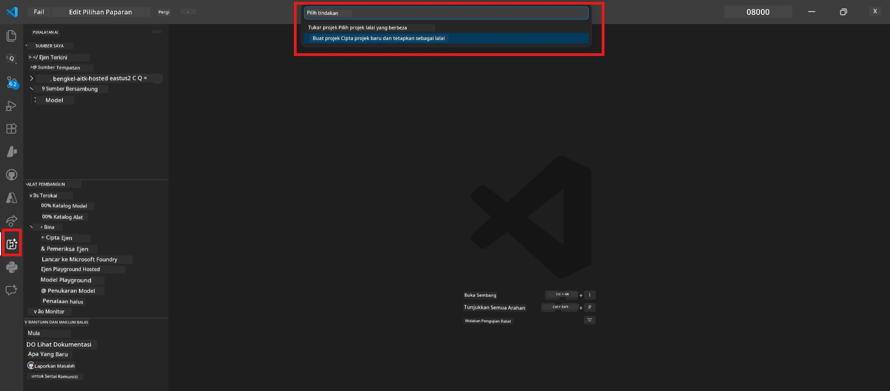

# Module 0 - Prasyarat

Sebelum memulakan Lab 02, sahkan anda telah menyiapkan perkara berikut. Makmal ini dibina terus berdasarkan Lab 01 - jangan langkauinya.

---

## 1. Lengkapkan Lab 01

Lab 02 mengandaikan anda telah:

- [x] Menyelesaikan semua 8 modul dalam [Lab 01 - Agen Tunggal](../../lab01-single-agent/README.md)
- [x] Berjaya melancarkan satu agen ke Perkhidmatan Agen Foundry
- [x] Mengesahkan agen berfungsi dalam kedua-dua Agent Inspector tempatan dan Foundry Playground

Jika anda belum menyelesaikan Lab 01, kembali dan selesaikannya sekarang: [Dokumen Lab 01](../../lab01-single-agent/docs/00-prerequisites.md)

---

## 2. Sahkan tetapan sedia ada

Semua alat dari Lab 01 masih harus dipasang dan berfungsi. Jalankan pemeriksaan ringkas ini:

### 2.1 Azure CLI

```powershell
az account show --query "{name:name, id:id}" --output table
```

Dijangkakan: Memaparkan nama dan ID langganan anda. Jika ini gagal, jalankan [`az login`](https://learn.microsoft.com/cli/azure/authenticate-azure-cli-interactively).

### 2.2 Sambungan VS Code

1. Tekan `Ctrl+Shift+P` → taip **"Microsoft Foundry"** → sahkan anda melihat arahan (contoh, `Microsoft Foundry: Create a New Hosted Agent`).
2. Tekan `Ctrl+Shift+P` → taip **"Foundry Toolkit"** → sahkan anda melihat arahan (contoh, `Foundry Toolkit: Open Agent Inspector`).

### 2.3 Projek & model Foundry

1. Klik ikon **Microsoft Foundry** pada Bar Aktiviti VS Code.
2. Sahkan projek anda disenaraikan (contoh, `workshop-agents`).
3. Kembangkan projek → sahkan model yang telah dilancarkan wujud (contoh, `gpt-4.1-mini`) dengan status **Succeeded**.

> **Jika pelancaran model anda tamat tempoh:** Sesetengah pelancaran tahap percuma tamat tempoh secara automatik. Lancarkan semula dari [Katalog Model](https://learn.microsoft.com/azure/foundry/foundry-models/concepts/models-sold-directly-by-azure) (`Ctrl+Shift+P` → **Microsoft Foundry: Open Model Catalog**).



### 2.4 Peranan RBAC

Sahkan anda mempunyai **Azure AI User** pada projek Foundry anda:

1. [Azure Portal](https://portal.azure.com) → sumber projek Foundry anda → **Access control (IAM)** → tab **[Role assignments](https://learn.microsoft.com/azure/foundry/concepts/rbac-foundry)**.
2. Cari nama anda → sahkan **[Azure AI User](https://aka.ms/foundry-ext-project-role)** disenaraikan.

---

## 3. Fahami konsep multi-agen (baru untuk Lab 02)

Lab 02 memperkenalkan konsep yang tidak diliputi dalam Lab 01. Baca ini sebelum meneruskan:

### 3.1 Apakah aliran kerja multi-agen?

Daripada satu agen mengendalikan semuanya, **aliran kerja multi-agen** membahagikan kerja kepada beberapa agen khusus. Setiap agen mempunyai:

- **Arahan** sendiri (prompt sistem)
- **Peranan** sendiri (apa yang menjadi tanggungjawabnya)
- **Alat** pilihan (fungsi yang boleh dipanggilnya)

Agen-agen berkomunikasi melalui **graf orkestrasi** yang menentukan bagaimana data mengalir antara mereka.

### 3.2 WorkflowBuilder

Kelas [`WorkflowBuilder`](https://learn.microsoft.com/agent-framework/workflows/agents-in-workflows) daripada `agent_framework` ialah komponen SDK yang menghubungkan agen-agen bersama:

```python
from agent_framework import WorkflowBuilder

workflow = (
    WorkflowBuilder(
        name="MyWorkflow",
        start_executor=agent_a,
        output_executors=[agent_d],
    )
    .add_edge(agent_a, agent_b)
    .add_edge(agent_a, agent_c)
    .add_edge(agent_b, agent_d)
    .add_edge(agent_c, agent_d)
    .build()
)
```

- **`start_executor`** - Agen pertama yang menerima input pengguna
- **`output_executors`** - Agen yang outputnya menjadi respons akhir
- **`add_edge(source, target)`** - Menentukan bahawa `target` menerima output dari `source`

### 3.3 Alat MCP (Model Context Protocol)

Lab 02 menggunakan **alat MCP** yang memanggil API Microsoft Learn untuk mendapatkan sumber pembelajaran. [MCP (Model Context Protocol)](https://modelcontextprotocol.io/introduction) adalah protokol piawai untuk menghubungkan model AI ke sumber data dan alat luaran.

| Istilah | Definisi |
|------|-----------|
| **pelayan MCP** | Perkhidmatan yang mendedahkan alat/sumber melalui [protokol MCP](https://learn.microsoft.com/azure/foundry/agents/how-to/tools/model-context-protocol) |
| **klien MCP** | Kod agen anda yang menyambung ke pelayan MCP dan memanggil alatnya |
| **[Streamable HTTP](https://learn.microsoft.com/agent-framework/agents/tools/hosted-mcp-tools)** | Kaedah pengangkutan yang digunakan untuk berkomunikasi dengan pelayan MCP |

### 3.4 Bagaimana Lab 02 berbeza dari Lab 01

| Aspek | Lab 01 (Agen Tunggal) | Lab 02 (Multi-Agen) |
|--------|----------------------|---------------------|
| Agen | 1 | 4 (peranan khusus) |
| Orkestrasi | Tiada | WorkflowBuilder (selari + berurutan) |
| Alat | Fungsi `@tool` pilihan | Alat MCP (panggilan API luaran) |
| Kompleksiti | Prompt mudah → respons | Resume + JD → skor kesesuaian → pelan tindakan |
| Aliran konteks | Terus | Serahan antara agen |

---

## 4. Struktur repositori bengkel untuk Lab 02

Pastikan anda tahu di mana fail Lab 02 berada:

```
workshop/
└── lab02-multi-agent/
    ├── README.md                       ← Lab overview
    ├── docs/                           ← You are here
    │   ├── README.md                   ← Learning path index
    │   ├── 00-prerequisites.md         ← This file
    │   ├── 01-understand-multi-agent.md
    │   ├── ...
    │   └── 08-troubleshooting.md
    └── PersonalCareerCopilot/          ← The agent project
        ├── agent.yaml                  ← Agent definition
        ├── main.py                     ← 4-agent workflow code
        ├── Dockerfile                  ← Container configuration
        └── requirements.txt            ← Python dependencies
```

---

### Pemeriksaan

- [ ] Lab 01 sudah disiapkan sepenuhnya (semua 8 modul, agen dilancarkan dan disahkan)
- [ ] `az account show` memaparkan langganan anda
- [ ] Sambungan Microsoft Foundry dan Foundry Toolkit dipasang dan berfungsi
- [ ] Projek Foundry mempunyai model yang dilancarkan (contoh, `gpt-4.1-mini`)
- [ ] Anda mempunyai peranan **Azure AI User** pada projek
- [ ] Anda sudah membaca bahagian konsep multi-agen di atas dan faham WorkflowBuilder, MCP, dan orkestrasi agen

---

**Seterusnya:** [01 - Fahami Senibina Multi-Agen →](01-understand-multi-agent.md)

---

<!-- CO-OP TRANSLATOR DISCLAIMER START -->
**Penafian**:  
Dokumen ini telah diterjemahkan menggunakan perkhidmatan terjemahan AI [Co-op Translator](https://github.com/Azure/co-op-translator). Walaupun kami berusaha untuk ketepatan, sila ambil maklum bahawa terjemahan automatik mungkin mengandungi kesilapan atau ketidaktepatan. Dokumen asal dalam bahasa asalnya harus dianggap sebagai sumber yang sah. Untuk maklumat penting, terjemahan profesional oleh manusia adalah disyorkan. Kami tidak bertanggungjawab terhadap sebarang salah faham atau tafsiran yang salah yang timbul daripada penggunaan terjemahan ini.
<!-- CO-OP TRANSLATOR DISCLAIMER END -->