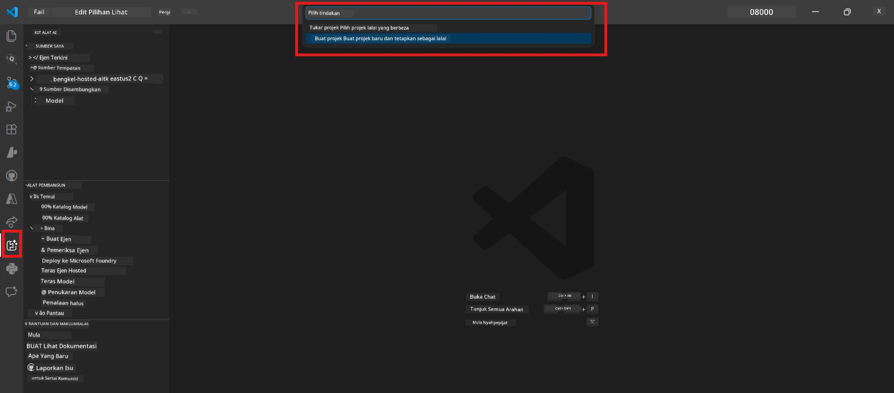

# Modul 0 - Pengenalan

⏱️ ~10 minit

> [!WARNING]
> **Pratonton & Had:** [Hosted Agents](https://learn.microsoft.com/azure/foundry/agents/concepts/hosted-agents) kini dalam **pratonton awam** - tidak disyorkan untuk beban kerja pengeluaran. Sesetengah ciri yang dipaparkan dalam bengkel ini mungkin berubah apabila perkhidmatan bergerak ke arah GA.

## Apa yang anda akan bina

Dalam makmal ini, anda meluaskan kemahiran ejen tunggal dari Makmal 01 untuk membina **aliran kerja berbilang ejen** - Penilai Keserasian Resume → Kerja.

Anda tampal **resume** dan **deskripsi pekerjaan**. Empat ejen khusus memproses input secara berperingkat, kemudian mengembalikan:
- Skor keserasian (0–100 dengan pecahan skor)
- Senarai jurang kemahiran dan sijil
- Peta pembelajaran peribadi dengan pautan Microsoft Learn sebenar untuk setiap jurang

**Aliran kerja menggunakan:**
- **Microsoft Agent Framework** - `WorkflowBuilder` untuk pengurusan rangkaian urutan
- **Foundry Toolkit untuk VS Code** - mendirikan, ujian secara tempatan, terbitkan
- **Model AI** (contoh, `gpt-4.1-mini`) - digunakan oleh keempat-empat ejen
- **Pelayan Microsoft Learn MCP** - menyediakan pautan sumber pembelajaran sebenar untuk setiap jurang kemahiran

---

## Pilih laluan anda

> ⚠️ **Teruskan dengan laluan yang sama seperti anda gunakan dalam Makmal 01.**

<details open>
<summary><strong>🅰️ Laluan A - Azure awan (memerlukan langganan Azure)</strong></summary>

| | Butiran |
|---|---|
| **Siapa yang sesuai?** | Anda telah menyiapkan Makmal 01 menggunakan langganan Azure |
| **Model** | Azure OpenAI melalui Foundry (contoh, `gpt-4.1-mini`) |
| **Modul yang diliputi** | Semua modul (00–09) |
| **Terbit ke awan?** | ✅ Ya - penerbitan penuh hujung ke hujung |

</details>

<details open>
<summary><strong>🅱️ Laluan B - Foundry Tempatan (tidak memerlukan langganan Azure)</strong></summary>

| | Butiran |
|---|---|
| **Siapa yang sesuai?** | Anda telah menyiapkan Makmal 01 menggunakan Foundry Tempatan |
| **Model** | Foundry Tempatan (percuma, dijalankan pada mesin anda) |
| **Modul yang diliputi** | Modul 00–05 (langkau 06–07 - penerbitan & pengesahan awan) |
| **Terbit ke awan?** | ❌ Tidak - ujian tempatan sahaja melalui Agent Inspector |

</details>

---

## Semakan Makmal 01

Makmal 02 dibina terus dari Makmal 01. Lengkapkan Makmal 01 dahulu sebelum mulakan di sini.

Belum buat Makmal 01 lagi? Mulakan di sini: [Makmal 01 - Pengenalan](../../lab01-single-agent/docs/00-prerequisites.md)

<details open>
<summary><strong>🅰️ Laluan A - Azure awan</strong></summary>

```powershell
az account show --query "{name:name, id:id}" --output table
```

Jika ini gagal, jalankan `az login`. Kemudian sahkan dalam VS Code:

1. `Ctrl+Shift+P` → taip **Foundry Toolkit** → sahkan perintah muncul.
2. Klik ikon **Foundry Toolkit** → projek dan model yang diterbitkan menunjukkan **Berjaya**.



> **RBAC:** Anda telah menetapkan **Foundry User** dalam Makmal 01. Jika anda perlu menetapkannya semula, lihat [Makmal 01, Modul 1](../../lab01-single-agent/docs/01-setup.md#deploy-a-model--assign-rbac). Peranan ini sebelum ini dinamakan **Azure AI User** - kebenaran sama.

</details>

<details open>
<summary><strong>🅱️ Laluan B - Foundry Tempatan</strong></summary>

```powershell
Invoke-WebRequest -Uri "http://localhost:5273/v1/health" -UseBasicParsing | Select-Object StatusCode
```

Dijangka: `StatusCode: 200`. Jika tidak, mulakan semula Foundry Tempatan dari sidebar Foundry Toolkit.

> Semua inferens dijalankan pada mesin anda. Panggilan keluar sahaja adalah alat MCP ke `https://learn.microsoft.com/api/mcp`.

</details>

---

## Apa yang baru dalam Makmal 02

| | Makmal 01 | Makmal 02 |
|--|--------|--------|
| Ejen | 1 | 4 (dirangkai dengan WorkflowBuilder) |
| Templat asas | Asas - Agent Framework | Aliran Kerja - Agent Framework |
| Pakej baru | - | `mcp` |
| Pengurusan | Ejen perbualan tunggal | Rangkaian urutan (WorkflowBuilder) |
| Alat baru | - | `search_microsoft_learn_for_plan` (MCP) |

---

**Seterusnya:** [01 - Fahami Seni Bina →](01-understand-multi-agent.md)

---

<!-- CO-OP TRANSLATOR DISCLAIMER START -->
**Penafian**:
Dokumen ini telah diterjemahkan menggunakan perkhidmatan terjemahan AI [Co-op Translator](https://github.com/Azure/co-op-translator). Walaupun kami berusaha untuk ketepatan, sila ambil maklum bahawa terjemahan automatik mungkin mengandungi kesilapan atau ketidaktepatan. Dokumen asal dalam bahasa asalnya harus dianggap sebagai sumber yang sahih. Untuk maklumat penting, terjemahan oleh manusia profesional adalah disyorkan. Kami tidak bertanggungjawab terhadap sebarang salah faham atau salah tafsir yang timbul daripada penggunaan terjemahan ini.
<!-- CO-OP TRANSLATOR DISCLAIMER END -->