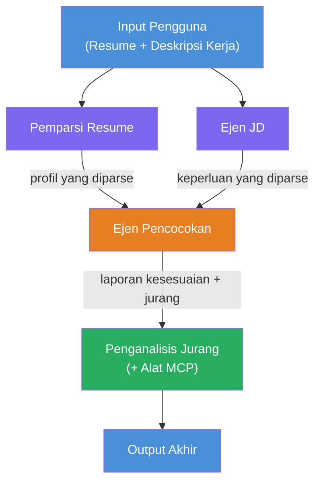
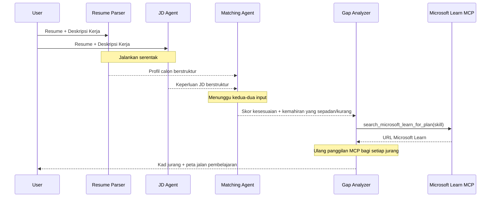
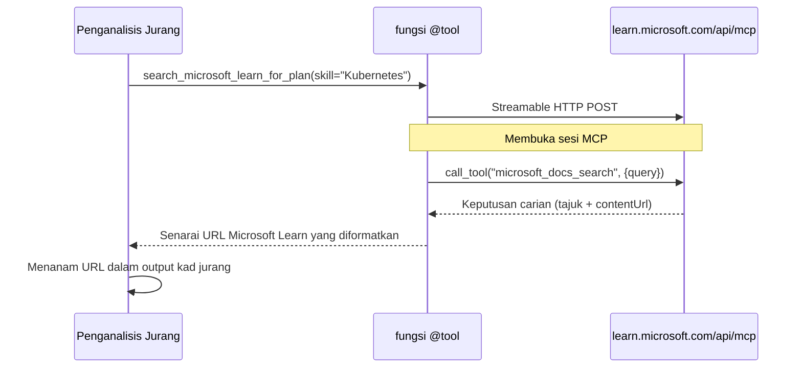

# Modul 1 - Memahami Seni Bina Multi-Ejen

Dalam modul ini, anda mempelajari seni bina Penilai Keserasian Resume → Kerja sebelum menulis sebarang kod. Memahami graf orkestrasi, peranan ejen, dan aliran data adalah penting untuk penyahpepijatan dan pengembangan [alur kerja multi-ejen](https://learn.microsoft.com/azure/architecture/ai-ml/idea/multiple-agent-workflow-automation).

---

## Masalah yang diselesaikan ini

Memadankan resume dengan deskripsi kerja melibatkan beberapa kemahiran yang berbeza:

1. **Parsing** - Mengekstrak data berstruktur daripada teks tidak berstruktur (resume)
2. **Analisis** - Mengekstrak keperluan daripada deskripsi kerja
3. **Perbandingan** - Memberi skor kesesuaian antara kedua-duanya
4. **Perancangan** - Membina peta pembelajaran untuk menutup kekurangan

Satu ejen yang melakukan keempat-empat tugas dalam satu prompt sering menghasilkan:
- Ekstrak tidak lengkap (ia tergesa-gesa melalui parsing untuk mencapai skor)
- Skor yang cetek (tiada pecahan berasaskan bukti)
- Peta pembelajaran umum (tidak disesuaikan dengan kekurangan tertentu)

Dengan membahagikan kepada **empat ejen khusus**, setiap satu memberi tumpuan pada tugasnya dengan arahan khusus, menghasilkan output berkualiti lebih tinggi pada setiap tahap.

---

## Empat ejen

Setiap ejen adalah ejen [Microsoft Foundry](https://learn.microsoft.com/azure/foundry/agents/concepts/hosted-agents) penuh yang dicipta melalui `AzureAIAgentClient.as_agent()`. Mereka berkongsi penyebaran model yang sama tetapi mempunyai arahan berbeza dan (pilihan) alat berbeza.

| # | Nama Ejen | Peranan | Input | Output |
|---|-----------|---------|-------|--------|
| 1 | **ResumeParser** | Mengekstrak profil berstruktur dari teks resume | Teks resume mentah (dari pengguna) | Profil Calon, Kemahiran Teknikal, Kemahiran Lembut, Sijil, Pengalaman Domain, Pencapaian |
| 2 | **JobDescriptionAgent** | Mengekstrak keperluan berstruktur dari JD | Teks JD mentah (dari pengguna, diteruskan melalui ResumeParser) | Gambaran Peranan, Kemahiran Diperlukan, Kemahiran Pilihan, Pengalaman, Sijil, Pendidikan, Tanggungjawab |
| 3 | **MatchingAgent** | Mengira skor kesesuaian berasaskan bukti | Output dari ResumeParser + JobDescriptionAgent | Skor Kesesuaian (0-100 dengan pecahan), Kemahiran Dipadankan, Kemahiran Hilang, Kekurangan |
| 4 | **GapAnalyzer** | Membina peta pembelajaran peribadi | Output dari MatchingAgent | Kad kekurangan (per kemahiran), Susunan Pembelajaran, Garis Masa, Sumber dari Microsoft Learn |

---

## Graf orkestrasi

Alur kerja menggunakan **pengagihan selari** diikuti oleh **pengumpulan berurutan**:


> **Legenda:** Ungu = ejen selari, Jingga = titik pengumpulan, Hijau = ejen akhir dengan alat

### Bagaimana data mengalir


1. **Pengguna menghantar** mesej yang mengandungi resume dan deskripsi kerja.
2. **ResumeParser** menerima input penuh pengguna dan mengekstrak profil calon berstruktur.
3. **JobDescriptionAgent** menerima input pengguna secara selari dan mengekstrak keperluan berstruktur.
4. **MatchingAgent** menerima output dari **ResumeParser dan JobDescriptionAgent** (rangka kerja menunggu kedua-dua selesai sebelum menjalankan MatchingAgent).
5. **GapAnalyzer** menerima output MatchingAgent dan memanggil **alat Microsoft Learn MCP** untuk mendapatkan sumber pembelajaran sebenar bagi setiap kekurangan.
6. **Output akhir** adalah respons GapAnalyzer, yang termasuk skor kesesuaian, kad kekurangan, dan peta pembelajaran lengkap.

### Kenapa pengagihan selari penting

ResumeParser dan JobDescriptionAgent berjalan **secara selari** kerana tiada yang bergantung pada satu sama lain. Ini:
- Mengurangkan jumlah kelewatan (kedua-duanya berjalan serentak bukan secara berurutan)
- Adalah pembahagian semula jadi (parsing resume vs parsing JD adalah tugas bebas)
- Menunjukkan corak multi-ejen biasa: **pengagihan → pengumpulan → tindakan**

---

## WorkflowBuilder dalam kod

Berikut adalah cara graf di atas dipetakan ke panggilan API [`WorkflowBuilder`](https://learn.microsoft.com/agent-framework/workflows/agents-in-workflows) dalam `main.py`:

```python
from agent_framework import WorkflowBuilder

workflow = (
    WorkflowBuilder(
        name="ResumeJobFitEvaluator",
        start_executor=resume_parser,       # Ejen pertama untuk menerima input pengguna
        output_executors=[gap_analyzer],     # Ejen akhir yang outputnya dikembalikan
    )
    .add_edge(resume_parser, jd_agent)      # ResumeParser → JobDescriptionAgent
    .add_edge(resume_parser, matching_agent) # ResumeParser → MatchingAgent
    .add_edge(jd_agent, matching_agent)      # JobDescriptionAgent → MatchingAgent
    .add_edge(matching_agent, gap_analyzer)  # MatchingAgent → GapAnalyzer
    .build()
)
```

**Memahami sisi graf:**

| Sisi | Maksudnya |
|------|-----------|
| `resume_parser → jd_agent` | JD Agent menerima output ResumeParser |
| `resume_parser → matching_agent` | MatchingAgent menerima output ResumeParser |
| `jd_agent → matching_agent` | MatchingAgent juga menerima output JD Agent (menunggu kedua-duanya) |
| `matching_agent → gap_analyzer` | GapAnalyzer menerima output MatchingAgent |

Kerana `matching_agent` mempunyai **dua sisi masuk** (`resume_parser` dan `jd_agent`), rangka kerja secara automatik menunggu kedua-dua selesai sebelum menjalankan MatchingAgent.

---

## Alat MCP

Ejen GapAnalyzer mempunyai satu alat: `search_microsoft_learn_for_plan`. Ini adalah **[alat MCP](https://learn.microsoft.com/agent-framework/agents/tools/hosted-mcp-tools)** yang memanggil API Microsoft Learn untuk mendapatkan sumber pembelajaran terpilih.

### Cara kerjanya

```python
@tool
async def search_microsoft_learn_for_plan(
    skill: str, role: str = "", max_results: int = 5
) -> str:
    """Search Microsoft Learn MCP and return curated official links."""
    # Menyambung ke https://learn.microsoft.com/api/mcp melalui HTTP Boleh Alir
    # Memanggil alat 'microsoft_docs_search' pada pelayan MCP
    # Mengembalikan senarai format URL Microsoft Learn
```

### Alur panggilan MCP


1. GapAnalyzer memutuskan ia memerlukan sumber pembelajaran untuk satu kemahiran (contoh: "Kubernetes")
2. Rangka kerja memanggil `search_microsoft_learn_for_plan(skill="Kubernetes")`
3. Fungsi membuka sambungan [Streamable HTTP](https://learn.microsoft.com/agent-framework/agents/tools/hosted-mcp-tools) ke `https://learn.microsoft.com/api/mcp`
4. Ia memanggil alat `microsoft_docs_search` pada [pelayan MCP](https://learn.microsoft.com/azure/foundry/agents/how-to/tools/model-context-protocol)
5. Pelayan MCP memulangkan hasil carian (tajuk + URL)
6. Fungsi memformat hasil dan memulangkannya sebagai rentetan
7. GapAnalyzer menggunakan URL yang dikembalikan dalam output kad kekurangannya

### Log MCP dijangka

Apabila alat dijalankan, anda akan melihat entri log seperti:

```
GET https://learn.microsoft.com/api/mcp → 405 (Method Not Allowed)
POST https://learn.microsoft.com/api/mcp → 200
DELETE https://learn.microsoft.com/api/mcp → 405 (Method Not Allowed)
```

**Ini adalah normal.** Klien MCP menguji dengan GET dan DELETE semasa inisialisasi - yang mengembalikan 405 adalah kelakuan dijangka. Panggilan alat sebenar menggunakan POST dan mengembalikan 200. Hanya risau jika panggilan POST gagal.

---

## Corak penciptaan ejen

Setiap ejen dicipta menggunakan **pengurus konteks async [`AzureAIAgentClient.as_agent()`](https://learn.microsoft.com/python/api/overview/azure/ai-agents-readme)**. Ini adalah corak Foundry SDK untuk mewujudkan ejen yang dibersihkan secara automatik:

```python
async with (
    get_credential() as credential,
    AzureAIAgentClient(
        project_endpoint=PROJECT_ENDPOINT,
        model_deployment_name=MODEL_DEPLOYMENT_NAME,
        credential=credential,
    ).as_agent(
        name="ResumeParser",
        instructions=RESUME_PARSER_INSTRUCTIONS,
    ) as resume_parser,
    # ... ulang untuk setiap ejen ...
):
    # Semua 4 ejen wujud di sini
    workflow = create_workflow(resume_parser, jd_agent, matching_agent, gap_analyzer)
```

**Perkara penting:**
- Setiap ejen mendapat instans `AzureAIAgentClient` sendiri (SDK memerlukan nama ejen dikhususkan kepada klien)
- Semua ejen berkongsi `credential`, `PROJECT_ENDPOINT`, dan `MODEL_DEPLOYMENT_NAME` yang sama
- Blok `async with` memastikan semua ejen dibersihkan apabila pelayan dimatikan
- GapAnalyzer tambahan menerima `tools=[search_microsoft_learn_for_plan]`

---

## Mula pelayan

Selepas mencipta ejen dan membina alur kerja, pelayan dimulakan:

```python
from azure.ai.agentserver.agentframework import from_agent_framework

agent = create_workflow(resume_parser, jd_agent, matching_agent, gap_analyzer)
await from_agent_framework(agent).run_async()
```

`from_agent_framework()` membungkus alur kerja sebagai pelayan HTTP yang membuka titik akhir `/responses` pada port 8088. Ini adalah corak yang sama seperti Lab 01, tetapi "ejen" kini adalah keseluruhan [graf alur kerja](https://learn.microsoft.com/agent-framework/workflows/as-agents).

---

### Titik semakan

- [ ] Anda memahami seni bina 4-ejen dan peranan setiap ejen
- [ ] Anda boleh menjejaki aliran data: Pengguna → ResumeParser → (selari) JD Agent + MatchingAgent → GapAnalyzer → Output
- [ ] Anda faham mengapa MatchingAgent menunggu ResumeParser dan JD Agent (dua sisi masuk)
- [ ] Anda faham alat MCP: apa fungsinya, bagaimana ia dipanggil, dan bahawa log GET 405 adalah normal
- [ ] Anda faham corak `AzureAIAgentClient.as_agent()` dan mengapa setiap ejen ada instans klien sendiri
- [ ] Anda boleh membaca kod `WorkflowBuilder` dan memetakannya ke graf visual

---

**Sebelum:** [00 - Prasyarat](00-prerequisites.md) · **Seterusnya:** [02 - Kerangka Projek Multi-Ejen →](02-scaffold-multi-agent.md)

---

<!-- CO-OP TRANSLATOR DISCLAIMER START -->
**Penafian**:  
Dokumen ini telah diterjemahkan menggunakan perkhidmatan terjemahan AI [Co-op Translator](https://github.com/Azure/co-op-translator). Walaupun kami berusaha untuk ketepatan, sila maklum bahawa terjemahan automatik mungkin mengandungi kesilapan atau ketidaktepatan. Dokumen asal dalam bahasa asalnya harus dianggap sebagai sumber yang sahih. Untuk maklumat kritikal, terjemahan manusia profesional adalah disyorkan. Kami tidak bertanggungjawab atas sebarang salah faham atau salah tafsir yang timbul daripada penggunaan terjemahan ini.
<!-- CO-OP TRANSLATOR DISCLAIMER END -->