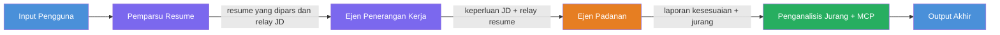

# Modul 1 - Fahami Seni Bina

⏱️ ~5 minit

Sebelum menulis sebarang kod, berikut adalah gambaran ringkas tentang apa yang anda bina dan bagaimana ia berfungsi.

---

## Apa yang anda bina

Anda tampal **resume** dan **penerangan kerja**. Alur kerja mengembalikan:

- Skor kesesuaian (0–100 dengan pecahan)
- Senarai kekurangan kemahiran dan sijil
- Peta pembelajaran peribadi dengan pautan Microsoft Learn untuk setiap kekurangan

---

## Empat ejen

Satu ejen yang cuba memparsing, memberi skor, dan merancang sekaligus cenderung tergesa-gesa dan menghasilkan keluaran yang cetek. Memecahkan kerja kepada empat ejen khusus memberikan hasil yang lebih baik:

| Ejen | Apa yang dilakukannya |
|-------|-------------|
| **ResumeParser** | Memparsing resume; menyalin JD secara terus ke dalam `[JOB DESCRIPTION PASS-THROUGH]` untuk ejen hiliran |
| **JobDescriptionAgent** | Mengekstrak keperluan JD daripada pass-through; menyampaikan `[PARSED RESUME]` sebagai `[PARSED RESUME PASS-THROUGH]` |
| **MatchingAgent** | Membandingkan kedua-dua bahagian yang dilabel; menghasilkan skor kesesuaian 0–100 dan senarai kekurangan |
| **GapAnalyzer** | Membina peta pembelajaran; mencari Microsoft Learn untuk setiap kekurangan |

---

## Graf orkestrasi

Alur kerja adalah **paip berurutan** - setiap ejen menyampaikan keluarannya ke ejen berikutnya:


```mermaid
flowchart LR
    A["Input Pengguna"] --> B["Pemparsu Resume"]
    B -- "resume yang dipars dan relay JD" --> C["Ejen Penerangan Kerja"]
    C -- "keperluan JD + relay resume" --> D["Ejen Padanan"]
    D -- "laporan kesesuaian + jurang" --> E["Penganalisis Jurang + MCP"]
    E --> F["Output Akhir"]

    style A fill:#4A90D9,color:#fff
    style B fill:#7B68EE,color:#fff
    style C fill:#7B68EE,color:#fff
    style D fill:#E67E22,color:#fff
    style E fill:#27AE60,color:#fff
    style F fill:#4A90D9,color:#fff
```

1. **ResumeParser** menerima input pengguna, memparsing resume, dan menyalin JD ke dalam `[JOB DESCRIPTION PASS-THROUGH]`.
2. **JD Agent** mengekstrak keperluan berstruktur dan menyampaikan `[PARSED RESUME PASS-THROUGH]` ke hadapan.
3. **MatchingAgent** membandingkan kedua-dua bahagian dan menghasilkan skor kesesuaian serta senarai kekurangan.
4. **GapAnalyzer** membina peta dan memanggil alat Microsoft Learn MCP untuk setiap kekurangan.

---

## Bagaimana ini dipetakan kepada kod

Dalam `main.py`, anda menggambarkan graf ini dengan `WorkflowBuilder`:

```python
workflow_agent = (
    WorkflowBuilder(
        start_executor=resume_executor,       # ejen pertama untuk menerima input pengguna
        output_executors=[gap_executor],      # ejen terakhir - outputnya adalah respons
    )
    .add_edge(resume_executor, jd_executor)       # ResumeParser → Ejen JD
    .add_edge(jd_executor, matching_executor)     # Ejen JD → MatchingAgent
    .add_edge(matching_executor, gap_executor)    # MatchingAgent → GapAnalyzer
    .build()
    .as_agent()
)
```

Setiap `Agent` dibalut dalam `AgentExecutor`. Panggilan `add_edge()` mentakrifkan paip yang sangat berurutan - setiap ejen hanya menerima output langsung pendahulunya.

> `context_mode="last_agent"` bermaksud setiap executor hanya melihat output langsung pendahulunya. ResumeParser dan JD Agent menyampaikan data ke hadapan dalam bahagian yang dilabel supaya setiap ejen hiliran mendapat tepat apa yang diperlukan.

---

## Alat MCP

GapAnalyzer mempunyai satu alat: `search_microsoft_learn_for_plan`. Ia bersambung ke `https://learn.microsoft.com/api/mcp` dan mengembalikan pautan Microsoft Learn sebenar untuk setiap kekurangan kemahiran.

Apabila alat berjalan anda akan melihat log ini - semua dijangka:

```
GET  https://learn.microsoft.com/api/mcp → 405   ← connection probe, normal
POST https://learn.microsoft.com/api/mcp → 200   ← actual tool call
DELETE https://learn.microsoft.com/api/mcp → 405 ← cleanup probe, normal
```

Hanya risau jika `POST` mengembalikan ralat.

---

**Sebelum ini:** [00 - Prasyarat](00-prerequisites.md) · **Seterusnya:** [02 - Membina Struktur Projek →](02-scaffold-multi-agent.md)

---

<!-- CO-OP TRANSLATOR DISCLAIMER START -->
**Penafian**:
Dokumen ini telah diterjemahkan menggunakan perkhidmatan terjemahan AI [Co-op Translator](https://github.com/Azure/co-op-translator). Walaupun kami berusaha untuk ketepatan, sila ambil maklum bahawa terjemahan automatik mungkin mengandungi kesilapan atau ketidaktepatan. Dokumen asal dalam bahasa asalnya harus dianggap sebagai sumber yang sahih. Untuk maklumat penting, terjemahan oleh manusia profesional adalah disyorkan. Kami tidak bertanggungjawab terhadap sebarang salah faham atau salah tafsir yang timbul daripada penggunaan terjemahan ini.
<!-- CO-OP TRANSLATOR DISCLAIMER END -->