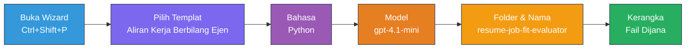
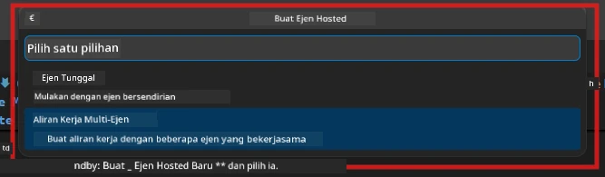

# Modul 2 - Membina Projek Multi-Ejen

Dalam modul ini, anda menggunakan [sambungan Microsoft Foundry](https://marketplace.visualstudio.com/items?itemName=TeamsDevApp.vscode-ai-foundry) untuk **membina projek aliran kerja multi-ejen**. Sambungan ini menjana keseluruhan struktur projek - `agent.yaml`, `main.py`, `Dockerfile`, `requirements.txt`, `.env`, dan konfigurasi debug. Anda kemudian menyesuaikan fail-fail ini dalam Modul 3 dan 4.

> **Nota:** Folder `PersonalCareerCopilot/` dalam makmal ini adalah contoh lengkap dan berfungsi bagi projek multi-ejen yang disesuaikan. Anda boleh sama ada membina projek baru (disyorkan untuk pembelajaran) atau meneliti kod sedia ada secara langsung.

---

## Langkah 1: Buka panduan Cipta Ejen Dihoskan


1. Tekan `Ctrl+Shift+P` untuk membuka **Command Palette**.
2. Taip: **Microsoft Foundry: Create a New Hosted Agent** dan pilihnya.
3. Panduan penciptaan ejen dihoskan dibuka.

> **Alternatif:** Klik ikon **Microsoft Foundry** di Bar Aktiviti → klik ikon **+** di sebelah **Agents** → **Create New Hosted Agent**.

---

## Langkah 2: Pilih templat Aliran Kerja Multi-Ejen

Panduan akan meminta anda memilih templat:

| Templat | Keterangan | Bila digunakan |
|----------|-------------|-------------|
| Ejen Tunggal | Satu ejen dengan arahan dan alat pilihan | Makmal 01 |
| **Aliran Kerja Multi-Ejen** | Beberapa ejen yang berkolaborasi melalui WorkflowBuilder | **Makmal ini (Makmal 02)** |

1. Pilih **Aliran Kerja Multi-Ejen**.
2. Klik **Seterusnya**.



---

## Langkah 3: Pilih bahasa pengaturcaraan

1. Pilih **Python**.
2. Klik **Seterusnya**.

---

## Langkah 4: Pilih model anda

1. Panduan memaparkan model yang dikerahkan dalam projek Foundry anda.
2. Pilih model yang sama seperti yang anda gunakan dalam Makmal 01 (contoh: **gpt-4.1-mini**).
3. Klik **Seterusnya**.

> **Tip:** [`gpt-4.1-mini`](https://learn.microsoft.com/azure/foundry/foundry-models/concepts/models-sold-directly-by-azure#gpt-41-series) disyorkan untuk pembangunan - ia pantas, murah, dan mengendalikan aliran kerja multi-ejen dengan baik. Tukar ke `gpt-4.1` untuk pengeluaran akhir jika anda mahukan output berkualiti lebih tinggi.

---

## Langkah 5: Pilih lokasi folder dan nama ejen

1. Dialog fail dibuka. Pilih folder sasaran:
   - Jika mengikuti repo bengkel: navigasi ke `workshop/lab02-multi-agent/` dan buat subfolder baru
   - Jika mula baru: pilih mana-mana folder
2. Masukkan **nama** untuk ejen yang dihoskan (contoh: `resume-job-fit-evaluator`).
3. Klik **Cipta**.

---

## Langkah 6: Tunggu pembinaan selesai

1. VS Code membuka tetingkap baru (atau tetingkap semasa dikemas kini) dengan projek yang telah dibina.
2. Anda sepatutnya dapat melihat struktur fail ini:

```
resume-job-fit-evaluator/
├── .env                ← Environment variables (placeholders)
├── .vscode/
│   └── launch.json     ← Debug configuration
├── agent.yaml          ← Agent definition (kind: hosted)
├── Dockerfile          ← Container configuration
├── main.py             ← Multi-agent workflow code (scaffold)
└── requirements.txt    ← Python dependencies
```

> **Nota bengkel:** Dalam repositori bengkel, folder `.vscode/` berada di **akar ruang kerja** dengan fail `launch.json` dan `tasks.json` bersama. Konfigurasi debug untuk Makmal 01 dan Makmal 02 kedua-duanya disertakan. Apabila anda tekan F5, pilih **"Lab02 - Multi-Agent"** dari dropdown.

---

## Langkah 7: Fahami fail yang dibina (khusus multi-ejen)

Pembinaan multi-ejen berbeza daripada pembinaan ejen tunggal dalam beberapa aspek penting:

### 7.1 `agent.yaml` - Definisi ejen

```yaml
kind: hosted
name: resume-job-fit-evaluator
description: >
  A multi-agent workflow that evaluates resume-to-job fit.
metadata:
  authors:
    - Microsoft
  tags:
    - Multi-Agent Workflow
    - Resume Evaluator
protocols:
  - protocol: responses
    version: v1
environment_variables:
  - name: PROJECT_ENDPOINT
    value: ${PROJECT_ENDPOINT}
  - name: MODEL_DEPLOYMENT_NAME
    value: ${MODEL_DEPLOYMENT_NAME}
```

**Perbezaan utama dari Makmal 01:** Bahagian `environment_variables` mungkin termasuk pembolehubah tambahan untuk titik akhir MCP atau konfigurasi alat lain. `name` dan `description` mencerminkan kes penggunaan multi-ejen.

### 7.2 `main.py` - Kod aliran kerja multi-ejen

Pembinaan termasuk:
- **Beberapa tali arahan ejen** (satu pekali bagi setiap ejen)
- **Beberapa pengurus konteks [`AzureAIAgentClient.as_agent()`](https://learn.microsoft.com/python/api/overview/azure/ai-agents-readme)** (satu bagi setiap ejen)
- **[`WorkflowBuilder`](https://learn.microsoft.com/agent-framework/workflows/agents-in-workflows)** untuk menghubungkan ejen bersama
- **`from_agent_framework()`** untuk menyajikan aliran kerja sebagai titik akhir HTTP

```python
from agent_framework import WorkflowBuilder, tool
from agent_framework.azure import AzureAIAgentClient
from azure.ai.agentserver.agentframework import from_agent_framework
```

Import tambahan [`WorkflowBuilder`](https://learn.microsoft.com/agent-framework/workflows/agents-in-workflows) adalah baharu berbanding Makmal 01.

### 7.3 `requirements.txt` - Kebergantungan tambahan

Projek multi-ejen menggunakan pakej asas yang sama seperti Makmal 01, ditambah dengan pakej berkaitan MCP:

```
agent-framework-azure-ai==1.0.0rc3
agent-framework-core==1.0.0rc3
azure-ai-agentserver-agentframework==1.0.0b16
azure-ai-agentserver-core==1.0.0b16
debugpy
agent-dev-cli --pre
```

> **Nota versi penting:** Pakej `agent-dev-cli` memerlukan bendera `--pre` dalam `requirements.txt` untuk memasang versi pratonton terkini. Ini diperlukan untuk keserasian Agent Inspector dengan `agent-framework-core==1.0.0rc3`. Lihat [Modul 8 - Penyelesaian Masalah](08-troubleshooting.md) untuk maklumat versi lanjut.

| Pakej | Versi | Tujuan |
|---------|---------|---------|
| [`agent-framework-azure-ai`](https://learn.microsoft.com/agent-framework/overview/) | `1.0.0rc3` | Integrasi Azure AI untuk [Microsoft Agent Framework](https://github.com/microsoft/agent-framework) |
| [`agent-framework-core`](https://learn.microsoft.com/agent-framework/overview/) | `1.0.0rc3` | Runtime teras (termasuk WorkflowBuilder) |
| `azure-ai-agentserver-agentframework` | `1.0.0b16` | Runtime pelayan ejen dihoskan |
| `azure-ai-agentserver-core` | `1.0.0b16` | Abstraksi teras pelayan ejen |
| `debugpy` | terkini | Debug Python (F5 dalam VS Code) |
| `agent-dev-cli` | `--pre` | CLI pembangunan tempatan + backend Agent Inspector |

### 7.4 `Dockerfile` - Sama seperti Makmal 01

Dockerfile adalah sama seperti Makmal 01 - ia menyalin fail, memasang kebergantungan dari `requirements.txt`, mendedahkan port 8088, dan menjalankan `python main.py`.

```dockerfile
FROM python:3.14-slim
WORKDIR /app
COPY ./ .
RUN pip install --upgrade pip && \
    if [ -f requirements.txt ]; then \
        pip install -r requirements.txt; \
    else \
      echo "No requirements.txt found" >&2; exit 1; \
    fi
EXPOSE 8088
CMD ["python", "main.py"]
```

---

### Titik Semak

- [ ] Panduan binaan selesai → struktur projek baru kelihatan
- [ ] Anda boleh melihat semua fail: `agent.yaml`, `main.py`, `Dockerfile`, `requirements.txt`, `.env`
- [ ] `main.py` termasuk import `WorkflowBuilder` (mengesahkan templat multi-ejen telah dipilih)
- [ ] `requirements.txt` termasuk kedua-dua `agent-framework-core` dan `agent-framework-azure-ai`
- [ ] Anda faham bagaimana binaan multi-ejen berbeza daripada binaan ejen tunggal (pelbagai ejen, WorkflowBuilder, alat MCP)

---

**Sebelum ini:** [01 - Fahami Seni Bina Multi-Ejen](01-understand-multi-agent.md) · **Seterusnya:** [03 - Konfigurasi Ejen & Persekitaran →](03-configure-agents.md)

---

<!-- CO-OP TRANSLATOR DISCLAIMER START -->
**Penafian**:
Dokumen ini telah diterjemahkan menggunakan perkhidmatan terjemahan AI [Co-op Translator](https://github.com/Azure/co-op-translator). Walaupun kami berusaha untuk ketepatan, sila ambil maklum bahawa terjemahan automatik mungkin mengandungi kesilapan atau ketidaktepatan. Dokumen asal dalam bahasa asalnya harus dianggap sebagai sumber yang sahih. Untuk maklumat penting, terjemahan profesional oleh manusia adalah disyorkan. Kami tidak bertanggungjawab terhadap sebarang salah faham atau salah tafsir yang timbul daripada penggunaan terjemahan ini.
<!-- CO-OP TRANSLATOR DISCLAIMER END -->