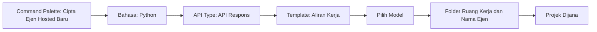
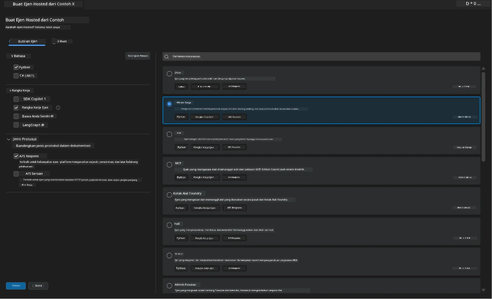
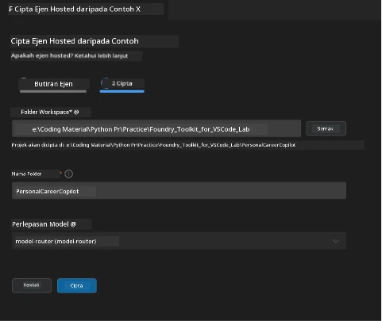

# Modul 2 - Rangka Projek Multi-Ejen

⏱️ ~5 minit

Dalam modul ini, anda menggunakan [Foundry Toolkit untuk VS Code](https://aka.ms/foundrytk) untuk **merangka projek multi-ejen**. Wizard akan menjana `agent.yaml`, `main.py`, `Dockerfile`, `requirements.txt`, `.env`, dan konfigurasi debug VS Code - supaya anda boleh fokus pada menyambungkan aliran kerja 4-ejen dalam Modul 3.

> **Konsep utama:** Rangka ini adalah kerangka kerja yang berfungsi dengan satu ejen. Anda menggantikan logik tempat letak dengan graf `WorkflowBuilder` dalam Modul 3. Anda tidak menulis kod asas dari awal.

> **Implementasi rujukan:** [`PersonalCareerCopilot/`](../../../../../workshop/lab02-multi-agent/PersonalCareerCopilot) adalah contoh kerja lengkap. Gunakannya untuk membandingkan kerja anda semasa anda berjalan.

### Aliran wizard rangka


```mermaid
flowchart LR
    A[Command Palette: Cipta Ejen Hosted Baru] --> B[Bahasa: Python]
    B --> C[API Type: API Respons]
    C --> D[Template: Aliran Kerja]
    D --> E[Pilih Model]
    E --> F[Folder Ruang Kerja dan Nama Ejen]
    F --> G[Projek Dijana]
```

---

## Langkah 1: Buka wizard Cipta Ejen Dihoskan

1. Tekan `Ctrl+Shift+P` untuk membuka **Command Palette**.
2. Taip: **Foundry Toolkit: Create a New Hosted Agent** dan pilih ia.
3. Wizard akan dibuka pada tab **Agent Details**.

> **Alternatif:** Klik ikon **Foundry Toolkit** di Bar Aktiviti → klik ikon **+** di sebelah **Hosted Agents** → **Create New Hosted Agent**.

---

## Langkah 2: Pilih tetapan



1. Pada bahagian navigasi/pilihan kiri, pilih yang berikut:

| Menu | Pilihan | Nota |
|--------|-----------|-------|
| **Language** | Python | C# (.NET) juga disokong |
| **Framework** | Agent Framework | Menyediakan `Agent`, `AgentExecutor`, `WorkflowBuilder` |
| **API type** | Response API | `POST /responses` - sejarah dikendalikan platform, sokongan streaming |
| **Template** | **Workflows** | Memproses permintaan melalui beberapa ejen secara berurutan |

2. Setelah dipilih, klik **Next**



3. Dalam tetingkap seterusnya, pilih yang berikut:

| Menu | Pilihan | Nota |
|--------|-----------|-------|
| **Workspace folder** | Semak lalu ke folder sasaran | contoh, `workshop/lab02-multi-agent/` dalam repo ini |
| **Agent name** | `PersonalCareerCopilot` | Ini menjadi nama direktori projek |
| **Model Deployment** | Pilih model yang anda gunakan | contoh, `gpt-4.1-mini` dari Lab 01 |

4. Klik **Create** untuk merangka projek. VS Code akan menjana fail-fail dan membuka folder tersebut.

> **Petua:** [`gpt-4.1-mini`](https://learn.microsoft.com/azure/foundry/foundry-models/concepts/models-sold-directly-by-azure#gpt-41-series) mengimbangi kelajuan dan kualiti dengan baik untuk pembangunan multi-ejen.

---

## Langkah 3: Periksa projek yang dijana

Selepas rangka selesai, sahkan anda melihat fail-fail ini dalam Explorer (`Ctrl+Shift+E`):

```
📂 <your-agent-name>/
├── .azdignore          ← Files excluded from Azure Developer CLI deployments
├── .dockerignore       ← Files excluded from Docker builds
├── .env                ← Environment variables (placeholders - fill in Module 3)
├── .vscode/
│   ├── launch.json     ← Debug config (F5 → run + Agent Inspector)
│   └── tasks.json      ← VS Code task definitions
├── agent.yaml          ← Agent definition (kind: hosted, protocol: responses)
├── Dockerfile          ← Container config for deployment
├── main.py             ← Stub agent entry point (replace with WorkflowBuilder in Module 3)
└── requirements.txt    ← Python dependencies
```

> **Penting:** Buka folder yang dirangka ini secara langsung di VS Code supaya `.vscode/launch.json` dan `tasks.json` berfungsi dengan betul untuk debug F5.

### Penjelasan fail utama

| Fail | Tujuan |
|------|---------|
| `agent.yaml` | Mengisytiharkan `kind: hosted`, memetakan pembolehubah env, mendefinisikan protokol `/responses` |
| `main.py` | Kerangka: satu `FoundryChatClient` → `Agent` → `ResponsesHostServer`. Anda akan gantikan ini dengan 4 ejen + `WorkflowBuilder` dalam Modul 3 |
| `Dockerfile` | `python:3.12-slim`, memasang `requirements.txt`, membuka port 8088, menjalankan `python main.py` |
| `requirements.txt` | `agent-framework-foundry`, `agent-framework-foundry-hosting`, `mcp<2,>=1.24.0`, `debugpy` |

> **Rujukan:** Lihat [`PersonalCareerCopilot/agent.yaml`](../../../../../workshop/lab02-multi-agent/PersonalCareerCopilot/agent.yaml) dan [`PersonalCareerCopilot/requirements.txt`](../../../../../workshop/lab02-multi-agent/PersonalCareerCopilot/requirements.txt) untuk kandungan lengkap yang dijana.

---

### ✅ Titik semak

- [ ] Wizard rangka selesai - folder projek baru nampak dalam Explorer
- [ ] Semua fail dijangka hadir: `agent.yaml`, `main.py`, `Dockerfile`, `requirements.txt`, `.env`
- [ ] `agent.yaml` menunjukkan `kind: hosted` dan `protocol: responses`
- [ ] `main.py` mengimport `Agent`, `FoundryChatClient`, `ResponsesHostServer`
- [ ] Folder yang dirangka dibuka sebagai root ruang kerja VS Code
- [ ] Anda faham `main.py` adalah kerangka - `WorkflowBuilder` ditambah dalam Modul 3

---

**Sebelum ini:** [01 - Fahami Seni Bina Multi-Ejen](01-understand-multi-agent.md) · **Seterusnya:** [03 - Konfigurasi Ejen & Persekitaran →](03-configure-agents.md)

---

<!-- CO-OP TRANSLATOR DISCLAIMER START -->
**Penafian**:
Dokumen ini telah diterjemahkan menggunakan perkhidmatan terjemahan AI [Co-op Translator](https://github.com/Azure/co-op-translator). Walaupun kami berusaha untuk ketepatan, sila ambil maklum bahawa terjemahan automatik mungkin mengandungi kesilapan atau ketidaktepatan. Dokumen asal dalam bahasa asalnya harus dianggap sebagai sumber yang sahih. Untuk maklumat penting, terjemahan oleh manusia profesional adalah disyorkan. Kami tidak bertanggungjawab terhadap sebarang salah faham atau salah tafsir yang timbul daripada penggunaan terjemahan ini.
<!-- CO-OP TRANSLATOR DISCLAIMER END -->