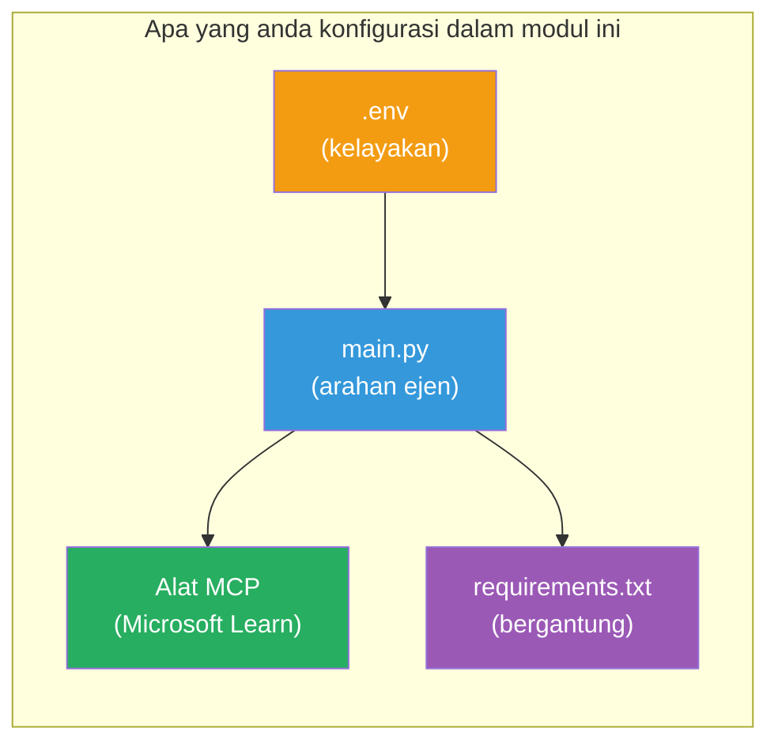

# Modul 3 - Konfigurasi Ejen, Alat MCP & Persekitaran

Dalam modul ini, anda akan menyesuaikan projek multi-ejen yang telah dibina. Anda akan menulis arahan untuk keempat-empat ejen, menyediakan alat MCP untuk Microsoft Learn, mengkonfigurasi pembolehubah persekitaran, dan memasang kebergantungan.


> **Rujukan:** Kod kerja lengkap terdapat di [`PersonalCareerCopilot/main.py`](../../../../../workshop/lab02-multi-agent/PersonalCareerCopilot/main.py). Gunakannya sebagai rujukan semasa membina projek anda sendiri.

---

## Langkah 1: Konfigurasi pembolehubah persekitaran

1. Buka fail **`.env`** di akar projek anda.
2. Isikan butiran projek Foundry anda:

   ```env
   PROJECT_ENDPOINT=https://<your-account>.services.ai.azure.com/api/projects/<your-project>
   MODEL_DEPLOYMENT_NAME=gpt-4.1-mini
   ```

3. Simpan fail tersebut.

### Di mana untuk mencari nilai-nilai ini

| Nilai | Cara untuk mencarinya |
|-------|-----------------------|
| **Project endpoint** | Bar sisi Microsoft Foundry → klik projek anda → URL titik akhir dalam paparan butiran |
| **Model deployment name** | Bar sisi Foundry → kembangkan projek → **Models + endpoints** → nama bersebelahan model yang diterapkan |

> **Keselamatan:** Jangan pernah komit `.env` ke kawalan versi. Tambahkannya ke `.gitignore` jika belum ada.

### Pemetaan pembolehubah persekitaran

`main.py` multi-ejen membaca nama pembolehubah persekitaran standard dan khusus bengkel:

```python
PROJECT_ENDPOINT = os.getenv("AZURE_AI_PROJECT_ENDPOINT") or os.getenv("PROJECT_ENDPOINT")
MODEL_DEPLOYMENT_NAME = os.getenv(
    "AZURE_AI_MODEL_DEPLOYMENT_NAME",
    os.getenv("MODEL_DEPLOYMENT_NAME", "gpt-4.1-mini"),
)
MICROSOFT_LEARN_MCP_ENDPOINT = os.getenv(
    "MICROSOFT_LEARN_MCP_ENDPOINT", "https://learn.microsoft.com/api/mcp"
)
```

Titik akhir MCP mempunyai nilai lalai yang munasabah - anda tidak perlu menetapkannya dalam `.env` melainkan anda ingin menimpanya.

---

## Langkah 2: Tulis arahan ejen

Ini adalah langkah yang paling kritikal. Setiap ejen memerlukan arahan yang direka dengan teliti yang menentukan peranannya, format output, dan peraturannya. Buka `main.py` dan cipta (atau ubah) pemalar arahan.

### 2.1 Ejen Parser Resume

```python
RESUME_PARSER_INSTRUCTIONS = """\
You are the Resume Parser.
Extract resume text into a compact, structured profile for downstream matching.

Output exactly these sections:
1) Candidate Profile
2) Technical Skills (grouped categories)
3) Soft Skills
4) Certifications & Awards
5) Domain Experience
6) Notable Achievements

Rules:
- Use only explicit or strongly implied evidence.
- Do not invent skills, titles, or experience.
- Keep concise bullets; no long paragraphs.
- If input is not a resume, return a short warning and request resume text.
"""
```

**Mengapa bahagian ini?** MatchingAgent memerlukan data berstruktur untuk penilaian. Bahagian yang konsisten menjadikan penyerahan antara ejen boleh dipercayai.

### 2.2 Ejen Deskripsi Kerja

```python
JOB_DESCRIPTION_INSTRUCTIONS = """\
You are the Job Description Analyst.
Extract a structured requirement profile from a JD.

Output exactly these sections:
1) Role Overview
2) Required Skills
3) Preferred Skills
4) Experience Required
5) Certifications Required
6) Education
7) Domain / Industry
8) Key Responsibilities

Rules:
- Keep required vs preferred clearly separated.
- Only use what the JD states; do not invent hidden requirements.
- Flag vague requirements briefly.
- If input is not a JD, return a short warning and request JD text.
"""
```

**Mengapa memisahkan kemahiran wajib vs disukai?** MatchingAgent menggunakan berat berbeza untuk setiap satu (Kemahiran Wajib = 40 mata, Kemahiran Disukai = 10 mata).

### 2.3 Ejen Pemadanan

```python
MATCHING_AGENT_INSTRUCTIONS = """\
You are the Matching Agent.
Compare parsed resume output vs JD output and produce an evidence-based fit report.

Scoring (100 total):
- Required Skills 40
- Experience 25
- Certifications 15
- Preferred Skills 10
- Domain Alignment 10

Output exactly these sections:
1) Fit Score (with breakdown math)
2) Matched Skills
3) Missing Skills
4) Partially Matched
5) Experience Alignment
6) Certification Gaps
7) Overall Assessment

Rules:
- Be objective and evidence-only.
- Keep partial vs missing separate.
- Keep Missing Skills precise; it feeds roadmap planning.
"""
```

**Mengapa penilaian yang jelas?** Penilaian yang boleh dihasilkan semula membolehkan perbandingan larian dan menyahpepijat isu. Skala 100 mata mudah untuk pengguna akhir mentafsir.

### 2.4 Ejen Penganalisis Jurang

```python
GAP_ANALYZER_INSTRUCTIONS = """\
You are the Gap Analyzer and Roadmap Planner.
Create a practical upskilling plan from the matching report.

Microsoft Learn MCP usage (required):
- For EVERY High and Medium priority gap, call tool `search_microsoft_learn_for_plan`.
- Use returned Learn links in Suggested Resources.
- Prefer Microsoft Learn for free resources.

CRITICAL: You MUST produce a SEPARATE detailed gap card for EVERY skill listed in
the Missing Skills and Certification Gaps sections of the matching report. Do NOT
skip or combine gaps. Do NOT summarize multiple gaps into one card.

Output format:
1) Personalized Learning Roadmap for [Role Title]
2) One DETAILED card per gap (produce ALL cards, not just the first):
   - Skill
   - Priority (High/Medium/Low)
   - Current Level
   - Target Level
   - Suggested Resources (include Learn URL from tool results)
   - Estimated Time
   - Quick Win Project
3) Recommended Learning Order (numbered list)
4) Timeline Summary (week-by-week)
5) Motivational Note

Rules:
- Produce every gap card before writing the summary sections.
- Keep it specific, realistic, and actionable.
- Tailor to candidate's existing stack.
- If fit >= 80, focus on polish/interview readiness.
- If fit < 40, be honest and provide a staged path.
"""
```

**Mengapa penekanan "KRITIKAL"?** Tanpa arahan eksplisit untuk menghasilkan SEMUA kad jurang, model cenderung menghasilkan hanya 1-2 kad dan meringkaskan selebihnya. Blok "KRITIKAL" menghalang pemangkasan ini.

---

## Langkah 3: Definisikan alat MCP

GapAnalyzer menggunakan alat yang memanggil [pelayan Microsoft Learn MCP](https://learn.microsoft.com/azure/foundry/agents/how-to/tools/model-context-protocol). Tambahkan ini ke `main.py`:

```python
import json
from agent_framework import tool
from mcp.client.session import ClientSession
from mcp.client.streamable_http import streamable_http_client

@tool
async def search_microsoft_learn_for_plan(
    skill: str, role: str = "", max_results: int = 5
) -> str:
    """Search Microsoft Learn MCP and return curated official links for roadmap planning."""
    query = " ".join(part for part in [skill, role, "learning path module"] if part).strip()
    query = query or "job skills learning path"

    try:
        async with streamable_http_client(MICROSOFT_LEARN_MCP_ENDPOINT) as (
            read_stream, write_stream, _,
        ):
            async with ClientSession(read_stream, write_stream) as session:
                await session.initialize()
                result = await session.call_tool(
                    "microsoft_docs_search", {"query": query}
                )

        if not result.content:
            return (
                "No results returned from Microsoft Learn MCP. "
                "Fallback: https://learn.microsoft.com/training/support/catalog-api"
            )

        payload_text = getattr(result.content[0], "text", "")
        data = json.loads(payload_text) if payload_text else {}
        items = data.get("results", [])[:max(1, min(max_results, 10))]

        if not items:
            return f"No direct Microsoft Learn results found for '{skill}'."

        lines = [f"Microsoft Learn resources for '{skill}':"]
        for i, item in enumerate(items, start=1):
            title = item.get("title") or item.get("url") or "Microsoft Learn Resource"
            url = item.get("url") or item.get("link") or ""
            lines.append(f"{i}. {title} - {url}".rstrip(" -"))
        return "\n".join(lines)
    except Exception as ex:
        return (
            f"Microsoft Learn MCP lookup unavailable. Reason: {ex}. "
            "Fallbacks: https://learn.microsoft.com/api/mcp"
        )
```

### Bagaimana alat ini berfungsi

| Langkah | Apa yang berlaku |
|---------|------------------|
| 1 | GapAnalyzer memutuskan ia memerlukan sumber untuk kemahiran (contoh: "Kubernetes") |
| 2 | Rangka kerja memanggil `search_microsoft_learn_for_plan(skill="Kubernetes")` |
| 3 | Fungsi membuka sambungan [HTTP Boleh Alirkan](https://learn.microsoft.com/agent-framework/agents/tools/hosted-mcp-tools) ke `https://learn.microsoft.com/api/mcp` |
| 4 | Memanggil `microsoft_docs_search` pada [pelayan MCP](https://learn.microsoft.com/azure/foundry/agents/how-to/tools/model-context-protocol) |
| 5 | Pelayan MCP mengembalikan hasil carian (tajuk + URL) |
| 6 | Fungsi memformat hasil sebagai senarai bernombor |
| 7 | GapAnalyzer menggabungkan URL ke dalam kad jurang |

### Kebergantungan MCP

Perpustakaan klien MCP disertakan secara transitif melalui [`agent-framework-core`](https://learn.microsoft.com/agent-framework/overview/). Anda **tidak** perlu menambahkannya secara berasingan di `requirements.txt`. Jika anda mendapat ralat import, sahkan:

```powershell
pip list | Select-String "mcp"
```

Dijangkakan: pakej `mcp` dipasang (versi 1.x atau lebih baru).

---

## Langkah 4: Sambungkan ejen dan aliran kerja

### 4.1 Cipta ejen dengan pengurus konteks

```python
from contextlib import asynccontextmanager

@asynccontextmanager
async def create_agents():
    async with (
        get_credential() as credential,
        AzureAIAgentClient(
            project_endpoint=PROJECT_ENDPOINT,
            model_deployment_name=MODEL_DEPLOYMENT_NAME,
            credential=credential,
        ).as_agent(
            name="ResumeParser",
            instructions=RESUME_PARSER_INSTRUCTIONS,
        ) as resume_parser,
        AzureAIAgentClient(
            project_endpoint=PROJECT_ENDPOINT,
            model_deployment_name=MODEL_DEPLOYMENT_NAME,
            credential=credential,
        ).as_agent(
            name="JobDescriptionAgent",
            instructions=JOB_DESCRIPTION_INSTRUCTIONS,
        ) as jd_agent,
        AzureAIAgentClient(
            project_endpoint=PROJECT_ENDPOINT,
            model_deployment_name=MODEL_DEPLOYMENT_NAME,
            credential=credential,
        ).as_agent(
            name="MatchingAgent",
            instructions=MATCHING_AGENT_INSTRUCTIONS,
        ) as matching_agent,
        AzureAIAgentClient(
            project_endpoint=PROJECT_ENDPOINT,
            model_deployment_name=MODEL_DEPLOYMENT_NAME,
            credential=credential,
        ).as_agent(
            name="GapAnalyzer",
            instructions=GAP_ANALYZER_INSTRUCTIONS,
            tools=[search_microsoft_learn_for_plan],
        ) as gap_analyzer,
    ):
        yield resume_parser, jd_agent, matching_agent, gap_analyzer
```

**Poin utama:**
- Setiap ejen mempunyai instans `AzureAIAgentClient` **sendiri**
- Hanya GapAnalyzer mendapat `tools=[search_microsoft_learn_for_plan]`
- `get_credential()` mengembalikan [`ManagedIdentityCredential`](https://learn.microsoft.com/python/api/overview/azure/identity-readme#managed-identity-support) di Azure, [`DefaultAzureCredential`](https://learn.microsoft.com/azure/developer/python/sdk/authentication/credential-chains#defaultazurecredential-overview) secara tempatan

### 4.2 Bina graf aliran kerja

```python
def create_workflow(resume_parser, jd_agent, matching_agent, gap_analyzer):
    workflow = (
        WorkflowBuilder(
            name="ResumeJobFitEvaluator",
            start_executor=resume_parser,
            output_executors=[gap_analyzer],
        )
        .add_edge(resume_parser, jd_agent)
        .add_edge(resume_parser, matching_agent)
        .add_edge(jd_agent, matching_agent)
        .add_edge(matching_agent, gap_analyzer)
        .build()
    )
    return workflow.as_agent()
```

> Lihat [Aliran Kerja sebagai Ejen](https://learn.microsoft.com/agent-framework/workflows/as-agents) untuk memahami corak `.as_agent()`.

### 4.3 Mulakan pelayan

```python
async def main() -> None:
    validate_configuration()
    async with create_agents() as (resume_parser, jd_agent, matching_agent, gap_analyzer):
        agent = create_workflow(resume_parser, jd_agent, matching_agent, gap_analyzer)
        from azure.ai.agentserver.agentframework import from_agent_framework
        await from_agent_framework(agent).run_async()

if __name__ == "__main__":
    asyncio.run(main())
```

---

## Langkah 5: Cipta dan aktifkan persekitaran maya

### 5.1 Cipta persekitaran

```powershell
cd workshop\lab02-multi-agent\PersonalCareerCopilot
python -m venv .venv
```

### 5.2 Aktifkannya

**PowerShell (Windows):**
```powershell
.\.venv\Scripts\Activate.ps1
```

**macOS/Linux:**
```bash
source .venv/bin/activate
```

### 5.3 Pasang kebergantungan

```powershell
pip install -r requirements.txt
```

> **Nota:** Baris `agent-dev-cli --pre` dalam `requirements.txt` memastikan versi pratonton terkini dipasang. Ini diperlukan untuk keserasian dengan `agent-framework-core==1.0.0rc3`.

### 5.4 Sahkan pemasangan

```powershell
pip list | Select-String "agent-framework|agentserver|agent-dev"
```

Output dijangkakan:
```
agent-dev-cli                  0.0.1b260316
agent-framework-azure-ai       1.0.0rc3
agent-framework-core            1.0.0rc3
azure-ai-agentserver-agentframework 1.0.0b16
azure-ai-agentserver-core      1.0.0b16
```

> **Jika `agent-dev-cli` menunjukkan versi lama** (contohnya `0.0.1b260119`), Agent Inspector akan gagal dengan ralat 403/404. Kemas kini: `pip install agent-dev-cli --pre --upgrade`

---

## Langkah 6: Sahkan pengesahan

Jalankan semakan pengesahan yang sama dari Lab 01:

```powershell
az account show --query "{name:name, id:id}" --output table
```

Jika ini gagal, jalankan [`az login`](https://learn.microsoft.com/cli/azure/authenticate-azure-cli-interactively).

Untuk aliran kerja multi-ejen, keempat-empat ejen berkongsi kredensial yang sama. Jika pengesahan berjaya untuk satu, ia berjaya untuk semua.

---

### Titik semak

- [ ] `.env` mempunyai nilai `PROJECT_ENDPOINT` dan `MODEL_DEPLOYMENT_NAME` yang sah
- [ ] Semua 4 pemalar arahan ejen ditakrifkan dalam `main.py` (ResumeParser, JD Agent, MatchingAgent, GapAnalyzer)
- [ ] Alat MCP `search_microsoft_learn_for_plan` ditakrifkan dan didaftarkan dengan GapAnalyzer
- [ ] `create_agents()` mencipta keempat-empat ejen dengan instans `AzureAIAgentClient` berasingan
- [ ] `create_workflow()` membina graf yang betul dengan `WorkflowBuilder`
- [ ] Persekitaran maya telah dicipta dan diaktifkan (`(.venv)` kelihatan)
- [ ] `pip install -r requirements.txt` selesai tanpa ralat
- [ ] `pip list` memaparkan semua pakej yang dijangkakan pada versi yang betul (rc3 / b16)
- [ ] `az account show` memaparkan akaun langganan anda

---

**Sebelum ini:** [02 - Scaffold Multi-Agent Project](02-scaffold-multi-agent.md) · **Seterusnya:** [04 - Orchestration Patterns →](04-orchestration-patterns.md)

---

<!-- CO-OP TRANSLATOR DISCLAIMER START -->
**Penafian**:  
Dokumen ini telah diterjemahkan menggunakan perkhidmatan terjemahan AI [Co-op Translator](https://github.com/Azure/co-op-translator). Walaupun kami berusaha untuk ketepatan, sila maklum bahawa terjemahan automatik mungkin mengandungi kesilapan atau ketidaktepatan. Dokumen asal dalam bahasa asalnya hendaklah dianggap sebagai sumber yang sahih. Untuk maklumat penting, terjemahan profesional oleh manusia adalah disyorkan. Kami tidak bertanggungjawab atas sebarang salah faham atau salah tafsir yang timbul daripada penggunaan terjemahan ini.
<!-- CO-OP TRANSLATOR DISCLAIMER END -->