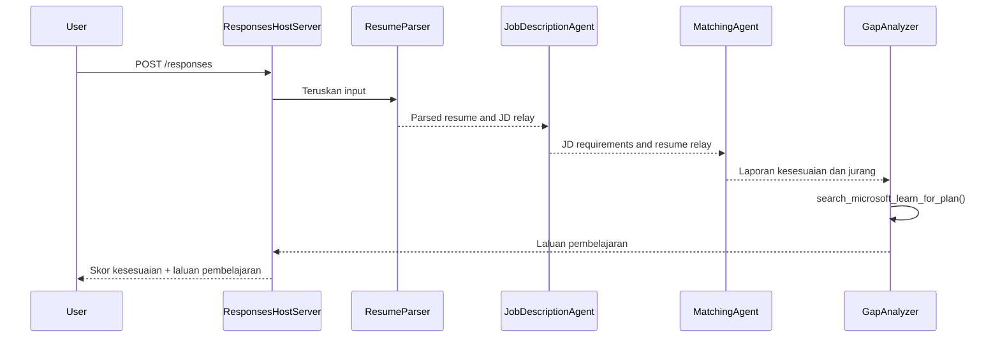

# Modul 3 - Konfigurasi Arahan, Persekitaran & Pasang Kebergantungan

⏱️ ~15 min

Dalam modul ini, anda menukar kerangka asas yang distruktur menjadi **aliran kerja** pelbagai ejen anda - dengan menetapkan pembolehubah persekitaran, menulis arahan ejen, menambah alat MCP, menyambung graf aliran kerja, dan memasang kebergantungan.

> **Rujukan:** Kod kerja lengkap terdapat dalam [`PersonalCareerCopilot/main.py`](../../../../../workshop/lab02-multi-agent/PersonalCareerCopilot/main.py). Gunakannya sebagai rujukan semasa membina graf aliran kerja dan blok arahan anda sendiri.

---

## Bagaimana keempat-empat ejen berfungsi bersama


```mermaid
sequenceDiagram
    participant User
    participant Server as ResponsesHostServer
    participant RP as ResumeParser
    participant JD as JobDescriptionAgent
    participant MA as MatchingAgent
    participant GA as GapAnalyzer

    User->>Server: POST /responses
    Server->>RP: Teruskan input
    RP-->>JD: Parsed resume and JD relay
    JD-->>MA: JD requirements and resume relay
    MA-->>GA: Laporan kesesuaian dan jurang
    GA->>GA: search_microsoft_learn_for_plan()
    GA-->>Server: Laluan pembelajaran
    Server-->>User: Skor kesesuaian + laluan pembelajaran
```

---

## Langkah 1: Konfigurasi pembolehubah persekitaran

1. Buka fail **`.env`** di akar projek anda (dibuat oleh wizard kerangka).
2. Gantikan pemegang tempat dengan nilai sebenar anda dari Lab 01.

<details open>
<summary><strong>🅰️ Laluan A - Langganan Foundry</strong></summary>

```env
FOUNDRY_PROJECT_ENDPOINT=https://<your-account>.services.ai.azure.com/api/projects/<your-project>
AZURE_AI_MODEL_DEPLOYMENT_NAME=gpt-4.1-mini
```

> **Lokasi nilai:** Lihat [Lab 01, Modul 1](../../lab01-single-agent/docs/01-setup.md#deploy-a-model--assign-rbac).

</details>

<details open>
<summary><strong>🅱️ Laluan B - Foundry Tempatan</strong></summary>

```env
FOUNDRY_PROJECT_ENDPOINT=http://localhost:5273/v1
AZURE_AI_MODEL_DEPLOYMENT_NAME=phi-4-mini
```

> Semua inferens dilakukan pada mesin anda - tiada data keluar dari peranti anda. Jalankan `foundry model list` untuk mengesahkan alias model yang tepat. Satu-satunya permintaan keluar adalah panggilan alat MCP ke `https://learn.microsoft.com/api/mcp`.

> **Lokasi nilai:** Lihat [Lab 01, Modul 1 - laluan tempatan](../../lab01-single-agent/docs/01-setup.md#step-2-set-up-based-on-your-access).

</details>

> **Keselamatan:** Jangan sekali-kali komit `.env` ke kawalan versi. Ia sepatutnya sudah disenaraikan dalam `.gitignore`.

---

## Langkah 2: Tulis arahan ejen

Arahan menentukan peranan setiap ejen, format output, dan peraturan. Buka `main.py` dan takrifkan (atau gantikan) empat konstanta arahan - rentetan lengkap ada dalam [`PersonalCareerCopilot/main.py`](../../../../../workshop/lab02-multi-agent/PersonalCareerCopilot/main.py).

### 2.1 `RESUME_PARSER_INSTRUCTIONS`
Mengurai resume menjadi profil calon yang berstruktur **dan** menyalin deskripsi kerja secara tepat ke dalam `[JOB DESCRIPTION PASS-THROUGH]`. Kedua-dua bahagian berlabel mesti muncul dalam output.

> **Kenapa perlu pass-through?** Dengan `context_mode="last_agent"`, ResumeParser adalah satu-satunya ejen yang melihat mesej asal pengguna. Jika ia tidak menyalin JD ke hadapan, ejen hiliran tidak akan pernah melihatnya.

### 2.2 `JOB_DESCRIPTION_INSTRUCTIONS`
Membaca `[PARSED RESUME]` dan `[JOB DESCRIPTION PASS-THROUGH]` dari output ResumeParser. Menghasilkan `[JD REQUIREMENTS]` (keperluan berstruktur) dan `[PARSED RESUME PASS-THROUGH]` (salinan resume tepat untuk MatchingAgent).

### 2.3 `MATCHING_AGENT_INSTRUCTIONS`
Membaca `[JD REQUIREMENTS]` dan `[PARSED RESUME PASS-THROUGH]`. Menghasilkan laporan kesesuaian ber-markah (0–100) dengan pecahan matematik, kemahiran yang sesuai, kemahiran yang hilang, dan penjajaran pengalaman.

### 2.4 `GAP_ANALYZER_INSTRUCTIONS`
Membaca laporan kesesuaian. Untuk **setiap** kemahiran yang hilang, memanggil `search_microsoft_learn_for_plan` untuk mendapatkan sumber pembelajaran Microsoft Learn. Menghasilkan satu kad jurang terperinci bagi setiap kemahiran serta peta jalan pembelajaran mingguan.

---

## Langkah 3: Tambah alat MCP

GapAnalyzer memanggil [server Microsoft Learn MCP](https://learn.microsoft.com/azure/foundry/agents/how-to/tools/model-context-protocol) untuk mendapatkan sumber pembelajaran sebenar bagi setiap jurang kemahiran. Fungsi penuh `search_microsoft_learn_for_plan` ada dalam [`PersonalCareerCopilot/main.py`](../../../../../workshop/lab02-multi-agent/PersonalCareerCopilot/main.py).

Daftarkan alat tersebut pada GapAnalyzer semasa mencipta ejen:

```python
gap_analyzer = Agent(
    client=client,
    instructions=GAP_ANALYZER_INSTRUCTIONS,
    name="GapAnalyzer",
    tools=[search_microsoft_learn_for_plan],
)
```

> Lihat [`PersonalCareerCopilot/main.py`](../../../../../workshop/lab02-multi-agent/PersonalCareerCopilot/main.py) untuk graf lengkap `WorkflowBuilder` dengan `FoundryChatClient`, `AgentExecutor`, dan semua panggilan `add_edge()`.

---

## Langkah 4: Buat persekitaran maya & pasang kebergantungan

> ⚠️ **Jangan langkau langkah ini.** Tanpa kebergantungan dipasang, debug F5 akan gagal.

### 4.1 Buat persekitaran maya

```powershell
python -m venv .venv
```

### 4.2 Aktifkan ia

| OS | Arahan |
|----|---------|
| **Windows (PowerShell)** | `.\.venv\Scripts\Activate.ps1` |
| **Windows (CMD)** | `.venv\Scripts\activate.bat` |
| **macOS / Linux** | `source .venv/bin/activate` |

Anda harus melihat `(.venv)` pada prompt terminal anda.

### 4.3 Pasang kebergantungan

```powershell
pip install -r requirements.txt
```

### 4.4 Sahkan

```powershell
pip list | Select-String "agent-framework|mcp|debugpy"
```

Dijangka: `agent-framework-foundry`, `agent-framework-foundry-hosting`, `mcp`, dan `debugpy` disenaraikan.

---

## Langkah 5: Sahkan pengesahan

<details open>
<summary><strong>🅰️ Laluan A - Sijil Azure</strong></summary>

```powershell
az account show --query "{name:name, id:id}" --output table
```

Jika ini gagal, jalankan [`az login`](https://learn.microsoft.com/cli/azure/authenticate-azure-cli-interactively).

Keempat-empat ejen berkongsi satu `FoundryChatClient` dan satu `DefaultAzureCredential`. Jika pengesahan berjaya untuk satu, ia berjaya untuk semua.

</details>

<details open>
<summary><strong>🅱️ Laluan B - Foundry Tempatan</strong></summary>

Tiada pengesahan diperlukan untuk ujian tempatan.

</details>

---

### ✅ Titik Semak

> Jangan **teruskan** ke Modul 04 sehingga: **(1)** `(.venv)` kelihatan pada prompt AND **(2)** `pip install -r requirements.txt` selesai dengan jayanya.

- [ ] `.env` mempunyai nama titik akhir dan model deployment yang sah (bukan pemegang tempat)
- [ ] Semua 4 konstanta arahan ejen ditakrifkan dalam `main.py` (ResumeParser, JD Agent, MatchingAgent, GapAnalyzer)
- [ ] Fungsi `search_microsoft_learn_for_plan` alat MCP ditakrifkan dan didaftarkan pada GapAnalyzer
- [ ] Objek `FoundryChatClient` + 4 `Agent` + 4 `AgentExecutor` dicipta dalam `main()`
- [ ] `WorkflowBuilder` membina graf berurutan yang betul dengan semua 3 panggilan `add_edge()`
- [ ] Persekitaran maya dicipta dan diaktifkan (`(.venv)` kelihatan pada prompt)
- [ ] `pip install -r requirements.txt` selesai tanpa ralat
- [ ] **Laluan A:** Perintah `az account show` berjaya ATAU ikon Akaun VS Code menunjukkan akaun yang telah masuk

---

**Sebelumnya:** [02 - Scaffold Multi-Agent Project](02-scaffold-multi-agent.md) · **Seterusnya:** [04 - Corak Orkestrasi →](04-orchestration-patterns.md)

---

<!-- CO-OP TRANSLATOR DISCLAIMER START -->
**Penafian**:
Dokumen ini telah diterjemahkan menggunakan perkhidmatan terjemahan AI [Co-op Translator](https://github.com/Azure/co-op-translator). Walaupun kami berusaha untuk ketepatan, sila ambil maklum bahawa terjemahan automatik mungkin mengandungi kesilapan atau ketidaktepatan. Dokumen asal dalam bahasa asalnya harus dianggap sebagai sumber yang sahih. Untuk maklumat penting, terjemahan oleh manusia profesional adalah disyorkan. Kami tidak bertanggungjawab terhadap sebarang salah faham atau salah tafsir yang timbul daripada penggunaan terjemahan ini.
<!-- CO-OP TRANSLATOR DISCLAIMER END -->