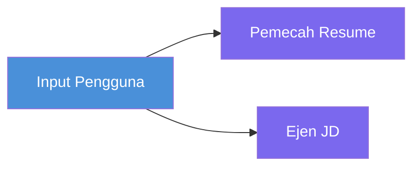
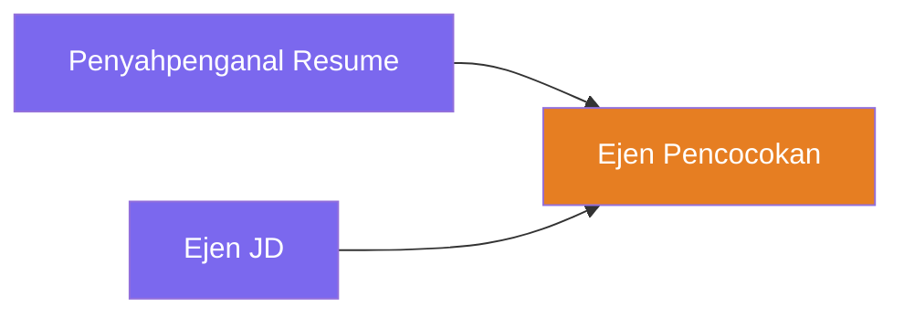
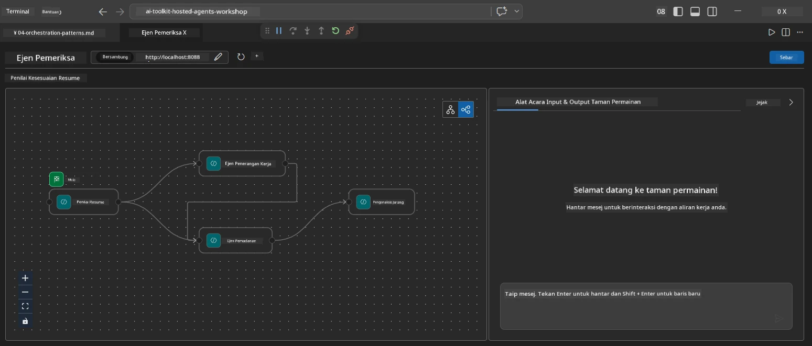
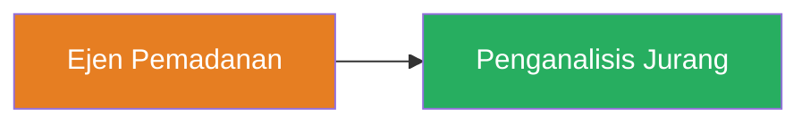
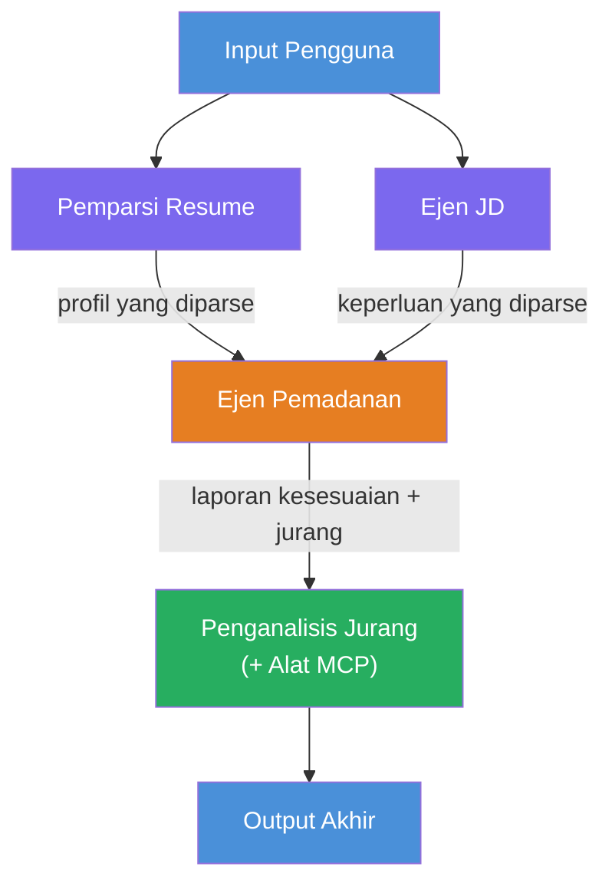
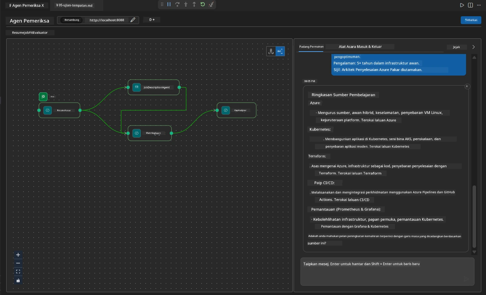

# Modul 4 - Corak Orkestrasi

Dalam modul ini, anda meneroka corak orkestrasi yang digunakan dalam Resume Job Fit Evaluator dan belajar bagaimana membaca, mengubah suai, dan meluaskan graf aliran kerja. Memahami corak ini adalah penting untuk menyahpepijat isu aliran data dan membina [aliran kerja pelbagai ejen](https://learn.microsoft.com/agent-framework/workflows/) anda sendiri.

---

## Corak 1: Fan-out (pecahan selari)

Corak pertama dalam aliran kerja ialah **fan-out** - satu input dihantar kepada beberapa ejen serentak.


Dalam kod, ini berlaku kerana `resume_parser` adalah `start_executor` - ia menerima mesej pengguna terlebih dahulu. Kemudian, kerana kedua-dua `jd_agent` dan `matching_agent` mempunyai tepi dari `resume_parser`, rangka kerja menghala output `resume_parser` ke kedua-dua ejen tersebut:

```python
.add_edge(resume_parser, jd_agent)         # Output ResumeParser → Ejen JD
.add_edge(resume_parser, matching_agent)   # Output ResumeParser → Ejen Padanan
```

**Mengapa ini berfungsi:** ResumeParser dan JD Agent memproses aspek yang berbeza dari input yang sama. Menjalankan mereka secara selari mengurangkan kelewatan jumlah berbanding menjalankan mereka secara berturutan.

### Bila hendak menggunakan fan-out

| Kes penggunaan | Contoh |
|----------------|---------|
| Tugasan kecil bebas | Memparsing resume vs. memparsing JD |
| Redundansi / pengundian | Dua ejen menganalisis data yang sama, seorang ketiga memilih jawapan terbaik |
| Output pelbagai format | Satu ejen menjana teks, satu lagi menjana JSON berstruktur |

---

## Corak 2: Fan-in (pengumpulan)

Corak kedua ialah **fan-in** - output dari berbilang ejen dikumpulkan dan dihantar ke satu ejen hiliran.


Dalam kod:

```python
.add_edge(resume_parser, matching_agent)   # Keluaran ResumeParser → MatchingAgent
.add_edge(jd_agent, matching_agent)        # Keluaran JD Agent → MatchingAgent
```

**Tingkah laku utama:** Apabila satu ejen mempunyai **dua atau lebih tepi masuk**, rangka kerja secara automatik menunggu **semua** ejen hiliran selesai sebelum menjalankan ejen hiliran tersebut. MatchingAgent tidak bermula sehingga kedua-dua ResumeParser dan JD Agent selesai.

### Apa yang MatchingAgent terima

Rangka kerja menggabungkan output dari semua ejen hiliran. Input MatchingAgent kelihatan seperti:

```
[ResumeParser output]
---
Candidate Profile:
  Name: Jane Doe
  Technical Skills: Python, Azure, Kubernetes, ...
  ...

[JobDescriptionAgent output]
---
Role Overview: Senior Cloud Engineer
Required Skills: Python, Azure, Terraform, ...
...
```

> **Nota:** Format penggabungan tepat bergantung pada versi rangka kerja. Arahan ejen perlu ditulis untuk mengendalikan output hiliran yang berstruktur dan tidak berstruktur.



---

## Corak 3: Rantaian berturutan

Corak ketiga ialah **rantai berturutan** - output satu ejen terus dihantar ke ejen seterusnya.


Dalam kod:

```python
.add_edge(matching_agent, gap_analyzer)    # Output MatchingAgent → GapAnalyzer
```

Ini adalah corak paling mudah. GapAnalyzer menerima skor kesesuaian, kemahiran yang sepadan/tiada, dan jurang dari MatchingAgent. Kemudian ia memanggil [alat MCP](https://learn.microsoft.com/azure/foundry/agents/how-to/tools/model-context-protocol) untuk setiap jurang bagi mendapatkan sumber Microsoft Learn.

---

## Graf lengkap

Menggabungkan ketiga-tiga corak menghasilkan aliran kerja penuh:


### Garis masa pelaksanaan

```mermaid
gantt
    title Garis Masa Pelaksanaan Ejen
    dateFormat X
    axisFormat %s

    section Selari
    Resume Parser       :rp, 0, 3
    JD Agent            :jd, 0, 2

    section Bersiri
    Matching Agent      :ma, 3, 5
    Gap Analyzer        :ga, 5, 9
```


> Jumlah masa dinding adalah lebih kurang `max(ResumeParser, JD Agent) + MatchingAgent + GapAnalyzer`. GapAnalyzer biasanya paling lambat kerana membuat beberapa panggilan alat MCP (satu untuk setiap jurang).

---

## Membaca kod WorkflowBuilder

Berikut adalah fungsi lengkap `create_workflow()` dari `main.py`, dengan anotasi:

```python
def create_workflow(resume_parser, jd_agent, matching_agent, gap_analyzer):
    workflow = (
        WorkflowBuilder(
            name="ResumeJobFitEvaluator",

            # Ejen pertama yang menerima input pengguna
            start_executor=resume_parser,

            # Ejen yang menghasilkan output yang menjadi respons akhir
            output_executors=[gap_analyzer],
        )
        # Fan-out: Output ResumeParser dihantar ke kedua-dua Ejen JD dan MatchingAgent
        .add_edge(resume_parser, jd_agent)
        .add_edge(resume_parser, matching_agent)

        # Fan-in: MatchingAgent menunggu kedua-dua ResumeParser dan Ejen JD
        .add_edge(jd_agent, matching_agent)

        # Bersiri: Output MatchingAgent disalurkan ke GapAnalyzer
        .add_edge(matching_agent, gap_analyzer)

        .build()
    )
    return workflow.as_agent()
```

### Jadual ringkasan tepi

| # | Tepi | Corak | Kesan |
|---|------|---------|--------|
| 1 | `resume_parser → jd_agent` | Fan-out | JD Agent menerima output ResumeParser (plus input pengguna asal) |
| 2 | `resume_parser → matching_agent` | Fan-out | MatchingAgent menerima output ResumeParser |
| 3 | `jd_agent → matching_agent` | Fan-in | MatchingAgent juga menerima output JD Agent (menunggu kedua-duanya) |
| 4 | `matching_agent → gap_analyzer` | Berturutan | GapAnalyzer menerima laporan kesesuaian + senarai jurang |

---

## Mengubah suai graf

### Menambah ejen baru

Untuk menambah ejen kelima (contohnya, **InterviewPrepAgent** yang menjana soalan temuduga berdasarkan analisis jurang):

```python
# 1. Definisikan arahan
INTERVIEW_PREP_INSTRUCTIONS = """\
You are the Interview Prep Agent.
Given a gap analysis and fit report, generate 10 targeted interview questions
the candidate should prepare for.
"""

# 2. Buat ejen (di dalam blok async with)
AzureAIAgentClient(
    project_endpoint=PROJECT_ENDPOINT,
    model_deployment_name=MODEL_DEPLOYMENT_NAME,
    credential=credential,
).as_agent(
    name="InterviewPrepAgent",
    instructions=INTERVIEW_PREP_INSTRUCTIONS,
) as interview_prep,

# 3. Tambah tepi dalam create_workflow()
.add_edge(matching_agent, interview_prep)   # menerima laporan kesesuaian
.add_edge(gap_analyzer, interview_prep)     # juga menerima kad jurang

# 4. Kemas kini output_executors
output_executors=[interview_prep],  # kini ejen akhir
```

### Menukar susunan pelaksanaan

Untuk membuat JD Agent berjalan **selepas** ResumeParser (berturutan bukan selari):

```python
# Buang: .add_edge(resume_parser, jd_agent)  ← sudah wujud, simpan ia
# Buang selari implisit dengan TIDAK membenarkan jd_agent menerima input pengguna secara langsung
# start_executor menghantar ke resume_parser terlebih dahulu, dan jd_agent hanya mendapat
# output resume_parser melalui tepi. Ini menjadikan mereka berurutan.
```

> **Penting:** `start_executor` adalah satu-satunya ejen yang menerima input pengguna mentah. Semua ejen lain menerima output dari tepi hiliran mereka. Jika anda mahu ejen juga menerima input pengguna mentah, ia mesti mempunyai tepi dari `start_executor`.

---

## Kesilapan graf biasa

| Kesilapan | Simptom | Pembetulan |
|-----------|---------|------------|
| Tepi hilang ke `output_executors` | Ejen berjalan tapi output kosong | Pastikan ada laluan dari `start_executor` ke setiap ejen dalam `output_executors` |
| Pergantungan bulat | Gelung tak berkesudahan atau tamat masa | Pastikan tiada ejen memberi balik ke ejen hiliran |
| Ejen dalam `output_executors` tanpa tepi masuk | Output kosong | Tambah sekurang-kurangnya satu `add_edge(source, that_agent)` |
| Berbilang `output_executors` tanpa fan-in | Output hanya mengandungi respons satu ejen | Gunakan satu ejen output yang mengumpul, atau terima output berbilang |
| Tiada `start_executor` | `ValueError` semasa bina | Sentiasa nyatakan `start_executor` dalam `WorkflowBuilder()` |

---

## Menyahpepijat graf

### Menggunakan Agent Inspector

1. Mulakan ejen secara tempatan (F5 atau terminal - lihat [Modul 5](05-test-locally.md)).
2. Buka Agent Inspector (`Ctrl+Shift+P` → **Foundry Toolkit: Open Agent Inspector**).
3. Hantar mesej ujian.
4. Dalam panel respons Inspector, cari **output penstriman** - ia menunjukkan sumbangan setiap ejen secara berurutan.



### Menggunakan logging

Tambahkan logging ke `main.py` untuk menjejaki aliran data:

```python
import logging
logger = logging.getLogger("resume-job-fit")

# Dalam create_workflow(), selepas membina:
logger.info("Workflow graph built with edges: RP→JD, RP→MA, JD→MA, MA→GA")
```

Log pelayan menunjukkan urutan pelaksanaan ejen dan panggilan alat MCP:

```
INFO:resume-job-fit:Starting Resume -> Job Fit Evaluator HTTP server...
INFO:resume-job-fit:Server running on http://localhost:8088
INFO:agent_framework:Executing agent: ResumeParser
INFO:agent_framework:Executing agent: JobDescriptionAgent
INFO:agent_framework:Waiting for upstream agents: ResumeParser, JobDescriptionAgent
INFO:agent_framework:Executing agent: MatchingAgent
INFO:agent_framework:Executing agent: GapAnalyzer
INFO:agent_framework:Tool call: search_microsoft_learn_for_plan(skill="Kubernetes")
POST https://learn.microsoft.com/api/mcp → 200
INFO:agent_framework:Tool call: search_microsoft_learn_for_plan(skill="Terraform")
POST https://learn.microsoft.com/api/mcp → 200
```

---

### Titik semak

- [ ] Anda boleh mengenal pasti tiga corak orkestrasi dalam aliran kerja: fan-out, fan-in, dan rantaian berturutan
- [ ] Anda faham bahawa ejen dengan pelbagai tepi masuk menunggu semua ejen hiliran selesai
- [ ] Anda boleh membaca kod `WorkflowBuilder` dan memadankan setiap panggilan `add_edge()` kepada graf visual
- [ ] Anda faham garis masa pelaksanaan: ejen selari berjalan dahulu, kemudian pengumpulan, kemudian berturutan
- [ ] Anda tahu bagaimana menambah ejen baru ke graf (mentakrif arahan, buat ejen, tambah tepi, kemas kini output)
- [ ] Anda boleh mengenal pasti kesilapan graf biasa dan simptomnya

---

**Sebelumnya:** [03 - Configure Agents & Environment](03-configure-agents.md) · **Seterusnya:** [05 - Test Locally →](05-test-locally.md)

---

<!-- CO-OP TRANSLATOR DISCLAIMER START -->
**Penafian**:  
Dokumen ini telah diterjemahkan menggunakan perkhidmatan terjemahan AI [Co-op Translator](https://github.com/Azure/co-op-translator). Walaupun kami berusaha untuk ketepatan, sila ambil perhatian bahawa terjemahan automatik mungkin mengandungi kesilapan atau ketidaktepatan. Dokument asal dalam bahasa asalnya harus dianggap sebagai sumber yang sahih. Untuk maklumat penting, terjemahan profesional oleh manusia adalah disyorkan. Kami tidak bertanggungjawab atas sebarang salah faham atau salah tafsir yang timbul daripada penggunaan terjemahan ini.
<!-- CO-OP TRANSLATOR DISCLAIMER END -->