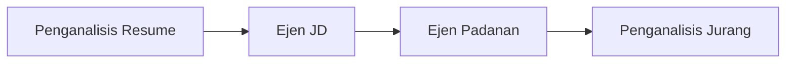
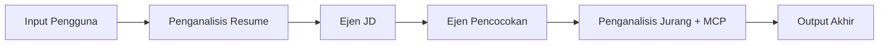

# Modul 4 - Corak Orkestrasi

⏱️ ~10 minit

Dalam modul ini, anda meneroka corak orkestrasi yang digunakan dalam Resume Job Fit Evaluator dan mempelajari cara membaca, mengubah suai, dan meluaskan graf aliran kerja. Memahami corak ini adalah penting untuk menyahpepijat isu aliran data dan membina [alur kerja multi-ejen](https://learn.microsoft.com/agent-framework/workflows/) anda sendiri.

---

## Corak 1: Rantaian berturutan

Corak asas dalam aliran kerja adalah **rantaian berturutan** - output setiap ejen terus memakan input ejen seterusnya.


```mermaid
flowchart LR
    RP[Penganalisis Resume] --> JD[Ejen JD]
    JD --> MA[Ejen Padanan]
    MA --> GA[Penganalisis Jurang]
```

Dalam kod, setiap panggilan `add_edge()` mencipta satu langkah dalam rantaian:

```python
.add_edge(resume_executor, jd_executor)       # Output ResumeParser → Ejen JD
.add_edge(jd_executor, matching_executor)     # Output Ejen JD → Ejen Padanan
.add_edge(matching_executor, gap_executor)    # Output Ejen Padanan → Penganalisis Jurang
```

> **Mengapa berturutan, bukan fan-out/fan-in?** `WorkflowBuilder` menggunakan **semantik OR** untuk tepi masuk: pelaksana hiliran akan beroperasi sebaik sahaja **mana-mana** pendahulu selesai. Jika `matching_executor` mempunyai dua tepi masuk (dari `resume_executor` dan `jd_executor`), ia akan dicetuskan dua kali - sekali apabila ResumeParser selesai dan sekali lagi apabila JD Agent selesai - menyebabkan GapAnalyzer juga berjalan dua kali dan output muncul dua kali. Saluran berturutan mengelakkan ini sepenuhnya.

## Corak 2: Penyampai Kandungan

Oleh kerana `context_mode="last_agent"` bermaksud setiap pelaksana hanya melihat output **pendahulu langsungnya**, ejen dalam rantaian berturutan mesti secara eksplisit menyampaikan data yang diperlukan oleh ejen hiliran.

Dalam aliran kerja ini:
- **ResumeParser** menyalin JD secara tepat ke dalam `[JOB DESCRIPTION PASS-THROUGH]` (supaya JD Agent boleh menemuinya).
- **JD Agent** menyalin `[PARSED RESUME]` secara tepat ke dalam `[PARSED RESUME PASS-THROUGH]` (supaya MatchingAgent boleh membandingkan kedua-dua profil).

```
ResumeParser output
└─ [PARSED RESUME]               ← extracted by JD Agent
└─ [JOB DESCRIPTION PASS-THROUGH] ← extracted by JD Agent

JD Agent output
└─ [JD REQUIREMENTS]             ← extracted by MatchingAgent
└─ [PARSED RESUME PASS-THROUGH]  ← extracted by MatchingAgent
```

Setiap bahagian penyampai mesti disalin **secara tepat** - merangkum atau memparafrasekannya akan memecahkan ejen hiliran yang bergantung padanya.

---

## Graf penuh

Menggabungkan corak rantaian berturutan dan penyampai kandungan menghasilkan aliran kerja penuh:


```mermaid
flowchart LR
    U[Input Pengguna] --> RP[Penganalisis Resume]
    RP --> JD[Ejen JD]
    JD --> MA[Ejen Pencocokan]
    MA --> GA[Penganalisis Jurang + MCP]
    GA --> O[Output Akhir]
```

Pemeriksa Ejen menunjukkan struktur graf yang sama ini apabila ejen dijalankan secara tempatan. Rujuk [Modul 5 - Uji Secara Tempatan](05-test-locally.md) untuk tangkapan skrin.

---

## Membaca kod WorkflowBuilder

Fungsi penuh `create_workflow()` ada dalam [`PersonalCareerCopilot/main.py`](../../../../../workshop/lab02-multi-agent/PersonalCareerCopilot/main.py). Tiga panggilan `add_edge()` membina saluran berturutan:

| # | Tepi | Kesan |
|---|------|--------|
| 1 | `resume_executor → jd_executor` | JD Agent menerima `[PARSED RESUME]` + `[JOB DESCRIPTION PASS-THROUGH]` |
| 2 | `jd_executor → matching_executor` | MatchingAgent menerima `[JD REQUIREMENTS]` + `[PARSED RESUME PASS-THROUGH]` |
| 3 | `matching_executor → gap_executor` | GapAnalyzer menerima laporan kesesuaian + senarai kekosongan |

---

## Mengubah suai graf

### Menambah ejen baru

Untuk menambah ejen kelima (contoh, **InterviewPrepAgent** selepas GapAnalyzer):

1. Takrifkan pemalar `INTERVIEW_PREP_INSTRUCTIONS`.
2. Cipta objek `Agent` + `AgentExecutor` (corak yang sama seperti empat ejen sedia ada).
3. Tambah `.add_edge(gap_executor, interview_exec)` dalam `WorkflowBuilder`.
4. Kemas kini `output_executors=[interview_exec]`.

> **Penting:** `start_executor` adalah satu-satunya ejen yang menerima input pengguna mentah. Semua ejen lain menerima output dari tepi huluannya.

---

## Kesilapan graf biasa

| Kesilapan | Simptom | Penyelesaian |
|---------|---------|-----|
| Tepi hilang ke `output_executors` | Ejen berjalan tetapi output kosong | Pastikan ada laluan dari `start_executor` ke setiap ejen dalam `output_executors` |
| Kebergantungan pusingan | Gelung tanpa henti atau tamat masa | Semak tiada ejen memberi maklum balas ke ejen huluan |
| Ejen dalam `output_executors` tanpa tepi masuk | Output kosong | Tambah sekurang-kurangnya satu `add_edge(source, that_agent)` |
| Pelbagai `output_executors` tanpa fan-in | Output hanya dari satu respon ejen | Gunakan satu ejen output yang mengagregat, atau terima output berganda |
| `start_executor` hilang | `ValueError` semasa bina | Sentiasa tentukan `start_executor` dalam `WorkflowBuilder()` |

---

## Penyahpepijatan graf

### Menggunakan Pemeriksa Ejen

1. Mulakan ejen secara tempatan dengan F5.
2. Buka Pemeriksa Ejen (`Ctrl+Shift+P` → **Foundry Toolkit: Buka Pemeriksa Ejen**).
3. Hantar mesej ujian.
4. Dalam panel respons Pemeriksa, cari **output penstriman** - ia menunjukkan sumbangan setiap ejen secara berturutan.


### Menggunakan log

Tambah log ke `main.py` untuk menjejaki aliran data:

```python
import logging
logger = logging.getLogger("resume-job-fit")

# Dalam main(), selepas membina aliran kerja:
logger.info("Workflow graph built with edges: RP→JD, JD→MA, MA→GA")
```

Log pelayan menunjukkan turutan pelaksanaan ejen dan panggilan alat MCP:

```
INFO:agent_framework:Executing agent: ResumeParser
INFO:agent_framework:Executing agent: JobDescriptionAgent
INFO:agent_framework:Executing agent: MatchingAgent
INFO:agent_framework:Executing agent: GapAnalyzer
INFO:agent_framework:Tool call: search_microsoft_learn_for_plan(skill="Kubernetes")
POST https://learn.microsoft.com/api/mcp → 200
INFO:agent_framework:Tool call: search_microsoft_learn_for_plan(skill="Terraform")
POST https://learn.microsoft.com/api/mcp → 200
```

---

### Titik semak

- [ ] Anda boleh mengenal pasti dua corak orkestrasi dalam aliran kerja: rantaian berturutan dan penyampai kandungan
- [ ] Anda faham mengapa `context_mode="last_agent"` memerlukan penyampaian data eksplisit antara ejen
- [ ] Anda boleh membaca kod `WorkflowBuilder` dan memetakan setiap panggilan `add_edge()` kepada graf visual
- [ ] Anda tahu bagaimana untuk menambah ejen baru ke hujung saluran
- [ ] Anda boleh mengenal pasti kesilapan graf umum dan simptomnya

---

**Sebelumnya:** [03 - Konfigurasi Ejen & Persekitaran](03-configure-agents.md) · **Seterusnya:** [05 - Uji Secara Tempatan →](05-test-locally.md)

---

<!-- CO-OP TRANSLATOR DISCLAIMER START -->
**Penafian**:
Dokumen ini telah diterjemahkan menggunakan perkhidmatan terjemahan AI [Co-op Translator](https://github.com/Azure/co-op-translator). Walaupun kami berusaha untuk ketepatan, sila ambil maklum bahawa terjemahan automatik mungkin mengandungi kesilapan atau ketidaktepatan. Dokumen asal dalam bahasa asalnya harus dianggap sebagai sumber yang sahih. Untuk maklumat penting, terjemahan oleh manusia profesional adalah disyorkan. Kami tidak bertanggungjawab terhadap sebarang salah faham atau salah tafsir yang timbul daripada penggunaan terjemahan ini.
<!-- CO-OP TRANSLATOR DISCLAIMER END -->