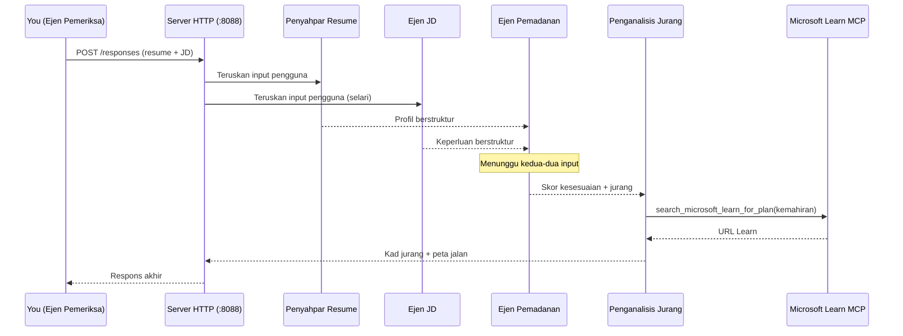
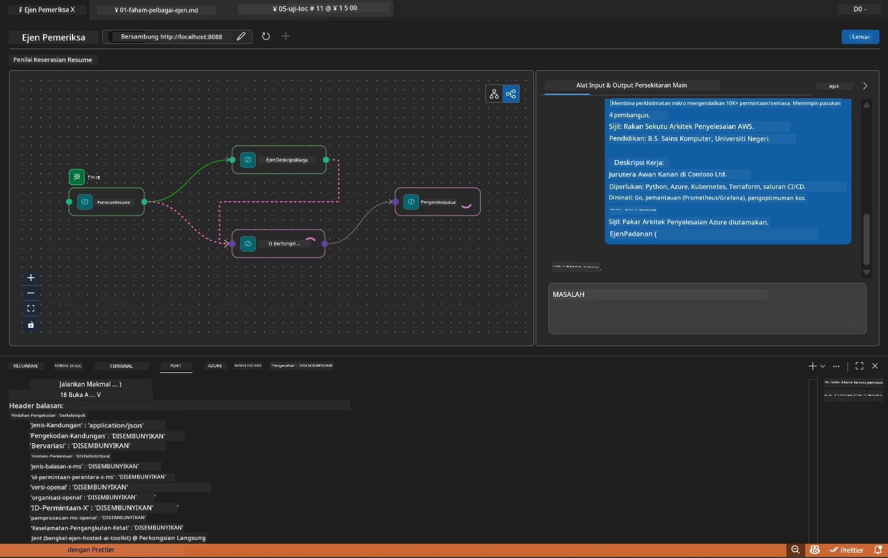

# Modul 5 - Uji Secara Tempatan (Multi-Ejen)

Dalam modul ini, anda menjalankan aliran kerja multi-ejen secara tempatan, mengujinya dengan Pemeriksa Ejen, dan mengesahkan bahawa keempat-empat ejen serta alat MCP berfungsi dengan betul sebelum diterapkan ke Foundry.

### Apa yang berlaku semasa ujian tempatan


---

## Langkah 1: Mula pelayan ejen

### Pilihan A: Menggunakan tugasan VS Code (disyorkan)

1. Tekan `Ctrl+Shift+P` → taip **Tasks: Run Task** → pilih **Run Lab02 HTTP Server**.
2. Tugasan akan memulakan pelayan dengan debugpy terpasang di port `5679` dan ejen di port `8088`.
3. Tunggu output menunjukkan:

```
INFO:resume-job-fit:Starting Resume -> Job Fit Evaluator HTTP server...
INFO:resume-job-fit:Server running on http://localhost:8088
```

### Pilihan B: Menggunakan terminal secara manual

```powershell
cd workshop\lab02-multi-agent\PersonalCareerCopilot
```

Aktifkan persekitaran maya:

**PowerShell (Windows):**
```powershell
.\.venv\Scripts\Activate.ps1
```

**macOS/Linux:**
```bash
source .venv/bin/activate
```

Mula pelayan:

```powershell
python -m debugpy --listen 127.0.0.1:5679 -m agentdev run main.py --verbose --port 8088
```

### Pilihan C: Menggunakan F5 (mod debug)

1. Tekan `F5` atau pergi ke **Run and Debug** (`Ctrl+Shift+D`).
2. Pilih konfigurasi pelancaran **Lab02 - Multi-Agent** dari dropdown.
3. Pelayan bermula dengan sokongan breakpoint penuh.

> **Petua:** Mod debug membolehkan anda menetapkan breakpoint di dalam `search_microsoft_learn_for_plan()` untuk memeriksa respons MCP, atau di dalam string arahan ejen untuk melihat apa yang diterima setiap ejen.

---

## Langkah 2: Buka Pemeriksa Ejen

1. Tekan `Ctrl+Shift+P` → taip **Foundry Toolkit: Open Agent Inspector**.
2. Pemeriksa Ejen terbuka dalam tab pelayar di `http://localhost:5679`.
3. Anda akan melihat antara muka ejen yang sedia menerima mesej.

> **Jika Pemeriksa Ejen tidak terbuka:** Pastikan pelayan telah bermula sepenuhnya (anda melihat log "Server running"). Jika port 5679 sibuk, rujuk [Modul 8 - Penyelesaian Masalah](08-troubleshooting.md).

---

## Langkah 3: Jalankan ujian asas

Jalankan tiga ujian ini secara berurutan. Setiap satu menguji aliran kerja secara bertahap.

### Ujian 1: Resume asas + deskripsi kerja

Tampal yang berikut ke dalam Pemeriksa Ejen:

```
Resume:
Jane Doe
Senior Software Engineer with 5 years of experience in Python, Django, and AWS.
Built microservices handling 10K+ requests/second. Led a team of 4 developers.
Certifications: AWS Solutions Architect Associate.
Education: B.S. Computer Science, State University.

Job Description:
Senior Cloud Engineer at Contoso Ltd.
Required: Python, Azure, Kubernetes, Terraform, CI/CD pipelines.
Preferred: Go, monitoring (Prometheus/Grafana), cost optimization.
Experience: 5+ years in cloud infrastructure.
Certifications: Azure Solutions Architect Expert preferred.
```

**Struktur output yang dijangka:**

Respons harus mengandungi output dari keempat-empat ejen secara berurutan:

1. **Output Penapis Resume** - Profil calon berstruktur dengan kemahiran dikelompokkan mengikut kategori
2. **Output Ejen JD** - Keperluan berstruktur dengan kemahiran wajib vs. pilihan dipisahkan
3. **Output Ejen Pemadanan** - Skor kesesuaian (0-100) dengan pecahan, kemahiran yang padan, kemahiran hilang, jurang
4. **Output Penganalisis Jurang** - Kad jurang individu bagi setiap kemahiran hilang, setiap satu dengan URL Microsoft Learn



### Apa yang perlu disahkan dalam Ujian 1

| Semak | Dijangka | Lulus? |
|-------|----------|--------|
| Respons mengandungi skor kesesuaian | Nombor antara 0-100 dengan pecahan | |
| Kemahiran yang padan disenaraikan | Python, CI/CD (sebahagian), dsb. | |
| Kemahiran hilang disenaraikan | Azure, Kubernetes, Terraform, dsb. | |
| Kad jurang ada untuk setiap kemahiran hilang | Satu kad bagi setiap kemahiran | |
| URL Microsoft Learn wujud | Pautan sebenar `learn.microsoft.com` | |
| Tiada mesej ralat dalam respons | Output berstruktur bersih | |

### Ujian 2: Sahkan pelaksanaan alat MCP

Semasa Ujian 1 berjalan, periksa **terminal pelayan** untuk entri log MCP:

```
GET https://learn.microsoft.com/api/mcp → 405 (Method Not Allowed)
POST https://learn.microsoft.com/api/mcp → 200
DELETE https://learn.microsoft.com/api/mcp → 405 (Method Not Allowed)
```

| Entri log | Maksud | Dijangka? |
|-----------|---------|----------|
| `GET ... → 405` | Klien MCP cuba GET semasa inisialisasi | Ya - normal |
| `POST ... → 200` | Panggilan alat sebenar ke pelayan MCP Microsoft Learn | Ya - ini panggilan sebenar |
| `DELETE ... → 405` | Klien MCP cuba DELETE semasa pembersihan | Ya - normal |
| `POST ... → 4xx/5xx` | Panggilan alat gagal | Tidak - rujuk [Penyelesaian Masalah](08-troubleshooting.md) |

> **Poin utama:** Baris `GET 405` dan `DELETE 405` adalah **tingkah laku yang dijangka**. Hanya risau jika panggilan `POST` kembali dengan kod status bukan 200.

### Ujian 3: Kes tepi - calon skor tinggi

Tampal resume yang hampir padan dengan JD untuk mengesahkan GapAnalyzer menangani senario skor tinggi:

```
Resume:
Alex Chen
Senior Cloud Engineer with 7 years of experience.
Skills: Python, Azure (AKS, Functions, DevOps), Kubernetes, Terraform, CI/CD (GitHub Actions, Azure Pipelines), Go, Prometheus, Grafana, cost optimization.
Certifications: Azure Solutions Architect Expert, Azure DevOps Engineer Expert.
Led infrastructure migration to Azure for 3 enterprise clients.
Education: M.S. Computer Science, Tech University.

Job Description:
Senior Cloud Engineer at Contoso Ltd.
Required: Python, Azure, Kubernetes, Terraform, CI/CD pipelines.
Preferred: Go, monitoring (Prometheus/Grafana), cost optimization.
Experience: 5+ years in cloud infrastructure.
Certifications: Azure Solutions Architect Expert preferred.
```

**Tingkah laku dijangka:**
- Skor kesesuaian harus **80+** (kebanyakan kemahiran padan)
- Kad jurang fokus pada penyempurnaan/kesiapan temuduga daripada pembelajaran asas
- Arahan GapAnalyzer berkata: "Jika fit >= 80, fokus pada penyempurnaan/kesiapan temuduga"

---

## Langkah 4: Sahkan kelengkapan output

Selepas menjalankan ujian, sahkan output memenuhi kriteria ini:

### Senarai semak struktur output

| Bahagian | Ejen | Hadir? |
|----------|-------|--------|
| Profil Calon | Resume Parser | |
| Kemahiran Teknikal (dikelompok) | Resume Parser | |
| Gambaran Peranan | Ejen JD | |
| Kemahiran Wajib vs. Pilihan | Ejen JD | |
| Skor Kesesuaian dengan pecahan | Ejen Pemadanan | |
| Kemahiran Padan / Hilang / Sebahagian | Ejen Pemadanan | |
| Kad jurang untuk setiap kemahiran hilang | Penganalisis Jurang | |
| URL Microsoft Learn dalam kad jurang | Penganalisis Jurang (MCP) | |
| Urutan pembelajaran (dinomborkan) | Penganalisis Jurang | |
| Ringkasan garis masa | Penganalisis Jurang | |

### Masalah biasa pada peringkat ini

| Masalah | Punca | Pembetulan |
|---------|-------|------------|
| Hanya 1 kad jurang (yang lain terpotong) | Arahan GapAnalyzer tiada blok CRITICAL | Tambah perenggan `CRITICAL:` ke `GAP_ANALYZER_INSTRUCTIONS` - lihat [Modul 3](03-configure-agents.md) |
| Tiada URL Microsoft Learn | Titik hujung MCP tidak boleh dicapai | Semak sambungan internet. Sahkan `MICROSOFT_LEARN_MCP_ENDPOINT` dalam `.env` adalah `https://learn.microsoft.com/api/mcp` |
| Respons kosong | `PROJECT_ENDPOINT` atau `MODEL_DEPLOYMENT_NAME` tidak diset | Semak nilai fail `.env`. Jalankan `echo $env:PROJECT_ENDPOINT` dalam terminal |
| Skor kesesuaian 0 atau tiada | MatchingAgent tidak menerima data hulu | Pastikan `add_edge(resume_parser, matching_agent)` dan `add_edge(jd_agent, matching_agent)` ada dalam `create_workflow()` |
| Ejen bermula tapi terus keluar | Ralat import atau kebergantungan hilang | Jalankan `pip install -r requirements.txt` sekali lagi. Semak trace terminal |
| Ralat `validate_configuration` | Variabel persekitaran hilang | Buat `.env` dengan `PROJECT_ENDPOINT=<your-endpoint>` dan `MODEL_DEPLOYMENT_NAME=<your-model>` |

---

## Langkah 5: Uji dengan data anda sendiri (pilihan)

Cuba tampal resume anda sendiri dan deskripsi kerja sebenar. Ini membantu mengesahkan:

- Ejen mengendalikan pelbagai format resume (kronologi, fungsi, hibrid)
- Ejen JD mengendalikan gaya JD yang berbeza (titik peluru, perenggan, berstruktur)
- Alat MCP memulangkan sumber relevan untuk kemahiran sebenar
- Kad jurang dipersonalisasi mengikut latar belakang khusus anda

> **Nota privasi:** Semasa menguji secara tempatan, data anda kekal di mesin anda dan hanya dihantar ke pengedaran Azure OpenAI anda. Ia tidak direkod atau disimpan oleh infrastruktur bengkel. Gunakan nama samaran jika anda mahu (contoh: "Jane Doe" bukannya nama sebenar).

---

### Titik Semak

- [ ] Pelayan bermula berjaya pada port `8088` (log menunjukkan "Server running")
- [ ] Pemeriksa Ejen dibuka dan disambungkan ke ejen
- [ ] Ujian 1: Respons lengkap dengan skor kesesuaian, kemahiran padan/hilang, kad jurang, dan URL Microsoft Learn
- [ ] Ujian 2: Log MCP menunjukkan `POST ... → 200` (panggilan alat berjaya)
- [ ] Ujian 3: Calon skor tinggi mendapat skor 80+ dengan cadangan fokus penyempurnaan
- [ ] Semua kad jurang hadir (satu bagi setiap kemahiran hilang, tiada terpotong)
- [ ] Tiada ralat atau jejak tumpukan dalam terminal pelayan

---

**Sebelum ini:** [04 - Corak Orkestrasi](04-orchestration-patterns.md) · **Seterusnya:** [06 - Terap ke Foundry →](06-deploy-to-foundry.md)

---

<!-- CO-OP TRANSLATOR DISCLAIMER START -->
**Penafian**:  
Dokumen ini telah diterjemahkan menggunakan perkhidmatan terjemahan AI [Co-op Translator](https://github.com/Azure/co-op-translator). Walaupun kami berusaha untuk ketepatan, sila ambil maklum bahawa terjemahan automatik mungkin mengandungi kesilapan atau ketidaktepatan. Dokumen asal dalam bahasa asalnya harus dianggap sebagai sumber yang sahih. Untuk maklumat yang kritikal, terjemahan profesional oleh manusia adalah disyorkan. Kami tidak bertanggungjawab terhadap sebarang salah faham atau salah tafsir yang timbul daripada penggunaan terjemahan ini.
<!-- CO-OP TRANSLATOR DISCLAIMER END -->