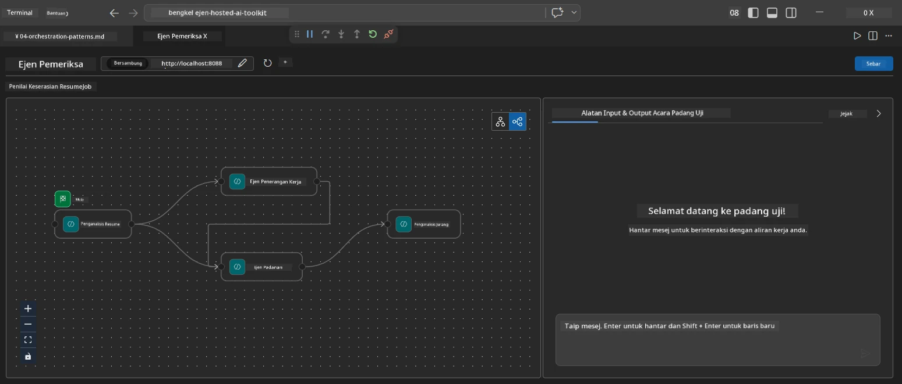
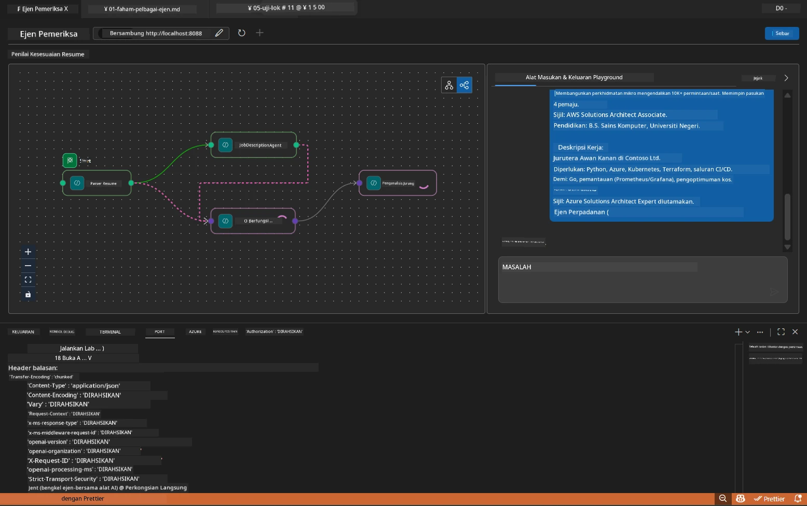
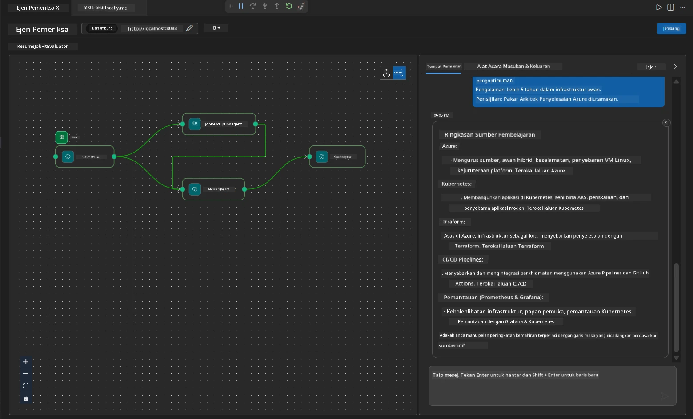

# Modul 5 - Uji Secara Tempatan

⏱️ ~15 min

Dalam modul ini, anda menjalankan aliran kerja ejen pelbagai secara tempatan, mengujinya dengan Agent Inspector, dan mengesahkan kesemua empat ejen dan alat MCP berfungsi dengan betul sebelum melakukan pelancaran.

---

## Langkah 1: Mulakan pelayan ejen

### Pilihan A: Menggunakan tugasan VS Code (disyorkan)

1. Buka `workshop/lab02-multi-agent/PersonalCareerCopilot/` sebagai folder VS Code anda.
2. Tekan `Ctrl+Shift+P` → taip **Tasks: Run Task** → pilih **Run Agent HTTP Server**.
3. Tugasan memulakan pelayan dengan debugpy dipasang pada port `5679` dan ejen pada port `8088`.
4. Tunggu output menunjukkan:

```
INFO:resume-job-fit:Starting Resume -> Job Fit Evaluator HTTP server...
INFO:resume-job-fit:Server running on http://localhost:8088
```

### Pilihan B: Menggunakan F5 (mod debug)

1. Tekan `F5` → pilih **Debug Local Agent HTTP Server**.
2. Pelayan bermula dengan sokongan titik henti penuh - berguna untuk memeriksa respons MCP atau output ejen.

---

## Langkah 2: Buka Agent Inspector

1. Tekan `Ctrl+Shift+P` → taip **Foundry Toolkit: Open Agent Inspector**.
2. Agent Inspector dibuka sebagai panel VS Code yang bersambung ke `http://localhost:8088`.
3. Anda sepatutnya melihat antara muka ejen siap menerima mesej.



> **Jika Agent Inspector tidak dibuka:** Pastikan pelayan telah bermula sepenuhnya (anda melihat log "Server running"). Jika port 5679 sibuk, lihat [Modul 8 - Penyelesaian Masalah](08-troubleshooting.md).

---

## Langkah 2b: (Pilihan) Buka Visualizer Aliran Kerja

Foundry Toolkit termasuk **Workflow Visualizer** masa nyata yang menunjukkan bagaimana ejen berinteraksi semasa graph dieksekusi. Ini sangat berguna untuk debug multi-ejen.

1. Tekan `Ctrl+Shift+P` → taip **Foundry Toolkit: Open Visualizer for Hosted Agents**.
2. Tab VS Code baru dibuka menunjukkan graph pelaksanaan langsung.
3. Semasa anda menghantar mesej dalam Agent Inspector, visualizer dikemas kini secara automatik - node hijau menandakan ejen yang selesai, dan tepi animasi menunjukkan data mengalir di antara mereka.

> **Pertindihan port:** Jika port visualizer sudah digunakan, tukar dalam Tetapan VS Code → **Extensions** → **Microsoft Foundry Configuration** → **Hosted Agents: Visualizer Port**.

---

## Langkah 3: Jalankan ujian asap

Jalankan tiga ujian ini mengikut urutan. Setiap ujian menguji secara progresif lebih banyak bahagian aliran kerja.

### Ujian 1: Resume asas + deskripsi jawatan

Tampal yang berikut ke dalam Agent Inspector:

```
Resume:
Jane Doe
Senior Software Engineer with 5 years of experience in Python, Django, and AWS.
Built microservices handling 10K+ requests/second. Led a team of 4 developers.
Certifications: AWS Solutions Architect Associate.
Education: B.S. Computer Science, State University.

Job Description:
Senior Cloud Engineer at Contoso Ltd.
Required: Python, Azure, Kubernetes, Terraform, CI/CD pipelines.
Preferred: Go, monitoring (Prometheus/Grafana), cost optimization.
Experience: 5+ years in cloud infrastructure.
Certifications: Azure Solutions Architect Expert preferred.
```

**Struktur output yang dijangka:**

Respons sepatutnya mengandungi output dari keempat-empat ejen secara berurutan:

1. **Output Resume Parser** - Dua bahagian bertanda: `[PARSED RESUME]` (profil calon dengan kemahiran terkumpul) dan `[JOB DESCRIPTION PASS-THROUGH]` (teks JD sebenar yang memberi input kepada JD Agent)
2. **Output JD Agent** - Keperluan berstruktur dengan kemahiran wajib dan pilihan dipisahkan
3. **Output Matching Agent** - Skor kesesuaian (0-100) dengan perincian, kemahiran dipadankan, kemahiran hilang, jurang
4. **Output Gap Analyzer** - Kad jurang individu untuk setiap kemahiran hilang, setiap satu dengan URL Microsoft Learn





### Apa yang perlu disahkan dalam Ujian 1

| Semak | Dijangka | Lulus? |
|-------|----------|-------|
| Respons mengandungi skor kesesuaian | Nombor antara 0-100 dengan perincian | |
| Kemahiran dipadankan disenaraikan | Python, CI/CD (sebahagian), dll. | |
| Kemahiran hilang disenaraikan | Azure, Kubernetes, Terraform, dll. | |
| Kad jurang wujud untuk setiap kemahiran hilang | Satu kad setiap kemahiran | |
| URL Microsoft Learn ada | Pautan sebenar `learn.microsoft.com` | |
| Tiada mesej ralat dalam respons | Output berstruktur bersih | |

### Ujian 2: Kes tepi - calon berkesesuaian tinggi

Tampal resume yang hampir sepadan dengan JD untuk mengesahkan GapAnalyzer mengendalikan senario berkesesuaian tinggi:

```
Resume:
Alex Chen
Senior Cloud Engineer with 7 years of experience.
Skills: Python, Azure (AKS, Functions, DevOps), Kubernetes, Terraform, CI/CD (GitHub Actions, Azure Pipelines), Go, Prometheus, Grafana, cost optimization.
Certifications: Azure Solutions Architect Expert, Azure DevOps Engineer Expert.
Led infrastructure migration to Azure for 3 enterprise clients.
Education: M.S. Computer Science, Tech University.

Job Description:
Senior Cloud Engineer at Contoso Ltd.
Required: Python, Azure, Kubernetes, Terraform, CI/CD pipelines.
Preferred: Go, monitoring (Prometheus/Grafana), cost optimization.
Experience: 5+ years in cloud infrastructure.
Certifications: Azure Solutions Architect Expert preferred.
```

**Kelakuan dijangka:**
- Skor kesesuaian harus **80+** (kebanyakan kemahiran sepadan)
- Kad jurang harus fokus pada kemasan/kesediaan temuduga dan bukan pembelajaran asas
- Arahan GapAnalyzer berkata: "Jika kesesuaian >= 80, fokus pada kemasan/kesediaan temuduga"

---

## Langkah 4: Uji dengan data anda sendiri (pilihan)

Cuba tampal resume dan deskripsi jawatan sebenar anda. Ini membantu mengesahkan:

- Ejen mengendalikan format resume berbeza (kronologi, fungsional, hibrid)
- JD Agent mengendalikan gaya JD berbeza (titik peluru, perenggan, berstruktur)
- Alat MCP memulangkan sumber relevan untuk kemahiran sebenar
- Kad jurang dipersonalisasi mengikut latar belakang khusus anda

> **Privasi - Laluan A (Foundry awan):** Teks resume dan JD dihantar ke penyebaran Azure OpenAI anda untuk inferens. Ia tidak direkod atau disimpan oleh infrastruktur bengkel. Gunakan nama tempat letak (contohnya, "Jane Doe") jika anda mahu.
>
> **Privasi - Laluan B (Foundry Tempatan):** Keempat-empat inferens ejen berjalan sepenuhnya pada peranti anda. Teks resume dan deskripsi jawatan anda **tidak pernah meninggalkan mesin anda**. Panggilan keluar satu-satunya adalah alat MCP mengambil sumber dari `https://learn.microsoft.com/api/mcp`; pertanyaan itu hanya mengandungi nama kemahiran, bukan data peribadi anda.

---

### Titik Semak

- [ ] Pelayan berjaya bermula pada port `8088` (log menunjukkan "Server running")
- [ ] Agent Inspector dibuka dan bersambung dengan ejen
- [ ] Ujian 1: Respons lengkap dengan skor kesesuaian, kemahiran dipadankan/hilang, kad jurang, dan URL Microsoft Learn
- [ ] Ujian 2: Calon berkesesuaian tinggi mendapat skor 80+ dengan cadangan fokus kemasan
- [ ] Semua kad jurang wujud (satu setiap kemahiran hilang, tiada pemotongan)
- [ ] Tiada ralat atau jejak timbunan dalam terminal pelayan

---

**Sebelumnya:** [04 - Pola Pengurusan](04-orchestration-patterns.md) · **Seterusnya:** [06 - Lancarkan ke Foundry →](06-deploy-to-foundry.md)

---

<!-- CO-OP TRANSLATOR DISCLAIMER START -->
**Penafian**:
Dokumen ini telah diterjemahkan menggunakan perkhidmatan terjemahan AI [Co-op Translator](https://github.com/Azure/co-op-translator). Walaupun kami berusaha untuk ketepatan, sila ambil maklum bahawa terjemahan automatik mungkin mengandungi kesilapan atau ketidaktepatan. Dokumen asal dalam bahasa asalnya harus dianggap sebagai sumber yang sahih. Untuk maklumat penting, terjemahan oleh manusia profesional adalah disyorkan. Kami tidak bertanggungjawab terhadap sebarang salah faham atau salah tafsir yang timbul daripada penggunaan terjemahan ini.
<!-- CO-OP TRANSLATOR DISCLAIMER END -->