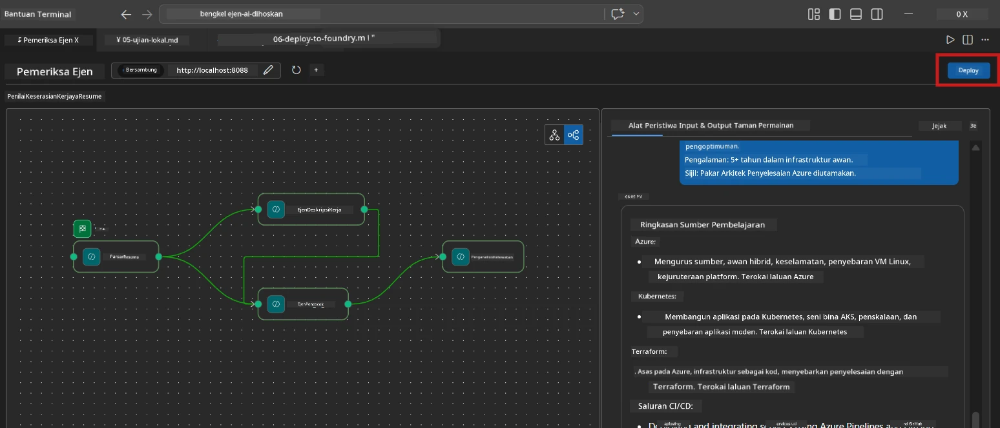
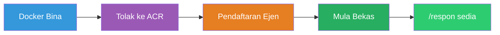
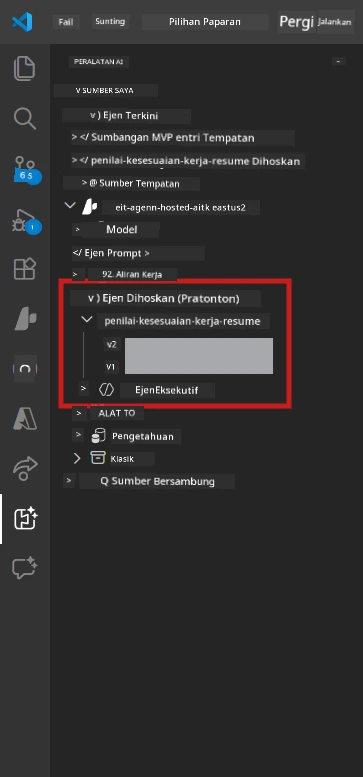

# Modul 6 - Deploy ke Servis Ejen Foundry

Dalam modul ini, anda akan menyebarkan aliran kerja multi-ejen yang diuji secara tempatan ke [Microsoft Foundry](https://learn.microsoft.com/azure/foundry/agents/concepts/hosted-agents) sebagai **Ejen Dihoskan**. Proses penyebaran membina imej kontena Docker, menolaknya ke [Azure Container Registry (ACR)](https://learn.microsoft.com/azure/container-registry/container-registry-intro), dan mencipta versi ejen dihoskan dalam [Servis Ejen Foundry](https://learn.microsoft.com/azure/foundry/agents/how-to/publish-agent).

> **Perbezaan utama dari Lab 01:** Proses penyebaran adalah sama. Foundry menganggap aliran kerja multi-ejen anda sebagai satu ejen dihoskan - kerumitan adalah di dalam kontena, tetapi permukaan penyebaran adalah titik akhir `/responses` yang sama.

---

## Pemeriksaan Prasyarat

Sebelum menyebarkan, sahkan setiap item di bawah:

1. **Ejen lulus ujian asap tempatan:**
   - Anda telah menyelesaikan ketiga-tiga ujian dalam [Modul 5](05-test-locally.md) dan aliran kerja menghasilkan output lengkap dengan kad jurang dan URL Microsoft Learn.

2. **Anda mempunyai peranan [Azure AI User](https://learn.microsoft.com/azure/foundry/concepts/rbac-foundry):**
   - Ditugaskan dalam [Lab 01, Modul 2](../../lab01-single-agent/docs/02-create-foundry-project.md). Sahkan:
   - [Azure Portal](https://portal.azure.com) → sumber projek Foundry anda → **Akses kawalan (IAM)** → **Penugasan peranan** → sahkan **[Azure AI User](https://aka.ms/foundry-ext-project-role)** disenaraikan untuk akaun anda.

3. **Anda telah log masuk ke Azure dalam VS Code:**
   - Semak ikon Akaun di bawah kiri VS Code. Nama akaun anda harus dapat dilihat.

4. **`agent.yaml` mempunyai nilai yang betul:**
   - Buka `PersonalCareerCopilot/agent.yaml` dan sahkan:
     ```yaml
     environment_variables:
       - name: PROJECT_ENDPOINT
         value: ${PROJECT_ENDPOINT}
       - name: MODEL_DEPLOYMENT_NAME
         value: ${MODEL_DEPLOYMENT_NAME}
     ```
   - Nilai ini mesti sepadan dengan pembolehubah persekitaran yang dibaca oleh `main.py` anda.

5. **`requirements.txt` mempunyai versi yang betul:**
   ```
   agent-framework-azure-ai==1.0.0rc3
   agent-framework-core==1.0.0rc3
   azure-ai-agentserver-agentframework==1.0.0b16
   azure-ai-agentserver-core==1.0.0b16
   debugpy
   agent-dev-cli --pre
   ```

---

## Langkah 1: Mulakan penyebaran

### Pilihan A: Deploy dari Agent Inspector (disyorkan)

Jika ejen berjalan melalui F5 dengan Agent Inspector dibuka:

1. Lihat pada **sudut atas kanan** panel Agent Inspector.
2. Klik butang **Deploy** (ikon awan dengan anak panah ke atas ↑).
3. Wizard penyebaran akan dibuka.



### Pilihan B: Deploy dari Command Palette

1. Tekan `Ctrl+Shift+P` untuk membuka **Command Palette**.
2. Taip: **Microsoft Foundry: Deploy Hosted Agent** dan pilihnya.
3. Wizard penyebaran akan dibuka.

---

## Langkah 2: Konfigurasikan penyebaran

### 2.1 Pilih projek sasaran

1. Senarai dropdown menunjukkan projek Foundry anda.
2. Pilih projek yang anda gunakan sepanjang bengkel (contohnya, `workshop-agents`).

### 2.2 Pilih fail ejen kontena

1. Anda akan diminta memilih titik masuk ejen.
2. Navigasi ke `workshop/lab02-multi-agent/PersonalCareerCopilot/` dan pilih **`main.py`**.

### 2.3 Konfigurasikan sumber

| Tetapan | Nilai disyorkan | Nota |
|---------|-----------------|-------|
| **CPU** | `0.25` | Lalai. Aliran kerja multi-ejen tidak memerlukan CPU lebih kerana panggilan model adalah I/O-bound |
| **Memori** | `0.5Gi` | Lalai. Tingkatkan ke `1Gi` jika anda menambah alat pemprosesan data besar |

---

## Langkah 3: Sahkan dan sebarkan

1. Wizard menunjukkan ringkasan penyebaran.
2. Semak dan klik **Confirm and Deploy**.
3. Perhatikan kemajuan dalam VS Code.

### Apa yang berlaku semasa penyebaran

Perhatikan panel **Output** VS Code (pilih dropdown "Microsoft Foundry"):


1. **Docker build** - Membina kontena dari `Dockerfile` anda:
   ```
   Step 1/6 : FROM python:3.14-slim
   Step 2/6 : WORKDIR /app
   ...
   Successfully built abc123def456
   ```

2. **Docker push** - Menolak imej ke ACR (1-3 minit pada penyebaran pertama).

3. **Pendaftaran ejen** - Foundry mencipta ejen dihoskan menggunakan metadata `agent.yaml`. Nama ejen adalah `resume-job-fit-evaluator`.

4. **Mula kontena** - Kontena dimulakan dalam infrastruktur yang diurus Foundry dengan identiti yang diurus sistem.

> **Penyebaran pertama lebih lambat** (Docker menolak semua lapisan). Penyebaran berikutnya menggunakan lapisan yang disimpan dalam cache dan lebih cepat.

### Nota khusus multi-ejen

- **Keempat-empat ejen berada dalam satu kontena.** Foundry melihat sebagai ejen dihoskan tunggal. Graf WorkflowBuilder berjalan secara dalaman.
- **Panggilan MCP keluar.** Kontena memerlukan akses internet untuk menghubungi `https://learn.microsoft.com/api/mcp`. Infrastruktur yang diurus Foundry menyediakan ini secara lalai.
- **[Managed Identity](https://learn.microsoft.com/python/api/overview/azure/identity-readme#managed-identity-support).** Dalam persekitaran dihoskan, `get_credential()` dalam `main.py` mengembalikan `ManagedIdentityCredential()` (kerana `MSI_ENDPOINT` diset). Ini automatik.

---

## Langkah 4: Sahkan status penyebaran

1. Buka bar sisi **Microsoft Foundry** (klik ikon Foundry di Bar Aktiviti).
2. Kembangkan **Hosted Agents (Preview)** di bawah projek anda.
3. Cari **resume-job-fit-evaluator** (atau nama ejen anda).
4. Klik pada nama ejen → kembangkan versi (contohnya, `v1`).
5. Klik pada versi → periksa **Container Details** → **Status**:



| Status | Maksud |
|--------|---------|
| **Started** / **Running** | Kontena sedang berjalan, ejen sedia |
| **Pending** | Kontena sedang bermula (tunggu 30-60 saat) |
| **Failed** | Kontena gagal bermula (semak log - lihat di bawah) |

> **Mula multi-ejen memakan masa lebih lama** daripada ejen tunggal kerana kontena mencipta 4 instans ejen semasa mula. "Pending" sehingga 2 minit adalah normal.

---

## Ralat penyebaran biasa dan penyelesaian

### Ralat 1: Kebenaran ditolak - `agents/write`

```
Error: lacks the required data action 
Microsoft.CognitiveServices/accounts/AIServices/agents/write
```

**Pembetulan:** Tugas **[Azure AI User](https://learn.microsoft.com/azure/foundry/concepts/rbac-foundry)** di peringkat **projek**. Lihat [Modul 8 - Penyelesaian Masalah](08-troubleshooting.md) untuk arahan langkah demi langkah.

### Ralat 2: Docker tidak berjalan

```
Error: Docker build failed / Cannot connect to Docker daemon
```

**Pembetulan:**
1. Mulakan Docker Desktop.
2. Tunggu sehingga "Docker Desktop is running".
3. Sahkan: `docker info`
4. **Windows:** Pastikan backend WSL 2 diaktifkan dalam tetapan Docker Desktop.
5. Cuba lagi.

### Ralat 3: pip install gagal semasa binaan Docker

```
Error: Could not find a version that satisfies the requirement agent-dev-cli
```

**Pembetulan:** Flag `--pre` dalam `requirements.txt` dikendalikan berbeza dalam Docker. Pastikan `requirements.txt` anda mengandungi:
```
agent-dev-cli --pre
```

Jika Docker masih gagal, buat `pip.conf` atau hantar `--pre` melalui argumen binaan. Lihat [Modul 8](08-troubleshooting.md).

### Ralat 4: Alat MCP gagal dalam ejen dihoskan

Jika Analyzer Jurang berhenti menghasilkan URL Microsoft Learn selepas penyebaran:

**Punca utama:** Dasar rangkaian mungkin menghalang HTTPS keluar dari kontena.

**Pembetulan:**
1. Ini biasanya bukan masalah dengan konfigurasi lalai Foundry.
2. Jika berlaku, semak sama ada rangkaian maya projek Foundry mempunyai NSG yang menghalang HTTPS keluar.
3. Alat MCP mempunyai URL fallback terbina dalam, jadi ejen masih akan menghasilkan output (tanpa URL langsung).

---

### Titik Semak

- [ ] Perintah penyebaran selesai tanpa ralat dalam VS Code
- [ ] Ejen muncul di bawah **Hosted Agents (Preview)** dalam bar sisi Foundry
- [ ] Nama ejen adalah `resume-job-fit-evaluator` (atau nama pilihan anda)
- [ ] Status kontena menunjukkan **Started** atau **Running**
- [ ] (Jika ralat) Anda mengenal pasti ralat, melakukan pembetulan, dan menyebar semula dengan berjaya

---

**Sebelumnya:** [05 - Test Locally](05-test-locally.md) · **Seterusnya:** [07 - Verify in Playground →](07-verify-in-playground.md)

---

<!-- CO-OP TRANSLATOR DISCLAIMER START -->
**Penafian**:  
Dokumen ini telah diterjemahkan menggunakan perkhidmatan terjemahan AI [Co-op Translator](https://github.com/Azure/co-op-translator). Walaupun kami berusaha untuk ketepatan, sila ambil maklum bahawa terjemahan automatik mungkin mengandungi kesilapan atau ketidaktepatan. Dokumen asal dalam bahasa asalnya hendaklah dianggap sebagai sumber yang sahih. Untuk maklumat penting, terjemahan profesional oleh manusia adalah digalakkan. Kami tidak bertanggungjawab atas sebarang salah faham atau salah tafsir yang timbul daripada penggunaan terjemahan ini.
<!-- CO-OP TRANSLATOR DISCLAIMER END -->