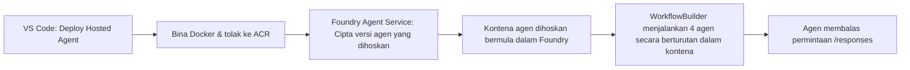
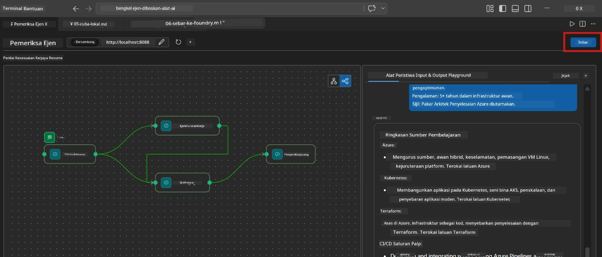

# Modul 6 - Kerahkan ke Perkhidmatan Ejen Foundry

⏱️ ~10 minit

Dalam modul ini, anda mengerahkan aliran kerja pelbagai ejen yang diuji secara tempatan ke [Microsoft Foundry](https://learn.microsoft.com/azure/foundry/agents/concepts/hosted-agents) sebagai **Ejen Hosted**. Proses pengerahan membina imej bekas Docker, menolaknya ke [Azure Container Registry (ACR)](https://learn.microsoft.com/azure/container-registry/container-registry-intro), dan mencipta versi ejen hosted dalam [Perkhidmatan Ejen Foundry](https://learn.microsoft.com/azure/foundry/agents/how-to/publish-agent).

> **Perbezaan utama dari Makmal 01:** Proses pengerahan adalah sama. Foundry menganggap aliran kerja pelbagai ejen anda sebagai satu ejen hosted - kerumitan adalah dalam bekas, tetapi permukaan pengerahan adalah endpoint `/responses` yang sama.

### Alur kerja pengerahan


```mermaid
flowchart LR
    A[VS Code: Deploy Hosted Agent] --> B[Bina Docker & tolak ke ACR]
    B --> C[Foundry Agent Service: Cipta versi agen yang dihoskan]
    C --> D[Kontena agen dihoskan bermula dalam Foundry]
    D --> E[WorkflowBuilder menjalankan 4 agen secara berturutan dalam kontena]
    E --> F[Agen membalas permintaan /responses]
```

---

## Semakan pra-syarat

Sebelum mengerahkan, pastikan setiap item berikut:

1. **Ejen lulus ujian asap tempatan:**
   - Anda telah menyelesaikan ketiga-tiga ujian dalam [Modul 5](05-test-locally.md) dan aliran kerja menghasilkan output lengkap dengan kad kekurangan dan URL Microsoft Learn.

2. **Anda mempunyai peranan [Foundry User](https://learn.microsoft.com/azure/foundry/concepts/rbac-foundry)** (untuk mengerahkan, anda memerlukan sekurang-kurangnya **Foundry Project Manager** pada skop projek):

   > **Nota:** Peranan RBAC Foundry baru-baru ini dinamakan semula - **Foundry User**, **Foundry Owner**, dan **Foundry Project Manager** sebelum ini dinamakan Pengguna Azure AI, Pemilik Azure AI, dan Pengurus Projek Azure AI. ID peranan dan kebenaran tidak berubah.

   - Sahkan di [Azure Portal](https://portal.azure.com) → sumber **projek** Foundry anda → **Kawalan akses (IAM)** → **Penugasan peranan** → pastikan **Foundry User** (atau lebih tinggi) disenaraikan untuk akaun anda.

3. **Anda telah log masuk ke Azure dalam VS Code:**
   - Semak ikon Akaun di bahagian bawah-kiri VS Code. Nama akaun anda harus kelihatan.

4. **`agent.yaml` mengandungi nilai yang betul:**
   - Buka `PersonalCareerCopilot/agent.yaml` dan sahkan:
     ```yaml
     environment_variables:
       - name: AZURE_AI_MODEL_DEPLOYMENT_NAME
         value: ${AZURE_AI_MODEL_DEPLOYMENT_NAME}
     ```
   - `FOUNDRY_PROJECT_ENDPOINT` **tidak** disenaraikan di sini - Foundry menyuntiknya semasa masa jalan. Hanya `AZURE_AI_MODEL_DEPLOYMENT_NAME` perlu diisytiharkan.

5. **`requirements.txt` mempunyai versi yang betul:**
   ```
   agent-framework-foundry
   agent-framework-foundry-hosting
   mcp<2,>=1.24.0
   debugpy
   ```

---

## Langkah 1: Mulakan pengerahan

### Pilihan A: Kerahkan dari Pemeriksa Ejen (disyorkan)

Jika ejen sedang berjalan melalui F5 dengan Pemeriksa Ejen dibuka:

1. Lihat **sudut atas-kanan** panel Pemeriksa Ejen.
2. Klik butang **Kerahkan** (ikon awan dengan anak panah ke atas ↑).
3. Penyihir pengerahan terbuka.



### Pilihan B: Kerahkan dari Palet Perintah

1. Tekan `Ctrl+Shift+P` untuk membuka **Palet Perintah**.
2. Taip: **Foundry Toolkit: Deploy Hosted Agent** dan pilihnya.
3. Penyihir pengerahan terbuka.

---

## Langkah 2: Konfigurasi pengerahan

### 2.1 Pilih projek sasaran

1. Senarai juntai ditunjukkan dengan projek Foundry anda.
2. Pilih projek yang anda gunakan sepanjang bengkel (contoh, `workshop-agents`).

### 2.2 Pilih fail ejen bekas

1. Anda akan diminta memilih titik masuk ejen.
2. Navigasi ke `workshop/lab02-multi-agent/PersonalCareerCopilot/` dan pilih **`main.py`**.

### 2.3 Konfigurasi sumber

| Tetapan | Nilai disyorkan | Nota |
|---------|------------------|-------|
| **Kaedah Pengerahan** | **Bekas** (disyorkan) atau **Kod** | Bekas membina imej Docker; Kod memuat naik sumber sebagai ZIP (pratonton) |
| **Pendaftaran Bekas** | **ACR Lalai** | Foundry mencipta dan menguruskan satu untuk anda |
| **CPU** | `0.25` | Lalai. Aliran kerja pelbagai ejen tidak memerlukan CPU lebih kerana panggilan model bergantung pada I/O |
| **Memori** | `0.5Gi` | Lalai. Tingkatkan ke `1Gi` jika anda menambah alat pemprosesan data besar |

---

## Langkah 3: Sahkan dan kerahkan

1. Penyihir menunjukkan ringkasan pengerahan.
2. Semak dan klik **Sahkan dan Kerahkan**.
3. Perhatikan kemajuan dalam VS Code.

### Apa yang berlaku semasa pengerahan

Perhatikan panel VS Code **Output** (pilih dropdown "Microsoft Foundry"):

1. **Pembinaan Docker** - Membina bekas dari `Dockerfile` anda
   ```
   Step 1/6 : FROM python:3.12-slim
   Step 2/6 : WORKDIR /app
   ...
   Successfully built abc123def456
   ```

2. **Tolakan Docker** - Menolak imej ke ACR (1-3 minit pada pengerahan pertama).

3. **Pendaftaran Ejen** - Foundry mencipta ejen hosted menggunakan metadata `agent.yaml`. Nama ejen adalah `resume-job-fit-evaluator`.

4. **Mula bekas** - Bekas bermula dalam infrastruktur yang diurus Foundry dengan identiti yang diurus sistem.

> **Pengerahan pertama lebih perlahan** (Docker menolak semua lapisan). Pengerahan seterusnya menggunakan semula lapisan yang telah di-cache dan lebih pantas.

### Nota khusus multi-ejen

- **Keempat-empat ejen berada dalam satu bekas.** Foundry melihat satu ejen hosted. Graf WorkflowBuilder berjalan secara dalaman.
- **Panggilan MCP keluar.** Bekas memerlukan akses internet untuk mencapai `https://learn.microsoft.com/api/mcp`. Infrastruktur yang diurus Foundry menyediakan ini secara lalai.
- **[Identiti Diurus](https://learn.microsoft.com/azure/foundry/agents/concepts/agent-identity).** Foundry secara automatik mencipta **identiti Entra khusus bagi setiap ejen** untuk setiap ejen Hosted semasa masa pengerahan. Dalam persekitaran hosted, `DefaultAzureCredential` menyelesaikan kepada identiti ejen ini secara automatik - tiada konfigurasi identiti diurus manual diperlukan.

---

## Langkah 4: Sahkan status pengerahan

1. Buka bar sisi **Microsoft Foundry** (klik ikon Foundry dalam Bar Aktiviti).
2. Kembangkan **Ejen Hosted (Pratonton)** di bawah projek anda.
3. Cari **resume-job-fit-evaluator** (atau nama ejen anda).
4. Klik pada nama ejen → kembangkan versi (contoh, `v1`).
5. Klik pada versi → semak **Butiran Bekas** → **Status**:


| Status | Maksud |
|--------|---------|
| **aktif** | Ejen sedang berjalan dan sedia menerima permintaan |
| **mencipta** | Bekas sedang bermula (tunggu 30–60 saat) |
| **gagal** | Bekas gagal bermula (semak log - lihat di bawah) |

> **Nota:** Bar sisi VS Code mungkin memaparkan label seperti "Berjalan" atau "Dimulakan" sementara status API asas menggunakan `aktif`/`mencipta`. Mana-mana paparan menunjukkan keadaan yang sama.

> **Permulaan multi-ejen mengambil masa lebih lama** daripada ejen tunggal kerana bekas mencipta 4 instans ejen semasa mula. `mencipta` sehingga 2 minit adalah normal.

---

## Ralat dan pembaikan pengerahan biasa

### Ralat 1: Kebenaran ditolak - `agents/write`

```
Error: lacks the required data action 
Microsoft.CognitiveServices/accounts/AIServices/agents/write
```

**Pembaikan:** Tetapkan peranan **[Foundry User](https://learn.microsoft.com/azure/foundry/concepts/rbac-foundry)** (sebelumnya **Pengguna Azure AI**) pada tahap **projek**. Lihat [Modul 8 - Penyelesaian Masalah](08-troubleshooting.md) untuk arahan langkah demi langkah.

### Ralat 2: Docker tidak berjalan

```
Error: Docker build failed / Cannot connect to Docker daemon
```

**Pembaikan:**
1. Mulakan Docker Desktop.
2. Tunggu "Docker Desktop is running".
3. Sahkan: `docker info`
4. **Windows:** Pastikan backend WSL 2 diaktifkan dalam tetapan Docker Desktop.
5. Cuba lagi.

### Ralat 3: pip install gagal semasa binaan Docker

```
Error: Could not find a version that satisfies the requirement agent-framework-foundry
```

**Pembaikan:** Sahkan `requirements.txt` sepadan:
```
agent-framework-foundry
agent-framework-foundry-hosting
mcp<2,>=1.24.0
debugpy
```

Jika binaan masih gagal, rangkaian Docker anda mungkin menghalang PyPI. Semak `docker info` untuk tetapan proksi.

### Ralat 4: Alat MCP gagal dalam ejen hosted

Jika Gap Analyzer berhenti menghasilkan URL Microsoft Learn selepas pengerahan:

**Punca utama:** Polisi rangkaian mungkin menghalang HTTPS keluar dari bekas.

**Pembaikan:**
1. Ini biasanya bukan masalah dengan konfigurasi lalai Foundry.
2. Jika berlaku, periksa sama ada rangkaian maya projek Foundry mempunyai NSG yang menghalang HTTPS keluar.
3. Alat MCP mempunyai URL sandaran terbina dalam, jadi ejen masih akan menghasilkan output (tanpa URL langsung).

---

### Penanda aras

- [ ] Perintah pengerahan selesai tanpa ralat dalam VS Code
- [ ] Ejen muncul di bawah **Ejen Hosted (Pratonton)** dalam bar sisi Foundry
- [ ] Nama ejen ialah `resume-job-fit-evaluator` (atau nama pilihan anda)
- [ ] Status bekas menunjukkan **Dimulakan** atau **Berjalan**
- [ ] (Jika ada ralat) Anda mengenal pasti ralat, menerapkan pembaikan, dan mengerahkan semula dengan berjaya

---

**Sebelumnya:** [05 - Uji Secara Tempatan](05-test-locally.md) · **Seterusnya:** [07 - Sahkan dalam Playground →](07-verify-in-playground.md)

---

<!-- CO-OP TRANSLATOR DISCLAIMER START -->
**Penafian**:
Dokumen ini telah diterjemahkan menggunakan perkhidmatan terjemahan AI [Co-op Translator](https://github.com/Azure/co-op-translator). Walaupun kami berusaha untuk ketepatan, sila ambil maklum bahawa terjemahan automatik mungkin mengandungi kesilapan atau ketidaktepatan. Dokumen asal dalam bahasa asalnya harus dianggap sebagai sumber yang sahih. Untuk maklumat penting, terjemahan oleh manusia profesional adalah disyorkan. Kami tidak bertanggungjawab terhadap sebarang salah faham atau salah tafsir yang timbul daripada penggunaan terjemahan ini.
<!-- CO-OP TRANSLATOR DISCLAIMER END -->