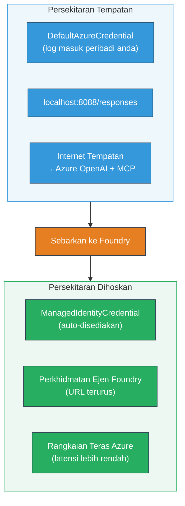

# Module 7 - Sahkan dalam Playground

Dalam modul ini, anda menguji aliran kerja multi-ejen yang telah diterapkan dalam kedua-dua **VS Code** dan **[Foundry Portal](https://ai.azure.com)**, mengesahkan ejen bertindak sama seperti ujian tempatan.

---

## Kenapa perlu sahkan selepas penerapan?

Aliran kerja multi-ejen anda berjalan dengan sempurna secara tempatan, jadi kenapa perlu uji sekali lagi? Persekitaran hos berbeza dalam beberapa cara:


| Perbezaan | Tempatan | Hos |
|-----------|----------|-----|
| **Identiti** | [`DefaultAzureCredential`](https://learn.microsoft.com/azure/developer/python/sdk/authentication/credential-chains#defaultazurecredential-overview) (log masuk peribadi anda) | [`ManagedIdentityCredential`](https://learn.microsoft.com/python/api/overview/azure/identity-readme#managed-identity-support) (penyediaan automatik) |
| **Endpoint** | `http://localhost:8088/responses` | titik akhir [Foundry Agent Service](https://learn.microsoft.com/azure/foundry/agents/concepts/hosted-agents) (URL yang diurus) |
| **Rangkaian** | Mesin tempatan → Azure OpenAI + MCP keluar | Tulang belakang Azure (latensi lebih rendah antara perkhidmatan) |
| **Sambungan MCP** | Internet tempatan → `learn.microsoft.com/api/mcp` | Bekas keluar → `learn.microsoft.com/api/mcp` |

Jika mana-mana pembolehubah persekitaran salah konfigurasi, RBAC berbeza, atau MCP keluar disekat, anda akan mengesannya di sini.

---

## Pilihan A: Uji dalam VS Code Playground (disyorkan dahulu)

[Sambungan Foundry](https://marketplace.visualstudio.com/items?itemName=TeamsDevApp.vscode-ai-foundry) termasuk Playground terbina dalam yang membolehkan anda berbual dengan ejen yang diterapkan tanpa meninggalkan VS Code.

### Langkah 1: Navigasi ke ejen anda yang dihoskan

1. Klik ikon **Microsoft Foundry** di **Activity Bar** VS Code (bar sisi kiri) untuk membuka panel Foundry.
2. Kembang projek yang disambungkan anda (contoh: `workshop-agents`).
3. Kembang **Hosted Agents (Preview)**.
4. Anda harus melihat nama ejen anda (contoh: `resume-job-fit-evaluator`).

### Langkah 2: Pilih versi

1. Klik pada nama ejen untuk kembangkan versinya.
2. Klik pada versi yang anda terapkan (contoh: `v1`).
3. Panel **detail** akan terbuka menunjukkan Butiran Bekas.
4. Sahkan status adalah **Started** atau **Running**.

### Langkah 3: Buka Playground

1. Dalam panel detail, klik butang **Playground** (atau klik kanan versi → **Open in Playground**).
2. Antara muka sembang akan terbuka di tab VS Code.

### Langkah 4: Jalankan ujian asas anda

Gunakan 3 ujian yang sama dari [Module 5](05-test-locally.md). Taip setiap mesej dalam kotak input Playground dan tekan **Send** (atau **Enter**).

#### Ujian 1 - Resume penuh + JD (aliran standard)

Tampal arahan resume penuh + JD dari Module 5, Ujian 1 (Jane Doe + Senior Cloud Engineer di Contoso Ltd).

**Jangkaan:**
- Skor kesesuaian dengan pecahan matematik (skala 100 mata)
- Bahagian Kemahiran yang sesuai
- Bahagian Kemahiran yang hilang
- **Satu kad jurang untuk setiap kemahiran hilang** dengan URL Microsoft Learn
- Pelan pembelajaran dengan garis masa

#### Ujian 2 - Ujian ringkas cepat (input minima)

```
RESUME: 3 years Python developer, knows Django and PostgreSQL, no cloud experience.

JOB: Cloud DevOps Engineer requiring AWS, Kubernetes, Terraform, CI/CD. 5 years needed.
```

**Jangkaan:**
- Skor kesesuaian lebih rendah (< 40)
- Penilaian jujur dengan laluan pembelajaran berperingkat
- Pelbagai kad jurang (AWS, Kubernetes, Terraform, CI/CD, jurang pengalaman)

#### Ujian 3 - Calon berkelayakan tinggi

```
RESUME:
10 years Azure Cloud Architect. AZ-305 certified. Expert in AKS, Terraform, Azure DevOps, 
Azure Functions, Helm, Prometheus, Grafana, Python, Go. Led platform team of 8.

JOB:
Senior Cloud Engineer. Required: AKS, Terraform, Azure DevOps, Python. Preferred: Helm, Go.
5+ years experience. AZ-305 preferred.
```

**Jangkaan:**
- Skor kesesuaian tinggi (≥ 80)
- Fokus pada kesediaan temuduga dan penyempurnaan
- Sedikit atau tiada kad jurang
- Garis masa pendek fokus pada persiapan

### Langkah 5: Bandingkan dengan keputusan tempatan

Buka nota atau tab pelayar dari Module 5 di mana anda menyimpan respons tempatan. Untuk setiap ujian:

- Adakah respons mempunyai **struktur yang sama** (skor kesesuaian, kad jurang, pelan pembelajaran)?
- Adakah ia mengikuti **rubrik penilaian yang sama** (pecahan 100 mata)?
- Adakah **URL Microsoft Learn** masih hadir dalam kad jurang?
- Adakah terdapat **satu kad jurang bagi setiap kemahiran hilang** (tidak dipendekkan)?

> **Perbezaan kata-kata kecil adalah normal** - model ini tidak deterministik. Fokus pada struktur, konsistensi skor, dan penggunaan alat MCP.

---

## Pilihan B: Uji dalam Foundry Portal

[Foundry Portal](https://ai.azure.com) menyediakan playground berasaskan web yang berguna untuk dikongsi dengan rakan sekerja atau pihak berkepentingan.

### Langkah 1: Buka Foundry Portal

1. Buka pelayar anda dan pergi ke [https://ai.azure.com](https://ai.azure.com).
2. Log masuk dengan akaun Azure yang sama yang anda gunakan sepanjang bengkel ini.

### Langkah 2: Navigasi ke projek anda

1. Pada halaman utama, cari **Projek terkini** di bar sisi kiri.
2. Klik nama projek anda (contoh: `workshop-agents`).
3. Jika anda tidak melihatnya, klik **Semua projek** dan cari.

### Langkah 3: Cari ejen yang diterapkan

1. Dalam navigasi kiri projek, klik **Build** → **Agents** (atau cari bahagian **Agents**).
2. Anda harus melihat senarai ejen. Cari ejen yang diterapkan (contoh: `resume-job-fit-evaluator`).
3. Klik pada nama ejen untuk membuka halaman butirannya.

### Langkah 4: Buka Playground

1. Pada halaman butiran ejen, lihat bar alat atas.
2. Klik **Open in playground** (atau **Try in playground**).
3. Antara muka sembang akan terbuka.

### Langkah 5: Jalankan ujian asas yang sama

Ulangi 3 ujian dari bahagian VS Code Playground di atas. Bandingkan setiap respons dengan keputusan tempatan (Module 5) dan keputusan VS Code Playground (Pilihan A di atas).

---

## Pengesahan khusus multi-ejen

Selain ketepatan asas, sahkan tingkah laku khusus multi-ejen ini:

### Pelaksanaan alat MCP

| Semak | Cara sahkan | Syarat lulus |
|-------|-------------|--------------|
| Panggilan MCP berjaya | Kad jurang mengandungi URL `learn.microsoft.com` | URL sebenar, bukan mesej gantian |
| Berbilang panggilan MCP | Setiap jurang keutamaan Tinggi/Sederhana ada sumber | Bukan hanya kad jurang pertama |
| Gantian MCP berfungsi | Jika URL tiada, periksa teks gantian | Ejen masih menghasilkan kad jurang (dengan atau tanpa URL) |

### Penyelaras ejen

| Semak | Cara sahkan | Syarat lulus |
|-------|-------------|--------------|
| Keempat-empat ejen berjalan | Output mengandungi skor kesesuaian DAN kad jurang | Skor datang dari MatchingAgent, kad dari GapAnalyzer |
| Pelaksanaan serentak | Masa respons munasabah (< 2 min) | Jika > 3 min, pelaksanaan serentak mungkin tidak berfungsi |
| Integriti aliran data | Kad jurang rujuk kemahiran dari laporan padanan | Tiada kemahiran halusinasi yang tiada dalam JD |

---

## Rubrik pengesahan

Gunakan rubrik ini untuk menilai tingkah laku aliran kerja multi-ejen yang dihoskan:

| # | Kriteria | Syarat lulus | Lulus? |
|---|----------|--------------|--------|
| 1 | **Ketepatan fungsi** | Ejen memberi respons pada resume + JD dengan skor kesesuaian dan analisis jurang | |
| 2 | **Konsistensi skor** | Skor kesesuaian menggunakan skala 100 mata dengan pecahan matematik | |
| 3 | **Kelengkapan kad jurang** | Satu kad bagi setiap kemahiran hilang (tidak dipendekkan atau digabungkan) | |
| 4 | **Integrasi alat MCP** | Kad jurang termasuk URL Microsoft Learn sebenar | |
| 5 | **Konsistensi struktur** | Struktur output sama antara tempatan dan hos | |
| 6 | **Masa respons** | Ejen hos memberi respons dalam masa 2 minit untuk penilaian penuh | |
| 7 | **Tiada kesilapan** | Tiada ralat HTTP 500, tamat masa, atau respons kosong | |

> "Lulus" bermakna semua 7 kriteria dipenuhi untuk semua 3 ujian dalam sekurang-kurangnya satu playground (VS Code atau Portal).

---

## Menyelesaikan masalah playground

| Simptom | Penyebab kemungkinan | Penyelesaian |
|---------|---------------------|--------------|
| Playground tidak dimuat | Status kontena bukan "Started" | Kembali ke [Module 6](06-deploy-to-foundry.md), sahkan status penerapan. Tunggu jika "Pending" |
| Ejen beri respons kosong | Nama penerapan model tidak sepadan | Semak `agent.yaml` → `environment_variables` → `MODEL_DEPLOYMENT_NAME` sepadan dengan model yang diterapkan |
| Ejen bagi mesej ralat | Kebenaran [RBAC](https://learn.microsoft.com/azure/foundry/concepts/rbac-foundry) hilang | Tetapkan **[Azure AI User](https://aka.ms/foundry-ext-project-role)** pada skop projek |
| Tiada URL Microsoft Learn dalam kad jurang | MCP keluar disekat atau pelayan MCP tidak tersedia | Semak sama ada kontena boleh capai `learn.microsoft.com`. Lihat [Module 8](08-troubleshooting.md) |
| Hanya 1 kad jurang (dipendekkan) | Arahan GapAnalyzer tiada blok "CRITICAL" | Semak semula [Module 3, Langkah 2.4](03-configure-agents.md) |
| Skor kesesuaian jauh berbeza dari tempatan | Model atau arahan berbeza diterapkan | Bandingkan env var `agent.yaml` dengan `.env` tempatan. Terapkan semula jika perlu |
| "Agent not found" dalam Portal | Penerapan masih disebarkan atau gagal | Tunggu 2 minit, muat semula. Jika masih tiada, terapkan semula dari [Module 6](06-deploy-to-foundry.md) |

---

### Titik semak

- [ ] Ejen diuji dalam VS Code Playground - ketiga-tiga ujian basah lulus
- [ ] Ejen diuji dalam Playground [Foundry Portal](https://ai.azure.com) - ketiga-tiga ujian basah lulus
- [ ] Respons konsisten secara struktur dengan ujian tempatan (skor kesesuaian, kad jurang, pelan pembelajaran)
- [ ] URL Microsoft Learn hadir dalam kad jurang (alat MCP berfungsi dalam persekitaran hos)
- [ ] Satu kad jurang bagi setiap kemahiran hilang (tiada pemendekan)
- [ ] Tiada ralat atau tamat masa sepanjang ujian
- [ ] Rubrik pengesahan diselesaikan (semua 7 kriteria lulus)

---

**Sebelum ini:** [06 - Deploy to Foundry](06-deploy-to-foundry.md) · **Seterusnya:** [08 - Troubleshooting →](08-troubleshooting.md)

---

<!-- CO-OP TRANSLATOR DISCLAIMER START -->
**Penafian**:  
Dokumen ini telah diterjemahkan menggunakan perkhidmatan terjemahan AI [Co-op Translator](https://github.com/Azure/co-op-translator). Walaupun kami berusaha untuk ketepatan, sila maklum bahawa terjemahan automatik mungkin mengandungi kesilapan atau ketidaktepatan. Dokumen asal dalam bahasa asalnya hendaklah dianggap sebagai sumber yang sahih. Untuk maklumat penting, terjemahan manusia profesional adalah disyorkan. Kami tidak bertanggungjawab atas sebarang salah faham atau tafsiran yang salah yang timbul daripada penggunaan terjemahan ini.
<!-- CO-OP TRANSLATOR DISCLAIMER END -->