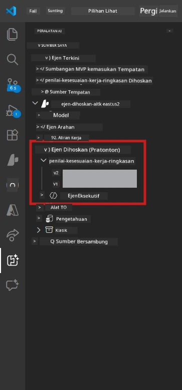

# Modul 7 - Sahkan di Playground

⏱️ ~10 min

Dalam modul ini, anda menguji aliran kerja multi-ejen yang telah anda ladikan di VS Code dan Foundry Portal, mengesahkan ejen berfungsi sama seperti ujian tempatan.

---

## Kenapa uji semula selepas pelaksanaan?

Persekitaran yang dihoskan berbeza dari setempat dalam beberapa cara penting:

| | Tempatan | Dihoskan |
|--|-------|--------|
| **Identiti** | Log masuk peribadi anda (`DefaultAzureCredential`) | Identiti Entra khusus bagi setiap ejen (disediakan automatik semasa pelaksanaan) |
| **Titik akhir** | `http://localhost:8088/responses` | URL yang diurus oleh Perkhidmatan Ejen Foundry |
| **Rangkaian** | Mesin anda → Azure OpenAI + MCP | Rangkaian utama Azure (kelewatan lebih rendah) |

Pembolehubah persekitaran yang salah konfigurasi, isu RBAC, atau panggilan keluar MCP yang disekat akan muncul di sini dulu.

---

## Pilihan A: Uji di VS Code Playground (disarankan dahulu)

### Langkah 1: Navigasi ke ejen yang dihoskan

1. Klik ikon **Foundry Toolkit** di Bar Aktiviti.
2. Kembangkan projek anda → **Hosted Agents (Preview)** → cari ejen anda.



### Langkah 2: Pilih versi

1. Klik pada ejen untuk mengembangkan versinya.
2. Klik `v1` → sahkan status **aktif** (bar sisi mungkin menunjukkan "Running" atau "Started" - kedua-duanya menunjukkan keadaan sedia yang sama).

### Langkah 3: Buka Playground

1. Klik **Playground** (atau klik kanan versi → **Open in Playground**).
2. Tetingkap chat dibuka dalam tab VS Code.

### Langkah 4: Jalankan ujian ringkas anda

Gunakan ketiga-tiga ujian yang sama dari [Modul 5](05-test-locally.md). Taip setiap mesej dalam kotak input Playground dan tekan **Hantar** (atau **Enter**).

#### Ujian 1 - Resume penuh + JD (aliran standard)

Tampal arahan resume penuh + JD dari Modul 5, Ujian 1 (Jane Doe + Senior Cloud Engineer di Contoso Ltd).

**Jangkaan:**
- Skor kesesuaian dengan pecahan matematik (skala 100 mata)
- Bahagian Kemahiran yang dipadankan
- Bahagian Kemahiran yang hilang
- **Satu kad kekurangan bagi setiap kemahiran yang hilang** dengan URL Microsoft Learn
- Peta pembelajaran dengan garis masa

#### Ujian 2 - Ujian singkat pantas (input minimum)

```
RESUME: 3 years Python developer, knows Django and PostgreSQL, no cloud experience.

JOB: Cloud DevOps Engineer requiring AWS, Kubernetes, Terraform, CI/CD. 5 years needed.
```

**Jangkaan:**
- Skor kesesuaian lebih rendah (< 40)
- Penilaian jujur dengan laluan pembelajaran bertahap
- Pelbagai kad kekurangan (AWS, Kubernetes, Terraform, CI/CD, jurang pengalaman)

#### Ujian 3 - Calon yang sangat sesuai

```
RESUME:
10 years Azure Cloud Architect. AZ-305 certified. Expert in AKS, Terraform, Azure DevOps, 
Azure Functions, Helm, Prometheus, Grafana, Python, Go. Led platform team of 8.

JOB:
Senior Cloud Engineer. Required: AKS, Terraform, Azure DevOps, Python. Preferred: Helm, Go.
5+ years experience. AZ-305 preferred.
```

**Jangkaan:**
- Skor kesesuaian tinggi (≥ 80)
- Fokus pada kesiapan temuduga dan penghalusan
- Sedikit atau tiada kad kekurangan
- Garis masa pendek tertumpu pada persiapan

### Langkah 5: Bandingkan dengan keputusan tempatan

Buka nota anda atau tab pelayar dari Modul 5 di mana anda menyimpan respons tempatan. Untuk setiap ujian:

- Adakah respons mempunyai **struktur yang sama** (skor kesesuaian, kad kekurangan, peta jalan)?
- Adakah mengikut **rubrik pemarkahan yang sama** (pecahan 100 mata)?
- Adakah **URL Microsoft Learn** masih ada dalam kad kekurangan?
- Adakah terdapat **satu kad kekurangan bagi setiap kemahiran yang hilang** (tidak dipotong)?

> **Perbezaan perkataan kecil adalah normal** - model tidak deterministik. Fokus pada struktur, konsistensi pemarkahan, dan penggunaan alat MCP.

---

## Pilihan B: Uji di Foundry Portal

[Foundry Portal](https://ai.azure.com) menyediakan playground berasaskan web yang berguna untuk dikongsi dengan rakan sekerja atau pihak berkepentingan.

### Langkah 1: Buka Foundry Portal

1. Buka pelayar anda dan pergi ke [https://ai.azure.com](https://ai.azure.com).
2. Log masuk dengan akaun Azure yang sama yang anda gunakan sepanjang bengkel.

### Langkah 2: Navigasi ke projek anda

1. Di halaman utama, cari **Recent projects** di bar sisi kiri.
2. Klik nama projek anda (contoh: `workshop-agents`).
3. Jika tidak kelihatan, klik **All projects** dan cari.

### Langkah 3: Cari ejen yang anda ladikkan

1. Dalam navigasi kiri projek, klik **Build** → **Agents** (atau cari bahagian **Agents**).
2. Anda harus melihat senarai ejen. Cari ejen yang anda ladikkan (contoh: `resume-job-fit-evaluator`).
3. Klik nama ejen untuk buka halaman butiran.

### Langkah 4: Buka Playground

1. Di halaman butiran ejen, lihat bar alat atas.
2. Klik **Open in playground** (atau **Try in playground**).
3. Antara muka chat dibuka.

### Langkah 5: Jalankan ketiga-tiga ujian ringkas yang sama

Ulang semua 3 ujian dari bahagian VS Code Playground di atas. Bandingkan setiap respons dengan keputusan tempatan (Modul 5) dan keputusan VS Code Playground (Pilihan A di atas).

---

## Pengesahan khusus multi-ejen

Selain kesahihan asas, sahkan tingkah laku khusus multi-ejen berikut:

### Pelaksanaan alat MCP

| Semak | Cara mengesahkan | Syarat lulus |
|-------|---------------|----------------|
| Panggilan MCP berjaya | Kad kekurangan mengandungi URL `learn.microsoft.com` | URL sebenar, bukan mesej gantian |
| Pelbagai panggilan MCP | Setiap kekurangan keutamaan Tinggi/Sederhana mempunyai sumber | Bukan hanya kad kekurangan pertama |
| Gantian MCP berfungsi | Jika URL hilang, semak teks gantian | Ejen masih menghasilkan kad kekurangan (dengan atau tanpa URL) |

### Penyelarasan ejen

| Semak | Cara mengesahkan | Syarat lulus |
|-------|---------------|----------------|
| Kesemua 4 ejen berjalan | Output mengandungi skor kesesuaian DAN kad kekurangan | Skor dari MatchingAgent, kad dari GapAnalyzer |
| Pelaksanaan berturutan | Masa respons munasabah (< 2 min) | Jika > 3 min, semak ralat dalam log terminal |
| Integriti aliran data | Kad kekurangan merujuk kemahiran dari laporan padanan | Tiada kemahiran halusinasi yang tiada dalam JD |

---

## Rubrik pengesahan

Gunakan rubrik ini untuk menilai tingkah laku aliran kerja multi-ejen yang dihoskan:

| # | Kriteria | Syarat Lulus | Lulus? |
|---|----------|---------------|-------|
| 1 | **Ketepatan fungsional** | Ejen bertindak balas kepada resume + JD dengan skor kesesuaian dan analisis kekurangan | |
| 2 | **Konsistensi pemarkahan** | Skor kesesuaian menggunakan skala 100 mata dengan pecahan matematik | |
| 3 | **Kelengkapan kad kekurangan** | Satu kad bagi setiap kemahiran hilang (tidak dipotong atau digabungkan) | |
| 4 | **Integrasi alat MCP** | Kad kekurangan termasuk URL Microsoft Learn sebenar | |
| 5 | **Konsistensi struktur** | Struktur output sepadan antara larian tempatan dan dihoskan | |
| 6 | **Masa respons** | Ejen yang dihoskan bertindak balas dalam 2 minit untuk penilaian penuh | |
| 7 | **Tiada ralat** | Tiada ralat HTTP 500, tamat masa atau respons kosong | |

> "Lulus" bermaksud semua 7 kriteria dipenuhi untuk semua 3 ujian ringkas dalam sekurang-kurangnya satu playground (VS Code atau Portal).

---

## Penyelesaian masalah isu playground

| Gejala | Sebab mungkin | Betulkan |
|---------|-------------|-----|
| Playground tidak dimuat | Bekas tidak dalam keadaan `active` | Kembali ke [Modul 6](06-deploy-to-foundry.md), sahkan status pelaksanaan. Tunggu jika `creating` |
| Ejen pulangkan respons kosong | Nama pelaksanaan model tidak sepadan | Semak `agent.yaml` → `environment_variables` → `AZURE_AI_MODEL_DEPLOYMENT_NAME` sepadan dengan model yang dilaksanakan |
| Ejen pulangkan mesej ralat | Kebenaran [RBAC](https://learn.microsoft.com/azure/foundry/concepts/rbac-foundry) hilang | Tetapkan **[Foundry User](https://aka.ms/foundry-ext-project-role)** (sebelumnya Azure AI User) pada skop projek |
| Tiada URL Microsoft Learn dalam kad kekurangan | Panggilan keluar MCP disekat atau pelayan MCP tidak tersedia | Semak jika bekas boleh mencapai `learn.microsoft.com`. Lihat [Modul 8](08-troubleshooting.md) |
| Hanya 1 kad kekurangan (dipotong) | Arahan GapAnalyzer tiada blok "CRITICAL" | Semak semula [Modul 3, Langkah 2.4](03-configure-agents.md) |
| Skor kesesuaian berbeza jauh dari tempatan | Model atau arahan berbeza dilaksanakan | Bandingkan pembolehubah persekitaran `agent.yaml` dengan `.env` tempatan. Jalankan pelaksanaan semula jika perlu |
| "Agent not found" dalam Portal | Pelaksanaan masih disalurkan atau gagal | Tunggu 2 minit, segar semula. Jika masih hilang, buat pelaksanaan semula dari [Modul 6](06-deploy-to-foundry.md) |

---

### Penanda aras

- [ ] Menguji ejen di VS Code Playground - ketiga-tiga ujian ringkas lulus
- [ ] Menguji ejen dalam [Foundry Portal](https://ai.azure.com) Playground - ketiga-tiga ujian ringkas lulus
- [ ] Respons adalah konsisten secara struktur dengan ujian tempatan (skor kesesuaian, kad kekurangan, peta jalan)
- [ ] URL Microsoft Learn hadir dalam kad kekurangan (alat MCP berfungsi dalam persekitaran hos)
- [ ] Satu kad kekurangan bagi setiap kemahiran yang hilang (tiada pemotongan)
- [ ] Tiada ralat atau tamat masa semasa ujian
- [ ] Lengkapkan rubrik pengesahan (semua 7 kriteria lulus)

---

**Sebelum:** [06 - Deploy to Foundry](06-deploy-to-foundry.md) · **Seterusnya:** [08 - Troubleshooting →](08-troubleshooting.md)

---

<!-- CO-OP TRANSLATOR DISCLAIMER START -->
**Penafian**:
Dokumen ini telah diterjemahkan menggunakan perkhidmatan terjemahan AI [Co-op Translator](https://github.com/Azure/co-op-translator). Walaupun kami berusaha untuk ketepatan, sila ambil maklum bahawa terjemahan automatik mungkin mengandungi kesilapan atau ketidaktepatan. Dokumen asal dalam bahasa asalnya harus dianggap sebagai sumber yang sahih. Untuk maklumat penting, terjemahan oleh manusia profesional adalah disyorkan. Kami tidak bertanggungjawab terhadap sebarang salah faham atau salah tafsir yang timbul daripada penggunaan terjemahan ini.
<!-- CO-OP TRANSLATOR DISCLAIMER END -->