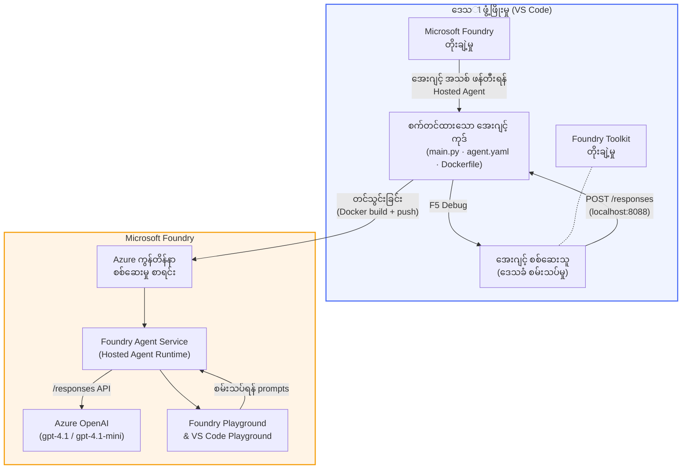

# Foundry Toolkit + Foundry Hosted Agents အလုပ်ရုံဆွေးနွေးပွဲ

[](https://www.python.org/)
[](https://github.com/microsoft/agents)
[](https://learn.microsoft.com/azure/ai-foundry/agents/concepts/hosted-agents/)
[](https://ai.azure.com/)
[](https://learn.microsoft.com/azure/ai-services/openai/)
[](https://learn.microsoft.com/cli/azure/install-azure-cli)
[](https://learn.microsoft.com/azure/developer/azure-developer-cli/install-azd)
[](https://www.docker.com/)
[](https://marketplace.visualstudio.com/items?itemName=ms-windows-ai-studio.windows-ai-studio)
[](LICENSE)

**Microsoft Foundry Agent Service** တွင် **Hosted Agents** အဖြစ် AI ကုဒ်များကို VS Code မှတစ်ဆင့် **Microsoft Foundry extension** နှင့် **Foundry Toolkit** အသုံးပြု၍ တည်ဆောက်၊ စမ်းသပ်၊ နှင့် တင်သွင်းပါ။

> **Hosted Agents သည် လောလောဆယ် ပြသမှုအဆင့်တွင် ရှိသည်။** ထောက်ပံ့မှုရှိသောတိုင်းဒေသများမှာ ကန့်သတ်ထားသည် - [တိုင်းဒေသရရှိနိုင်မှု](https://learn.microsoft.com/azure/foundry/agents/concepts/hosted-agents#region-availability) ကိုကြည့်ပါ။

> သင်္ကေတ `agent/` ဖိုလ်ဒါကို Foundry extension မှ **အလိုအလျောက် ထည့်သွင်း** လုပ်သည် - ထိုနောက် သင်သည် ကုဒ်ကို ပုံစံပြုပြင်ပြီး၊ ဒေသန္တရစမ်းသပ်ခြင်းပြုလုပ်၍ တင်သွင်းနိုင်သည်။

<!-- CO-OP TRANSLATOR LANGUAGES TABLE START -->
[Arabic](../ar/README.md) | [Bengali](../bn/README.md) | [Bulgarian](../bg/README.md) | [Burmese (Myanmar)](./README.md) | [Chinese (Simplified)](../zh-CN/README.md) | [Chinese (Traditional, Hong Kong)](../zh-HK/README.md) | [Chinese (Traditional, Macau)](../zh-MO/README.md) | [Chinese (Traditional, Taiwan)](../zh-TW/README.md) | [Croatian](../hr/README.md) | [Czech](../cs/README.md) | [Danish](../da/README.md) | [Dutch](../nl/README.md) | [Estonian](../et/README.md) | [Finnish](../fi/README.md) | [French](../fr/README.md) | [German](../de/README.md) | [Greek](../el/README.md) | [Hebrew](../he/README.md) | [Hindi](../hi/README.md) | [Hungarian](../hu/README.md) | [Indonesian](../id/README.md) | [Italian](../it/README.md) | [Japanese](../ja/README.md) | [Kannada](../kn/README.md) | [Khmer](../km/README.md) | [Korean](../ko/README.md) | [Lithuanian](../lt/README.md) | [Malay](../ms/README.md) | [Malayalam](../ml/README.md) | [Marathi](../mr/README.md) | [Nepali](../ne/README.md) | [Nigerian Pidgin](../pcm/README.md) | [Norwegian](../no/README.md) | [Persian (Farsi)](../fa/README.md) | [Polish](../pl/README.md) | [Portuguese (Brazil)](../pt-BR/README.md) | [Portuguese (Portugal)](../pt-PT/README.md) | [Punjabi (Gurmukhi)](../pa/README.md) | [Romanian](../ro/README.md) | [Russian](../ru/README.md) | [Serbian (Cyrillic)](../sr/README.md) | [Slovak](../sk/README.md) | [Slovenian](../sl/README.md) | [Spanish](../es/README.md) | [Swahili](../sw/README.md) | [Swedish](../sv/README.md) | [Tagalog (Filipino)](../tl/README.md) | [Tamil](../ta/README.md) | [Telugu](../te/README.md) | [Thai](../th/README.md) | [Turkish](../tr/README.md) | [Ukrainian](../uk/README.md) | [Urdu](../ur/README.md) | [Vietnamese](../vi/README.md)

> **ဒေသနယ်စနစ်ဖြင့် မိတ္ထဲသို့ကူးယူရန် ဦးစားပေးပါသလား?**
>
> ဤရေပိုက်စ်တိုတွင် ဘာသာစကား ၅၀ ကျော်ပါရှိပြီး ဒေါင်းလုပ်အရွယ်အစားကိုအများအပြားတိုးစေသည်။ ဘာသာစကားများ မပါအောင် ကူးယူရန် sparse checkout ကို အသုံးပြုပါ။
>
> **Bash / macOS / Linux:**
> ```bash
> git clone --filter=blob:none --sparse https://github.com/microsoft-foundry/Foundry_Toolkit_for_VSCode_Lab.git
> cd Foundry_Toolkit_for_VSCode_Lab
> git sparse-checkout set --no-cone '/*' '!translations' '!translated_images'
> ```
>
> **CMD (Windows):**
> ```cmd
> git clone --filter=blob:none --sparse https://github.com/microsoft-foundry/Foundry_Toolkit_for_VSCode_Lab.git
> cd Foundry_Toolkit_for_VSCode_Lab
> git sparse-checkout set --no-cone "/*" "!translations" "!translated_images"
> ```
>
> ဒါက သင့်အား ဘာသာစကားများ မပါဘဲ အစဉ်လိုက်သင်ကြားမှု အကြောင်းအရာများကို အလွယ်တကူ လုပ်ဆောင်နိုင်စေသည်။
<!-- CO-OP TRANSLATOR LANGUAGES TABLE END -->

---

## စနစ်ပုံသဏ္ဍာန်


**သွားလာမှု:** Foundry extension သည် agent ကို scaffold လုပ်သည် → သင်သည် ကုဒ်နှင့် ညွှန်ကြားချက်များကို ကိုယ်တိုင်ပြင်ဆင်သည် → Agent Inspector ဖြင့် ဒေသန္တရစမ်းသပ်သည် → Foundry သို့ တင်သွင်းသည် (Docker ပုံရိပ်ကို ACR သို့ တင်ပေးသည်) → Playground တွင် စစ်ဆေးသည်။

---

## သင် တည်ဆောက်မည့်အရာ

| Lab | ဖော်ပြချက် | အခြေအနေ |
|-----|-------------|---------|
| **Lab 01 - တစ်ဦးတည်းသော Agent** | **"Explain Like I'm an Executive" Agent** ကို တည်ဆောက်ပြီး ဒေသန္တရစမ်းသပ်၍ Foundry သို့ တင်သွင်းပါ | ✅ ရရှိနိုင်သည် |
| **Lab 02 - Multi-Agent Workflow** | **"Resume → Job Fit Evaluator"** ဖြစ်တဲ့ ၄ ဦးသော Agent များက Resume ကိုသုံးသပ်ပြီး သင်ကြားမှု လမ်းကြောင်း ဖန်တီးရာတွင် ပူးပေါင်းဆောင်ရွက်သည် | ✅ ရရှိနိုင်သည် |

---

## Executive Agent ကိုတွေ့ဆုံခြင်း

ဤအလုပ်ရုံဆွေးနွေးပွဲတွင် သင်သည် **"Explain Like I'm an Executive" Agent** ကို တည်ဆောက်မည်ဖြစ်သည် - နည်းပညာဆိုင်ရာစကားလုံး မတော်တဆကျဉ်းစေသော အကြောင်းအရာများကို သက်သာပြေနိုင်သော၊ ထိပ်တန်းအဆင့်လုပ်ငန်းပေါ်တွင် ကြားနေရမည့် စကားအတိုချက်များသို့ ပြန်လည် ဘာသာပြန်ပေးသော AI Agent ဖြစ်သည်။ အမှန်တကယ်ကတော့ "thread pool exhaustion caused by synchronous calls introduced in v3.2" ဆိုတဲ့ စကားလိုကားကို C-suite အဖွဲ့အတွက် မကြားချင်ကြပါဘူး။

ကျွန်တော်ဤ Agent ကို တည်ဆောက်ခဲ့တာမှာ ကြောင့်ကတော့ ကျွန်တော့်ရဲ့ ဖန်တီးထားတဲ့ post-mortem က အကြောင်းပြန်ပြီး *"So... is the website down or not?"* လို့တုံ့ပြန်တယ်ဆိုတဲ့ အဖြစ်အပျက် မကြာခဏ ကြုံတွေ့ရလို့ပါ။

### အလုပ်လုပ်ပုံ

သင်နည်းပညာဆိုင်ရာအပ်ဒိတ်တစ်ခု ထည့်သွင်းသည်။ ထို့နောက် သုံးစွဲသူအနေနှင့် executive summary - bullet point ၃ ခု၊ လှုပ်ရှားသောစကားနှင့် error stack မပါဘဲ၊ 感情မရှိဘဲ summary ရရှိသည်။ အဓိကအားဖြင့် **ဖြစ်ပျက်ခဲ့သည့်အရာ**, **စီးပွားရေးသက်ရောက်မှု**, နှင့် **နောက်တစ်ဆင့်** ဖြစ်ပါသည်။

### လှုပ်ရှားချက်ကို ကြည့်မယ်

**သင်ပြောသည်:**
> "The API latency increased due to thread pool exhaustion caused by synchronous calls introduced in v3.2."

**Agent မှ ပြန်ဆိုသည်:**

> **Executive Summary:**
> - **ဖြစ်ပျက်သည်:** နောက်ဆုံးထွက်ရှိသောထုတ်လုပ်မှုအပြီး၊ စနစ်အမြန်နှုန်း ကျဆင်းခဲ့သည်။
> - **စီးပွားရေးသက်ရောက်မှု:** အချို့သုံးစွဲသူများသည် ဝန်ဆောင်မှုကို အသုံးပြုရာတွင် ရှည်ထိန်းခိုင်းခံခဲ့ရသည်။
> - **နောက်တစ်ဆင့်:** ပြောင်းလဲမှုကို ပြန်လည် ဖျက်သိမ်းပြီး ပြင်ဆင်မှု တင်သွင်းခြင်း မတိုင်မီ ပြင်ဆင်နေသည်။

### ဤ Agent ကို ဘာကြောင့်?

ဤ Agent သည် တစ်ခုတည်းသော ရည်ရွယ်ချက်ရှိသည့် အသေးစား agent ဖြစ်ပြီး hosted agent workflow ကို စတင်လေ့လာရန်အတွက် အသင့်တော်ဆုံးဖြစ်သည်။ သို့သော်လည်း အမှန်တကယ်မှာ အင်ဂျင်နီယာအဖွဲ့အားလုံးအတွက် ဒီလို agent တစ်ခုရှိခြင်း ဂုဏ်ယူစရာဖြစ်ပါသည်။

---

## အလုပ်ရုံဆွေးနွေးပွဲ ဖွဲ့စည်းပုံ

```
📂 Foundry_Toolkit_for_VSCode_Lab/
├── 📄 README.md                      ← You are here
├── 📂 ExecutiveAgent/                ← Standalone hosted agent project
│   ├── agent.yaml
│   ├── Dockerfile
│   ├── main.py
│   └── requirements.txt
└── 📂 workshop/
    ├── 📂 lab01-single-agent/        ← Full lab: docs + agent code
    │   ├── README.md                 ← Hands-on lab instructions
    │   ├── 📂 docs/                  ← Step-by-step tutorial modules
    │   │   ├── 00-prerequisites.md
    │   │   ├── 01-install-foundry-toolkit.md
    │   │   ├── 02-create-foundry-project.md
    │   │   ├── 03-create-hosted-agent.md
    │   │   ├── 04-configure-and-code.md
    │   │   ├── 05-test-locally.md
    │   │   ├── 06-deploy-to-foundry.md
    │   │   ├── 07-verify-in-playground.md
    │   │   └── 08-troubleshooting.md
    │   └── 📂 agent/                 ← Reference solution (auto-scaffolded by Foundry extension)
    │       ├── agent.yaml
    │       ├── Dockerfile
    │       ├── main.py
    │       └── requirements.txt
    └── 📂 lab02-multi-agent/         ← Resume → Job Fit Evaluator
        ├── README.md                 ← Hands-on lab instructions (end-to-end)
        ├── 📂 docs/                  ← Step-by-step tutorial modules
        │   ├── 00-prerequisites.md
        │   ├── 01-understand-multi-agent.md
        │   ├── 02-scaffold-multi-agent.md
        │   ├── 03-configure-agents.md
        │   ├── 04-orchestration-patterns.md
        │   ├── 05-test-locally.md
        │   ├── 06-deploy-to-foundry.md
        │   ├── 07-verify-in-playground.md
        │   └── 08-troubleshooting.md
        └── 📂 PersonalCareerCopilot/ ← Reference solution (multi-agent workflow)
            ├── agent.yaml
            ├── Dockerfile
            ├── main.py
            └── requirements.txt
```

> **မှတ်ချက်:** `agent/` ဖိုလ်ဒါကို Microsoft Foundry extension မှ Command Palette တွင် `Microsoft Foundry: Create a New Hosted Agent` ကို ပြုလုပ်တဲ့အခါ 생성 လုပ်သည်။ ဖိုင်တွေကို သင့် agent ၏ ညွှန်ကြားချက်များ၊ ကိရိယာများနှင့် စနစ်အပြင်အဆင်များနှင့် တိုးတက်ဖွံ့ဖြိုးစေသည်။ Lab 01 တွင် ဤကို ဖြည့်စွက်၍ ပြန်လည်ဖန်တီးခြင်းပြုလုပ်လမ်းညွှန်ပါသည်။

---

## စတင်အသုံးပြုခြင်း

### ၁။ Repository ကို ကူးယူပါ

```bash
git clone https://github.com/microsoft-foundry/Foundry_Toolkit_for_VSCode_Lab.git
cd Foundry_Toolkit_for_VSCode_Lab
```

### ၂။ Python virtual environment တည်ဆောက်ပါ

```bash
python -m venv venv
```

ဖွင့်ပါ:

- **Windows (PowerShell):**
  ```powershell
  .\venv\Scripts\Activate.ps1
  ```
- **macOS / Linux:**
  ```bash
  source venv/bin/activate
  ```

### ၃။ အလိုအလျောက်လိုအပ်သော Packages များကို 설치 လုပ်ပါ

```bash
pip install -r workshop/lab01-single-agent/agent/requirements.txt
```

### ၄။ မိမိ environment များ ကို ဖြည့်စွက်လိုက်ပါ

agent ဖိုလ်ဒါထဲက ရှိ `.env` ကို ကူးယူပြီး သင့်တန်ဖိုးများကို ဖြည့်ပါ:

```bash
cp workshop/lab01-single-agent/agent/.env.example workshop/lab01-single-agent/agent/.env
```

`workshop/lab01-single-agent/agent/.env` ကို ပြင်ပါ:

```env
AZURE_AI_PROJECT_ENDPOINT=https://<your-account>.services.ai.azure.com/api/projects/<your-project>
MODEL_DEPLOYMENT_NAME=<your-model-deployment-name>
```

### ၅။ အလုပ်ရုံဆွေးနွေးပွဲ Labs အတိုင်း လိုက်နာပါ

ယင်း Lab များသည် module များကို သီးခြားထားပြီး၊ ပထမ Lab 01 မှစ၍ အခြေခံများ လေ့လာထားပါ။ ထို့နောက် Lab 02 တွင် multi-agent workflow များကို လေ့လာနိုင်သည်။

#### Lab 01 - တစ်ဦးတည်း Agent ([အပြည့်အစုံညွှန်ကြားချက်များ](workshop/lab01-single-agent/README.md))

| # | Module | Link |
|---|--------|------|
| 1 | ကြိုတင်လိုအပ်ချက်များဖတ်ပါ | [00-prerequisites.md](workshop/lab01-single-agent/docs/00-prerequisites.md) |
| 2 | Foundry Toolkit နှင့် Foundry extension ကို install စက်ပါ | [01-install-foundry-toolkit.md](workshop/lab01-single-agent/docs/01-install-foundry-toolkit.md) |
| 3 | Foundry Project တည်ဆောက်ပါ | [02-create-foundry-project.md](workshop/lab01-single-agent/docs/02-create-foundry-project.md) |
| 4 | Hosted Agent တစ်ခုဖန်တီးပါ | [03-create-hosted-agent.md](workshop/lab01-single-agent/docs/03-create-hosted-agent.md) |
| 5 | ညွှန်ကြားချက်များနှင့် environment ကို ပြင်ဆင်ပါ | [04-configure-and-code.md](workshop/lab01-single-agent/docs/04-configure-and-code.md) |
| 6 | ဒေသန္တရ စမ်းသပ်ပါ | [05-test-locally.md](workshop/lab01-single-agent/docs/05-test-locally.md) |
| 7 | Foundry သို့ တင်သွင်းပါ | [06-deploy-to-foundry.md](workshop/lab01-single-agent/docs/06-deploy-to-foundry.md) |
| 8 | Playground တွင် အတည်ပြုပါ | [07-verify-in-playground.md](workshop/lab01-single-agent/docs/07-verify-in-playground.md) |
| 9 | ပြဿနာဖြေရှင်းခြင်း | [08-troubleshooting.md](workshop/lab01-single-agent/docs/08-troubleshooting.md) |

#### Lab 02 - Multi-Agent Workflow ([အပြည့်အစုံညွှန်ကြားချက်များ](workshop/lab02-multi-agent/README.md))

| # | Module | Link |
|---|--------|------|
| 1 | ကြိုတင်လိုအပ်ချက်များ (Lab 02) | [00-prerequisites.md](workshop/lab02-multi-agent/docs/00-prerequisites.md) |
| 2 | Multi-agent စနစ်ပုံသဏ္ဍာန်ကို နားဆင်ပါ | [01-understand-multi-agent.md](workshop/lab02-multi-agent/docs/01-understand-multi-agent.md) |
| 3 | Multi-agent Project ကို Scaffold လုပ်ပါ | [02-scaffold-multi-agent.md](workshop/lab02-multi-agent/docs/02-scaffold-multi-agent.md) |
| 4 | Agents နှင့် Environment ကို ပြင်ဆင်ပါ | [03-configure-agents.md](workshop/lab02-multi-agent/docs/03-configure-agents.md) |
| 5 | စီမံခန့်ခွဲမှုပုံစံများ | [04-orchestration-patterns.md](workshop/lab02-multi-agent/docs/04-orchestration-patterns.md) |
| 6 | ဒေသန္တရစမ်းသပ်မှု (multi-agent) | [05-test-locally.md](workshop/lab02-multi-agent/docs/05-test-locally.md) |
| 7 | Foundry သို့ တပ်ဆင်ခြင်း | [06-deploy-to-foundry.md](workshop/lab02-multi-agent/docs/06-deploy-to-foundry.md) |
| 8 | Playground တွင် စစ်ဆေးခြင်း | [07-verify-in-playground.md](workshop/lab02-multi-agent/docs/07-verify-in-playground.md) |
| 9 | ပြဿနာများ ဖြေရှင်းခြင်း (multi-agent) | [08-troubleshooting.md](workshop/lab02-multi-agent/docs/08-troubleshooting.md) |

---

## တာဝန်ရှိသူ

<table>
<tr>
    <td align="center"><a href="https://github.com/ShivamGoyal03">
        <br />
        <sub><b>Shivam Goyal</b></sub>
    </a><br />
    </td>
</tr>
</table>

---

## လိုအပ်သောခွင့်ပြုချက်များ (လျင်မြန်သောကိုးကားချက်)

| သရုပ်ပြမှု | လိုအပ်သော အခန်းကဏ္ဍများ |
|----------|---------------|
| Foundry စီမံကိန်းအသစ် ဖန်တီးခြင်း | Foundry resource တွင် **Azure AI Owner** |
| စီမံကိန်းရှိပြီးသားကို တပ်ဆင်ခြင်း (အရင်းအမြစ်အသစ်များ) | စာရင်းသွင်းမှုတွင် **Azure AI Owner** + **Contributor** |
| ပြည့်စုံစွာ ပြင်ဆင်ပြီးသော စီမံကိန်းကို တပ်ဆင်ခြင်း | အကောင့်တွင် **Reader** + စီမံကိန်းတွင် **Azure AI User** |

> **အရေးကြီးစွာ:** Azure `Owner` နှင့် `Contributor` အခန်းကဏ္ဍများတွင် *စီမံခန့်ခွဲမှု* ခွင့်သာပါရှိပြီး၊ *ဖွံ့ဖြိုးတိုးတက်မှု* (ဒေတာဆိုင်ရာ လုပ်ဆောင်ချက်) ခွင့်များ မပါဝင်ပါ။ အင်စတောင့်များ တည်ဆောက်ပြီး တပ်ဆင်ရန် သင်သည် **Azure AI User** သို့မဟုတ် **Azure AI Owner** လိုအပ်ပါတယ်။

---

## ကိုးကားချက်များ

- [Quickstart: သင်၏ ပထမဆုံး hosted agent တပ်ဆင်ခြင်း (VS Code)](https://learn.microsoft.com/azure/foundry/agents/quickstarts/quickstart-hosted-agent)
- [Hosted agents ဆိုတာဘာလဲ?](https://learn.microsoft.com/azure/foundry/agents/concepts/hosted-agents)
- [VS Code တွင် hosted agent workflow ဖန်တီးခြင်း](https://learn.microsoft.com/azure/foundry/agents/how-to/vs-code-agents-workflow-pro-code)
- [Hosted agent တပ်ဆင်ခြင်း](https://learn.microsoft.com/azure/foundry/agents/how-to/deploy-hosted-agent)
- [Microsoft Foundry အတွက် RBAC](https://learn.microsoft.com/azure/foundry/concepts/rbac-foundry)
- [Architecture Review Agent နမူနာ](https://github.com/Azure-Samples/agent-architecture-review-sample) - MCP tools, Excalidraw diagrams နှင့် နှစ်မျိုးတပ်ဆင်နိုင်သော အစစ်အမှန် hosted agent

---


## လိုင်စင်

[MIT](../../LICENSE)

---

<!-- CO-OP TRANSLATOR DISCLAIMER START -->
**အတင်းအကြပ်မှတ်ချက်**  
ဤစာတမ်းကို AI ဘာသာပြန်ဝန်ဆောင်မှုဖြစ်သည့် [Co-op Translator](https://github.com/Azure/co-op-translator) ဖြင့် ဘာသာပြန်ထားပါသည်။ ကျွန်ုပ်တို့သည် တိကျမှန်ကန်မှုအတွက် ထိထိရောက်ရောက် ကြိုးစားနေသော်လည်း၊ အလိုအလျောက်ဘာသာပြန်ခြင်းမှ ဖြစ်နိုင်သော အမှားများ သို့မဟုတ် မှားယွင်းချက်များ ရှိနိုင်ကြောင်း သိရှိထားရှိပါစေ။ မူလစာချုပ်အတွက် မိမိဘာသာစကားဖြင့် ရေးသားထားသော စာတမ်းကို အတိအကျအရင်းအမြစ်အဖြစ် သတ်မှတ်ရန် လိုပါသည်။ အဓိကအချက်အလက်များအတွက် လူတစ်ယောက်တည်းဖြင့် လုပ်ဆောင်သည့် ပရော်ဖက်ရှင်နယ် ဘာသာပြန်ခြင်း ကို အကြံပြုပါသည်။ ဤဘာသာပြန်ချက်ကို အသုံးပြုခြင်းမှ ဖြစ်ပေါ်နိုင်သည့် နားလည်မမှန်မှုများ သို့မဟုတ် အဓိပ္ပာယ်မှားခြင်းများအတွက် ကျွန်ုပ်တို့သည် တာဝန်မယူပါ။
<!-- CO-OP TRANSLATOR DISCLAIMER END -->