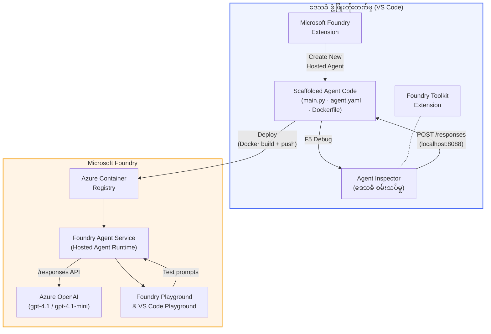

# Foundry Toolkit + Foundry Hosted Agents Workshop

[](https://www.python.org/)
[](https://github.com/microsoft/agents)
[](https://learn.microsoft.com/azure/ai-foundry/agents/concepts/hosted-agents/)
[](https://ai.azure.com/)
[](https://learn.microsoft.com/azure/ai-services/openai/)
[](https://learn.microsoft.com/cli/azure/install-azure-cli)
[](https://learn.microsoft.com/azure/developer/azure-developer-cli/install-azd)
[](https://www.docker.com/)
[](https://marketplace.visualstudio.com/items?itemName=ms-windows-ai-studio.windows-ai-studio)
[](LICENSE)

VS Code မှ **Microsoft Foundry extension** နဲ့ **Foundry Toolkit** ကို အသုံးပြုပြီး **Microsoft Foundry Agent Service** အတွက် AI agents တွေကို **Hosted Agents** အဖြစ် တည်ဆောက်၊ စမ်းသပ်၊ တင်သွင်းပါ။

> **Hosted Agents များသည် လောလောဆယ် ကြိုတင် ကြည့်ရှုရန် အဆင့်တွင် ရှိသည်။** ပံ့ပိုးသော ဒေသများ ကန့်သတ်ထားသည် - [ဒေသရရှိနိုင်မှု](https://learn.microsoft.com/azure/foundry/agents/concepts/hosted-agents#region-availability) ကို ကြည့်ပါ။

> လက်တွေ့ လက်ခံရရှိနိုင်သော lab တစ်ခုခြင်းရဲ့ `agent/` ဖိုလ်ဒါကို Foundry extension မှ **အလိုအလျောက် ဖွဲ့စည်းပေးသည်** - သင်က ဂရုပြု၍ ကုဒ်ကို ပြင်ဆင်၊ ဒေသတွင်း စမ်းသပ်၊ Deployment ပြုလုပ်ပါ။

### 🌐 ဘာသာစကားအများအပြားကို ပံ့ပိုးမှု

#### GitHub Action မှတဆင့် ပံ့ပိုးသည် (အလိုအလျောက်နှင့် အမြဲတမ်း အပ်ဒိတ်ဖြစ်နေသည်)

<!-- CO-OP TRANSLATOR LANGUAGES TABLE START -->
[Arabic](../ar/README.md) | [Bengali](../bn/README.md) | [Bulgarian](../bg/README.md) | [Burmese (Myanmar)](./README.md) | [Chinese (Simplified)](../zh-CN/README.md) | [Chinese (Traditional, Hong Kong)](../zh-HK/README.md) | [Chinese (Traditional, Macau)](../zh-MO/README.md) | [Chinese (Traditional, Taiwan)](../zh-TW/README.md) | [Croatian](../hr/README.md) | [Czech](../cs/README.md) | [Danish](../da/README.md) | [Dutch](../nl/README.md) | [Estonian](../et/README.md) | [Finnish](../fi/README.md) | [French](../fr/README.md) | [German](../de/README.md) | [Greek](../el/README.md) | [Hebrew](../he/README.md) | [Hindi](../hi/README.md) | [Hungarian](../hu/README.md) | [Indonesian](../id/README.md) | [Italian](../it/README.md) | [Japanese](../ja/README.md) | [Kannada](../kn/README.md) | [Khmer](../km/README.md) | [Korean](../ko/README.md) | [Lithuanian](../lt/README.md) | [Malay](../ms/README.md) | [Malayalam](../ml/README.md) | [Marathi](../mr/README.md) | [Nepali](../ne/README.md) | [Nigerian Pidgin](../pcm/README.md) | [Norwegian](../no/README.md) | [Persian (Farsi)](../fa/README.md) | [Polish](../pl/README.md) | [Portuguese (Brazil)](../pt-BR/README.md) | [Portuguese (Portugal)](../pt-PT/README.md) | [Punjabi (Gurmukhi)](../pa/README.md) | [Romanian](../ro/README.md) | [Russian](../ru/README.md) | [Serbian (Cyrillic)](../sr/README.md) | [Slovak](../sk/README.md) | [Slovenian](../sl/README.md) | [Spanish](../es/README.md) | [Swahili](../sw/README.md) | [Swedish](../sv/README.md) | [Tagalog (Filipino)](../tl/README.md) | [Tamil](../ta/README.md) | [Telugu](../te/README.md) | [Thai](../th/README.md) | [Turkish](../tr/README.md) | [Ukrainian](../uk/README.md) | [Urdu](../ur/README.md) | [Vietnamese](../vi/README.md)

> **ဒေသတွင်းကလုံ ချင်လား?**
>
> ဒီ repo မှာ ၅၀ ကျော် ဘာသာစကား ဘာသာပြန်ချက်များ ပါဝင်ပြီး ဒါကြောင့်ဒေါင်းလုပ်အရွယ်အစား လေးလံပြီး မြန်ဆန်တဲ့ ဒေါင်းလုပ်မဖြစ်စေပါဘူး။ ဘာသာပြန်ချက်များမပါဘဲ clone လုပ်ချင်ရင် sparse checkout ကို သုံးပါ:
>
> **Bash / macOS / Linux:**
> ```bash
> git clone --filter=blob:none --sparse https://github.com/microsoft-foundry/Foundry_Toolkit_for_VSCode_Lab.git
> cd Foundry_Toolkit_for_VSCode_Lab
> git sparse-checkout set --no-cone '/*' '!translations' '!translated_images'
> ```
>
> **CMD (Windows):**
> ```cmd
> git clone --filter=blob:none --sparse https://github.com/microsoft-foundry/Foundry_Toolkit_for_VSCode_Lab.git
> cd Foundry_Toolkit_for_VSCode_Lab
> git sparse-checkout set --no-cone "/*" "!translations" "!translated_images"
> ```
>
> ဒါကြောင့် သင်သင်ယူဖို့ လိုအပ်တဲ့ အရာအားလုံးကို အလျင်မြန်စွာ ရရှိနိုင်မှာ ဖြစ်ပါတယ်။
<!-- CO-OP TRANSLATOR LANGUAGES TABLE END -->

---

## အဆောက်အဦ ရုပ်တည်မှု


**စီးဆင်းပုံ:** Foundry extension က agent ကို ဖွဲ့စည်း → သင်က ကုဒ်နဲ့ လမ်းညွှန်ချက်တွေကို ပြင်ဆင် → Agent Inspector နဲ့ ဒေသတွင်း စမ်းသပ် → Foundry သို့ တင်သွင်း (Docker image ကို ACR ထဲသို့ ပို့) → Playground မှာ စစ်ဆေး။

---

## သင်တည်ဆောက်မယ့် အရာများ

| Lab | ဖော်ပြချက် | အခြေအနေ |
|-----|-------------|--------|
| **Lab 01 - Single Agent** | **"Explain Like I'm an Executive" Agent** ကို တည်ဆောက်၊ ဒေသတွင်း စမ်းသပ်ပြီး Foundry သို့ တင်သွင်းရန် | ✅ ရရှိနိုင်ပြီ |
| **Lab 02 - Multi-Agent Workflow** | **"Resume → Job Fit Evaluator"** ကို တည်ဆောက်ရန် - agent ၄ ယောက် ပူးပေါင်းပြီး resume ကို အဆင်ပြေမှု βαθများပေးပြီး သင်ယူရေးစီမံခန့်ခွဲမှု လမ်းညွှန်ကို ဖန်တီးသည် | ✅ ရရှိနိုင်ပြီ |

---

## Executive Agent ကိုတွေ့ဆုံပါ

ဒီ workshop မှာ **"Explain Like I'm an Executive" Agent** ကို တည်ဆောက်မှာ ဖြစ်ပြီး - ဒါတွေက ဗဟုသုတ အရမ်း ပြင်းထန်တဲ့ နည်းပညာ စကားများကို စိတ်ရှည်စွာ နားလည်နိုင်ပြီး၊ အခန်းအစည်းအဝေးတွေမှာ အသုံးပြုနိုင်အောင် ရိုးရှင်းတဲ့ အနှစ်ချုပ် စာများ ထုတ်ပေးတဲ့ AI agent တစ်ခု ဖြစ်ပါတယ်။ တကယ်တော့ C-suite ထဲမှာ "thread pool exhaustion caused by synchronous calls introduced in v3.2." ဆိုတာ ပျင်းကွက်ချင်သူ မရှိပါဘူး။

ကျွန်တော် ဒီ agent ကို တည်ဆောက်ခဲ့တာက ကျွန်တော်ရဲ့ အကောင်းဆုံးရေးသားထားတဲ့ post-mortem ကို *"ဆိုတော့... website က ပိတ်သိပ်နေတာလား မပိတ်သိပ်ဘူးလား?"* ဆိုပြီး တုံ့ပြန်ကြတဲ့ အချိန်တွေ ဒီ agent ရဲ့ လိုအပ်မှုကို မြင်ခဲ့ရလို့ ဖြစ်ပါတယ်။

### ၎င်းကို မည်သို့ ကုန်သွယ်ပါသလဲ

နည်းပညာ အချက်အလက်တွေကို တင်ပြလိုက်ပါ။ Agent က executive summary ကို ပြန်ပေးပါလိမ့်မယ် - အချက် ၃ ချက်၊ jargon မပါ၊ stack trace မပါ၊ စိုးရိမ်ဖွယ်ရာ မပါပါဘူး။ ပဲ **ဘာဖြစ်ပြီးသား၊ စီးပွားရေး အကျိုးသက်ရောက်မှု၊ နောက်တစ်ဆင့်** တွေကို ပဲ ဒီမှာ ထည့်သွင်းပြောဆိုပါတယ်။

### လက်တွေ့ ကြည့်ပါ

**သင်ပြောသည်:**
> "The API latency increased due to thread pool exhaustion caused by synchronous calls introduced in v3.2."

**Agent က ပြန်ဖြေသည်:**

> **Executive Summary:**
> - **ဘာဖြစ်သွားသလဲ:** နောက်ဆုံးထွက်လာတဲ့ ဗားရှင်းပြီးနောက် စနစ်ထက်ပိုမြန်မှု လျော့နည်းသွားတယ်။
> - **စီးပွားရေးသက်ရောက်မှု:** အသုံးပြုသူအချို့က ဝန်ဆောင်မှုကို အသုံးပြုရာမှာ ကျရှုံးမှု ရှိခဲ့တယ်။
> - **နောက်တစ်ဆင့်:** ပြဿနာကို ပြန်ဖျက်ထားပြီး၊ ပြင်ဆင်မှုကို ပြင်ဆင်ခြင်းခံ့ပီး ပြန်လည်တင်သွင်းမယ်။

### ဒီ agent ကိုဘာကြောင့်?

ဒီ agent က တစ်ခုတည်း ရည်ရွယ်ချက်ရှိပြီး သွက်လက်ရှင်းလင်းသော agent တစ်ခုဖြစ်ပြီး hosted agent workflow အခြေခံအဆင့်များကို သင်ယူဖို့ အထူးသင့်လျော်ပါသည်။ နည်းပညာအဖွဲ့တစ်ဖွဲ့လုံး အတွက်လည်း အသုံးဝင်တယ်။

---

## Workshop ဖွဲ့စည်းပုံ

```
📂 Foundry_Toolkit_for_VSCode_Lab/
├── 📄 README.md                      ← You are here
├── 📂 ExecutiveAgent/                ← Standalone hosted agent project
│   ├── agent.yaml
│   ├── Dockerfile
│   ├── main.py
│   └── requirements.txt
└── 📂 workshop/
    ├── 📂 lab01-single-agent/        ← Full lab: docs + agent code
    │   ├── README.md                 ← Hands-on lab instructions
    │   ├── 📂 docs/                  ← Step-by-step tutorial modules
    │   │   ├── 00-prerequisites.md
    │   │   ├── 01-install-foundry-toolkit.md
    │   │   ├── 02-create-foundry-project.md
    │   │   ├── 03-create-hosted-agent.md
    │   │   ├── 04-configure-and-code.md
    │   │   ├── 05-test-locally.md
    │   │   ├── 06-deploy-to-foundry.md
    │   │   ├── 07-verify-in-playground.md
    │   │   └── 08-troubleshooting.md
    │   └── 📂 agent/                 ← Reference solution (auto-scaffolded by Foundry extension)
    │       ├── agent.yaml
    │       ├── Dockerfile
    │       ├── main.py
    │       └── requirements.txt
    └── 📂 lab02-multi-agent/         ← Resume → Job Fit Evaluator
        ├── README.md                 ← Hands-on lab instructions (end-to-end)
        ├── 📂 docs/                  ← Step-by-step tutorial modules
        │   ├── 00-prerequisites.md
        │   ├── 01-understand-multi-agent.md
        │   ├── 02-scaffold-multi-agent.md
        │   ├── 03-configure-agents.md
        │   ├── 04-orchestration-patterns.md
        │   ├── 05-test-locally.md
        │   ├── 06-deploy-to-foundry.md
        │   ├── 07-verify-in-playground.md
        │   └── 08-troubleshooting.md
        └── 📂 PersonalCareerCopilot/ ← Reference solution (multi-agent workflow)
            ├── agent.yaml
            ├── Dockerfile
            ├── main.py
            └── requirements.txt
```

> **မှတ်ချက်:** lab တစ်ခုခြင်းထဲရှိ `agent/` ဖိုလ်ဒါမှာ **Microsoft Foundry extension** က `Microsoft Foundry: Create a New Hosted Agent` command ကို Command Palette ကနေ တင်သွင်းစဉ် စက်ရုပ်ဖန်တီးပေးထားတာဖြစ်တယ်။ ပြီးမှာ သင့် agent အတွက် လမ်းညွှန်ချက်၊ ကိရိယာများနဲ့ ဖွဲ့စည်းမှုတွေကို ကိုယ်တိုင် ပြင်ဆင်မှာဖြစ်ပါတယ်။ Lab 01 က ဒီအရာကို စတင်တည်ဆောက်ပုံ လမ်းညွှန်ပေးပါသည်။

---

## စတင်လိုက်ပါ

### ၁။ Repository ကို clone ချရန်

```bash
git clone https://github.com/microsoft-foundry/Foundry_Toolkit_for_VSCode_Lab.git
cd Foundry_Toolkit_for_VSCode_Lab
```

### ၂။ Python virtual environment တည်ဆောက်ရန်

```bash
python -m venv venv
```

အသုံးပြုရန် ဖွင့်ပါ -

- **Windows (PowerShell):**
  ```powershell
  .\venv\Scripts\Activate.ps1
  ```
- **macOS / Linux:**
  ```bash
  source venv/bin/activate
  ```

### ၃။ လိုအပ်သော library များ 설치လုပ်ခြင်း

```bash
pip install -r workshop/lab01-single-agent/agent/requirements.txt
```

### ၄။ Environment variables ကို ပြင်ဆင်ပါ

agent ဖိုလ်ဒါအတွင်းရှိ မူကွဲ `.env` ဖိုင်ကို ကူးယူပြီး  ကိုယ့်တန်ဖိုးတွေ ဖြည့်ပါ -

```bash
cp workshop/lab01-single-agent/agent/.env.example workshop/lab01-single-agent/agent/.env
```

`workshop/lab01-single-agent/agent/.env` ကို တည်းဖြတ်ပါ -

```env
AZURE_AI_PROJECT_ENDPOINT=https://<your-account>.services.ai.azure.com/api/projects/<your-project>
MODEL_DEPLOYMENT_NAME=<your-model-deployment-name>
```

### ၅။ Workshop Labs များကို လိုက်နာပါ

lab တစ်ခုချင်းစီမှာ သီးသန့် module များ ပါဝင်သည်။ အခြေခံအာရုံစူးစိုက်ဖို့ **Lab 01** နဲ့ စပြီး multi-agent workflows များကို သိရှိချင်ရင် **Lab 02** သို့ ဆက်လက်သွားပါ။

#### Lab 01 - Single Agent ([အပြည့်အစုံ လမ်းညွှန်ချက်များ](workshop/lab01-single-agent/README.md))

| # | Module | လင့်ခ် |
|---|--------|------|
| 1 | မတိုင်ခင်အချက်အလက်များ ဖတ်ပါ | [00-prerequisites.md](workshop/lab01-single-agent/docs/00-prerequisites.md) |
| 2 | Foundry Toolkit နဲ့ Foundry extension ကို 설치 လုပ်ပါ | [01-install-foundry-toolkit.md](workshop/lab01-single-agent/docs/01-install-foundry-toolkit.md) |
| 3 | Foundry Project တည်ဆောက်ပါ | [02-create-foundry-project.md](workshop/lab01-single-agent/docs/02-create-foundry-project.md) |
| 4 | Hosted Agent တစ်ခု ဖန်တီးပါ | [03-create-hosted-agent.md](workshop/lab01-single-agent/docs/03-create-hosted-agent.md) |
| 5 | လမ်းညွှန်ချက် & Environment ကို ပြင်ဆင်ပါ | [04-configure-and-code.md](workshop/lab01-single-agent/docs/04-configure-and-code.md) |
| 6 | ဒေသတွင်း စမ်းသပ်ပါ | [05-test-locally.md](workshop/lab01-single-agent/docs/05-test-locally.md) |
| 7 | Foundry သို့ တင်သွင်းပါ | [06-deploy-to-foundry.md](workshop/lab01-single-agent/docs/06-deploy-to-foundry.md) |
| 8 | Playground မှာ စစ်ဆေးပါ | [07-verify-in-playground.md](workshop/lab01-single-agent/docs/07-verify-in-playground.md) |
| 9 | စိန်ခေါ်မှုများ ဖြေရှင်းခြင်း | [08-troubleshooting.md](workshop/lab01-single-agent/docs/08-troubleshooting.md) |

#### Lab 02 - Multi-Agent Workflow ([အပြည့်အစုံ လမ်းညွှန်ချက်များ](workshop/lab02-multi-agent/README.md))

| # | Module | လင့်ခ် |
|---|--------|------|
| 1 | မတိုင်ခင်အချက်အလက်များ (Lab 02) | [00-prerequisites.md](workshop/lab02-multi-agent/docs/00-prerequisites.md) |
| 2 | Multi-agent architecture ကို နားလည်ပါ | [01-understand-multi-agent.md](workshop/lab02-multi-agent/docs/01-understand-multi-agent.md) |
| 3 | Multi-agent project ကို ဖွဲ့စည်းပါ | [02-scaffold-multi-agent.md](workshop/lab02-multi-agent/docs/02-scaffold-multi-agent.md) |
| 4 | Agents & Environment ကို ပြင်ဆင်ပါ | [03-configure-agents.md](workshop/lab02-multi-agent/docs/03-configure-agents.md) |
| 5 | Orchestration Patterns များ | [04-orchestration-patterns.md](workshop/lab02-multi-agent/docs/04-orchestration-patterns.md) |
| 6 | ဒေသတွင်း စမ်းသပ်ပါ (multi-agent) | [05-test-locally.md](workshop/lab02-multi-agent/docs/05-test-locally.md) |
| 7 | Foundry သို့ ဖြန့်ချိခြင်း | [06-deploy-to-foundry.md](workshop/lab02-multi-agent/docs/06-deploy-to-foundry.md) |
| 8 | Playground မှာ အတည်ပြုခြင်း | [07-verify-in-playground.md](workshop/lab02-multi-agent/docs/07-verify-in-playground.md) |
| 9 | ပြဿနာဖြေရှင်းခြင်း (multi-agent) | [08-troubleshooting.md](workshop/lab02-multi-agent/docs/08-troubleshooting.md) |

---

## တာဝန်ခံ

<table>
<tr>
    <td align="center"><a href="https://github.com/ShivamGoyal03">
        <br />
        <sub><b>Shivam Goyal</b></sub>
    </a><br />
    </td>
</tr>
</table>

---

## လိုအပ်သော ခွင့်ပြုချက်များ (လျင်မြန်သော ရည်ညွှန်းချက်)

| အခြေအနေ | လိုအပ်သော အခန်းကဏ္ဍများ |
|----------|---------------|
| Foundry ပရောဂျက်အသစ် တည်ဆောက်ရန် | Foundry အရင်းအမြစ်ပေါ်ရှိ **Azure AI Owner** |
| ရှိပြီးသား ပရောဂျက် (အရင်းအမြစ်အသစ်များ) ထဲသို့ ဖြန့်ချိရန် | စာရင်းသွင်းခွင့်ပေါ်ရှိ **Azure AI Owner** + **Contributor** |
| ပြည့်စုံစွာကွန်ဖီဂာသော ပရောဂျက်ထဲသို့ ဖြန့်ချိရန် | အကောင့်ပေါ်ရှိ **Reader** + ပရောဂျက်ပေါ်ရှိ **Azure AI User** |

> **အရေးကြီးချက်:** Azure `Owner` နှင့် `Contributor` အခန်းကဏ္ဍများတွင် *စီမံခန့်ခွဲမှု* ခွင့်ပြုချက်များသာပါဝင်ပြီး၊ *ဖွံ့ဖြိုးတိုးတက်မှု* (ဒေတာလှုပ်ရှားမှု) ခွင့်ပြုချက်များမပါဝင်ပါ။ Agent များတည်ဆောက်ခြင်းနှင့် ဖြန့်ချိခြင်းအတွက် **Azure AI User** သို့မဟုတ် **Azure AI Owner** လိုအပ်ပါသည်။

---

## ကိုးကားချက်များ

- [Quickstart: သင်၏ ပထမဆုံး hosted agent ကို ဖြန့်ချိခြင်း (VS Code)](https://learn.microsoft.com/azure/foundry/agents/quickstarts/quickstart-hosted-agent)
- [Hosted agents ဆိုတာဘာလဲ?](https://learn.microsoft.com/azure/foundry/agents/concepts/hosted-agents)
- [VS Code တွင် hosted agent workflow များ ဖန်တီးခြင်း](https://learn.microsoft.com/azure/foundry/agents/how-to/vs-code-agents-workflow-pro-code)
- [Hosted agent တစ်ခု ဖြန့်ချိခြင်း](https://learn.microsoft.com/azure/foundry/agents/how-to/deploy-hosted-agent)
- [Microsoft Foundry အတွက် RBAC](https://learn.microsoft.com/azure/foundry/concepts/rbac-foundry)
- [Architecture Review Agent နမူနာ](https://github.com/Azure-Samples/agent-architecture-review-sample) - MCP ကိရိယာများ၊ Excalidraw ပုံဆွဲများနှင့် နှစ်မျိုးဖြန့်ချိမှုပါရှိသည့် အမှန်တကယ်အသုံးပြုနိုင်သော hosted agent

---

## လိုင်စင်

[MIT](../../LICENSE)

---

<!-- CO-OP TRANSLATOR DISCLAIMER START -->
**ဆိုင်းငံ့ချက်**ঃ  
ဤစာတမ်းကို AI ဘာသာပြန်ဝန်ဆောင်မှု [Co-op Translator](https://github.com/Azure/co-op-translator) ကို အသုံးပြု၍ ဘာသာပြန်ထားပါသည်။ ကျွန်ုပ်တို့သည် တိကျမှန်ကန်မှုအတွက် ကြိုးစားသော်လည်း၊ အလိုအလျောက်ဘာသာပြန်မှုများတွင် အမှားများ သို့မဟုတ် မှားယွင်းမှုများ ပါဝင်နိုင်သည်ကို ကျေးဇူးပြု၍ သိရှိထားကြပါရန် မေတ္တာရပ်ခံအပ်ပါသည်။ မူရင်းစာရွက်စာတမ်းကို မိခင်ဘာသာဖြင့်သာ အတည်ပြုနိုင်သော အရင်းအမြစ်အနေနှင့် သတ်မှတ်သင့်သည်။ အရေးကြီးသောသတင်းအချက်အလက်များအတွက် လူမှုအသိပညာရပ်ဆိုင်ရာ ဘာသာပြန်ချက်ကို အကြံပြုပါသည်။ ဤဘာသာပြန်မှုကို အသုံးပြုမှုမှ ဖြစ်ပေါ်လာသော မျှော်လင့်ချက်မကျခြင်း သို့မဟုတ် အပေါ်ယံနားလည်မှုများအတွက် ကျွန်ုပ်တို့မှာ တာဝန်မရှိပါ။
<!-- CO-OP TRANSLATOR DISCLAIMER END -->