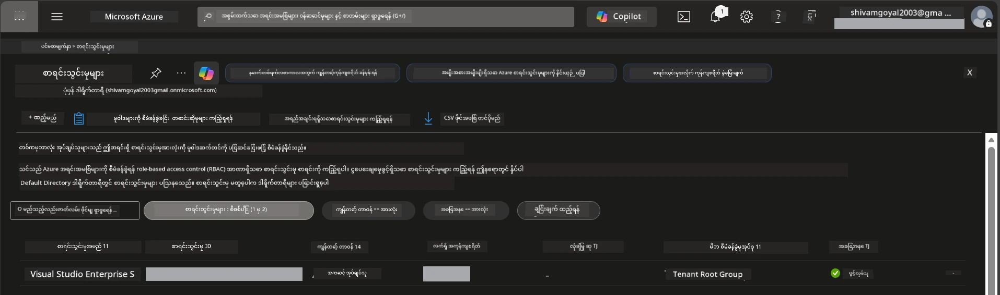

# Module 0 - တင်ပြချက်များ

သင်တန်းအစ မစတိုင်မီ သင့်မှာ အောက်ပါကိရိယာများ၊ လက်လှမ်းရှိမှုနှင့် ပတ်ဝန်းကျင်များ မှန်ကန်စွာပြင်ဆင်ပြီးကြောင်း အတည်ပြုပါ။ အောက်ပါအဆင့်တိုင်းကို လိုက်နာပါ - ရှေ့ဆက်မလုပ်ပါနှင့်။

---

## 1. Azure အကောင့်နှင့် စာရင်းသွင်းခြင်း

### 1.1 သင့် Azure စာရင်းသွင်းမှုကို ဖန်တီးခြင်း သို့မဟုတ် အတည်ပြုခြင်း

1. ဘရောက်ဇာကိုဖွင့်ပြီး [https://azure.microsoft.com/free/](https://azure.microsoft.com/free/) သို့သွားပါ။
2. Azure အကောင့်မရှိသေးပါက **Start free** ကို နှိပ်ပြီး စာရင်းပေးသွင်းခြင်း လမ်းညွှန်ကိုလိုက်နာပါ။ Microsoft အကောင့် (သို့မဟုတ် အသစ်ဖန်တီးပါ) နှင့် မှတ်ပုံတင်အတည်ပြုရန် ခရက်ဒစ်ကတ်လိုအပ်ပါသည်။
3. အကောင့်ရှိပြီးသားဖြစ်ပါက [https://portal.azure.com](https://portal.azure.com) တွင် လက်မှတ်ထိုးဝင်ပါ။
4. Portal တွင် ဘယ်ဘက် အဆွဲစနစ်မှ **Subscriptions** blade ကို နှိပ်ပါ (သို့မဟုတ် အပေါ်တန်း ရှာဖွေမှု ဘားတွင် "Subscriptions" ဟု ရိုက်ထည့်ပါ)။
5. ကန့်သတ်ချက်ရှိစွာ အနည်းဆုံး တစ်ခုသော **Active** subscription ကို ကြည့်ရှုနိုင်ကြောင်း အတည်ပြုပါ။ **Subscription ID** ကို မှတ်သားပါ - အကြောင်းလာရင် လိုအပ်မယ်။



### 1.2 လိုအပ်သော RBAC အခန်းကဏ္ဍများကို နားလည်ခြင်း

[Hosted Agent](https://learn.microsoft.com/azure/foundry/agents/concepts/hosted-agents) တပ်ဆင်ခြင်းအတွက် သာမန် Azure `Owner` နှင့် `Contributor` အခန်းကဏ္ဍများ မပါဝင်သည့် **data action** ခွင့်ပြုချက်များ လိုအပ်ပါသည်။ အောက်ပါ [အခန်းကဏ္ဍတွဲ](https://learn.microsoft.com/azure/foundry/concepts/rbac-foundry#built-in-roles) များထဲမှ တစ်ခုကို လိုအပ်ပါသည်။

| ကိစ္စရပ် | လိုအပ်သော အခန်းကဏ္ဍများ | သတ်မှတ်ရန် နေရာ |
|----------|------------------------|------------------|
| Foundry စီမံကိန်းအသစ် ဖန်တီးခြင်း | Foundry အရင်းအမြစ်တွင် **Azure AI Owner** | Azure Portal တွင် Foundry အရင်းအမြစ် |
| ရှိပြီးသားစီမံကိန်း (အရင်းအမြစ်အသစ်) တွင် တပ်ဆင်ခြင်း | စာရင်းသွင်းမှုတွင် **Azure AI Owner** + **Contributor** | စာရင်းသွင်းမှု + Foundry အရင်းအမြစ် |
| ပြီးပြည့်စုံစွာ ပြင်ဆင်ပြီး စီမံကိန်းတွင် တပ်ဆင်ခြင်း | အကောင့်တွင် **Reader** + စီမံကိန်းတွင် **Azure AI User** | Azure Portal တွင် အကောင့် + စီမံကိန်း |

> **အရေးပါသောအချက်:** Azure `Owner` နှင့် `Contributor` အခန်းကဏ္ဍများသည် *စီမံခန့်ခွဲမှု* ခွင့်ပြုချက်များ (ARM လုပ်ဆောင်ချက်များ) သာ ပေးသည်။ သင်သည် `agents/write` ကဲ့သို့ *data actions* များအတွက် [**Azure AI User**](https://learn.microsoft.com/azure/foundry/concepts/rbac-foundry#built-in-roles) (သို့မဟုတ် အထက်လောင်း) လိုအပ်သည်။ ဤအခန်းကဏ္ဍများကို [Module 2](02-create-foundry-project.md) တွင် သတ်မှတ်ပါမည်။

---

## 2. ဒေသီကိရိယာများ ထည့်သွင်းခြင်း

အောက်ပါ တစ်ခုချင်း စက်ပစ္စည်းများ ထည့်သွင်းပါ။ ထည့်သွင်းပြီးနောက် စစ်ဆေးမှုအမိန့်ကို အသုံးပြု၍ လုပ်ဆောင်မှုပြဿနာမရှိကြောင်း အတည်ပြုပါ။

### 2.1 Visual Studio Code

1. [https://code.visualstudio.com/](https://code.visualstudio.com/) သို့ သွားပါ။
2. သင့် OS (Windows/macOS/Linux) အတွက် သွင်းယူသူကို ဒေါင်းလုပ်လုပ်ပါ။
3.။ ပုံမှန်ပင်သတ်တိုး ဖြင့် သွင်းယူပါ။
4. VS Code ကိုဖွင့်ပြီး စတင်နိုင်ကြောင်း အတည်ပြုပါ။

### 2.2 Python 3.10+

1. [https://www.python.org/downloads/](https://www.python.org/downloads/) သို့ သွားပါ။
2. Python 3.10 သို့မဟုတ် နောက်ပိုင်း (3.12+ ကို အကြံပြုသည်) ကို ဒေါင်းလုပ်လုပ်ပါ။
3. **Windows:** သွင်းယူစဉ် **"Add Python to PATH"** ကို ပထမဆုံး မျက်နှာပြင်တွင် ရွေးချယ်ပါ။
4. တမန်နယ်တစ်ခုဖွင့်ပြီး အောက်ပါကို စစ်ဆေးပါ။

   ```powershell
   python --version
   ```

   မျှော်မှန်းသော output: `Python 3.10.x` သို့မဟုတ် အထက်။

### 2.3 Azure CLI

1. [https://learn.microsoft.com/cli/azure/install-azure-cli](https://learn.microsoft.com/cli/azure/install-azure-cli) သို့ သွားပါ။
2. သင့် OS အတွက် သွင်းယူခြင်းလမ်းညွှန်ကို လိုက်နာပါ။
3. စစ်ဆေးပါ။

   ```powershell
   az --version
   ```

   မျှော်မှန်းချက်: `azure-cli 2.80.0` သို့မဟုတ် အထက်။

4. လက်မှတ်ထိုးဝင်ပါ။

   ```powershell
   az login
   ```

### 2.4 Azure Developer CLI (azd)

1. [https://learn.microsoft.com/azure/developer/azure-developer-cli/install-azd](https://learn.microsoft.com/azure/developer/azure-developer-cli/install-azd) သို့ သွားပါ။
2. သင့် OS အတွက် သွင်းယူခြင်းလမ်းညွှန်ကို လိုက်နာပါ။ Windows တွင်:

   ```powershell
   winget install microsoft.azd
   ```

3. စစ်ဆေးပါ။

   ```powershell
   azd version
   ```

   မျှော်မှန်းချက်: `azd version 1.x.x` သို့မဟုတ် အထက်။

4. လက်မှတ်ထိုးဝင်ပါ။

   ```powershell
   azd auth login
   ```

### 2.5 Docker Desktop (စိတ်ကြိုက်)

Docker သည် သင် တပ်ဆင်မှု မတိုင်မီ ဒေသီတွင် ကွန်တိန်နာ ပုံရိပ်ကို တည်ဆောက်၍ စမ်းသပ်လိုပါကသာ လိုအပ်သည်။ Foundry အထုပ်သည် တပ်ဆင်မှုအတွင်း ကွန်တိန်နာ တည်ဆောက်မှုများကို အလိုအလျောက် ကိုင်တွယ်ပေးပါသည်။

1. [https://docs.docker.com/get-docker/](https://docs.docker.com/get-docker/) သို့သွားပါ။
2. သင့် OS အတွက် Docker Desktop ကို ဒေါင်းလုပ်လုပ်ပြီး ထည့်သွင်းပါ။
3. **Windows:** သွင်းယူစဉ် WSL 2 backend ကို ရွေးချယ်ထားခြင်းရှိရန် သေချာပါစေ။
4. Docker Desktop ကို စတင်ပြီး စနစ်ထိပ်မှာ **"Docker Desktop is running"** ဟု ပြသသည့် အိုင်ကွန်ကို စောင့်ပါ။
5. တမန်နယ်တစ်ခု ဖွင့်ပြီး စစ်ဆေးပါ။

   ```powershell
   docker info
   ```

   ဤအမှာစာသည် error မရှိဘဲ Docker system အချက်အလက်များကို ပုံနှိပ်သင့်သည်။ `Cannot connect to the Docker daemon` ဟုမြင်ရပါက Docker ပြီးစီးစွာ စတင်ရန် အကြာကာလ မျှော်လင့်ပါ။

---

## 3. VS Code အတွက် အထုပ်များ ထည့်သွင်းခြင်း

သုံးခုအထုပ် လိုအပ်သည်။ သင်တန်းစတင်မတိုင်မီ ထည့်သွင်းပြီးဖြစ်ရန် လိုအပ်ပါသည်။

### 3.1 Visual Studio Code အတွက် Microsoft Foundry

1. VS Code ဖွင့်ပါ။
2. `Ctrl+Shift+X` ဖြင့် Extensions panel ကို ဖွင့်ပါ။
3. ရှာဖွေမှု ဘားတွင် **"Microsoft Foundry"** ဟု ရိုက်ထည့်ပါ။
4. **Microsoft Foundry for Visual Studio Code** (ပြုစုသူ: Microsoft, ID: `TeamsDevApp.vscode-ai-foundry`) ကို ရှာပါ။
5. **Install** ကို နှိပ်ပါ။
6. ထည့်သွင်းပြီးနောက် Activity Bar (ဘယ်ဘက် sidebar) တွင် **Microsoft Foundry** အိုင်ကွန် ကို မြင်ရပါမည်။

### 3.2 Foundry Toolkit

1. Extensions panel (`Ctrl+Shift+X`) တွင် **"Foundry Toolkit"** ဟု ရှာပါ။
2. **Foundry Toolkit** (ပြုစုသူ: Microsoft, ID: `ms-windows-ai-studio.windows-ai-studio`) ကို ရှာပါ။
3. **Install** ကိုနှိပ်ပါ။
4. Activity Bar တွင် **Foundry Toolkit** အိုင်ကွန် မြင်ရပါမည်။

### 3.3 Python

1. Extensions panel တွင် **"Python"** ဟု ရှာပါ။
2. **Python** (ပြုစုသူ: Microsoft, ID: `ms-python.python`) ကို ရှာပါ။
3. **Install** ကို နှိပ်ပါ။

---

## 4. VS Code မှ Azure သို့ လက်မှတ်ထိုးဝင်ခြင်း

[Microsoft Agent Framework](https://learn.microsoft.com/agent-framework/overview/) သည် သက်ဆိုင်ရာအတည်ပြုခြင်းအတွက် [`DefaultAzureCredential`](https://learn.microsoft.com/azure/developer/python/sdk/authentication/credential-chains#defaultazurecredential-overview) ကို အသုံးပြုသည်။ သင်သည် VS Code မှ Azure တွင် လက်မှတ်ထိုးဝင်ထားရမည်။

### 4.1 VS Code မှ လက်မှတ်ထိုးဝင်ခြင်း

1. VS Code ၏ ဘယ် အောက်ခြေမှာရှိသည့် **Accounts** အိုင်ကွန် (လူပုံစံ) ကို နှိပ်ပါ။
2. **Sign in to use Microsoft Foundry** (သို့မဟုတ် **Sign in with Azure**) ကို နှိပ်ပါ။
3. ဘရောက်ဇာပြတင်းပေါက် ပေါ်လာပါမည် - သင်၏ subscription သို့ လက်လှမ်းရှိထားသော Azure အကောင့်ဖြင့် လက်မှတ်ထိုးဝင်ပါ။
4. VS Code သို့ ပြန်သွားပါ။ ဘယ် အောက်ခြေတွင် သင့်အကောင့်နာမည်မြင်တွေ့ရပါမည်။

### 4.2 (စိတ်ကြိုက်) Azure CLI မှ လက်မှတ်ထိုးဝင်ခြင်း

Azure CLI ထည့်သွင်းပြီး CLI အခြေပြု အတည်ပြုမှုကို ရွေးချယ်ပါက-

```powershell
az login
```

ဤကိရိယာသည် လက်မှတ်ထိုးရန် ဘရောက်ဇာကို ဖွင့်ပါမည်။ လက်မှတ်ထိုးပြီးနောက် မှန်ကန်သော subscription ကို သတ်မှတ်ပါ-

```powershell
az account set --subscription "<your-subscription-id>"
```

စစ်ဆေးပါ-

```powershell
az account show --query "{name:name, id:id, state:state}" --output table
```

သင်၏ subscription နာမည်၊ ID နှင့် အခြေအနေ = `Enabled` ဖြစ်ကြောင်း မြင်ရပါမည်။

### 4.3 (နည်းလမ်း အခြား) ဝန်ဆောင်မှု အဓိက သုံးသော အတည်ပြုမှု

CI/CD သို့ မျှဝေသော ပတ်ဝန်းကျင်များအတွက် အောက်ပါ ပတ်ဝန်းကျင် မူဝါဒများကို သတ်မှတ်ပါ။

```powershell
$env:AZURE_TENANT_ID = "<your-tenant-id>"
$env:AZURE_CLIENT_ID = "<your-client-id>"
$env:AZURE_CLIENT_SECRET = "<your-client-secret>"
```

---

## 5. ကြိုတင် ကြည့်ရှုမှု ကန့်သတ်ချက်များ

ဆက်လက်ရန်အပြီး၊ လက်ရှိ ကန့်သတ်ချက်များကို သိရှိထားပါ။

- [**Hosted Agents**](https://learn.microsoft.com/azure/foundry/agents/concepts/hosted-agents) သည် လက်ရှိတွင် **အများပြည်သူ ကြိုတင်ကြည့်ရှုမှုပြုလုပ်နေခြင်း** ဖြစ်ပြီး ထုတ်လုပ်မှု အလုပ်များအတွက် အကြံမပေးပါ။
- **အထောက်အပံ့ပေးသည့် တိုင်းဒေသများ ကန့်သတ်ထားသည်** - အရင်းအမြစ်များ ဖန်တီးမီ [တိုင်းဒေသ ရရှိနိုင်မှု](https://learn.microsoft.com/azure/foundry/agents/concepts/hosted-agents#region-availability) ကို စစ်ဆေးပါ။ မထောက်ခံသော တိုင်းဒေသ ရွေးချယ်ပါက တပ်ဆင်မှု မအောင်မြင်ပါ။
- `azure-ai-agentserver-agentframework` အထုပ်သည် မဝင်ပေါက်ကြောင်း (`1.0.0b16`) ဖြစ်ပြီး API များ ပြောင်းလဲနိုင်သည်။
- မျှော်လင့်ချက် အတိုင်း hosted agents သည် 0-5 ကိုယ်စားလှယ် (replicas) အထိ ထောက်ခံသည် (scale-to-zero အပါအဝင်)။

---

## 6. ကြိုတင် စစ်ဆေးရန် စာရင်း

အောက်ပါ အချက်အားလုံးကို ဆောင်ရွက်ပါ။ များ မဖြစ်လျှင် ထပ်မံစစ်ဆေးပြီး ပြင်ဆင်ပါ။

- [ ] VS Code ကို ပိတ်ပြီး ဖြင့်လို့ ချွတ်ယွင်းမှုမရှိပါ
- [ ] Python 3.10+ သည် PATH တွင်ရှိသည် (`python --version` မှာ `3.10.x` သို့မဟုတ် အထက် ဖြစ်ရမည်)
- [ ] Azure CLI ထည့်သွင်းပြီး (`az --version` သည် `2.80.0` သို့မဟုတ် အထက် ဖြစ်ရမည်)
- [ ] Azure Developer CLI ထည့်သွင်းပြီး (`azd version` သည် အမြဲတမ်း ဗားရှင်း အချက်အလက် ပြပါတယ်)
- [ ] Microsoft Foundry extension ထည့်သွင်းပြီး (Activity Bar တွင် အိုင်ကွန် မြင်ရ)
- [ ] Foundry Toolkit extension ထည့်သွင်းပြီး (Activity Bar တွင် အိုင်ကွန် မြင်ရ)
- [ ] Python extension ထည့်သွင်းပြီး
- [ ] VS Code တွင် Azure အကောင့်ဖြင့် လက်မှတ်ထိုးဝင်ပြီး (ဘယ်အောက် Accounts အိုင်ကွန် ကြည့်ပါ)
- [ ] `az account show` သည် သင့် subscription ကို ပြန်စစ်ပေးသည်
- [ ] (စိတ်ကြိုက်) Docker Desktop ပြေးနေပြီး (`docker info` သည် error မရှိဘဲ system အချက်အလက် ပြေးပေးသည်)

### စစ်ဆေးချက်

VS Code ၏ Activity Bar ကို ဖွင့်၍ **Foundry Toolkit** နှင့် **Microsoft Foundry** sidebar မြင်နိုင်ကြောင်း အတည်ပြုပါ။ တစ်ခုချင်းစီနှိပ်၍ ချွတ်ယွင်းမှုမရှိဘဲ ဖွင့်လို့ရကြောင်း စစ်ဆေးပါ။

---

**နောက်တစ်ဆင့်:** [01 - Install Foundry Toolkit & Foundry Extension →](01-install-foundry-toolkit.md)

---

<!-- CO-OP TRANSLATOR DISCLAIMER START -->
**အာမခံချက်**  
ဤစာတမ်းကို AI ဘာသာပြန်မှု ဝန်ဆောင်မှုဖြစ်သည့် [Co-op Translator](https://github.com/Azure/co-op-translator) ကို အသုံးပြု၍ ဘာသာပြန်ထားပါသည်။ တိကျမှုအတွက် ကြိုးစား၍ ကြိုးပမ်းထားသော်လည်း အလိုအလျောက် ဘာသာပြန်မှုများတွင် အမှားများ သို့မဟုတ် မမှန်ကန်မှုများ ရှိနိုင်ကြောင်း သတိပြုပါရန် လိုအပ်ပါသည်။ မူလစာတမ်းကို ယင်းဘာသာစကားအတိုင်း သတ္တိပေါ်ဆုံး အမြောက်အမြား မှတ်ယူရန် သင့်တော်ပါသည်။ အရေးပါသော အချက်အလက်များအတွက် ကျွမ်းကျင်သော လူ့ဘာသာပြန်မှုကို အကြံပြုပါသည်။ ဤဘာသာပြန်မှုကို အသုံးပြုခြင်းကြောင့် ဖြစ်ပေါ်နိုင်သည့် မှားထုတ်နားလည်မှုများ သို့မဟုတ် ရယူနားလည်မှု မမှန်ကန်မှုများအတွက် ကျွန်ုပ်တို့ အပြစ်မဲ့ဖြစ်ပါသည်။
<!-- CO-OP TRANSLATOR DISCLAIMER END -->