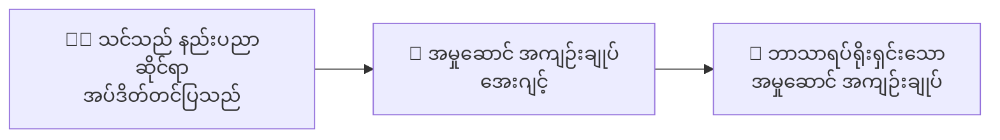

# မော်ဒူး 0 - နိဒါန်း

⏱️ ~10 မိနစ်

> [!WARNING]
> **ကြိုတင်ကြည့်ရှုခြင်းနှင့် အကန့်အသတ်များ။** [Hosted Agents](https://learn.microsoft.com/azure/foundry/agents/concepts/hosted-agents) များသည် ယခုအချိန်တွင် **အများပြည်သူကြိုတင်ကြည့်ရှုခြင်း** အဆင့်တွင်ရှိပြီး အလုပ်လုပ်ဆောင်မှုအတွက် မသင့်တော်ပါ။ အောက်ပါအချက်များကို သိရှိထားပါ။
> - **ထောက်ခံထားသော ဒေသများမှာ ကန့်သတ်ထားသည်** - အရင်းအမြစ်များဖန်တီးမည့်အခါတွင် [ဒေသရနိုင်မှု](https://learn.microsoft.com/azure/foundry/agents/concepts/hosted-agents#region-availability) ကို စစ်ဆေးပါ။ ထောက်ခံမထားသောဒေသကို ရွေးချယ်ပါက တပ်ဆင်မှု မအောင်မြင်ပါ။
> - `azure-ai-agentserver-agentframework` package သည် သိုလှောင်မတိုင်မီ ဗားရှင်းဖြစ်ပြီး API များသည် ဗားရှင်းအလိုက် ပြောင်းလဲနိုင်သည်။
> - အတိုင်းအတာ ကန့်သတ်ချက်များ - hosted agents များသည် 0–5 မိတ္တူများ (scale-to-zero အပါအဝင်) ကို ထောက်ခံသည်။
> - ယခု အလုပ်ရုံဆွေးနွေးပွဲတွင် ပြသထားသော အချို့သော လုပ်ဆောင်ချက်များသည် GA နှင့် ရောက်ရှိလာသည့်အချိန်တွင် ပြောင်းလဲနိုင်ပါသည်။

## သင်တည်ဆောက်မည့်အရာ

ယခု အလုပ်ရုံဆွေးနွေးပွဲတွင် သင်သည် **"ကျွန်တော်/ကျွန်မ အမှုဆောင်အနေဖြင့် ရှင်းပြပါ"** agent တစ်ခုကို တည်ဆောက်မည်ဖြစ်သည်။ ၎င်းသည် ရှုပ်ထွေးသော နည်းပညာဆိုင်ရာ အပ်ဒိတ်များကို ထုတ်ပြန်ပြီး စာရင်းကိုင်အဆင့်အတန်းရှိသူများအတွက် ရိုးရှင်းသေချာသော အင်္ဂလိပ်ဘာသာ အကျဥ်းချုပ်များအဖြစ် ပြန်ရေးပြောပြသည့် hosted AI agent ဖြစ်သည်။

```mermaid
flowchart LR
    A["🧑‍💻 သင်သည် နည်းပညာဆိုင်ရာ\nအပ်ဒိတ်တင်ပြသည်"] --> B["🤖 အမှုဆောင် အကျဉ်းချုပ်\nအေးဂျင့်"]
    B --> C["📝 ဘာသာရပ်ရိုးရှင်းသော\nအမှုဆောင် အကျဉ်းချုပ်"]
```

**Agent သည် အသုံးပြုသည်။**
- **Microsoft Agent Framework** - agent သက်ဆိုင်ရာ လိုဂစ်နှင့် ဖွဲ့စည်းမှုအတွက်
- **Foundry Toolkit for VS Code** - စခန်းတည်ဆောက်ရန်၊ ဒေသခံ စမ်းသပ်ရန် နှင့် တပ်ဆင်ရန်
- **AI မော်ဒယ်တစ်ခု** (ဥပမာ `gpt-4.1-mini/gpt-5-mini`) - အကျဥ်းချုပ်များ ထုတ်လုပ်ရန်

ဤ အလုပ်ရုံဆွေးနွေးပွဲ၏ အဆုံးတွင် သင်တွင် Agent Inspector မှ ဖောင်းပြန်စမ်းသပ်နိုင်သည့် အလုပ်လုပ်သော agent တစ်ခုရှိပြီးလိုလားလျှင် cloud သို့ တပ်ဆင်နိုင်ပါသည်။

---

## Hosted agents ဆိုတာဘာလဲ

**Hosted agent** သည် Microsoft Foundry တွင် စီမံခန့်ခွဲသော ဝန်ဆောင်မှုအဖြစ် လည်ပတ်သော AI agent တစ်ခုဖြစ်သည်။ သင့်အကိုင်အခဲများကို ကိုယ်တိုင်စီမံခန့်ခွဲမှု မလုပ်ဘဲ၊ agent ကုဒ်ကို container ထဲတွင် ထုပ်ပိုးပြီး Foundry သည် တိုင်းတာမှု၊ အိမ်တွင်းနေရာသတ်မှတ်မှုနှင့် HTTP endpoint တစ်ခုဖြင့် ဖော်ပြပေးသည်။

| အယူအဆ | အဓိပ္ပာယ် |
|---------|--------------|
| **Agent** | အသုံးပြုသူ စာတမ်းကို လက်ခံ၍ AI မော်ဒယ်ကို ခေါ်ယူပြီး တင်းမြစ် ပြန်လည်တုံ့ပြန်မှုကို ပေးပို့သော သင့် Python ကုဒ် |
| **Hosted** | Foundry က သင့် container ကို နှင့် ကိုယ်တိုင် ကုန်ကျစရိတ်မရှိဘဲ လည်ပတ်စေသည် - VM မဟုတ်၊ Kubernetes မဟုတ်၊ အကြံပေးနည်းပညာမလိုအပ်ပါ |
| **Responses protocol** | client များသည် agent နှင့် ဆက်သွယ်ရန် ခေါ်နိုင်သော HTTP API ( `POST /responses`) တစ်ခု |
| **Agent Inspector** | ဒေသခံ စမ်းသပ်ရေး UI (Foundry Toolkit ထဲတွင် ပါဝင်ပြီး) agent နှင့် စကားပြောနိုင်သည်။ တပ်ဆင်ရေးမပြုမီ အကြိုစစ်ဆေးရန် |

ယခု အလုပ်ရုံဆွေးနွေးပွဲတွင် သင်သည် ဦးစွာလုံးဝ hosted agent တစ်ခုအဖြစ် တည်ဆောက်နိုင်မည်ဖြစ်ပြီး ဒေသခံ စမ်းသပ်နိုင်ပါသည်။

---

## သင်၏လမ်းကြောင်းရွေးပါ

> ⚠️ **ဆက်လက်မတိုင်မီ လမ်းကြောင်းတစ်ခုကို ရွေးပါ။** သင့်ရွေးချယ်မှုသည် ထည့်သွင်းရန် ကိရိယာများနှင့် စပ်လျဉ်းသော မော်ဒူးများကို သတ်မှတ်ပေးသည်။ စာရင်းသွင်းမှု ရယူပါက လမ်းကြောင်း B မှ A သို့ ပြောင်းလဲနိုင်ပါသည်။

<strong>🅰️ လမ်းကြောင်း A - Azure cloud (Azure စာရင်းသွင်းမှု လိုအပ်သည်)</strong>

| | အသေးစိတ် |
|---|---|
| **ဘယ်သူများအတွက်လဲ?** | သင့်တွင် အသက်သွင်းထားသော Azure စာရင်းရှိပြီး Foundry အရင်းအမြစ်များ ဖန်တီးနိုင်သူ |
| **မော်ဒယ်** | Azure OpenAI ကို Foundry မှတဆင့် (ဥပမာ `gpt-4.1-mini/gpt-5-mini`) |
| **ဖုံးလွှမ်းသော မော်ဒူးများ** | မော်ဒူး 00–07 အထိ အားလုံး |
| **Cloud သို့ တပ်ဆင်မည်လား?** | ✅ ဟုတ်ပါတယ် - အဝင်မှ အထွက်အထိ ပြည့်စုံသော တပ်ဆင်မှု |

<strong>🅱️ လမ်းကြောင်း B - ဒေသခံ / အခမဲ့အဆင့် (Azure စာရင်းသွင်းမှု မလိုအပ်ပါ)</strong>

| | အသေးစိတ် |
|---|---|
| **ဘယ်သူများအတွက်လဲ?** | MVP များ၊ ကျောင်းသားများ၊ သို့မဟုတ် Azure ဝင်ခွင့်မရှိသူများ |
| **မော်ဒယ်** | **Foundry Local** (အခမဲ့၊ သင့်စက်ပေါ်တွင် လည်ပတ်သည်) |
| **ဖုံးလွှမ်းသော မော်ဒူးများ** | မော်ဒူး 00–04 (တပ်ဆင်မှုနှင့် cloud စစ်ဆေးမှု မလိုက်ပါ) |
| **Cloud သို့ တပ်ဆင်မည်လား?** | ❌ မဟုတ်ပါ - Agent Inspector ဖြင့် ဒေသခံ စမ်းသပ်မှုသာ |

---

## လမ်းကြောင်းအားလုံးအတွက် - လိုအပ်သော ကိရိယာများ

အောက်ပါ ကိရိယာအချင်းချင်းကို အပ်ဒိတ်လုပ်ပါ။ ထည့်သွင်းပြီးနောက် စစ်ဆေးရေးအမိန့်ကို အောင်မြင်မှုအမှတ်အသားနှင့် တွက်ချက်ပါ။

| # | ကိရိယာ | ဗားရှင်း | ထည့်သွင်းခြင်း | စစ်ဆေးခြင်း (မျှော်လင့်ထားသော ထွက်ရှိမှု) |
|---|------|---------|---------|---------------------------|
| 1 | **Visual Studio Code** | နောက်ဆုံးဗားရှင်း | [code.visualstudio.com](https://code.visualstudio.com/) | အမှားမရှိဘဲ ဖွင့်ပါသည် |
| 2 | **Python** | 3.12 သို့တက်ရှိ | [python.org/downloads](https://www.python.org/downloads/) | `python --version` → `Python 3.12.x` |
| 3 | **Foundry Toolkit for VS Code** | နောက်ဆုံးဗားရှင်း | Extension ID: `ms-windows-ai-studio.windows-ai-studio` | Foundry အိုင်ကွန်ကို Activity Bar တွင်မြင်ရသည် |
| 4 | **Python extension for VS Code** | နောက်ဆုံးဗားရှင်း | Extension ID: `ms-python.python` | Extensions panel တွင် ထည့်သွင်းပြီး |

> [!TIP]
> **ထည့်သွင်းရာတွင် အကြံဉာဏ်များ။**
> - **Python PATH (Windows):** Python ထည့်သွင်းရေးအစီအစဉ်၏ ပထမတစ်မျက်နှာတွင် **"Add Python to PATH"** ကို အမြဲစစ်ဆေးပါ။ မရှိပါက terminal တွင် `python` ကို မှတ်မိမရပါ။
> - **Python ဗားရှင်းများ များစွာရှိခြင်း:** Python 3.10 နှင့် 3.12 နှစ်ခုလုံး ထည့်သွင်းထားပါက `python3.12 -m venv .venv` ကို အသုံးပြု၍ virtual environment အတွက် မှန်ကန်တဲ့ဗားရှင်းကို အသုံးပြုပါ။
> - **Docker WSL 2 (Windows):** Docker Desktop ထည့်သွင်းစဉ်တွင် **WSL 2 backend** ကို ရွေးချယ်ထားပါ။ Hyper-V ဖြင့် Docker သည် သေးငယ်ပြီး Foundry container တည်ဆောက်မှုတွင် ပြဿနာ ဖြစ်နိုင်သည်။
> - **Docker မစတင်ပါက?** Docker Desktop ဖွင့်ပြီး ၃၀–၆၀ စက္ကန့်စောင့်ပါ။ `docker info` ကို ပြေးနှိပ်ပါ - "Cannot connect to the Docker daemon" ဟုပြသပါက Docker သည် အစောပိုင်း အဆင့်တွင်ရှိသည်။
> - **VS Code extensions မဖွင့်ပါက?** extensions ထည့်သွင်းပြီးနောက် `Ctrl+Shift+P` → `Developer: Reload Window` ဖြင့် ပြန်လည်ဖွင့်ပါ။

> **Windows အသုံးပြုသူများအတွက်:** Python ထည့်သွင်းသည်မှာ **"Add Python to PATH"** ကို စစ်ဆေးပါ။

**နောက်တစ်ခု:** [01 - Setup →](01-setup.md)

---

<!-- CO-OP TRANSLATOR DISCLAIMER START -->
**ပြောကြားချက်**
ဤစာတမ်းကို AI ဘာသာပြန်ဝန်ဆောင်မှု [Co-op Translator](https://github.com/Azure/co-op-translator) အသုံးပြု၍ ဘာသာပြန်ထားပါသည်။ ကျွန်ုပ်တို့သည် တိကျမှန်ကန်မှုအတွက် ကြိုးပမ်းနေသော်လည်း၊ စက်ကိရိယာဘာသာပြန်ခြင်းများတွင် အမှားများ သို့မဟုတ် မှားယွင်းချက်များ ပါဝင်နိုင်ကြောင်း သတိပြုပါရန် လိုအပ်ပါသည်။ မူလစာတမ်းကို မူရင်းဘာသာဖြင့်သာ ယုံကြည်စိတ်ချရသော အချက်အလက်အဖြစ် သတ်မှတ်သင့်သည်။ အရေးကြီးသည့် သတင်းအချက်အလက်များအတွက် ပရော်ဖက်ရှင်နယ် လူသားဘာသာပြန်သူဝန်ဆောင်မှုကို အကြံပြုပါသည်။ ဤဘာသာပြန်ချက်ကို အသုံးပြုခြင်းမှ ဖြစ်ပေါ်လာသော နားလည်မှုကွာခြားမှုများ သို့မဟုတ် မမှန်ကန်သော အသုံးပြုမှုများအတွက် ကျွန်ုပ်တို့ တာဝန်မခံပါ။
<!-- CO-OP TRANSLATOR DISCLAIMER END -->