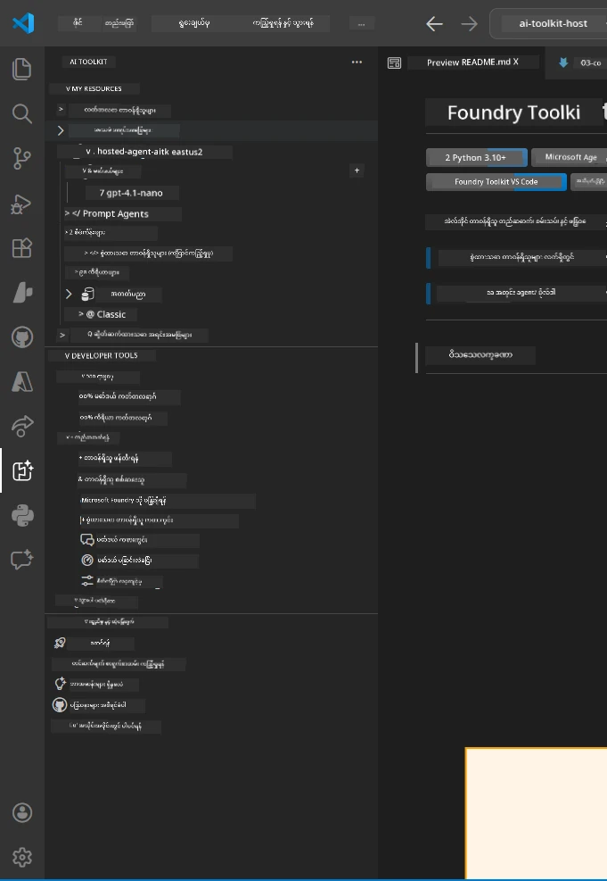
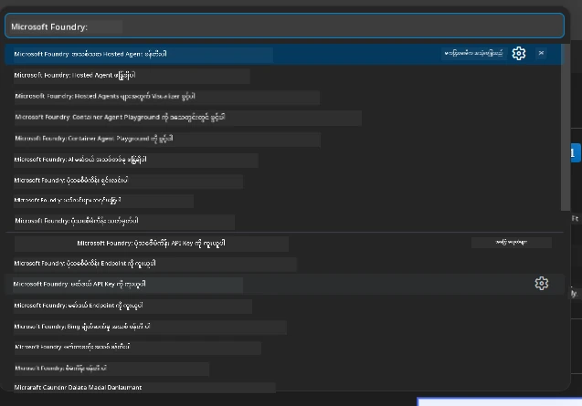

# Module 1 - Install Foundry Toolkit & Foundry Extension

ဤ module သည် ဤ workshop အတွက် အဓိကဖြစ်သော VS Code extensions နှစ်ခုကို 설치ခြင်းနှင့် အတည်ပြုခြင်းလုပ်ငန်းစဉ်ကို လမ်းညွန်ပေးပါသည်။ သင်သည် [Module 0](00-prerequisites.md) တွင် သွင်းပြီးသားဖြစ်ပါက၊ ဤ module ကို လုပ်ဆောင်ခြင်းဖြင့် ထို extension များမှန်ကန်စွာ လည်ပတ်နေကြောင်း အတည်ပြုနိုင်ပါသည်။

---

## Step 1: Install the Microsoft Foundry Extension

**Microsoft Foundry for VS Code** extension သည် Foundry project များဖန်တီးခြင်း၊ မော်ဒယ်များ ထည့်သွင်းခြင်း၊ hosted agent များ scaffolding ပြုလုပ်ခြင်းနှင့် VS Code မှတိုက်ရိုက် deploy ပြုလုပ်ခြင်းတို့အတွက် မူလတည့်သောကိရိယာဖြစ်သည်။

1. VS Code ကို ဖွင့်ပါ။
2. `Ctrl+Shift+X` ကို နှိပ်၍ **Extensions** panel ကို ဖွင့်ပါ။
3. အထက်ရှိ ရှာဖွေမှုဘောက်စ်တွင် **Microsoft Foundry** ဟု ရိုက်ထည့်ပါ။
4. **Microsoft Foundry for Visual Studio Code** ဟူသော ရလဒ်ကို ရှာပါ။
   - Publisher: **Microsoft**
   - Extension ID: `TeamsDevApp.vscode-ai-foundry`
5. **Install** ခလုတ်ကိုနှိပ်ပါ။
6. 설치ပြီးဆုံးသည်နှင့်အတူ (လွယ်ကူသော တိုးတက်မှုညွှန်ပြချက် တစ်ချက်ကို တွေ့ရပါမည်) စောင့်ဆိုင်းပါ။
7. 설치ပြီးဆုံးသည်နှင့်အတူ VS Code ၏ ဘယ်ဖက်ကမ်းလှမ်းနေသော **Activity Bar** တွင် **Microsoft Foundry** အိုင်ကွန်အသစ် (သားရတနာ/AI အိုင်ကွန်ကဲ့သို့) ကို တွေ့ရပါမည်။
8. **Microsoft Foundry** အိုင်ကွန်ကို နှိပ်၍ ၎င်း၏ sidebar မျက်နှာပြင်ကို ဖွင့်ပါ။ ဤတွင် အောက်ပါအစိတ်အပိုင်းများကို တွေ့ရပါမည်-
   - **Resources** (သို့မဟုတ် Projects)
   - **Agents**
   - **Models**

> **အိုင်ကွန်း မပေါ်ပါက:** VS Code ကို ပြန်လည်မှီတက်ပါ (`Ctrl+Shift+P` → `Developer: Reload Window`) ကို အသုံးပြုကြည့်ပါ။

---

## Step 2: Install the Foundry Toolkit Extension

**Foundry Toolkit** extension သည် [**Agent Inspector**](https://learn.microsoft.com/azure/foundry/agents/how-to/vs-code-agents-workflow-pro-code) ကို ထောက်ပံ့ပေးပြီး၊ agent များကို ဒေသစိတ်စစ်ဆေးစမ်းသပ်ခြင်း၊ debug လုပ်ခြင်းအတွက် visual interface၊ playground, မော်ဒယ်စီမံခန့်ခွဲခြင်းနှင့် အကဲဖြတ်ကိရိယာများကို ပါဝင်ပေးသည်။

1. Extensions panel (`Ctrl+Shift+X`) တွင် ရှာဖွေမှုဘောက်စ်ကို ဖယ်ရှားပြီး **Foundry Toolkit** ဟု ရိုက်ထည့်ပါ။
2. ရလဒ်ထဲမှ **Foundry Toolkit** ကို ရှာဖွေပါ။
   - Publisher: **Microsoft**
   - Extension ID: `ms-windows-ai-studio.windows-ai-studio`
3. **Install** ကို နှိပ်ပါ။
4. 설치ပြီးဆုံးသည်နှင့်အတူ **Activity Bar** တွင် **Foundry Toolkit** အိုင်ကွန် (ရုပ်သုံးရိုဘော့/တောက်ပသည့်အိုင်ကွန်) ပေါ်လာပါမည်။
5. **Foundry Toolkit** အိုင်ကွန်ကို နှိပ်ပြီး sidebar မျက်နှာပြင်ကို ဖွင့်ပါ။ Foundry Toolkit ၏ အကြိုဆိုမက်ဆေ့ ၊ options များအဖြစ်-
   - **Models**
   - **Playground**
   - **Agents**

---

## Step 3: Verify both extensions are working

### 3.1 Verify Microsoft Foundry Extension

1. Activity Bar တွင် **Microsoft Foundry** အိုင်ကွန်ကို နှိပ်ပါ။
2. သင်သည် Azure တွင် ဝင်ရောက်ထားပြီး (Module 0 မှ) ဖြစ်လျှင် **Resources** အောက်တွင် သင်၏ project များကို မြင်ရပါမည်။
3. အကောင့်ဝင်ရန် မေးခြင်းဖြစ်ပါက **Sign in** ကို နှိပ်ပြီး အတည်ပြုခြင်း လမ်းကြောင်းအတိုင်း လိုက်နာပါ။
4. sidebar ကို အမှားမရှိဘဲ မြင်ရနိုင်ခြင်းကို အတည်ပြုပါ။

### 3.2 Verify Foundry Toolkit Extension

1. Activity Bar တွင် **Foundry Toolkit** အိုင်ကွန်ကို နှိပ်ပါ။
2. ကြိုဆိုသော view သို့မဟုတ် အဓိက panel သည် အမှားမရှိဘဲ ဖွင့်နိုင်ခြင်းကို အတည်ပြုပါ။
3. မည်သည့် ပြင်ဆင်မှုမပြုလုပ်သေးပါက အခုလို သုံးစွဲရန် မလိုအပ်ပါ - [Module 5](05-test-locally.md) တွင် Agent Inspector ကို အသုံးပြုမည်ဖြစ်သည်။

### 3.3 Verify via Command Palette

1. `Ctrl+Shift+P` ကို နှိပ်၍ Command Palette ကို ဖွင့်ပါ။
2. **"Microsoft Foundry"** ဟူ၍ရိုက်ထည့်ပါ - အောက်ပါ command များကို မြင်ရပါမည်-
   - `Microsoft Foundry: Create a New Hosted Agent`
   - `Microsoft Foundry: Deploy Hosted Agent`
   - `Microsoft Foundry: Open Model Catalog`
3. Command Palette ကို ပိတ်ရန် `Escape` ကိုနှိပ်ပါ။
4. Command Palette မှ ပြန်ဖွင့်ပြီး **"Foundry Toolkit"** ဟူ၍ ရိုက်ထည့်ပါ - အောက်ပါ command များကို မြင်ရပါမည်-
   - `Foundry Toolkit: Open Agent Inspector`

> ဤ command များမမြင်ရပါက၊ extension များ မမှန်ကန်စွာ သွင်းထားခြင်းဖြစ်နိုင်သည်။ uninstall ပြီး ထပ်မံ install ပြုလုပ်ကြည့်ပါ။

---

## What these extensions do in this workshop

| Extension | What it does | When you'll use it |
|-----------|-------------|-------------------|
| **Microsoft Foundry for VS Code** | Foundry project များ ဖန်တီးခြင်း၊ မော်ဒယ်များ ထည့်သွင်းခြင်း၊ **[hosted agents](https://learn.microsoft.com/azure/foundry/agents/concepts/hosted-agents)** ကို scaffolding (auto-generates `agent.yaml`, `main.py`, `Dockerfile`, `requirements.txt`), [Foundry Agent Service](https://learn.microsoft.com/azure/foundry/agents/overview) သို့ deploy ပြုလုပ်ခြင်း | Modules 2, 3, 6, 7 |
| **Foundry Toolkit** | ဒေသစိတ် စစ်ဆေးခြင်းနှင့် debug အတွက် Agent Inspector, playground UI, မော်ဒယ် စီမံခန့်ခွဲခြင်း | Modules 5, 7 |

> **Foundry extension သည် ဤ workshop တွင် အရေးပါသော ကိရိယာဖြစ်ပါသည်။** ၎င်းသည် တစ်စိတ်တစ်ပိုင်းမှစ၍ အဆုံးသတ်အထိ ဝေလ်ဒ်ရှေ့ပြေး အဖြစ် scaffold → configure → deploy → verify ကို လုပ်ဆောင်ပေးပါသည်။ Foundry Toolkit သည် ဒေသစိတ် စစ်ဆေးခြင်းအတွက် visual Agent Inspector ကို ထောက်ပံ့ပေးသည်။

---

### Checkpoint

- [ ] Microsoft Foundry အိုင်ကွန်သည် Activity Bar တွင် မြင်နိုင်သည်
- [ ] အိုင်ကွန်ကို နှိပ်၍ sidebar ကို အမှားမရှိဘဲ ဖွင့်နိုင်သည်
- [ ] Foundry Toolkit အိုင်ကွန်သည် Activity Bar တွင် မြင်နိုင်သည်
- [ ] အိုင်ကွန်ကို နှိပ်၍ sidebar ကို အမှားမရှိဘဲ ဖွင့်နိုင်သည်
- [ ] `Ctrl+Shift+P` → "Microsoft Foundry" ဟု ရိုက်၍ ရနိုင်သည့် command များကို မြင်နိုင်သည်
- [ ] `Ctrl+Shift+P` → "Foundry Toolkit" ဟု ရိုက်၍ ရနိုင်သည့် command များကို မြင်နိုင်သည်

---

**Previous:** [00 - Prerequisites](00-prerequisites.md) · **Next:** [02 - Create Foundry Project →](02-create-foundry-project.md)

---

<!-- CO-OP TRANSLATOR DISCLAIMER START -->
**နိဒါန်းချက်**:  
ဤစာတမ်းကို AI ဘာသာပြန်ခြင်းဝန်ဆောင်မှု [Co-op Translator](https://github.com/Azure/co-op-translator) အသုံးပြု၍ ဘာသာပြန်ထားပါသည်။ တိကျမှုအတွက် ကြိုးပမ်းထားသော်လည်း၊ စက်အလိုအလျောက်ဘာသာပြန်ခြင်းတွင် အမှားများ သို့မဟုတ် တိကျမှုလျော့နည်းမှုများ ဖြစ်ပေါ်နိုင်ကြောင်း သတိပြုပါရန်။ မူရင်းစာတမ်းကို မိခင်ဘာသာဖြင့် ကိုးကားထားသည့်အဖြစ်မှန်အရင်းအမြစ်အဖြစ် သတ်မှတ်သင့်ပါသည်။ အရေးကြီးသော သတင်းအချက်အလက်များအတွက် မူရင်းလူ့ဘာသာပြန်ခြင်းကို အကြံပြုပါသည်။ ဤဘာသာပြန်မှုအသုံးပြုမှုမှ အကြောင်းအမျိုးမျိုးကြောင့် ဖြစ်ပေါ်နိုင်သော မှားနားချက်များ သို့မဟုတ် မသေချာမှုများအတွက် ကျွန်ုပ်တို့သည် တာဝန်မထမ်းဆောင်ပါ။
<!-- CO-OP TRANSLATOR DISCLAIMER END -->