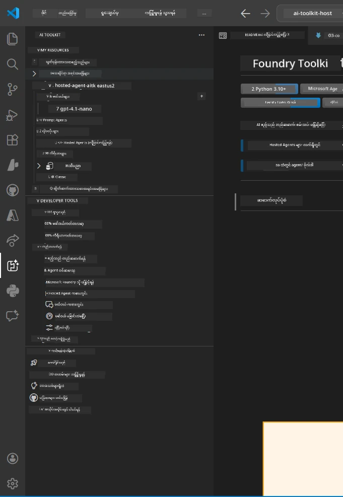
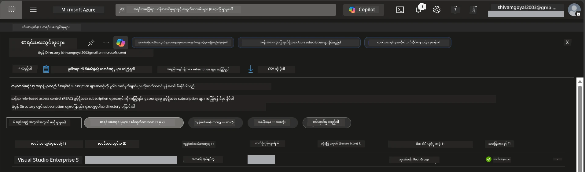
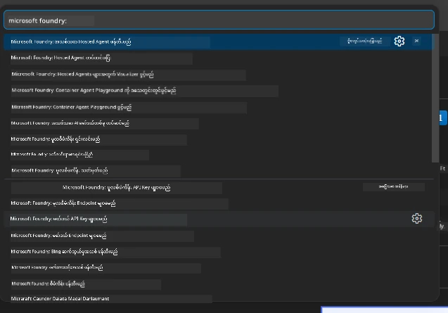
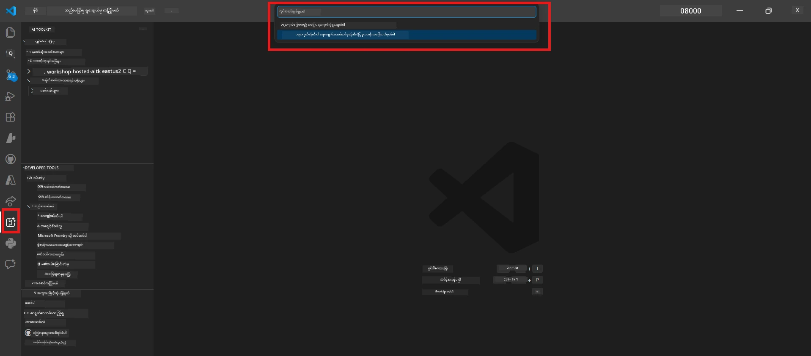
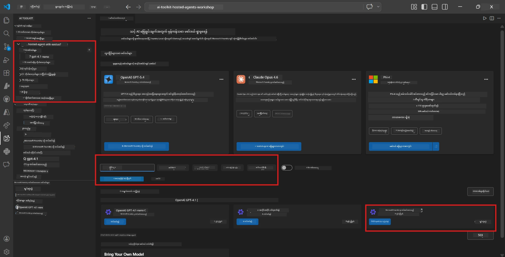
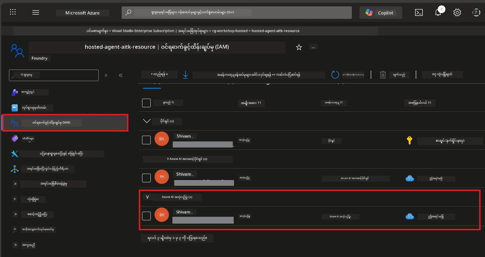

# ရှိပ်ဆက်ချက် - ပိုမိုချဲ့ထွင်မှု၊ စီမံကိန်းနှင့် မော်ဒယ်

⏱️ ~15 မိနစ်

ဤမော်ဂျူးတွင် သင်သည် Foundry Toolkit ချဲ့ထွင်မှုကို 설치ပြီး အတည်ပြုကာ Foundry စီမံကိန်းအသစ်တစ်ခုကို ဖန်တီး (သို့မဟုတ် ချိတ်ဆက်) ပြီး သင်၏ဧရိယာမှ အကူအညီပြုမည့် မော်ဒယ်ကို တပ်ဆင်ပါမည်။

## အဆင့် ၁ - Foundry Toolkit ကို 설치ပါ

**VS Code အတွက် Foundry Toolkit** သည် ဤအလုပ်ရုံဆွေးနွေးမှုအတွက် အဓိကချဲ့ထွင်မှုဖြစ်သည်။ ၎င်းသည် စီမံကိန်းဖန်တီးခြင်း၊ မော်ဒယ်တပ်ဆင်ခြင်း၊ ဧရိယာဆောက်လုပ်ခြင်း၊ ဒေသတွင်း စမ်းသပ်ခြင်း (Agent Inspector) နှင့် မိုးကန်းတင်ခြင်းအား VS Code မှ တစ်ဆင့် ဆောင်ရွက်နိုင်စေသည်။

1. VS Code ကိုဖွင့်ပြီး `Ctrl+Shift+X` ကိုနှိပ်၍ **Extensions** panel ကို ဖွင့်ပါ။
2. **Foundry Toolkit** ရှာပါ။
3. **Foundry Toolkit for VS Code** (Publisher: Microsoft, ID: `ms-windows-ai-studio.windows-ai-studio`) ကို 설치ပါ။
4. 설치ပြီးနောက်၊ **Foundry Toolkit** သင်အိုင်ကွန်သည် Activity Bar (ဘယ်ဘက် Sidebar) တွင် ပေါ်လာပါမည်။

> *မှတ်ချက်: Activity Bar သည် အဟောင်းချဲ့ထွင်မှုဗားရှင်းများတွင် "AI TOOLKIT" ဟုပြသနိုင်သည်။ လုပ်ဆောင်ချက်များမှာ တူညီသည်။*



## အဆင့် ၂ - သင့်ဝင်ရောက်ခွင့်အခြေအနေအပေါ်မူတည်၍ ပြင်ဆင်ခြင်း

> **သင်၏လမ်းကြောင်းကို ရွေးချယ်ပါ။** သင့်အတွက် ကိုက်ညီသည့်အပိုင်းကို ဖွင့်ပါ။ သင်သည် **တစ်ခုသာ** ပြီးမြောက်ရန်လိုအပ်သည်။

<details>
<summary><strong>🅰️ လမ်းကြောင်း A - Azure cloud (Azure subscription လိုအပ်ပါသည်)</strong></summary>

### Azure CLI

1. [learn.microsoft.com/cli/azure/install-azure-cli](https://learn.microsoft.com/cli/azure/install-azure-cli) မှ 설치ပါ။
2. စိစစ်ရန်: `az --version` (2.80.0+ ဖြစ်စေရန် မျှော်မှန်းပါ)။
3. လက်မှတ်ဝင်ရန်: `az login`

### အတည်ပြုမှုရွေးချယ်စရာများ

[Microsoft Agent Framework](https://learn.microsoft.com/agent-framework/overview/) သည် [`DefaultAzureCredential`](https://learn.microsoft.com/azure/developer/python/sdk/authentication/credential-chains#defaultazurecredential-overview) ကို အသုံးပြုပြီး အတည်ပြုခြင်းနည်းလမ်းများစွာကို အဓိကအစဉ်လိုက်စမ်းသပ်သည်။ သင်၏ပတ်ဝန်းကျင်နှင့် ကိုက်ညီသောနည်းလမ်းကို ရွေးချယ်ပါ။

#### ရွေးချယ်စရာ ၁ - VS Code အကောင့်များ (အလုပ်ရုံဆွေးနွေးမှုအတွက် အကြံပြု)
1. VS Code ၏ ဘယ်အောက်ခြေတွင် တည်ရှိသော **Accounts** သင်္ကေတ (လူပုံစံ) ကို နှိပ်ပါ။
2. **Microsoft Foundry အသုံးပြုရန် လက်မှတ်ဝင်ရန်** (သို့မဟုတ် **Azure ဖြင့် လက်မှတ်ဝင်ရန်**) ကို ရွေးချယ်ပါ။
3. ဘွက်ဇာတစ်ခု ဖွင့်ပြီး သင့် Azure အကောင့်ဖြင့် လက်မှတ်ဝင်ပါ။
4. VS Code သို့ ပြန်ရောက်ပါ။ သင့်အကောင့်အမည်သည် ဘယ်အောက်ခြေလည်းမြင်ရမည်။

#### ရွေးချယ်စရာ ၂: Azure CLI
```bash
az login
az account set --subscription "<your-subscription-id>"
```

#### ရွေးချယ်စရာ ၃: Service Principal (လုပ်ငန်းတို/CI)
လုံခြုံစိတ်ချရသောပတ်ဝန်းကျင်များ သို့မဟုတ် CI/CD pipeline များအတွက်၊ `.env` ဖိုင်တွင် ရှိသည့် ပတ်ဝန်းကျင်အပြောင်းအလဲများကို သတ်မှတ်ပါ။
```env
AZURE_TENANT_ID=<your-tenant-id>
AZURE_CLIENT_ID=<your-client-id>
AZURE_CLIENT_SECRET=<your-client-secret>
```

> **`DefaultAzureCredential` ၏ လုပ်ဆောင်ပုံ:** ပတ်ဝန်းကျင်အပြောင်းအလဲများကို ပထမဦးဆုံးစမ်းသပ်ပြီး ထို့နောက် managed identity၊ VS Code မှ လက်မှတ်ဝင်ခြင်း၊ Azure CLI တို့ဖြင့် အောင်မြင်သောနည်းလမ်းကိုအသုံးပြုသည်။ [credential chain စာတမ်းများ](https://learn.microsoft.com/azure/developer/python/sdk/authentication/credential-chains#defaultazurecredential-overview) ကြည့်ပါ။

### Azure Developer CLI (azd)

1. 설치: `winget install microsoft.azd` (Windows) သို့မဟုတ် [install docs](https://learn.microsoft.com/azure/developer/azure-developer-cli/install-azd) ကိုကြည့်ပါ။
2. စိစစ်ရန်: `azd version`
3. လက်မှတ်ဝင်ရန်: `azd auth login`

### Docker Desktop (ဆန္ဒအရ)

ဒေါ်ကာ သည် ဒေသတွင်းဖန်တီးမှုအတွက်သာ လိုအပ်သည်။ Foundry ချဲ့ထွင်မှုသည် Deployment အတွင်း၌ အလိုအလျောက် ဖန်တီးမှုများကို ကိုင်တွယ်ပေးသည်။

1. [docs.docker.com/get-docker](https://docs.docker.com/get-docker/) မှ 설치ပါ။
2. စစ်ဆေးရန်: `docker info`

### Azure subscription နှင့် RBAC

1. [portal.azure.com](https://portal.azure.com) တွင် လက်မှတ်ဝင်ပါ။
2. **Subscriptions** သို့ သွားပြီး အနည်းဆုံး တစ်ခုမှာ **Active** ဖြစ်ပြီးကြောင်း သေချာပါစေ။
3. သင့် **Subscription ID** ကို မှတ်ထားပါ - Module 01 တွင် လိုအပ်ပါမည်။



#### RBAC ဖြစ်စဉ်ဇယား

[Hosted Agent](https://learn.microsoft.com/azure/foundry/agents/concepts/hosted-agents) တပ်ဆင်ခြင်းအတွက် Azure ရဲ့ `Owner` နှင့် `Contributor` အခန်းကဏ္ဍများ၌ မပါဝင်သော **data action** ခွင့်များ လိုအပ်ပါသည်။ အောက်ပါဇယားတွင် လိုအပ်သည့် အခန်းကဏ္ဍများကို ကြည့်ပါ။

| ဖြစ်စဉ် | လိုအပ်သော အခန်းကဏ္ဍများ | ဘယ်မှာ ပေးသင့်သည်ဟု ဆိုသည် |
|----------|---------------|----------------------|
| Foundry စီမံကိန်း အသစ် ဖန်တီးခြင်း | **Azure AI Owner** (Foundry resource) | Azure Portal တွင် Foundry resource |
| ရှိပြီးသား စီမံကိန်းသို့ တပ်ဆင်ခြင်း (အသစ်သော resource များ) | **Azure AI Owner** + **Contributor** (subscription) | Subscription နှင့် Foundry resource |
| ပြီးပြည့်စုံစွာ ဖွဲ့စည်းပြီး စီမံကိန်း | **Reader** (အကောင့်) + **Azure AI User** (စီမံကိန်း) | အကောင့်နှင့် စီမံကိန်း Azure Portal မှာ |
| ဒေသတွင်း စမ်းသပ်ခြင်းသာ (တပ်ဆင်ခြင်း မရှိ) | **Azure AI User** (စီမံကိန်း) | Azure Portal မှ စီမံကိန်း |

> **အချက်အလက် အရေးကြီးချက်** - Azure `Owner` နှင့် `Contributor` များသည် *စီမံခန့်ခွဲမှု* ခွင့်များသာ ပေးသည်။ *data action* များ (ဥပမာ `agents/write`) အတွက် [**Azure AI User**](https://learn.microsoft.com/azure/foundry/concepts/rbac-foundry#built-in-roles) (သို့မဟုတ် အထက်တန်း) လိုအပ်သည်။

## Foundry စီမံကိန်းကို ချိတ်ဆက် (သို့) ဖန်တီးပါ



1. `Ctrl+Shift+P` ကို နှိပ်ပြီး **Foundry Toolkit: Create Project** ကို ရိုက်ထည့် → ရွေးချယ်ပါ။
2. **Azure subscription** ကို dropdown မှ ရွေးချယ်ပါ။
3. **resource group** တစ်ခု ရွေးချယ် (ဥပမာ `rg-hosted-agents-workshop`) (သို့) ဖန်တီးပါ။
4. hosted agents ကို ထောက်ပံ့ပေးသော **ဒေသ** တစ်ခုကို ရွေးချယ်ပါ - `East US`, `West US 2` သို့မဟုတ် `Sweden Central` ဖြစ်နိုင်သည်။ [ဒေသရရှိနိုင်မှု](https://learn.microsoft.com/azure/foundry/agents/concepts/hosted-agents#region-availability) ကြည့်ပါ။
5. စီမံကိန်းအမည်ကို ထည့်ပါ (ဥပမာ `workshop-agents`)။
6. စီမံကိန်းဖန်တီးခြင်းကို 2–5 မိနစ် စောင့်ပါ။ VS Code တွင် တိုးတက်မှုအသိပေးချက်ႀကော်ငြာပေါ်ပါမည်။
7. ပြီးဆုံးလျှင် သင့်စီမံကိန်းသည် **Foundry Toolkit** sidebar ထဲမှ **MY RESOURCES** အောက်တွင် ဖော်ပြပါမည်။



## မော်ဒယ်တပ်ဆင်ခြင်းနှင့် RBAC ပေးသတ်ခြင်း

သင့် hosted agent သည် ရိုက်ပြန်မှုများ ဖန်တီးရန် AI မော်ဒယ် တစ်ခု လိုအပ်သည်။

#### မော်ဒယ် ရွေးချယ်မှု ဇယား
သင့်လိုအပ်ချက်ပေါ် မူတည်၍ မော်ဒယ် အဆင့်အတန်းများမှ ရွေးချယ်နိုင်သည်။

| မော်ဒယ် | အကောင်းဆုံးအသုံးပြုမှု | ကုန်ကျစရိတ် | မှတ်ချက်များ |
|-------|----------|------|-------|
| `gpt-4.1` | အရည်အသွေးမြင့်၍ ကြောင်းရဲ့ နက်နဲသော တုံ့ပြန်မှုများ | မြင့်မား | အကောင်းဆုံးအဖြေများ၊ နောက်ဆုံး စမ်းသပ်မှုအတွက် အကြံပြုသည် |
| `gpt-4.1-mini/gpt-5-mini` | မြန်ဆန်သော ထပ်တိုးချက်များ၊ ကုန်ကျစရိတ်နည်း | နည်း | အလုပ်ရုံဖွင့်ရန်နှင့် မြန်ဆန်သောစမ်းသပ်မှုအတွက် သင့်တော်သည် |
| `gpt-4.1-nano` | အလင်းချိန်အလုပ်များ | အလွန်နည်း | ကုန်ကျစရိတ်သက်သာဆုံး၊ သို့သော် ရိုးရှင်းသောတုံ့ပြန်မှုများ |

1. `Ctrl+Shift+P` ကို နှိပ်ပြီး **Foundry Toolkit: Open Model Catalog** ကို ရိုက်ထည့်ရန် (သို့မဟုတ် DEVELOPER TOOLS မှ Model Catalog ကို sidebar တွင် နှိပ်ပါ)
2. catalog ထဲတွင် **gpt-4.1** ရှာပါ။
3. **OpenAI GPT-4.1-mini** (သို့မဟုတ် အရည်အသွေးကောင်းသော `gpt-5-mini`) ကို ရွေးပြီး **Deploy** ကိုနှိပ်ပါ။



4. တပ်ဆင်မှုပြင်ဆင်မှုတွင် -
   - **Deployment name:** ပုံမှန်ကိုတန်ထားပါ သို့မဟုတ် ပုဂ္ဂိုလ်ရေးအမည်ထည့်ပါ။ **ဤအမည်ကို မှတ်ထားပါ။**
   - **Target:** **Deploy to Foundry Toolkit** ကိုရွေးပြီး သင့်စီမံကိန်းကို ရွေးချယ်ပါ။
5. **Deploy** ကိုနှိပ်ပြီး 1–3 မိနစ် စောင့်ပါ။

> **အကြံပြုချက်:** အလုပ်ရုံအတွက် `gpt-4.1-mini/gpt-5-mini` ကို အသုံးပြုပါ - မြန်ဆန်၊ သက်သာပြီး ကောင်းမွန်သောအဖြေများထွက်ရှိသည်။

### သင်၏တန်ဖိုးများကို မှတ်သားပါ

တပ်ဆင်ပြီးနောက်၊ ဤတန်ဖိုးနှစ်ခုကို မှတ်သားပါ (Module 03 တွင် လိုအပ်ပါမည်)။

| တန်ဖိုး | ဘယ်မှာ တွေ့နိုင်မလဲ |
|-------|-----------------|
| **Project endpoint** | Sidebar မှ သင့်စီမံကိန်းကိုနှိပ်ပါ → အသေးစိတ် ကြည့်ရန် URL ပြပါမည် (ဥပမာ `https://<account>.services.ai.azure.com/api/projects/<project>`) |
| **Model deployment name** | စီမံကိန်းကို ဖြန့်ချိပြီး → **Models** → တပ်ဆင်ထားသည့် မော်ဒယ်နာမည် (ဥပမာ `gpt-4.1-mini/gpt-5-mini`) |

### RBAC အခန်းကဏ္ဍ ပေးပါ

> ⚠️ **ဤအဆင့်ကို များစွာပျက်ကွက်လေ့ရှိသည်။** မှန်ကန်သော အခန်းကဏ္ဍ မရှိပါက Module 05 ၏ တပ်ဆင်မှု မအောင်မြင်ပါ။

#### ငါ့အတွက် မည်သည့်အခန်းကဏ္ဍလိုအပ်သလဲ?
သင့်ဖြစ်စဉ်အပေါ် မူတည်၍ အောက်တွင်ပါတဲ့ အခန်းကဏ္ဍပေါင်းများစွာ လိုအပ်ပါသည်။

| ဖြစ်စဉ် | လိုအပ်သော အခန်းကဏ္ဍများ | ဘယ်မှာ ပေးသင့်သည်ဟု ဆိုသည် |
|----------|---------------|----------------------|
| Foundry စီမံကိန်း အသစ် ဖန်တီးခြင်း | **Azure AI Owner** (Foundry resource) | Azure Portal တွင် Foundry resource |
| ရှိပြီးသား စီမံကိန်းသို့ တပ်ဆင်ခြင်း (အသစ်သော resource များ) | **Azure AI Owner** + **Contributor** (subscription) | Subscription နှင့် Foundry resource |
| ပြီးပြည့်စုံစွာ ဖွဲ့စည်းပြီး စီမံကိန်း | **Reader** (အကောင့်) + **Azure AI User** (စီမံကိန်း) | အကောင့်နှင့် စီမံကိန်း Azure Portal မှာ |

**အချက်အလက် အရေးကြီးချက် -** Azure `Owner` နဲ့ `Contributor` ဟာ စီမံခန့်ခွဲမှုခွင့်တွေကိုသာ ပေးတဲ့အတွက် *data action* များအတွက် (ဥပမာ `agents/write`) **Azure AI User** (သို့မဟုတ် အထက်တန်း) ကပို လိုအပ်ပါတယ်။

1. [portal.azure.com](https://portal.azure.com) ကိုဖွင့်ပါ။
2. သင့် **Foundry စီမံကိန်း** အမည်ကို ရှာပြီး အမျိုးအစား **"Foundry Toolkit project"** (အကောင့်မဟုတ်ပါ) ကို နှိပ်ပါ။
3. ဘယ်သို့တည်ရှိသော **Access control (IAM)** ကို နှိပ်ပါ။
4. **+ Add** ကိုနှိပ်ပြီး **Add role assignment** ကို ရွေးပါ။
5. **Role tab:** **Azure AI User** ကို ရှာပြီး ရွေးချယ်၊ **Next** ကိုနှိပ်ပါ။
6. **Members tab:** **User, group, or service principal** ကို ရွေးပြီး **+ Select members** ကို နှိပ်ကာ အကြောင်းပြန်ရှာပြီး ရွေးပါ → **Select** ကိုနှိပ်ပါ။
7. **Review + assign** ကို နှိပ်ပြီး ပြန်လည် နှိပ်ပါ။
8. တပ်ဆင်မှု ပြန်လည် ပျံ့နှံ့မှုအတွက် **1–2 မိနစ်** ကြာ အသေးစိတ်စောင့်ပါ။

> **ဘာကြောင့် ဤအခန်းကဏ္ဍလဲ?** Azure `Owner`/`Contributor` သည် စီမံခန့်ခွဲမှု ခွင့်များသာ ပေးသည်။ **Azure AI User** သည် `agents/write` data action ကို ဆောင်ရွက်ရန် အသုံးပြု၍ agent များဖန်တီးရန် နှင့် တပ်ဆင်ရန်လိုအပ်သည်။ [Foundry RBAC စာတမ်းများ](https://learn.microsoft.com/azure/foundry/concepts/rbac-foundry#built-in-roles) ကြည့်ပါ။



</details>

<details>
<summary><strong>🅱️ လမ်းကြောင်း B - ဒေသတွင်း / အခမဲ့ (Azure subscription မလိုအပ်ပါ)</strong></summary>

### Foundry Local

Foundry Local သည် သင်၏ကိုယ်ပိုင်စက်တွင် AI မော်ဒယ်များကို အလုပ်လုပ်စေသည် - မိုးကန်းအကောင့်မလိုအပ်ပါ။ Foundry Toolkit မှ မော်ဒယ် catalog ဖြင့် Foundry Local မော်ဒယ်များကို အသုံးပြုနိုင်ပါသည်။

1. Foundry Toolkit ချဲ့ထွင်မှုသို့ သွားပါ။
2. Foundry Toolkit navigation တွင် **Developer Tools** > **Model Catalog** ကို ရွေးချယ်ပါ။
3. အသစ် ဖွင့်သောပြတင်းပေါ်တွင် navigation ဘားထဲမှ **local** ကို ရွေးချယ်ပါ။
4. **Phi 4 Mini** သို့ ဆိပ်ကမ်းကို ချပြပြီး **add button** ကို နှိပ်ပါ၊ တစ်ခုတည်းသော စာရင်းတွင် မော်ဒယ် ဒေါင်းလုပ်ဆွဲနေသောပြမြင်ရန် ပေါ်လာမည်။
5. မော်ဒယ် ဒေါင်းလုပ်ပြီးဆုံးမှ နောက်အဆင့်သို့ ဆက်လက်ရွေ့ပါ။

</details>

### ✅ စစ်ဆေးချက်


- [ ] `Ctrl+Shift+P` → "Foundry Toolkit" တွင် ရရှိနိုင်သော command များ ပြသသည်။
- [ ] Foundry Toolkit ချဲ့ထွင်မှု 설치ပြီး Sidebar မှားအားမရှိစွာ ဖွင့်သည်။
- [ ] VS Code ပွင့်ပြီးမှန်ကန်စွာ အလုပ်လုပ်သည်။
- [ ] `python --version` မှ 3.10+ ဖြစ်သည်။
- [ ] VS Code Activity Bar တွင် Foundry Toolkit အိုင်ကွန် မြင်ရသည်။
- [ ] **လမ်းကြောင်း A:** `az login` အောင်မြင်ပြီး Subscription Active ဖြစ်ပါသည်။
- [ ] **လမ်းကြောင်း B:** Foundry Local အား တည်ဆောက်ပြီး (`foundry local status`)
- [ ] **လမ်းကြောင်း A:** Sidebar တွင် Foundry စီမံကိန်း မြင်ရပြီး မော်ဒယ် တပ်ဆင်ပြီး Azure AI User အခန်းကဏ္ဍ သတ်မှတ်ထားသည်။
- [ ] **လမ်းကြောင်း B:** Foundry Local ရှိပြီး မော်ဒယ်ဖြင့် အလုပ်လုပ်သည်။
- [ ] သင်၏ **endpoint** နှင့် **model deployment name** ကို မှတ်သားထားသည်။


**ယခင်:** [00 - လိုအပ်ချက်များ](00-prerequisites.md) · **သွားမည့်နေရာ:** [02 - Hosted Agent ဖန်တီးခြင်း →](02-create-hosted-agent.md)

---

<!-- CO-OP TRANSLATOR DISCLAIMER START -->
**ပြောကြားချက်**
ဤစာတမ်းကို AI ဘာသာပြန်ဝန်ဆောင်မှု [Co-op Translator](https://github.com/Azure/co-op-translator) အသုံးပြု၍ ဘာသာပြန်ထားပါသည်။ ကျွန်ုပ်တို့သည် တိကျမှန်ကန်မှုအတွက် ကြိုးပမ်းနေသော်လည်း၊ စက်ကိရိယာဘာသာပြန်ခြင်းများတွင် အမှားများ သို့မဟုတ် မှားယွင်းချက်များ ပါဝင်နိုင်ကြောင်း သတိပြုပါရန် လိုအပ်ပါသည်။ မူလစာတမ်းကို မူရင်းဘာသာဖြင့်သာ ယုံကြည်စိတ်ချရသော အချက်အလက်အဖြစ် သတ်မှတ်သင့်သည်။ အရေးကြီးသည့် သတင်းအချက်အလက်များအတွက် ပရော်ဖက်ရှင်နယ် လူသားဘာသာပြန်သူဝန်ဆောင်မှုကို အကြံပြုပါသည်။ ဤဘာသာပြန်ချက်ကို အသုံးပြုခြင်းမှ ဖြစ်ပေါ်လာသော နားလည်မှုကွာခြားမှုများ သို့မဟုတ် မမှန်ကန်သော အသုံးပြုမှုများအတွက် ကျွန်ုပ်တို့ တာဝန်မခံပါ။
<!-- CO-OP TRANSLATOR DISCLAIMER END -->