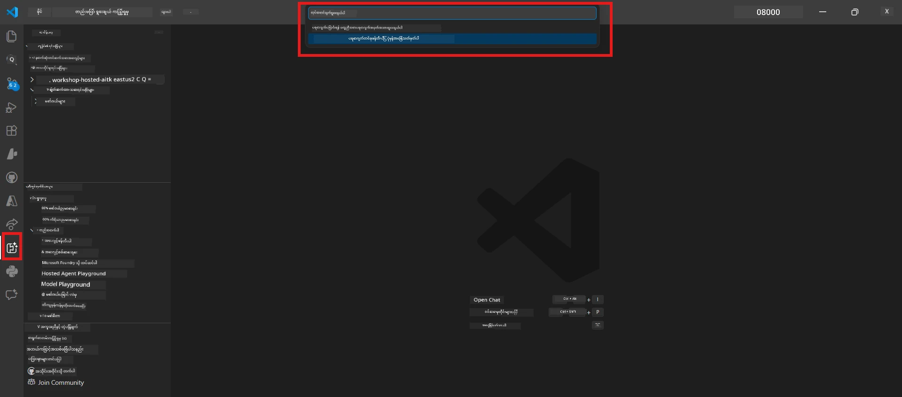
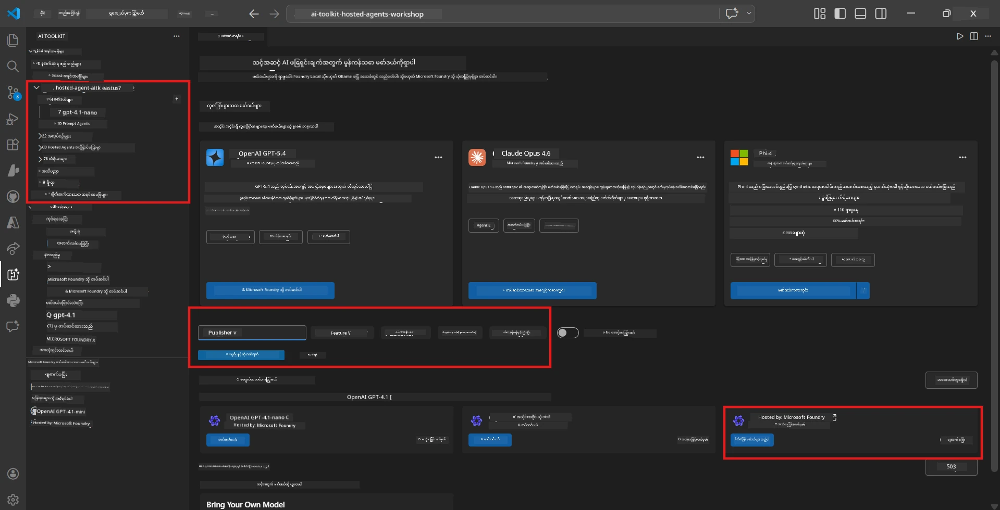
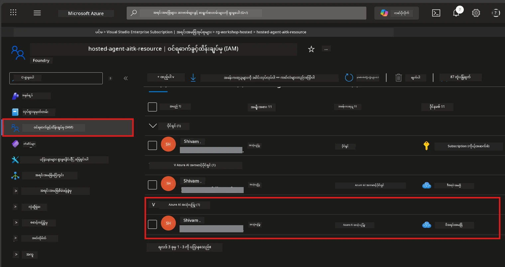

# Module 2 - Foundry Project တစ်ခု ဖန်တီးခြင်းနှင့် Model တစ်ခု Deploy ပြုလုပ်ခြင်း

ဤ module တွင် သင်သည် Microsoft Foundry project တစ်ခု ဖန်တီး (သို့မဟုတ် ရွေးချယ်) ပြီး သင်၏ agent အသုံးပြုမည့် model တစ်ခုကို deploy ပြုလုပ်ပါမည်။ အဆင့်တိုင်းကို ရှင်းလင်းပြတ်သားစွာရေးသားထားပြီး - အဆင့်များအတိုင်းလိုက်နာပါ။

> သင့်မှာ 이미 Foundry project တင်ပြီး Model တစ်ခု deploy ပြီးသားဖြစ်လျှင် [Module 3](03-create-hosted-agent.md) သို့ကျော်လွှားပါ။

---

## Step 1: VS Code မှ Foundry project တစ်ခု ဖန်တီးခြင်း

VS Code မှ နုတ်မထားပဲ Microsoft Foundry extension ကို အသုံးပြု၍ project တစ်ခုဖန်တီးပါမည်။

1. `Ctrl+Shift+P` ကိုနှိပ်ပြီး **Command Palette** ကိုဖွင့်ပါ။
2. ရိုက်ထည့်ပါ: **Microsoft Foundry: Create Project** နှင့် ရွေးချယ်ပါ။
3. dropdown တစ်ခု ပေါ်လာပါမည် - သင့် **Azure subscription** ကို စာရင်းမှ ရွေးချယ်ပါ။
4. **resource group** ကို ရွေးချယ်ရန် (သို့) ဖန်တီးရန် မေးမည်:
   - အသစ်တစ်ခုဖန်တီးရန်: အမည်တစ်ခု ရိုက်ထည့်ပါ (ဥပမာ `rg-hosted-agents-workshop`) နှင့် Enter နှိပ်ပါ။
   - ရှိပြီးသားကို အသုံးပြုမည်ဆို သော့ခတ်စာရင်းမှ ရွေးချယ်ပါ။
5. **Region** တစ်ခုကို ရွေးချယ်ပါ။ **အရေးကြီး:** hosted agents နှင့်အထောက်အပံ့ပေးသော region ကို ရွေးချယ်ပါ။ [region availability](https://learn.microsoft.com/azure/foundry/agents/concepts/hosted-agents#region-availability) ကိုစစ်ဆေးပါ။ အများဆုံးရွေးချယ်မှုမှာ `East US`, `West US 2` သို့မဟုတ် `Sweden Central` ဖြစ်သည်။
6. Foundry project အတွက် **အမည်** တစ်ခု ရိုက်ထည့်ပါ (ဥပမာ `workshop-agents`)။
7. Enter နှိပ်ပြီး provision ပြီးခြင်းအားစောင့်ပါ။

> **Provisioning သည် မိနစ် ၂-၅ ကြာနိုင်သည်။** VS Code ၏ အောက်ညာထောင့်တွင် progress notification ကိုမြင်ရပါမည်။ Provisioning ပြုလုပ်စဉ် VS Code ကိုပိတ်မထားရ။

8. ပြီးဆုံးလျှင် **Microsoft Foundry** sidebar တွင် သင့် project အသစ်ကို **Resources** အောက်တွင်မြင်ရပါမည်။
9. project အမည်ကို နှိပ်ပြီး ကျယ်ကျယ်ပြန့်ပြန့် ဖှင့်ထားပြီး **Models + endpoints** နှင့် **Agents** စသည့် အပိုင်းများ မြင်ရသည်ကို အတည်ပြုပါ။



### နောက်ထပ်ရွေးချယ်စရာ - Foundry Portal မှ ဖန်တီးခြင်း

ဘရောက်ဇာကို သုံးရင်:

1. [https://ai.azure.com](https://ai.azure.com) ကိုဖွင့်ပြီး ဝင်ပါ။
2. အိမ်စာမျက်နှာတွင် **Create project** ကိုနှိပ်ပါ။
3. Project အမည်, subscription, resource group နဲ့ region ကို ရိုက်ထည့်ပါ။
4. **Create** နှိပ်၍ provisioning ဖြစ်လာစေပါ။
5. ဖန်တီးပြီးရင် VS Code သို့ပြန်သွားပါ - refresh (နောက်ဆုံးတင်သွင်းမှု) အလေးပေးပြီး Foundry sidebar တွင် project ပြပါလိမ့်မည်။

---

## Step 2: Model တစ်ခု Deploy ပြုလုပ်ခြင်း

သင့် [hosted agent](https://learn.microsoft.com/azure/foundry/agents/concepts/hosted-agents) သည် Azure OpenAI model တစ်ခု လိုအပ်သည့်တုံ့ပြန်မှုများ ဖန်တီးရန်လိုအပ်သည်။ သင်သည် [အခု Deploy ပြုလုပ်ပါမည်](https://learn.microsoft.com/azure/ai-foundry/openai/how-to/create-resource#deploy-a-model)။

1. `Ctrl+Shift+P` ကိုနှိပ်၍ **Command Palette** ကိုဖွင့်ပါ။
2. ရိုက်ထားပါ: **Microsoft Foundry: Open [Model Catalog](https://learn.microsoft.com/azure/ai-foundry/openai/concepts/models)** နှင့် ရွေးချယ်ပါ။
3. VS Code တွင် Model Catalog ရှုမြင်ကွင်း ပြထားပါမည်။ **gpt-4.1** ကို ရှာဖွေရန် သို့မဟုတ် ရှာဖွေရန်ဘားကိုအသုံးပြုပါ။
4. **gpt-4.1** model ကတ် (သို့) မြန်ဆန်မှုနည်းမြင့် `gpt-4.1-mini` ကို နှိပ်ပါ။
5. **Deploy** ကို နှိပ်ပါ။


6. Deployment configuration တွင်
   - **Deployment name**: ပုံမှန်အကြောင်းအရာ (ဥပမာ `gpt-4.1`) ကိုထားပေးပါ သို့မဟုတ် အသေးစိတ်အမည်ထည့်ပါ။ **ဒီအမည်ကို မှတ်ထားပါ** - Module 4 တွင်လိုအပ်မည်။
   - **Target**: **Deploy to Microsoft Foundry** ကိုရွေးချယ်ပြီး ပြီးခဲ့သည့် project ကို ရွေးပါ။
7. **Deploy** ကိုနှိပ်ပြီး deployment ပြီးဆုံးရန် စောင့်ပါ (၁-၃ မိနစ်)။

### Model ရွေးချယ်ခြင်း

| Model | အကောင်းဆုံး သုံးစွဲမှု | ကုန်ကျစရိတ် | မှတ်ချက်များ |
|-------|-------------------------|-------------|--------------|
| `gpt-4.1` | အရည်အသွေးမြင့်၊ အသေးစိတ် စိတ်ခံစားချက် ပြန်လည်ပေးနိုင်မှု | အမြင့်ဆုံး | အကောင်းဆုံးရလဒ်၊ နောက်ဆုံး စမ်းသပ်မှု ဝါသနာရှိသူများအတွက် 추천 |
| `gpt-4.1-mini` | မြန်ဆန်သော iteration၊ အနည်းငယ် လည်းကောင်း | နည်းသည် | workshop ဖန်တီးခြင်းနှင့် လျင်မြန်စွာ စမ်းသပ်ခြင်းအတွက် ကောင်းမွန် |
| `gpt-4.1-nano` | ပိုမိုပေါ့ပါးသော လုပ်ငန်းတာဝန်များ | အတတ်နိုင်ဆုံးနည်းဆုံး | အကျိုးသက်သာစွာ၊ ဒါပေမယ့် တုံ့ပြန်ချက် ပိုပေါ့ပါးသည် |

> **ဤ workshop အတွက် အကြံပြုချက်:** ဖန်တီးခြင်းနှင့် စမ်းသပ်ခြင်းအတွက် `gpt-4.1-mini` ကို အသုံးပြုပါ။ မြန်ဆန်ပြီး စရိတ်သက်သာကောင်းမွန်သည့် အလုပ်များအတွက် ရလဒ်ကောင်း ရပါမည်။

### Model deployment အတည်ပြုခြင်း

1. **Microsoft Foundry** sidebar တွင် သင့် project ကို ကျယ်ကျယ်ပြန့်ပြန့် ဖွင့်ပါ။
2. **Models + endpoints** (သို့) ဆင်တူသော အပိုင်း အောက်ကိုကြည့်ပါ။
3. သင့် deploy ပြီးသား model (ဥပမာ `gpt-4.1-mini`) ကို **Succeeded** သို့မဟုတ် **Active** status နဲ့ တွေ့ရပါမည်။
4. Model deployment ကို နှိပ်၍ အသေးစိတ် ကြည့်ရှုပါ။
5. **ဒီနှစ်ချက်ကို မှတ်ထားပေးပါ** - Module 4 တွင် လိုအပ်ပါမည်။

   | ကန့်သတ်ချက် | ရှာဖွေမည့်နေရာ | ဥပမာတန်ဖိုး |
   |-------------|------------------|------------|
   | **Project endpoint** | Foundry sidebar တွင် project အမည်ကို နှိပ်ပါ။ အသေးစိတ်တွင် endpoint URL ပြပါမည်။ | `https://<account>.services.ai.azure.com/api/projects/<project>` |
   | **Model deployment name** | deployment model အမည် ပြပါသည်။ | `gpt-4.1-mini` |

---

## Step 3: လိုအပ်သော RBAC role များထားသတ်မှတ်ခြင်း

ဤအဆင့်သည် **အကြိမ်အများဆုံး လုပ်မိလွဲသော အဆင့်** ဖြစ်သည်။ မှန်ကန်သော roles မပါရှိဘဲ Module 6 တွင် deployment ပြုလုပ်မယ်ဆိုပြီး ခွင့်ပြုချက် error ဖြစ်ပေါ်မှာဖြစ်သည်။

### 3.1 Azure AI User role ကို ကိုယ်ပိုင်သို့ထားခြင်း

1. ဘရောက်ဇာဖွင့်ပြီး [https://portal.azure.com](https://portal.azure.com) သွားပါ။
2. အပေါ်ဘက် ရှာဖွေရေးဘားတွင် သင့် **Foundry project** အမည်ကို ရိုက်ထည့်ပြီး ရလဒ်တွင် နှိပ်ပါ။
   - **အရေးကြီး:** **project** resource (အမျိုးအစား: "Microsoft Foundry project") ကိုရွေးပါ၊ အကောင့်/ hub resource မဟုတ်ပါ။
3. project ၏ ဘယ်ဘက်လမ်းညွှန်ဌာနတွင် **Access control (IAM)** ကိုနှိပ်ပါ။
4. အပေါ်ဘက်တွင် **+ Add** ကိုနှိပ်ပြီး → **Add role assignment** ကိုရွေးပါ။
5. **Role** အတန်းတွင် [**Azure AI User**](https://learn.microsoft.com/azure/foundry/concepts/rbac-foundry#built-in-roles) ကို ရှာပြီးရွေးပါ။ **Next** ကို နှိပ်ပါ။
6. **Members** tab တွင်
   - **User, group, or service principal** ကိုရွေးပါ။
   - **+ Select members** ကိုနှိပ်ပါ။
   - သင့်နာမည် သို့မဟုတ် အီးမေးလ် စာရင်းကို ရှာပြီး ကိုယ်တိုင်ကို ရွေးချယ်ပါ။ **Select** ကို နှိပ်ပါ။
7. **Review + assign** ကို နှိပ်ပြီး ထပ်မံ **Review + assign** နှိပ်ကာ အတည်ပြုပါ။



### 3.2 (Optional) Azure AI Developer role ထပ်မံသတ်မှတ်ခြင်း

Project အတွင်း အပိုတိုးဆောင်မှုများ ဖန်တီးရန် သို့မဟုတ် deployment များကို programmatically စီမံချင်လျှင် -

1. အထက်ဖော်ပြထားသည့် အဆင့်များကို ထပ်မံလုပ်ပါ။ အဆင့် 5 တွင် **Azure AI Developer** ကို ရွေးပါ။
2. Foundry resource (account) အဆင့်တွင် သတ်မှတ်ပါ၊ project အဆင့် သာမဟုတ်။

### 3.3 သင့် role assignment များကို အတည်ပြုခြင်း

1. project ၏ **Access control (IAM)** စာမျက်နှာတွင် **Role assignments** tab ကို နှိပ်ပါ။
2. သင့်နာမည် ရှာပါ။
3. Project scope အတွက် အနည်းဆုံး **Azure AI User** ကို မြင်ရပါမည်။

> **ဤအကြောင်းအရာ အရေးကြီးသည့်အချက်:** [`Azure AI User`](https://learn.microsoft.com/azure/foundry/concepts/rbac-foundry#built-in-roles) role သည် `Microsoft.CognitiveServices/accounts/AIServices/agents/write` data action ကို ခွင့်ပြုသည်။ မပါဘဲ Deploy ပြုလုပ်ရာတွင် error ပေါ်နိုင်သည်။
>
> ```
> Error: lacks the required data action 
> Microsoft.CognitiveServices/accounts/AIServices/agents/write 
> to perform POST /api/projects/{projectName}/assistants operation.
> ```
>
> အသေးစိတ်များအတွက် [Module 8 - Troubleshooting](08-troubleshooting.md) ကိုကြည့်ပါ။

---

### အချက်စစ်

- [ ] Foundry project ရှိပြီး VS Code ၏ Microsoft Foundry sidebar တွင် မြင်နိုင်သည်။
- [ ] Model တစ်ခုအား (ဥပမာ `gpt-4.1-mini`) deployment ပြုလုပ်ပြီး **Succeeded** status ရှိသည်။
- [ ] **project endpoint** URL နှင့် **model deployment name** ကို မှတ်သားထားသည်။
- [ ] **Azure AI User** role ကို project အဆင့်တွင် ဆက်သွယ်ပြီး သတ်မှတ်ထားသည် (Azure Portal → IAM → Role assignments တွင်စစ်ဆေးရန်)။
- [ ] Project သည် [hosted agents အထောက်အပံ့ရှိ region](https://learn.microsoft.com/azure/foundry/agents/concepts/hosted-agents#region-availability) တစ်ခုတွင် တည်ရှိသည်။

---

**ယခင်အပိုင်း:** [01 - Install Foundry Toolkit](01-install-foundry-toolkit.md) · **နောက်တစ်ဆင့်:** [03 - Create a Hosted Agent →](03-create-hosted-agent.md)

---

<!-- CO-OP TRANSLATOR DISCLAIMER START -->
**အဆိုပြုချက်**  
ဤစာတမ်းကို AI ဘာသာပြန်ဝန်ဆောင်မှု [Co-op Translator](https://github.com/Azure/co-op-translator) ဖြင့် ဘာသာပြန်ထားပါသည်။ ကျွန်ုပ်တို့သည် တိကျမှန်ကန်မှုအတွက် ကြိုးပမ်းနေသော်လည်း အလိုအလျောက် ဘာသာပြန်မှုများတွင် အမှားများ သို့မဟုတ် မှားယွင်းချက်များ ဖြစ်နိုင်ကြောင်း သတိပြုရန်လိုအပ်ပါသည်။ မူရင်းစာတမ်းကို မိခင်ဘာသာဖြင့်သာ အတည်ပြုရမည့် စံနှုန်းအဖြစ်ယူဆရမည်။ အရေးကြီးသော သတင်းအချက်အလက်များအတွက် မျက်နှာကျက် လူသား ဘာသာပြန်သူမှ ဘာသာပြန်မှုကို အကြံပြုပါသည်။ ဤဘာသာပြန်မှုဖြင့် ဖြစ်ပေါ်နိုင်သည့် နားမလည်မှုများ သို့မဟုတ် မှားယွင်းဖတ်ရှုမှုများအတွက် ကျွန်ုပ်တို့ တာဝန်မယူပါ။
<!-- CO-OP TRANSLATOR DISCLAIMER END -->