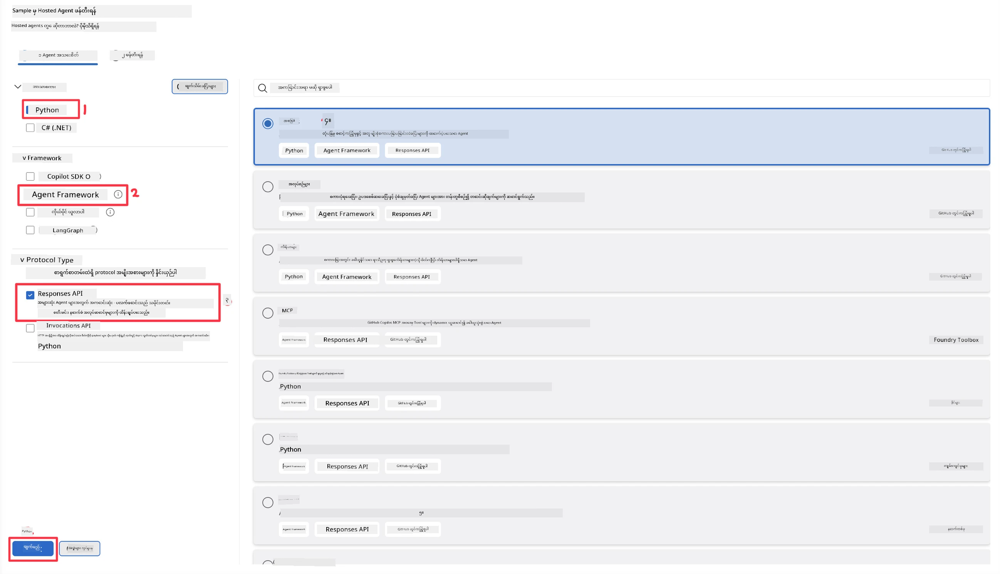
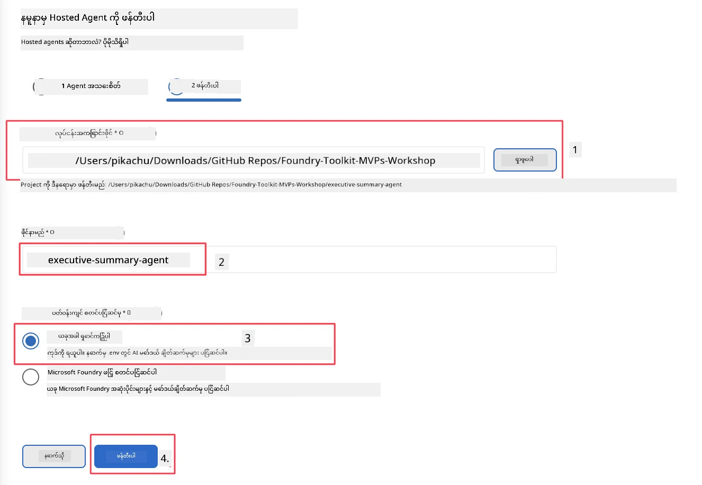

# မော်ဂျူး ၂ - အသစ်သော Hosted Agent တစ်ခု ဖန်တီးခြင်း

⏱️ ~5 မိနစ်

ဤ မော်ဂျူးတွင်၊ သင်သည် Foundry Toolkit ကို အသုံးပြု၍ **hosted agent ပရောဂျက်အသစ်တစ်ခု စနစ်တကျ ဖန်တီးမည်**။ Scaffold သည် ပရောဂျက်၏ စုစည်းမှုလုံးလုံးကို - `agent.yaml`, `main.py`, `Dockerfile`, `requirements.txt`, နှင့် VS Code debug configuration - ဖန်တီးပေးပြီး သင်သည် agent ၏ အပြုအမူ ညှိနှိုင်းမှုမှာ အာရုံစိုက်နိုင်စေရန် ဖြစ်သည်။

> **အဓိက တင်ထားချက်:** ဤ lab တွင်ရှိသော `agent/` ဖိုလ်ဒါသည် Foundry Toolkit မှ စနစ်တကျ ဖန်တီးသောဥပမာဖြစ်သည်။ သင်သည် အဲဒီဖိုင်များကို စတင်ရေးသားရန် မလိုအပ်ပါ။

### Scaffold wizard လမ်းညွှန်စနစ်

```mermaid
flowchart LR
    A["Command Palette:
    Create new Hosted Agent"] --> B["Language:
    Python"]
    B --> C["API type:
    Response API"]
    C --> D["Template:
    Basic - Agent Framework"]
    D --> E["မော်ဒယ်ရွေးချယ်ပါ"]
    E --> F["Workspace folder
    & agent name"]
    F --> G["ထုတ်လုပ်ထားသော ပရောဂျက်"]

    style A fill:#4A90D9,color:#fff
    style B fill:#7B68EE,color:#fff
    style C fill:#7B68EE,color:#fff
    style D fill:#7B68EE,color:#fff
    style E fill:#7B68EE,color:#fff
    style F fill:#7B68EE,color:#fff
    style G fill:#27AE60,color:#fff
```



---

## အဆင့် ၁: Create Hosted Agent wizard ကိုဖွင့်ပါ

၁။ `Ctrl+Shift+P` ကိုနှိပ်ပြီး **Command Palette** ကိုဖွင့်ပါ။
၂။ ရိုက်ထည့်ပါ: **Foundry Toolkit: Create new Hosted Agent** နှင့် ရွေးချယ်ပါ။

> **အခြားနည်းလမ်း: Foundry Portal မှတဆင့် ဖန်တီးခြင်း**
> သင်သည် browser ကိုသာ သဘောကျလျှင် [https://ai.azure.com](https://ai.azure.com) တွင် သင်၏ ပရောဂျက်ကို ဖန်တီးနိုင်ပါသည်။ ပရောဂျက် provision ပြီးပါက VS Code ကိုပြန်သွား၍ **Foundry Toolkit** sidebar ကို အသုံးပြုကာ ချိတ်ဆက်နိုင်ပါသည်။

> **အခြားနည်းလမ်း:** Foundry Toolkit sidebar ၏ **Hosted Agents (Preview)** ပြတင်းပေါ်တွင်ရှိသော **+** သင်္ကေတကို နှိပ်ပါ။

## အဆင့် ၂: ဆက်တင်များကို ရွေးချယ်ပါ



၁။ ဘယ်ပတ်လမ်း/ရွေးချယ်မှု အပိုင်းတွင် အောက်ပါအတိုင်း ရွေးချယ်ပါ။

| မီနူး | ရွေးချယ်မှု | မှတ်စုများ |
|--------|-----------|-------|
| **ဘာသာစကား** | Python | C# ကိုလည်း ပံ့ပိုးသည် |
| **Framework** | Agent Framework | Agent Framework SDK ကို အသုံးပြု၍ ရိုးရှင်းစနစ်ဖြစ်သည် |
| **API အမျိုးအစား** | Response API | `POST /responses` - တွေ့ဆုံစကားပြောခြင်း၊ platform က စီမံထိန်းသိမ်းထားသော သမိုင်းမှတ်တမ်းပါရှိသည် |
| **Template** | Basic | Agent Framework SDK ကို အသုံးပြု၍ ရိုးရှင်းစနစ်ဖြစ်သည် |

၂။ ရွေးချယ်ပြီးပါက **Next** ကိုနှိပ်ပါ



၃။ နောက်တစ်ခု ဖွင့်ပေါ်လာသော ပြတင်းပေါ်တွင် အောက်ပါအတိုင်း ရွေးချယ်ပါ။

| မီနူး | ရွေးချယ်မှု | မှတ်စုများ |
|--------|-----------|-------|
| **အလုပ်လုပ်ရန် ဖိုလ်ဒါ** | ပစ်မှတ် ဖိုလ်ဒါကို ရွေးချယ်ပါ | ဥပမာ `workspace/Foundry_Toolkit_for_VSCode_Lab/` သို့မဟုတ် ဒီ repo အတွင်း သေးငယ်သော ဖိုလ်ဒါတစ်ခု |
| **Agent အမည်** | အမည်တစ်ခု ရိုက်ထည့်ပါ | ဥပမာ `executive-summary-agent` |
| **ပတ်ဝန်းကျင် သတ်မှတ်မှု** | လက်ရှိတွင် ချိန်ဆ ပြင်ရန် မလိုအပ်ပါ |  |

**create** ကို နှိပ်ပြီး သင်၏ agent ကို ဖန်တီးပါ။ Hosted agent အမည်ဖြင့် ဖိုလ်ဒါ အသစ်တစ်ခု ဖန်တီးမည်။

## အဆင့် ၃: ဖန်တီးပြီး ပရောဂျက်ကို ကြည့်ရှုခြင်း

Scaffold ပြီးဆုံးခြင်းအပြီး Explorer (`Ctrl+Shift+E`) တွင် အောက်ပါဖိုင်များ ပါရှိကြောင်း အတည်ပြုပါ။

```
📂 my-agent/
├── .env                ← Environment variables (placeholders)
├── .vscode/
│   ├── launch.json     ← Debug config (F5 → run + Agent Inspector)
│   └── tasks.json      ← VS Code task definitions
├── agent.yaml          ← Agent definition (kind: hosted)
├── Dockerfile          ← Container config for deployment
├── main.py             ← Agent entry point (your main code)
└── requirements.txt    ← Python dependencies
```

### အဓိက ဖိုင်များ ရှင်းလင်းချက်

| ဖိုင် | ရည်ရွယ်ချက် |
|------|---------|
| `agent.yaml` | Agent ကို `kind: hosted` ဟူ၍ ကြေညာထားပြီး ပတ်ဝန်းကျင်အညွှန်းများကို မျက်မှောက်ချသည်၊ `/responses` protocol ကို သတ်မှတ်သည် |
| `main.py` | `FoundryChatClient` တစ်ခု ဖန်တီးပြီး → `Agent` အဖြစ် လမ်းညွှန်ချက်နှင့် ထုတ်ပေးသည် → `ResponsesHostServer` မှတဆင့် 8088 port တွင် ဝန်ဆောင်မှုပေးသည် |
| `Dockerfile` | `python:3.12-slim` ကို အသုံးပြုပြီး လိုအပ်သော dependency များကို 설치၊ 8088 port ကိုဖွင့်၊ `main.py` ကို run လုပ်သည် |
| `requirements.txt` | `agent-framework-foundry`, `agent-framework-foundry-hosting`, `mcp`, `debugpy` |

> **အရေးကြီးချက်:** Scaffold လုပ်ထားသော agent ဖိုလ်ဒါကို တိုက်ရိုက် VS Code တွင် ဖွင့်ပါ (အဓိက `agent/` ဖိုလ်ဒါကို) ထို့ကြောင့် `.vscode/launch.json` နှင့် `tasks.json` ကို F5 debugging အတွက် မှန်ကန်စွာ အလုပ်လုပ်စေပါသည်။

---

### ✅ စစ်ဆေးချက်

- [ ] စနစ်တကျ ဖန်တီးထားသော ပရောဂျက် နှင့် မျှော်လင့်ထားသော ဖိုင်တွေ အားလုံးပါဝင်ခြင်း
- [ ] `agent.yaml` တွင် `kind: hosted` နှင့် `protocol: responses` ကို ပြသခြင်း
- [ ] `main.py` တွင် `Agent`, `FoundryChatClient`, `ResponsesHostServer` ကို အတင်ပြုခြင်း
- [ ] agent ဖိုလ်ဒါကို VS Code တွင် workspace root အဖြစ် ဖွင့်ထားခြင်း

---

**ယခင်:** [01 - Setup](01-setup.md) · **နောက်တစ်ခု:** [03 - Configure & Code →](03-configure-and-code.md)

---

<!-- CO-OP TRANSLATOR DISCLAIMER START -->
**ပြောကြားချက်**
ဤစာတမ်းကို AI ဘာသာပြန်ဝန်ဆောင်မှု [Co-op Translator](https://github.com/Azure/co-op-translator) အသုံးပြု၍ ဘာသာပြန်ထားပါသည်။ ကျွန်ုပ်တို့သည် တိကျမှန်ကန်မှုအတွက် ကြိုးပမ်းနေသော်လည်း၊ စက်ကိရိယာဘာသာပြန်ခြင်းများတွင် အမှားများ သို့မဟုတ် မှားယွင်းချက်များ ပါဝင်နိုင်ကြောင်း သတိပြုပါရန် လိုအပ်ပါသည်။ မူလစာတမ်းကို မူရင်းဘာသာဖြင့်သာ ယုံကြည်စိတ်ချရသော အချက်အလက်အဖြစ် သတ်မှတ်သင့်သည်။ အရေးကြီးသည့် သတင်းအချက်အလက်များအတွက် ပရော်ဖက်ရှင်နယ် လူသားဘာသာပြန်သူဝန်ဆောင်မှုကို အကြံပြုပါသည်။ ဤဘာသာပြန်ချက်ကို အသုံးပြုခြင်းမှ ဖြစ်ပေါ်လာသော နားလည်မှုကွာခြားမှုများ သို့မဟုတ် မမှန်ကန်သော အသုံးပြုမှုများအတွက် ကျွန်ုပ်တို့ တာဝန်မခံပါ။
<!-- CO-OP TRANSLATOR DISCLAIMER END -->