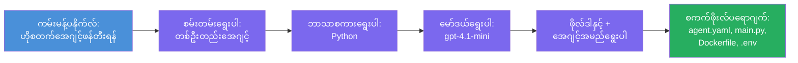

# Module 3 - အသစ်ဖန်တီးသော Hosted Agent (Foundry Extension ဖြင့် အလိုအလျောက်ဖန်တီးခြင်း)

ဤ module တွင် Microsoft Foundry extension ကို အသုံးပြု၍ **အသစ်သော [hosted agent](https://learn.microsoft.com/azure/foundry/agents/concepts/hosted-agents) project ကို scaffold ပြုလုပ်သည်။** Extension အနေဖြင့် project တစ်ခုလုံး၏ဖွဲ့စည်းပုံအား ထည့်သွင်းပေးမည် ဖြစ်ပြီး `agent.yaml`, `main.py`, `Dockerfile`, `requirements.txt`, `.env` ဖိုင်နှင့် VS Code debug configuration အပါအဝင်ဖြစ်သည်။ Scaffold ပြီးနောက် သင်၏ agent ၏ အညွှန်း၊ ကိရိယာများနှင့် ပြင်ဆင်ရန် ဖိုင်များကို သင်အလိုက်ပြင်ဆင်ရမည်။

> **အဓိကအယူအဆ:** ဒီ lab တွင်ရှိသော `agent/` folder သည် Foundry extension သည် scaffold command ကို run လုပ်သောအခါ ဖန်တီးပေးသော file များ၏ ဥပမာဖြစ်သည်။ သင်မှတ်သားထားသော ဖိုင်များကို ကိုယ့်အနေနှင့် ပြန်ရေးမနေဘဲ extension ကဖန်တီးပေးပြီး သင်ပြင်ဆင်သည့် ဖိုင်များဖြစ်သည်။

### Scaffold wizard ၏ ဦးတည်ချက်


---

## အဆင့် 1: Create Hosted Agent wizard ကို ဖွင့်ပါ

1. `Ctrl+Shift+P` ကို ဖိ၍ **Command Palette** ကို ဖွင့်ပါ။
2. အောက်ပါစာသားကို ရိုက်ထည့်ပါ - **Microsoft Foundry: Create a New Hosted Agent** နှင့် ရွေးချယ်ပါ။
3. Hosted agent ဖန်တီးခြင်း wizard ကို ဖွင့်ပေးမည်။

> **လမ်းလျှောက်ခြင်း အခြားနည်းလမ်း:** Microsoft Foundry sidebar မှ → **Agents** အနားရှိ **+** အိုင်ကွန်းကို နှိပ်ခြင်း သို့မဟုတ် right-click ပြုလုပ်ပြီး **Create New Hosted Agent** ကို ရွေးချယ်၍လည်း wizard သို့ သွားရောက်နိုင်သည်။

---

## အဆင့် 2: Template ကို ရွေးချယ်ပါ

Wizard မှ template တစ်ခုခေါ်ယူရန် မေးမြန်းသည်။ အောက်ပါရွေးချယ်စရာများရှိသည်-

| Template | ဖေါ်ပြချက် | ဘယ်အချိန်အသုံးပြုမလဲ |
|----------|-------------|----------------------------|
| **Single Agent** | မိမိပိုင် မော်ဒယ်၊ အညွှန်းများ၊ စိတ်ကြိုက်ကိရိယာများပါရှိသော အေးဂျင်တစ်ခု | ဒီ workshop (Lab 01) |
| **Multi-Agent Workflow** | တစျခုနောက်တစ်ခု လိုက်တိုက်သွား လုပ်ငန်းများဆောင်ရွက်သော အေးဂျင်များ များစွာ | Lab 02 |

1. **Single Agent** ကို ရွေးပါ။
2. **Next** ကိုနှိပ်ပါ (သို့မဟုတ် ရွေးချယ်မှုကို အလိုအလျော့ဆက်တိုက်ဆောင်ရွက်မည်)။

---

## အဆင့် 3: Programming language ရွေးချယ်ပါ

1. **Python** ကို ရွေးပါ (ဤ workshop အတွက် အကြံပြုထားသည်)။
2. **Next** ကိုနှိပ်ပါ။

> **C# ကိုလည်း ပံ့ပိုးပေးသည်** (ငါသည် .NET ကို ထောက်ပံ့ချင်လျှင်)။ Scaffold ဖွဲ့စည်းပုံသည် ကွဲပြားခြားနားမှု မရှိပါ ( `main.py` မဟုတ်ပဲ `Program.cs` ကို အသုံးပြုသည်)။

---

## အဆင့် 4: မော်ဒယ်ရွေးချယ်ပါ

1. Wizard သည် သင်၏ Foundry project တွင် ထည့်သွင်းထားသော မော်ဒယ်များ ပြသပေးသည် (Module 2 မှ)။
2. သင် ထည့်သွင်းထားသော မော်ဒယ်ကို ရွေးပါ၊ ဥပမာ: **gpt-4.1-mini**။
3. **Next** ကို နှိပ်ပါ။

> မော်ဒယ်များ မမြင်ပါက [Module 2](02-create-foundry-project.md) ကို ပြန်သွားပြီး မော်ဒယ်တစ်ခု ထည့်သွင်းပါ။

---

## အဆင့် 5: ဖိုလ်ဒါတည်နေရာနှင့် agent အမည် ရွေးပါ

1. ဖိုင်ဒိုင်လော့ဂ်ပြတင်းပေါက် ဖွင့်ပြီး သင့် project ကို ဖန်တီးမည့် **target folder** ကို ရွေးချယ်ပါ။ ဤ workshop အတွက်-
   - စတင်အသစ်ဖြင့်: folder မည့် ကိုမဆိုရွေးချယ်နိုင်ပါသည် (ဥပမာ- `C:\Projects\my-agent`)
   - workshop repository အတွင်းတွင်: `workshop/lab01-single-agent/agent/` အောက်တွင် subfolder အသစ် တစ်ခုဖန်တီးပါ။
2. Hosted agent အတွက် **အမည်** ထည့်ပါ (ဥပမာ- `executive-summary-agent` သို့မဟုတ် `my-first-agent`)။
3. **Create** (သို့မဟုတ် Enter) ကိုနှိပ်ပါ။

---

## အဆင့် 6: Scaffold ပြီးဆုံးရန် စောင့်ပါ

1. VS Code သည် scaffolded project ဖြင့် **ပြိုင်အသစ်သောပင်မပတ်ဝန်းကျင်** ဖွင့်ပေးမည်။
2. Project ပြီးပြည့်စုံသောအထိ စက္ကန့်အနည်းငယ် စောင့်ပါ။
3. Explorer panel တွင် ဤဖိုင်များကို တွေ့ရမည် (`Ctrl+Shift+E`) -

```
📂 my-first-agent/
├── .env                ← Environment variables (auto-generated with placeholders)
├── .vscode/
│   └── launch.json     ← Debug configuration (F5 to run + Agent Inspector)
├── agent.yaml          ← Agent definition (kind: hosted)
├── Dockerfile          ← Container configuration for deployment
├── main.py             ← Agent entry point (your main code file)
└── requirements.txt    ← Python dependencies
```

> **ဤသည်ဟာ ဒီ lab ၏ `agent/` folder နှင့် တူညီသော ဖွဲ့စည်းမှုဖြစ်သည်။ Foundry extension သည် အလိုအလျောက် ဤဖိုင်များကို ဖန်တီးပေးပြီး သင့်အနေနှင့် ကိုယ်တိုင် ဖန်တီးရန် မလုံလောက်ပါ။**

> **Workshop မှတ်ချက်:** ဤ workshop repository အတွင်း `.vscode/` folder သည် **workspace root** တွင်ရှိပြီး lab-specific configurations ဖြင့် ပြည့်စုံသည်။ ထိုမှာ shared `launch.json` နှင့် `tasks.json` ဖိုင်များပါဝင်ပြီး debug configuration နှစ်ခု - **"Lab01 - Single Agent"** နှင့် **"Lab02 - Multi-Agent"** ပါဝင်သည်။ F5 ကိုနှိပ်သောအခါ သင်လက်ရှိသုံးနေသော lab နှင့် ကိုက်ညီသော configuration ကို dropdown မှရွေးပါ။

---

## အဆင့် 7: ဖန်တီးထားသော ဖိုင်တစ်ခုချင်းစီကို နားလည်ပါ

Wizard မှ ဖန်တီးထားသော ဖိုင်များကို ပြဿနာမဖြစ်စေရန် အချိန်ယူ လေ့လာကြည့်ပါ။ Module 4 ကို အဆင်ပြေအောင် အရေးပါသည်။

### 7.1 `agent.yaml` - Agent အဓိကသတ်မှတ်ချက်

`agent.yaml` ကို ဖွင့်ပါ။ အမျိုးအစားကအောက်ပါအတိုင်း ဖြစ်သည်-

```yaml
# yaml-language-server: $schema=https://raw.githubusercontent.com/microsoft/AgentSchema/refs/heads/main/schemas/v1.0/ContainerAgent.yaml

kind: hosted
name: my-first-agent
description: >
  A hosted agent deployed to Microsoft Foundry Agent Service.
metadata:
  authors:
    - Microsoft
  tags:
    - Azure AI AgentServer
    - Microsoft Agent Framework
    - Hosted Agent
protocols:
  - protocol: responses
    version: v1
environment_variables:
  - name: AZURE_AI_PROJECT_ENDPOINT
    value: ${PROJECT_ENDPOINT}
  - name: AZURE_AI_MODEL_DEPLOYMENT_NAME
    value: ${MODEL_DEPLOYMENT_NAME}
dockerfile_path: Dockerfile
resources:
  cpu: '0.25'
  memory: 0.5Gi
```

**အဓိက၀က်:**

| Field | ရည်ရွယ်ချက် |
|-------|--------------|
| `kind: hosted` | သင့်အေးဂျင်သည် hosted agent ဖြစ်ကြောင်း ထုတ်ဖော်ပြောကြားခြင်း (container-based, [Foundry Agent Service](https://learn.microsoft.com/azure/foundry/agents/overview) သို့ တင်ထားသည်) |
| `protocols: responses v1` | အေးဂျင်သည် OpenAI နှင့်ကိုက်ညီသော `/responses` HTTP endpoint ကို ပြသသည် |
| `environment_variables` | `.env` ဖိုင်အကြောင်းအရာများကို container ၏ environment variables ပြောင်းလဲ ချိတ်ဆက်ထားခြင်း |
| `dockerfile_path` | container image ကို ဆောက်ဖို့ အသုံးပြုသော Dockerfile ဖိုင်တည်နေရာ |
| `resources` | container အတွက် CPU နှင့် memory စီမံခန့်ခွဲမှု (0.25 CPU, 0.5Gi memory) |

### 7.2 `main.py` - Agent ၏ ဝင်ရောက်မှု စာမျက်နှာ

`main.py` ကို ဖွင့်ပါ။ သင့် agent ရဲ့ logic များပါဝင်သော Python ဖိုင်ဖြစ်သည်။ Scaffold မှ တစ်ဆင့်ဝင်ရောက်မှုမှာ-

```python
from agent_framework.azure import AzureAIAgentClient
from azure.ai.agentserver.agentframework import from_agent_framework
from azure.identity.aio import DefaultAzureCredential
```

**အဓိက import များ:**

| Import | ရည်ရွယ်ချက် |
|--------|-------------|
| `AzureAIAgentClient` | သင့် Foundry project နှင့် ချိတ်ဆက်ပြီး `.as_agent()` ဖြင့် agent အဖြစ်ဖန်တီးပေးသည် |
| [`DefaultAzureCredential`](https://learn.microsoft.com/azure/developer/python/sdk/authentication/credential-chains#defaultazurecredential-overview) | အတည်ပြုခြင်းကို ကိုင်တွယ်ပေးသည် (Azure CLI, VS Code sign-in, managed identity, သို့မဟုတ် service principal) |
| `from_agent_framework` | Agent အား HTTP server အဖြစ်  `/responses` endpoint ဖြင့် wrap လုပ်ပေးသည် |

နောက်ဆုံးတွင် flow သည်-
1. Credential ဖန်တီးမှု → client ဖန်တီးမှု → `.as_agent()` ကို အသုံးပြု agent ရယူခြင်း (async context manager) → server နေရာတွင် wrap လုပ်ခြင်း → run

### 7.3 `Dockerfile` - Container image

```dockerfile
FROM python:3.14-slim

WORKDIR /app

COPY ./ .

RUN pip install --upgrade pip && \
    if [ -f requirements.txt ]; then \
        pip install -r requirements.txt; \
    else \
        echo "No requirements.txt found" >&2; exit 1; \
    fi

EXPOSE 8088

CMD ["python", "main.py"]
```

**အဓိက အချက်များ:**
- Base image အနေဖြင့် `python:3.14-slim` ကို အသုံးပြုသည်။
- Project ဖိုင်အကုန်လုံး `/app` ထဲသို့ ကူးပါ။
- `pip` ကို မြှင့်တင်ပြီး `requirements.txt` မှ အသုံးပြုမှုများ ထည့်သွင်းပါ၊ ဖိုင် မရှိပါက fail ဖြစ်မည်။
- **Port 8088 ကို expose လုပ်သည်**- hosted agents များအတွက် လိုအပ်သော port ဖြစ်သည်။ မပြောင်းလဲပါနှင့်။
- Agent ကို `python main.py` ဖြင့် စတင်ပေးသည်။

### 7.4 `requirements.txt` - အားဖြည့်ရန် dependencies

```
agent-framework-azure-ai==1.0.0rc3
agent-framework-core==1.0.0rc3
azure-ai-agentserver-agentframework==1.0.0b16
azure-ai-agentserver-core==1.0.0b16
debugpy
agent-dev-cli
```

| Package | ရည်ရွယ်ချက် |
|---------|--------------|
| `agent-framework-azure-ai` | Microsoft Agent Framework အတွက် Azure AI ဖြည့်စွက်မှု |
| `agent-framework-core` | Agent များဖန်တီးရာတွင် Core runtime ( `python-dotenv` ပါဝင်သည်) |
| `azure-ai-agentserver-agentframework` | Foundry Agent Service အတွက် hosted agent server runtime |
| `azure-ai-agentserver-core` | Core agent server abstraction များ |
| `debugpy` | Python debugging ရှိရန်ကူညီမှု (VS Code တွင် F5 debugging ပြုလုပ်နိုင်ရန်) |
| `agent-dev-cli` | Local development CLI, agent တွေကို စမ်းသပ်ရာ အသုံးပြုသည် (debug/run configuration တွင် သုံးသည်) |

---

## Agent protocol ကို နားလည်ခြင်း

Hosted agents များသည် **OpenAI Responses API** protocol ဖြင့် ဆက်သွယ်သည်။ ထိုအခါ agent သည် single HTTP endpoint ကို လုပ်ဆောင်ပြသသည်-

```
POST http://localhost:8088/responses
Content-Type: application/json

{
  "input": "Your prompt here",
  "stream": false
}
```

Foundry Agent Service သည် endpoint ၌ ဖုန်းခေါ်ခြင်းများ ပြုလုပ်၍ အသုံးပြုသူ prompt များကို ပို့ပေးပြီး agent ၏ အဖြေများကို လက်ခံရမည်။ ထို protocol သည် OpenAI API နှင့် တူညီသည်၊ ထိုကြောင့် သင်၏ agent သည် OpenAI Responses ကို ပြောဆိုနိုင်သည့် client များနှင့် ကိုက်ညီမည်။

---

### စစ်ဆေးချက်

- [ ] Scaffold wizard ကို အောင်မြင်စွာ ပြီးဆုံးပြီး **အသစ်သော VS Code ပြတင်းပေါက်** ဖွင့်ပေးပါသည်။
- [ ] `agent.yaml`, `main.py`, `Dockerfile`, `requirements.txt`, `.env` ဖိုင် ၅ခုလုံးကို မြင်တွေ့နိုင်ပါသည်။
- [ ] `.vscode/launch.json` ဖိုင် ရှိသည် (F5 debugging အတွက် - workshop တွင် workspace root တွင် lab-specific configuration များနှင့် ရှိသည်)
- [ ] ဖိုင်တစ်ခုချင်းစီ၏ ရည်ရွယ်ချက်ကို နားလည်ပြီးဖြစ်သည်။
- [ ] port `8088` လိုအပ်ပြီး `/responses` endpoint သည် protocol ဖြစ်ကြောင်းနားလည်သည်။ 

---

**ပြီးခဲ့သည်:** [02 - Create Foundry Project](02-create-foundry-project.md) · **နောက်တည်:** [04 - Configure & Code →](04-configure-and-code.md)

---

<!-- CO-OP TRANSLATOR DISCLAIMER START -->
**ပယ်ချ)**  
ဤစာတမ်းကို AI ဘာသာပြန်ဝန်ဆောင်မှု [Co-op Translator](https://github.com/Azure/co-op-translator) ဖြင့် ဘာသာပြန်ထားသည်။ တိကျမှန်ကန်မှုအတွက် ကြိုးစားပေမယ့်၊ အလိုအလျောက် ဘာသာပြန်မှုများတွင် အမှားများ သို့မဟုတ် မှားယွင်းချက်များ ပါဝင်နိုင်ကြောင်း သိရှိထားပါ။ မူလစာတမ်းသည် မူလဘာသာစကားဖြင့်သာ တရားဝင်အရင်းအမြစ်အနေဖြင့် ထည့်သွင်းစဉ်းစားသင့်သည်။ အရေးကြီးသော သတင်းအချက်အလက်များအတွက် ပရော်ဖက်ရှင်နယ် လူသား ဘာသာပြန်မှုကို အကြံပြုပါသည်။ ဤဘာသာပြန်မှုကို အသုံးပြုခြင်းမှ ဖြစ်ပေါ်နိုင်သည့် နားလည်မှုမှားယွင်းမှုများ သို့မဟုတ် မှားယွင်းဖတ်ရှုမှုများအတွက် ကျွန်ုပ်တို့သည် တာဝန်မယူပါ။
<!-- CO-OP TRANSLATOR DISCLAIMER END -->