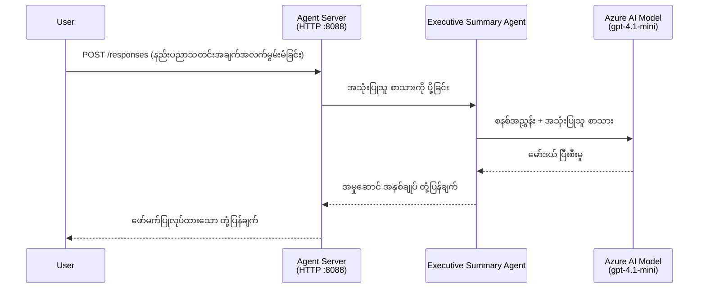
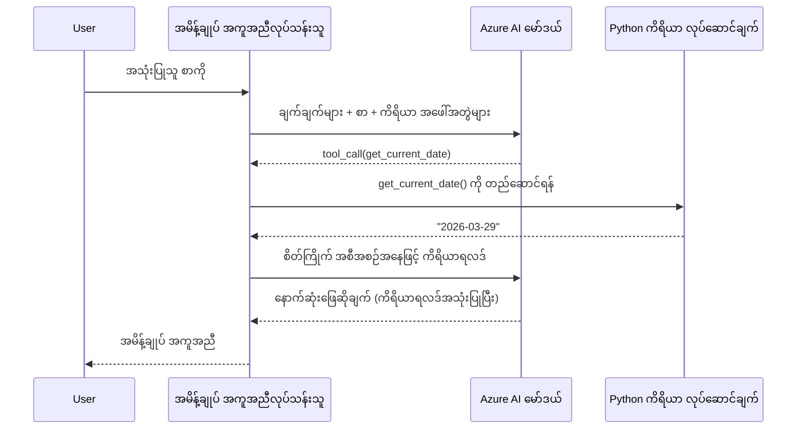

# Module 4 - သတ်မှတ်ချက်များ၊ ပတ်ဝန်းကျင် & တိုက်ရိုက်လိုအပ်ချက်များ ထည့်သွင်းခြင်း

ဒီ module မှာ သင်သည် Module 3 မှ auto-scaffold ဖြစ်တဲ့ agent ဖိုင်တွေကို ကိုယ်တိုင်ပြင်ဆင်ပါမယ်။ ဒါဟာ သင့်ရဲ့ generic scaffold ကို **သင့်ရဲ့** agent အဖြစ်ပြောင်းလဲတဲ့ အစိတ်အပိုင်းဖြစ်ပါတယ် - သတ်မှတ်ချက်များရေးခြင်း၊ ပတ်ဝန်းကျင်အပြောင်းအလဲများ ပြုလုပ်ခြင်း၊ လိုအပ်ရင် tools တွေနဲ့ dependency တွေ ထည့်ခြင်းတို့ဖြစ်ပါတယ်။

> **မှတ်ချက်:** Foundry extension က သင့် project ဖိုင်တွေကို အလိုအလျောက်ထုတ်ပေးထားပါတယ်။ ယခု သင်က အဲဒီဖိုင်တွေကို ပြင်ဆင်နေပါပြီ။ အပြည့်အစုံ agent customized ตัวอย่างကို [`agent/`](../../../../../workshop/lab01-single-agent/agent) ဖိုဒါထဲမှာကြည့်ရှုနိုင်ပါသည်။

---

## အစိတ်အပိုင်းတွေ ဘယ်လိုပေါင်းစပ်ကြသည်

### Request lifecycle (single agent)


> **Tools တွေနဲ့အတူ:** Agent က tools တွေ မှတ်ပုံတင်ထားရင်၊ model က တိုက်ရိုက်ဖြေချက်တစ်ခုထုတ်ပြန်ခြင်းနဲ့အစား tool-call ကို ပြန်ပေးနိုင်ပါတယ်။ framework က tool ကို ဒေသဆိုင်ရာ စမ်းသပ်ပြီး ဇယားဆီကို ပြန် feed လုပ်ပေးပြီး၊ model က နောက်ဆုံးဖြေချက်ကို ဖန်တီးပါတယ်။


---

## Step 1: ပတ်ဝန်းကျင်အပြောင်းအလဲများ သတ်မှတ်ခြင်း

Scaffold က `.env` ဖိုင်တစ်ခုကို placeholder တန်ဖိုးတွေနဲ့ ဖန်တီးထားပါတယ်။ သင် Module 2 မှ အမှန်တကယ်တန်ဖိုးတွေဖြည့်သွင်းရမယ်။

1. သင့် scaffolding project မှာ **`.env`** ဖိုင်ကို ဖွင့်ပါ (project root အတွင်းရှိ).
2. Placeholder တန်ဖိုးတွေကို သင့် Foundry project အချက်အလက် အမှန်တကယ်နဲ့ အစားထိုးပါ:

   ```env
   PROJECT_ENDPOINT=https://<your-account>.services.ai.azure.com/api/projects/<your-project>
   MODEL_DEPLOYMENT_NAME=gpt-4.1-mini
   ```

3. ဖိုင်ကို သိမ်းပါ။

### ဒီ တန်ဖိုးတွေ ဘယ်မှာ ရှာမလဲ

| တန်ဖိုး | ဘယ်လို ရှာမလဲ |
|---------|----------------|
| **Project endpoint** | VS Code မှာ **Microsoft Foundry** sidebar ကိုဖွင့်ပြီး → သင့် project ကို နှိပ်ပြီး → detail view မှာ endpoint URL ပြသပါမည်။ ပုံစံက `https://<account-name>.services.ai.azure.com/api/projects/<project-name>` ဖြစ်ပါသည် |
| **Model deployment name** | Foundry sidebar မှာ သင့် project ကို ဖြည့်ပြီး → **Models + endpoints** အောက်မှာ → ထည့်သွင်းထားသော model နာမည်ကို (ဥပမာ `gpt-4.1-mini`) တွေ့ရပါမည် |

> **လုံခြုံရေး:** `.env` ဖိုင်ကို version control ထဲ သီးမထားပါနဲ့။ ရှိပြီးသား `.gitignore` ထဲမှာ ပါဝင်နေပါပြီ။ မပါလျှင် ထည့်ပါ:
> ```
> .env
> ```


### ပတ်ဝန်းကျင်အပြောင်းအလဲများ မျှဝေမှု

Mapping ဆက်စပ်မှုက: `.env` → `main.py` (`os.getenv` နဲ့ ဖတ်ရှုခြင်း) → `agent.yaml` (deploy အချိန်မှာ container env vars ဖြစ်စေ).

`main.py` မှာ scaffold က အောက်ပါအတိုင်း ဖတ်ပါသည်:

```python
PROJECT_ENDPOINT = os.getenv("AZURE_AI_PROJECT_ENDPOINT") or os.getenv("PROJECT_ENDPOINT")
MODEL_DEPLOYMENT_NAME = os.getenv("AZURE_AI_MODEL_DEPLOYMENT_NAME", os.getenv("MODEL_DEPLOYMENT_NAME", "gpt-4.1-mini"))
```

`AZURE_AI_PROJECT_ENDPOINT` နှင့် `PROJECT_ENDPOINT` နှစ်ခုလုံးလက်ခံပါတယ် (agent.yaml မှာ `AZURE_AI_*` prefix ကိုသုံးသည်).

---

## Step 2: Agent သတ်မှတ်ချက်များ ရေးခြင်း

ဒီက အရေးကြီးဆုံး customization အဆင့်ဖြစ်ပါတယ်။ သတ်မှတ်ချက်တွေက သင့် agent ရဲ့ ကိုယ်ရည်ကိုယ်သွေး၊ အပြုအမူ၊ output ပုံစံနဲ့ လုံခြုံရေး အကန့်အသတ်များကို သတ်မှတ်ပါတယ်။

1. သင့် project ထဲ `main.py` ဖိုင်ကို ဖွင့်ပါ။
2. instruction string ကို ရှာပါ (scaffold က default/generic တစ်ခု ထည့်ပေးထားသည်).
3. အပြည့်အစုံနဲ့ ဖွဲ့စည်းထားသော သတ်မှတ်ချက်များနဲ့ အစားထိုးပါ။

### သင့် instructions တွင် ပါဝင်သင့်သည်များ

| အစိတ်အပိုင်း | ရည်ရွယ်ချက် | ဥပမာ |
|-------------|-------------|-------|
| **Role** | Agent ဘာလုပ်လို့ ဖြစ်သလဲ | "သင်သည် executive summary agent ဖြစ်သည်" |
| **Audience** | ဖြေချက်တွေ ရည်ရွယ်သည့် သူများ | "နည်းပညာ ဆိုင်ရာ နည်းပါးသော အဆင့်ကြီးများ" |
| **Input definition** | အကြောင်းအရာ prompt မျိုး | "နည်းပညာ ပြဿနာ အစီရင်ခံစာများ၊ လုပ်ငန်းသတင်းများ" |
| **Output format** | တိတိကျကျ ဖြေချက်ပုံစံ | "Executive Summary: - ဖြစ်ပျက်ခဲ့သည့်အကြောင်း: ... - စီးပွားရေးသက်ရောက်မှု: ... - နောက်ထပ်အဆင့်: ..." |
| **Rules** | ကန့်သတ်ချက်များနှင့် မလိုလားအပ်သည့် မက်ဆေ့ဂျ်များ | "ပေးထားသော အချက်အလက်ထက် မပိုစရာ မရေးရ" |
| **Safety** | မမှန်မှန် သုံးစွဲမှု နှင့် မမှန်သော စိတ်ကူးများ ကာကွယ်မှု | "Input မရှင်းလင်းရင် ရှင်းလင်းရန် မေးပါ" |
| **Examples** | အပေါင်းအသင်းပြု Input/Output နည်းလမ်းများ | 2-3 မျိုးကွဲ မည်မျှ Input များ ပါသင့်သည် |

### ဥပမာ: Executive Summary Agent သတ်မှတ်ချက်

အောက်တွင် workshop ရဲ့ [`agent/main.py`](../../../../../workshop/lab01-single-agent/agent/main.py) ထဲမှာ အသုံးပြုထားသော instructions:

```python
AGENT_INSTRUCTIONS = """You are an "Explain Like I'm an Executive" agent.

Purpose:
Your job is to translate complex technical or operational information into
clear, concise, and outcome-focused summaries that can be easily understood
by non-technical executives.

Audience:
Senior leaders with limited technical background who care about impact,
risk, and what happens next.

What you must do:
- Rephrase the input so it is understandable to a non-technical audience
- Prioritize clarity, brevity, and outcomes over technical accuracy
- Remove technical jargon, logs, metrics, stack traces, and deep root-cause details
- Translate technical causes into simple cause-and-effect statements
- Explicitly call out business impact
- Always include a clear next step or action
- Maintain a neutral, factual, and calm executive tone
- Do NOT add new facts or speculate beyond the input

Standard Output Structure (always use this wording):

Executive Summary:
- What happened: <plain-language description>
- Business impact: <clear, non-technical impact>
- Next step: <clear action or mitigation>

Rules:
- Keep responses under 100 words
- Do NOT add facts beyond the input
- If input is unclear, ask for clarification
"""
```

4. `main.py` ထဲရှိ လက်ရှိ instructions string ကို သင့် instructions နဲ့ အစားထိုးပါ။
5. ဖိုင်ကို သိမ်းပါ။

---

## Step 3: (Optional) အပြင် tools များ ထည့်သွင်းခြင်း

Hosted agents တွေက တိုက်ရိုက် Python function တွေကို [tools](https://learn.microsoft.com/azure/foundry/agents/concepts/tool-catalog) အဖြစ် အကောင်အထည်ဖော်နိုင်ပါတယ်။ ဒါဟာ prompt-only agents တွေရဲ့ ကန့်သတ်ချက်ထက် code-based hosted agents ရဲ့ အဓိက အားသာချက်ဖြစ်ပါတယ် - သင့် agent က arbitrary server-side logic ကို run လုပ်နိုင်ပါတယ်။

### 3.1 Tool function သတ်မှတ်ခြင်း

`main.py` ထဲ tool function တစ်ခု ထည့်ပါ:

```python
from agent_framework import tool

@tool
def get_current_date() -> str:
    """Returns the current date in YYYY-MM-DD format."""
    from datetime import date
    return str(date.today())
```

`@tool` decorator က ရိုးရိုး Python function ကို agent tool အဖြစ်ပြောင်းပေးပါတယ်။ docstring ကတော့ model က မဖတ်ရှုမယ့် tool အသေးစိတ် ပုံဖေါ်ချက် ဖြစ်ပါတယ်။

### 3.2 Agent နဲ့ tool ကို မှတ်ပုံတင်ခြင်း

`.as_agent()` context manager နဲ့ agent တည်ဆောက်တဲ့အခါ `tools` parameter မှ tool ကိုပေးပါ:

```python
async with AzureAIAgentClient(
    project_endpoint=PROJECT_ENDPOINT,
    model_deployment_name=MODEL_DEPLOYMENT_NAME,
    credential=credential,
).as_agent(
    name="my-agent",
    instructions=AGENT_INSTRUCTIONS,
    tools=[get_current_date],
) as agent:
    server = from_agent_framework(agent)
    await server.run_async()
```

### 3.3 Tool call တွေ ဘယ်လို အလုပ်လုပ်သလဲ

1. အသုံးပြုသူက prompt တစ်ခု ပေးပို့တယ်။
2. Model က prompt, instructions နဲ့ tool ဖော်ပြချက်အရ tool အသုံးလိုတယ် သမိုင်းသဘော များစွာ ဆုံးဖြတ်သည်။
3. Tool လိုအပ်ရင်၊ framework က သင့် Python function ကို ဒေသရဲ့ container အတွင်းမှာ ခေါ်သုံးသည်။
4. Tool က ပြန်လာတဲ့ ရလဒ်ကို model ကို context အနေနဲ့ ပြန်ပေးသည်။
5. Model က နောက်ဆုံးဖြေချက် ဖန်တီးသည်။

> **Tools တွေက server-side မှာ run ဖြစ်တယ်** - user ရဲ့ browser သို့မဟုတ် model ထက်မဟုတ်ဘဲ သင့် container အတွင်းမှာ run တယ်။ ဒါကြောင့် သင်သည် database, API, file system, Python library များကို အသုံးပြုနိုင်ပါသည်။

---

## Step 4: Virtual environment ဖန်တီးခြင်းနှင့် ဖွင့်ခြင်း

Dependency များ တပ်ဆင်ခင် isolate Python environment တစ်ခု ဖန်တီးပါ။

### 4.1 Virtual environment ဖန်တီးခြင်း

VS Code မှ terminal (`Ctrl+` ``) ကိုဖွင့်ပြီး အောက်ပါ command run ပါ:

```powershell
python -m venv .venv
```

ဒါက သင့် project directory ထဲ `.venv` folder ဖန်တီးပေးပါမယ်။

### 4.2 Virtual environment ဖွင့်ခြင်း

**PowerShell (Windows):**

```powershell
.\.venv\Scripts\Activate.ps1
```

**Command Prompt (Windows):**

```cmd
.venv\Scripts\activate.bat
```

**macOS/Linux (Bash):**

```bash
source .venv/bin/activate
```

Terminal prompt အစမှာ `(.venv)` ကို မြင်ရင် virtual environment ဖွင့်ပြီးဖြစ်ပါတော့သည်။

### 4.3 Dependency တပ်ဆင်ခြင်း

Virtual environment ဖွင့်ပြီးနောက် လိုအပ်သော package များကို install ပြုလုပ်ပါ:

```powershell
pip install -r requirements.txt
```

ဒီ packages တွေ တပ်ဆင်မှာဖြစ်သည်:

| Package | ရည်ရွယ်ချက် |
|---------|--------------|
| `agent-framework-azure-ai==1.0.0rc3` | [Microsoft Agent Framework](https://learn.microsoft.com/agent-framework/overview/) အတွက် Azure AI integration |
| `agent-framework-core==1.0.0rc3` | Agent တည်ဆောက်ရန် core runtime (`python-dotenv` ပါဝင်သည်) |
| `azure-ai-agentserver-agentframework==1.0.0b16` | [Foundry Agent Service](https://learn.microsoft.com/azure/foundry/agents/overview) အတွက် hosted agent server runtime |
| `azure-ai-agentserver-core==1.0.0b16` | Core agent server abstraction များ |
| `debugpy` | Python debugging (VS Code ထဲ F5 debugging အတွက်) |
| `agent-dev-cli` | Local development CLI (agent များ စမ်းသပ်ရန်) |

### 4.4 တပ်ဆင်မှု စစ်ဆေးခြင်း

```powershell
pip list | Select-String "agent-framework|agentserver"
```

မျှော်လင့်ချက် အဖြေ:
```
agent-framework-azure-ai   1.0.0rc3
agent-framework-core       1.0.0rc3
azure-ai-agentserver-agentframework 1.0.0b16
azure-ai-agentserver-core  1.0.0b16
```

---

## Step 5: အတည်ပြုခြင်း

Agent က [`DefaultAzureCredential`](https://learn.microsoft.com/azure/developer/python/sdk/authentication/credential-chains#defaultazurecredential-overview) ကို အသုံးပြုပြီး အောက်ပါ authentication နည်းလမ်းများ အဆက်လိုက် စမ်းသပ်သည်:

1. **ပတ်ဝန်းကျင်အပြောင်းအလဲများ** - `AZURE_CLIENT_ID`, `AZURE_TENANT_ID`, `AZURE_CLIENT_SECRET` (service principal)
2. **Azure CLI** - သင့်ရဲ့ `az login` session ကို ရယူသည်
3. **VS Code** - သင် VS Code ကို စတင် login လုပ်ထားတဲ့ account ကို သုံးသည်
4. **Managed Identity** - Azure မှာ run ရင် (deploy အချိန်)

### 5.1 Local development အတွက် စစ်ဆေးခြင်း

အနည်းဆုံး အောက်ပါနည်းဖြင့် အောင်မြင်ရမည်:

**ရွေးချယ်မှု A: Azure CLI (အကြံပြု)**

```powershell
az account show --query "{name:name, id:id}" --output table
```

မျှော်လင့်ချက်: သင့် subscription နာမည်နှင့် ID ကို ပြပါလိမ့်မည်။

**ရွေးချယ်မှု B: VS Code မှာ လက်မှတ်ထိုးထားခြင်း**

1. VS Code ရဲ့ ဘယ်ဘက် အောက်ဆုံးမှာ **Accounts** icon ကို ရှာပါ။
2. သင့်အကောင့်နာမည်ကို မြင်ရင် authentication ပြီးဖြစ်သည်။
3. မမြင်ရင် icon ကို နှိပ်ပြီး → **Sign in to use Microsoft Foundry** လုပ်ပါ။

**ရွေးချယ်မှု C: Service principal (CI/CD အတွက်)**

```powershell
$env:AZURE_TENANT_ID = "<your-tenant-id>"
$env:AZURE_CLIENT_ID = "<your-client-id>"
$env:AZURE_CLIENT_SECRET = "<your-client-secret>"
```

### 5.2 ပျမ်းမျှ authentication ပြဿနာ

Azure account များစွာ ဖြင့် Login ထားရင်၊ မှန်ကန်သော subscription ကိုရွေးချယ်ထားသည်ကို သေချာစေပါ:

```powershell
az account set --subscription "<your-subscription-id>"
```

---

### စစ်ဆေးရန် စာရင်း

- [ ] `.env` ဖိုင်တွင် `PROJECT_ENDPOINT` နှင့် `MODEL_DEPLOYMENT_NAME` အမှန်တကယ်ရှိသည် (placeholder မဟုတ်)
- [ ] Agent instructions ကို `main.py` မှာ ကိုယ်တိုင်ချိန်ညှိထားသည် - role, audience, output format, rules, safety constraints ကို သတ်မှတ်ထားသည်
- [ ] (Optional) Custom tools များ သတ်မှတ်ပြီး မှတ်ပုံတင်ထားသည်
- [ ] Virtual environment ရှိပြီး ဖွင့်ထားသည် (`(.venv)` ကို terminal prompt မှာ မြင်ရသည်)
- [ ] `pip install -r requirements.txt` မှ အမှားမရှိဘဲ ပြီးစီးသည်
- [ ] `pip list | Select-String "azure-ai-agentserver"` မှ package တပ်ဆင်ပြီးသည် ပြသည်
- [ ] Authentication မှန်ကန်သည် - `az account show` က subscription ပြန်ပြောသည် သို့မဟုတ် VS Code မှာ login ပြီးဖြစ်သည်

---

**ပြီးခဲ့သည်:** [03 - Create Hosted Agent](03-create-hosted-agent.md) · **ဆက်သွယ်ရန်:** [05 - Test Locally →](05-test-locally.md)

---

<!-- CO-OP TRANSLATOR DISCLAIMER START -->
**တားမြစ်ချက်**:  
ဤစာရွက်စာတမ်းသည် AI ဘာသာပြန်ဝန်ဆောင်မှု [Co-op Translator](https://github.com/Azure/co-op-translator) ကို အသုံးပြု၍ ဘာသာပြန်ထားခြင်းဖြစ်သည်။ တိကျမှန်ကန်မှုအတွက် ကြိုးစားသော်လည်း အလိုအလျောက်ဘာသာပြန်မှုတွင် အမှားများ သို့မဟုတ် မှန်ကန်မှုမရှိမှုများ ပါဝင်နိုင်ကြောင်း သတိပြုပါ။ မူရင်းစာရွက်စာတမ်းကို သဘာဝဘာသာဖြင့် သာမန္နှင့် ယုံကြည်စိတ်ချရသော အချက်အလက်အရင်းမြစ်အဖြစ် ဆင်ခြင်သင့်ပါသည်။ အရေးကြီးသော အချက်အလက်များအတွက် ဗမာဘာသာစကားကျွမ်းကျင် ပရော်ဖက်ရှင်နယ်သူများ၏ ဘာသာပြန်ခြင်းကို အကြံပြုပါသည်။ ဤဘာသာပြန်မှုကို အသုံးပြုခြင်းကြောင့် ဖြစ်ပေါ်လာသည့် နားလည်မှုမှားခြင်း သို့မဟုတ် မှားယွင်းသည့်သဘောထားများအတွက် ကျွန်ုပ်တို့သည် တာဝန်မရှိပါ။
<!-- CO-OP TRANSLATOR DISCLAIMER END -->