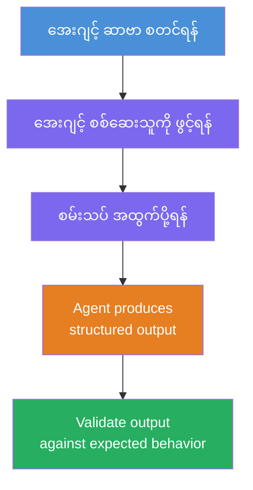
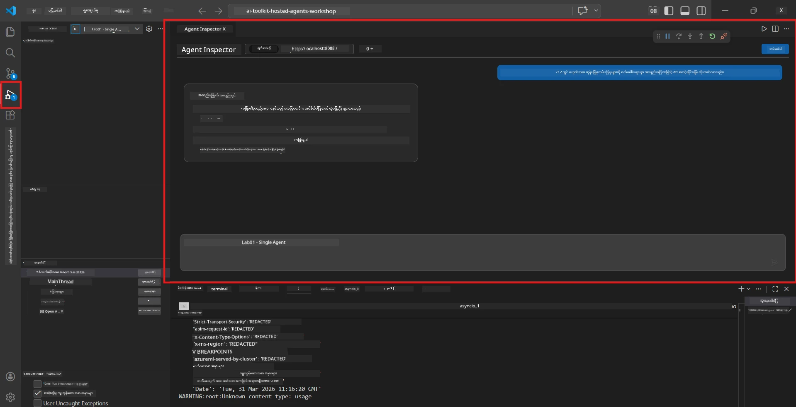
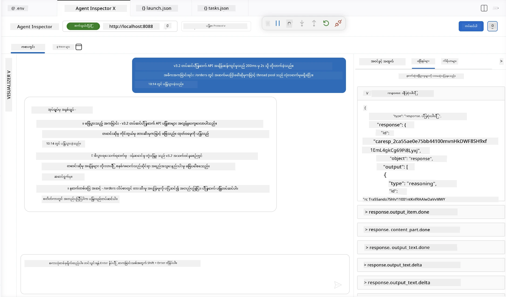

# မော်ဂျူး ၄ - ဒေသတွင်း စမ်းသပ်ခြင်း

⏱️ ~၁၀ မိနစ်

ဤမော်ဂျူးတွင် သင်၏အေဂျင့်ကို ဒေသတွင်းတွင် စမ်းသပ်ပြီး **ပျော်ရွှင်စရာ လမ်းကြောင်း လုပ်ဆောင်မှု စမ်း သပ်မှုများဖြင့်** သေချာစွာ လုပ်ဆောင်နေကြောင်း အတည်ပြုပါမည်။ သင်သည် Agent Inspector (မြင်သာသော UI) သို့မဟုတ် တိုက်ရိုက် HTTP ခေါ်ဆိုမှုများကို အသုံးပြု၍ အေဂျင့်သည် ဖွဲ့စည်းထားသော၊ တိကျမှန်ကန်သော ဖြေကြားမှုများ ထုတ်လုပ်ခြင်းကို အတည်ပြုပါလိမ့်မည်။

### ဒေသတွင်း စမ်းသပ်မှု လုပ်ငန်းစဉ်



---

## ရွေးချယ်စရာ ၁: F5 ခလုတ်နှိပ်၍ Agent Inspector ဖြင့် Debug မည် (အကြံပြု)

### Debugger ကို စတင်ပါ

၁။ **executive-summary-agent/** ဖိုင်တွဲကို တိုက်ရိုက် VS Code တွင်ဖွင့်ပါ (`File → Open Folder`)။
၂။ **Run and Debug** ပန်နယ်ကိုဖွင့်ပါ (`Ctrl+Shift+D`)။
၃။ dropdown မှ **Debug Local Agent Server** ကို ရွေးချယ်ပါ။
၄။ **F5** နှိပ်ပါ (သို့မဟုတ် ▶ Start Debugging ကိုနှိပ်ပါ)။

> ⚠️ **အရေးကြီးချက် - သင့် Python Interpreter ကို ရွေးချယ်ပါ**
> သင် "ModuleNotFoundError" ရရှိပါက သို့မဟုတ် debugger စတင်၍ မရပါက VS Code ကို သင့် virtual environment ကို အသုံးပြုရန် ပြန်ပြောပါ:
  > ၁။ `Ctrl+Shift+P` ကိုနှိပ်၍ **Python: Select Interpreter** လိုင်းကို ရိုက်ထည့်ပါ။
  > ၂။ သင့် project ရဲ့ `.venv` ဖိုလ်ဒါ ထဲရှိ interpreter (ဥပမာ `.\.venv\Scripts\python.exe` Windows မှာ) ကို ရွေးချယ်ပါ။
  > ၃။ Debug session ကို ပြန်စတင်ပါ။
> အမှားနဲ့လည်း ဆက်လက်ဖြစ်နေပါက သင်၏ `tasks.json` ဖိုင်ကို လက်ဖြင့် အောက်ပါအတိုင်း ပြင်ဆင်ပါ:
  > ၁။ `.vscode/tasks.json` ဖိုင်ကို သွားပါ
  > ၂။ `Run Agent/Workflow HTTP Server` ဟူသော command ကို ရွေးချယ်ပါ
  > ၃။ command value ကို `"value": "${workspaceFolder}/.venv/bin/python",` အဖြစ် ပြောင်းလဲပါ။

### ဖြစ်ပေါ်ပုံ

၁။ HTTP server ကို `http://localhost:8088/responses` တွင် စတင်ပြေးဆွဲမည်။
၂။ **Agent Inspector** ပန်နယ်သည် အလိုအလျောက်ဖွင့်မည် - စမ်းသပ်ရန် မြင်သာသည့် chat အင်တာဖေ့စ်။
၃။ `main.py` တွင် breakpoints ဖွင့်ထားသည်။

Terminal ကို ကြည့်ရှုပါ -
```
Starting executive summary hosted agent
Executive agent server running on http://localhost:8088
```

> **Agent Inspector ဖွင့်ရာမရှိပါက** `Ctrl+Shift+P` → **Foundry Toolkit: Open Agent Inspector** ကို နှိပ်ပါ။



> *ဓာတ်ပုံတွင် ရှေးဟောင်းသော 'AI TOOLKIT' အမှတ်တံဆိပ် များ ပြသထားနိုင်ပါသည်။*

---

## ရွေးချယ်စရာ ၂: Terminal မှတဆင့် စမ်းသပ်ခြင်း (အခြားလမ်း)

Terminal တစ်ခုတွင် agent ကို စတင်ပြီး၊ နောက်ထပ် terminal မှ တောင်းဆိုချက်များ ပို့ပါ:

```bash
# Terminal 1: အေးဂျင့်ကို စတင်ပါ။
cd executive-summary-agent/
source .venv/bin/activate
python main.py
```

```bash
# Terminal 2: စမ်းသပ်ပို့ရန် (curl)
curl -sS -X POST http://localhost:8088/responses \
  -H "Content-Type: application/json" \
  -d '{"input": "The API latency increased due to thread pool exhaustion caused by sync calls in v3.2.", "stream": false}'
```

---

## အခြေအနေ စမ်းသပ်မှုများ - ပျော်ရွှင်စရာ လမ်းကြောင်း လုပ်ဆောင်မှု အတည်ပြုမှု

အောက်ပါ စတင် သုံးခု **အားလုံးကို** ပြေးပါ။ ၎င်းတို့သည် သင့် အေဂျင့် အတွက် တကယ့် input များအတွက် မှန်ကန်စွာ ဖွဲ့စည်းထားသော output ထုတ်လုပ်မှုကို အတည်ပြုပါသည်။



### အခြေအနေ ၁: IT ဖြစ်ရပ် - API စိတ်လှုပ်ရှားမှု မြင့်တက်မှု

**Input:**
```
The API latency increased from 200ms to 2s after deploying v3.2.
Root cause: thread pool starvation from synchronous calls in /orders.
Rolled back at 10:14.
```

**မျှော်မှန်းကြည့်ရှုချက်:**
- ✅ "Executive Summary" ဖွဲ့စည်းမှု (ဘာဖြစ်ပျက်သည် / စီးပွားရေး သက်ရောက်မှု / နောက်တစ်ဆင့်)
- ✅ နည်းပညာဆိုင်ရာ စကားလုံးမပါ ( "thread pool" မပါ၊ "/orders" မပါ၊ "v3.2" မပါ)
- ✅ စီးပွားရေး သက်ရောက်မှုကို ရှင်းလင်းစွာ ဖော်ပြပါ (ဥပမာ - အသုံးပြုသူများ ဆက်တိုက် မျှော်လင့်ချက်ရှိခြင်း)
- ✅ နောက်တစ်ဆင့် ပါရှိသည် (ဥပမာ - ပြင်ဆင်မှု ဖြန့်ချိ၊ စောင့်ကြည့်မှု တပ်ဆင်)

---

### အခြေအနေ ၂: ဒေတာဓာတ်တိုးလမ်းကြောင်း - ETL မအောင်မြင်ခြင်း

**Input:**
```
The nightly ETL job failed because the upstream schema changed. APAC dashboards show missing data.
```

**မျှော်မှန်းကြည့်ရှုချက်:**
- ✅ ဒေတာ refresh မအောင်မြင်မှုကို ရိုးရိုးလေး ရှင်းပြပါ
- ✅ APAC dashboard များသက်ရောက်မှုကို ဖော်ပြပါ
- ✅ ပြုပြင် သတ်မှတ်ချက် နောက်တစ်ဆင့် ပါရှိသည်
- ✅ "ETL", "schema" နှင့် နည်းပညာစွဲစကားများ မပါဝင်ပါ

---

### အခြေအနေ ၃: လုံခြုံရေး - အထွက် အသုံးပြုချက် ဖော်ထုတ်ခြင်း

**Input:**
```
Static analysis flagged a hardcoded secret in the repository.
The secret may have been exposed in commit history.
```

**မျှော်မှန်းကြည့်ရှုချက်:**
- ✅ အေဂျင့်နှင့် သက်ဆိုင်သည့် credential/လုံခြုံရေး ပြဿနာကို လူသိလူကြား အဆင်ပြေစွာ ဖော်ပြပါ
- ✅ ဖြစ်နိုင်ချေရှိသောအားနည်းချက် (မသိမ်းထားသော တင်သွင်းခြင်း) ကို ချင့်ချိန်ပြပါ
- ✅ ပြုပြင်သည့် အချက်များ (credential ပြောင်းလဲမှု၊ စစ်ဆေးခြင်း) ပါပါသည်
- ✅ "static analysis", "commit history", "hardcoded" စသောစကားလုံး မပါဝင်ပါ

---

## အတည်ပြုမှု လက္ခဏာများ

အခြေအနေတိုင်းအတွက် စစ်ဆေးကြည့်ပါ -

| # | လက္ခဏာများ | ဖြတ်တောက်မှု အခြေအနေ |
|---|----------|---------------|
| 1 | **ဖွဲ့စည်းမှု** | "Executive Summary" ပုံစံကို သုံးပြီး သုံးခုလုံးပါဝင်သည် |
| 2 | **ရိုးရှင်းသောဘာသာစကား** | အမှုဆောင် မဖြစ်လေတဲ့ နည်းပညာ စကားလုံး မပါဝင်ပါ |
| 3 | **တိကျမှန်ကန်မှု** | summary တွင် input နှင့် ကိုက်ညီသည် - ဖန်တီးထားသော အသေးစိတ် မပါဝင်ပါ |
| 4 | **အတိုချုပ်မှု** | ဖြေကြားချက်သည် စကားလုံး ၁၀၀ ကျော် မဟုတ်ပါကြောင်း |
| 5 | **နောက်တစ်ဆင့်** | ဖော်ပြသည့် တိုက်ရိုက် ရှင်းလင်းသော အရေးယူမှု သို့မဟုတ် လျော့ပျော့မှု |

---

## Debugging အကြံပြုချက်များ

| ပြဿနာ | ဖြေရှင်းနည်း |
|-------|-----|
| Agent မစတင်ပါ | `.env` တန်ဖိုးများစစ်ဆေးပါ၊ venv ဖွင့်ထားသည်ကို အတည်ပြုပါ၊ `pip install -r requirements.txt` ကို ဆောင်ရွက်ပါ |
| ဖြေကြားချက် ရှင်းပေါ်မှုမရှိ | `main.py` ၌ ညွှန်ကြားချက်များ စစ်ဆေး၍ output ဖော်ပြပုံကို သေချာစွာ သတ်မှတ်ပါ |
| ဖြေကြားချက်၌ စကားလုံးများပါဝင်သည် | "နည်းပညာစကားလုံးများ ဖယ်ရှားရန်" စည်းမျဉ်းများအား နည်းလမ်းပြောင်း ဆောင်ရွက်ပါ |
| Agent Inspector မဖွင့်ပါ | `Ctrl+Shift+P` → **Foundry Toolkit: Open Agent Inspector** ကိုနှိပ်ပါ |
| Terminal တွင် Model အမှားများ | `AZURE_AI_MODEL_DEPLOYMENT_NAME` ကို မှန်ကန်စွာ ရိုက်ထည့်သည်ကို စစ်ဆေးပါ (အက္ခရာ ကြီး/သေး သတိထား) |

---

### ✅ စစ်ဆေးရန် အချက်များ

- [ ] Agent ကို ဒေသတွင်းတွင် အမှားမရှိစွာ စတင်ပါ
- [ ] Agent Inspector ဖွင့်ပြီး chat အင်တာဖေ့စ် ပြသပါ (F5 အသုံးပြုပါက)
- [ ] **အခြေအနေ ၁** (IT ဖြစ်ရပ်) - ဖွဲ့စည်းထားသော Executive Summary၊ စကားလုံး မပါဝင်ပါ
- [ ] **အခြေအနေ ၂** (ဒေတာ လမ်းကြောင်း) - သက်ဆိုင်သော အတိုချုပ်မှုနှင့် စီးပွားရေး သက်ရောက်မှု
- [ ] **အခြေအနေ ၃** (လုံခြုံရေးသတိပေးချက်) - သင့်လျော်သော အန္တရာယ် ဆက်သွယ်မှု
- [ ] အားလုံးတွင် သတ်မှတ်ထားသော output ဖွဲ့စည်းမှုနှင့် ကိုက်ညီပါသည်

> **သင့်ဖြေကြားချက်များကို သိမ်းဆည်းရန်** (ကူးယူပါ သို့မဟုတ် စကရင်ရှော့) - ကလောဒ်ရလဒ်နှင့် Module 06 တွင် နှိုင်းယှဉ်မည်။

---

**ရှေ့တန်း:** [03 - Configure & Code](03-configure-and-code.md) · **နောက်တန်း:** [05 - Deploy to Foundry →](05-deploy-to-foundry.md)

---

<!-- CO-OP TRANSLATOR DISCLAIMER START -->
**ပြောကြားချက်**
ဤစာတမ်းကို AI ဘာသာပြန်ဝန်ဆောင်မှု [Co-op Translator](https://github.com/Azure/co-op-translator) အသုံးပြု၍ ဘာသာပြန်ထားပါသည်။ ကျွန်ုပ်တို့သည် တိကျမှန်ကန်မှုအတွက် ကြိုးပမ်းနေသော်လည်း၊ စက်ကိရိယာဘာသာပြန်ခြင်းများတွင် အမှားများ သို့မဟုတ် မှားယွင်းချက်များ ပါဝင်နိုင်ကြောင်း သတိပြုပါရန် လိုအပ်ပါသည်။ မူလစာတမ်းကို မူရင်းဘာသာဖြင့်သာ ယုံကြည်စိတ်ချရသော အချက်အလက်အဖြစ် သတ်မှတ်သင့်သည်။ အရေးကြီးသည့် သတင်းအချက်အလက်များအတွက် ပရော်ဖက်ရှင်နယ် လူသားဘာသာပြန်သူဝန်ဆောင်မှုကို အကြံပြုပါသည်။ ဤဘာသာပြန်ချက်ကို အသုံးပြုခြင်းမှ ဖြစ်ပေါ်လာသော နားလည်မှုကွာခြားမှုများ သို့မဟုတ် မမှန်ကန်သော အသုံးပြုမှုများအတွက် ကျွန်ုပ်တို့ တာဝန်မခံပါ။
<!-- CO-OP TRANSLATOR DISCLAIMER END -->