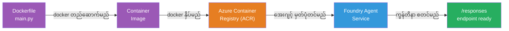
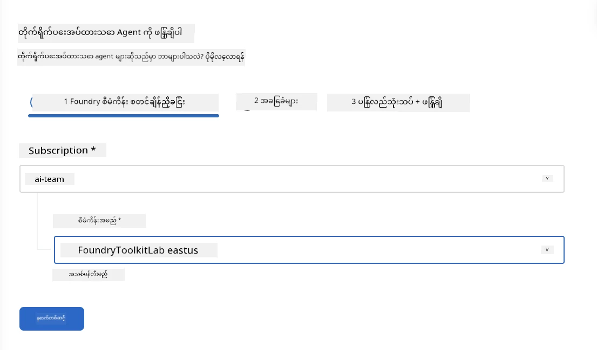
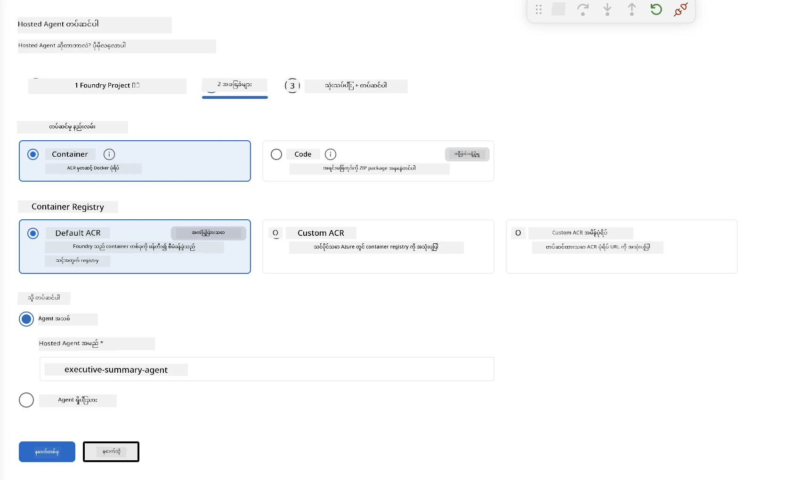
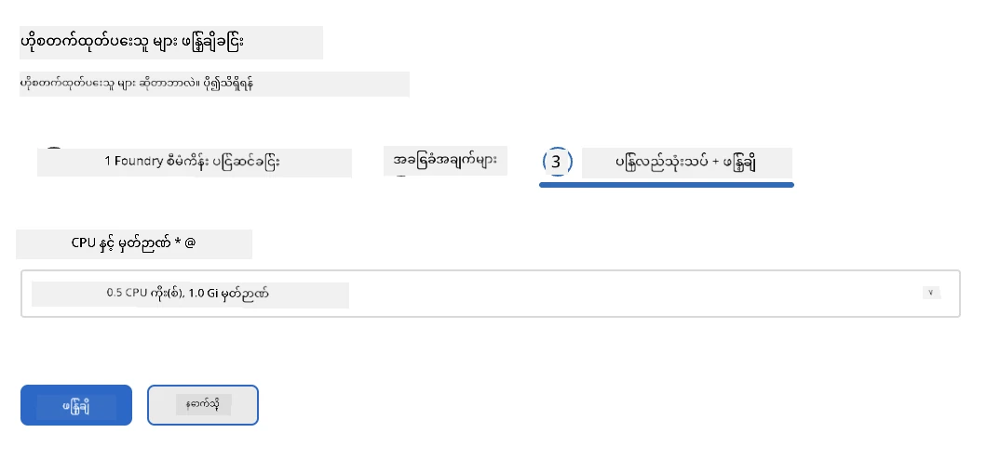
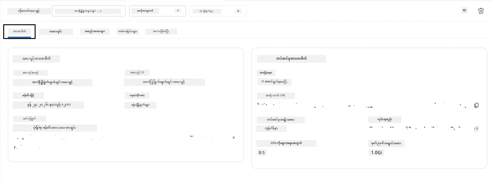

# Module 5 - Foundry Agent Service သို့ ထည့်သွင်းခြင်း

⏱️ ~10 မိနစ်

> ⚠️ **Path B အသုံးပြုသူများအတွက်:** ဤ module သည် Foundry စာရင်းပေးသွင်းမှု လိုအပ်သည်။ Foundry Local ကို အသုံးပြုနေပါက [Module 07 - အကျဉ်းချုပ်](07-summary.md)သို့ ကျော်ဖြတ်ပါ။ သင်သည် ဒေသဆိုင်ရာ ဖွံ့ဖြိုးတိုးတက်ရေး လုပ်ငန်းစဉ်ကို အောင်မြင်စွာ ပြီးမြောက်ခဲ့ပါပြီ။

ဤ module တွင်၊ သင့်ဒေသတွင် စမ်းသပ်ပြီးဖြစ်သော agent ကို Microsoft Foundry မှာ **Hosted Agent** အနေနှင့် တင်သွင်းပါမည်။ ထည့်သွင်းခြင်းသည် container ပုံရိပ် တည်ဆောက်ခြင်း၊ Azure Container Registry သို့ ရုပ်ပုံသွင်းခြင်းနှင့် Foundry ၏ စီမံခန့်ခွဲထားသော အစီအစဉ်တွင် agent ကို စတင် လည်ပတ်စေရန် ဖြစ်သည်။

### ထည့်သွင်းခြင်း လုပ်ငန်းစဉ်

---

## မရှိမဖြစ်စစ်ဆေးရန်

ထည့်သွင်းရန် မတိုင်မီ စစ်ဆေးပါ-

- [ ] Agent သည် [Module 04](04-test-locally.md) မှ ဒေသဆိုင်ရာ စမ်းသပ်မှု ၃ ခုစလုံး ဖြတ်ကျော်ရမည်
- [ ] သင်တွင် ပရောဂျက်အဆင့်တွင် **Azure AI User** အခန်းကဏ္ဍ ရှိရမည် ([Module 01, RBAC ခန့်အပ်ခြင်း](01-setup.md#deploy-a-model--assign-rbac))
- [ ] VS Code တွင် Azure သို့ လက်မှတ်ထိုးထားပြီးဖြစ်ရမည် (အကောင့် အိုင်ကွန်တွင် အသုံးပြုသူအမည်ပြသ)

---

## အဆင့် 1: ထည့်သွင်းခြင်း စတင်ခြင်း

### ရွေးချယ်စရာ A: Agent Inspector မှ ပြုလုပ်ခြင်း (အကြံပြု)

Agent Inspector ဖွင့်ထားသည်ဆိုပါက (စမ်းသပ်နေစဉ်):
1. အပေါ်ညာဘက်ထောင့်ရှိ **Deploy** ခလုတ်ကို နှိပ်ပါ (မိုးတိမ် အိုင်ကွန် ↑)။

### ရွေးချယ်စရာ B: Command Palette မှ ထည့်သွင်းခြင်း

1. `Ctrl+Shift+P` နှိပ် → **Foundry Toolkit: Deploy Hosted Agent** ကို ရွေးချယ်ပါ။

---

## အဆင့် 2: ထည့်သွင်းခြင်းကို သတ်မှတ်ခြင်း

ဝစ်ဇာတ်သည် သင့်အား တောင်းဆိုမည်မှာ-

| တောင်းဆိုမှု | ရွေးချယ်မှု |
|--------|-----------|
| **စာရင်းပေးသွင်းမှု** | သင့် Azure Subscription |
| **ပရောဂျက် သတ်မှတ်ချက်** | သင့် Foundry ပရောဂျက် (ဥပမာ - `workshop-agents`) |

**next** ကို နှိပ်၍ agent ကို သတ်မှတ်ပါ။

| တောင်းဆိုမှု | ရွေးချယ်မှု |
|--------|-----------|
| **ထည့်သွင်းမှု နည်းလမ်း** | Container |
| **Container registry** | **ပုံမှန် ACR** (Microsoft Foundry သည် သင့်အတွက် တည်ဆောက်၍ စီမံသည်) |
| **တင်ရန်** | အAgent အသစ် (နာမည်, `executive-summary-agent`) |

**next** ကို နှိပ်၍ သုံးသပ်ပြီး ထည့်သွင်းပါ။

| တောင်းဆိုမှု | ရွေးချယ်မှု |
|--------|-----------|
| **CPU နှင့် မှတ်ဉာဏ်** | **0.25 CPU cores, 0.5 Gi memory** (workshop အတွက် လုံလောက်သည်) |

---

## အဆင့် 3: ထည့်သွင်းပြီး ကြည့်ရှုမည်

1. **Deploy** ကိုနှိပ်ပါ။
2. **Output** ပန်းကန် (dropdown မှ **Microsoft Foundry** ရွေးပါ) ကိုကြည့်ပါ။
3. ထည့်သွင်းခြင်းသည် အောက်ပါ အဆင့်များဖြင့် ဆောင်ရွက်သည်။
   - **Docker build** - Dockerfile မှ container တည်ဆောက်သည်
   - **Docker push** - ပုံရိပ်ကို ACR သို့ ထုတ်ပို့သည် (ပထမဆုံးထည့်သွင်းရာတွင် 1-3 မိနစ်)
   - **Agent မှတ်ပုံတင်ခြင်း** - Foundry တွင် hosted agent ဖန်တီးသည်
   - **Container စတင်ခြင်း** - system-managed identity ဖြင့် စတင်သည်

4. ပြီးဆုံးသောအခါ အကြောင်းကြားချက်တစ်ခု ထွက်ပေါ်ပါမည်-
   > **my-agent ကို အောင်မြင်စွာ ထည့်သွင်းပြီးပါပြီ။** `View logs` `Run agent`

5. **Run agent** ကိုနှိပ်ပြီး Agent Playground ကို ဖွင့်ပါ။

### ထည့်သွင်းခြင်း အခြေအနေတန်ဖိုးများ

| အခြေအနေ | အဓိပ္ပါယ် |
|--------|---------|
| **Running** | Container ပြင်ဆင်ပြီး၊ agent တုံ့ပြန်နေသည် |
| **Pending** | Container စတင်နေသည် - 30-60 စက္ကန့် စောင့်ပါ |
| **Failed** | မှတ်တမ်းများ စစ်ဆေးပါ (အောက်တွင် ပြင်ဆင်နည်းရှိသည်) |

---

## ပုံမှန်ထည့်သွင်းခြင်း အမှားများ

| အမှား | အကြောင်းရင်း | ပြင်ဆင်နည်း |
|-------|-----------|-----|
| `agents/write` ခွင့်လွှတ် မရရှိမှု | ပရောဂျက်အဆင့်တွင် **Azure AI User** အခန်းကဏ္ဍ မရှိခြင်း | [Module 01, RBAC ခန့်အပ်ခြင်း](01-setup.md#deploy-a-model--assign-rbac) ကိုကြည့်ပါ |
| Docker မပတ်သွားခြင်း | Docker Desktop မစတင်ခြင်း | Docker Desktop စတင်ပါ → `docker info` ဖြင့် အတည်ပြုပါ |
| ACR ခွင့်ပြုချက်ပြဿနာ | Managed identity မှ ပုံရိပ်ဆွဲကျွမ်းနိုင်ခြင်း မရှိခြင်း | [Module 08 - ပြဿနာတက်သော အခြေအနေများ](08-troubleshooting.md) ကိုကြည့်ပါ |

---

### ✅ စစ်ဆေးချက်

- [ ] ထည့်သွင်းခြင်း အမှားမရှိ စတင်ပြီးစီးပြီးပြီ
- [ ] Agent သည် Foundry ဘေးဖက် sidebar တွင် **Hosted Agents (Preview)** အောက်တွင် ပြထားသည်
- [ ] Container အခြေအနေသည် **Running** ဟု ပြသည်
- [ ] Agent Playground tab ကိုဖွင့်ပြီး agent အသေးစိတ်နှင့် endpoint URL ကို ပြပြီးဖြစ်သည်

---

**ယခင်:** [04 - ဒေသဆိုင်ရာ စမ်းသပ်ခြင်း](04-test-locally.md) · **နောက်တစ်ခု:** [06 - Playground တွင် သက်သေခံခြင်း →](06-verify-in-playground.md)

---

<!-- CO-OP TRANSLATOR DISCLAIMER START -->
**ပြောကြားချက်**
ဤစာတမ်းကို AI ဘာသာပြန်ဝန်ဆောင်မှု [Co-op Translator](https://github.com/Azure/co-op-translator) အသုံးပြု၍ ဘာသာပြန်ထားပါသည်။ ကျွန်ုပ်တို့သည် တိကျမှန်ကန်မှုအတွက် ကြိုးပမ်းနေသော်လည်း၊ စက်ကိရိယာဘာသာပြန်ခြင်းများတွင် အမှားများ သို့မဟုတ် မှားယွင်းချက်များ ပါဝင်နိုင်ကြောင်း သတိပြုပါရန် လိုအပ်ပါသည်။ မူလစာတမ်းကို မူရင်းဘာသာဖြင့်သာ ယုံကြည်စိတ်ချရသော အချက်အလက်အဖြစ် သတ်မှတ်သင့်သည်။ အရေးကြီးသည့် သတင်းအချက်အလက်များအတွက် ပရော်ဖက်ရှင်နယ် လူသားဘာသာပြန်သူဝန်ဆောင်မှုကို အကြံပြုပါသည်။ ဤဘာသာပြန်ချက်ကို အသုံးပြုခြင်းမှ ဖြစ်ပေါ်လာသော နားလည်မှုကွာခြားမှုများ သို့မဟုတ် မမှန်ကန်သော အသုံးပြုမှုများအတွက် ကျွန်ုပ်တို့ တာဝန်မခံပါ။
<!-- CO-OP TRANSLATOR DISCLAIMER END -->