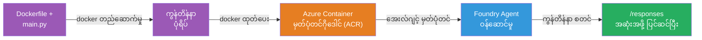
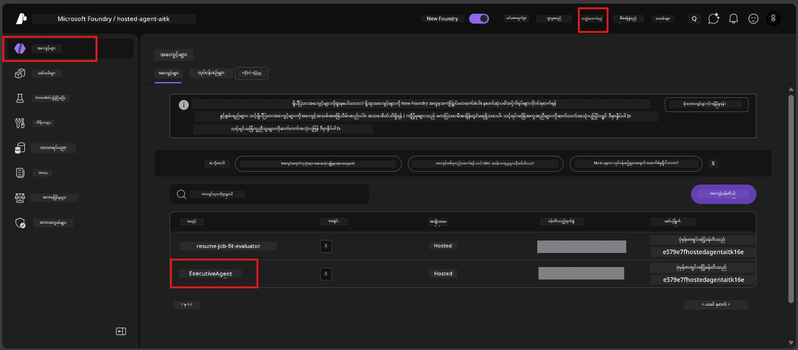

# Module 6 - Deploy to Foundry Agent Service

ဤ module တွင် သင့်ရဲ့ locally-tested agent ကို Microsoft Foundry တွင် [**Hosted Agent**](https://learn.microsoft.com/azure/foundry/agents/concepts/hosted-agents) အဖြစ် ထည့်သွင်းပေးမည် ဖြစ်သည်။ Deployment လုပ်ငန်းစဉ်တွင် သင့် project မှ Docker container image တစ်ခုကို တည်ဆောက်ပြီး၊ [Azure Container Registry (ACR)](https://learn.microsoft.com/azure/container-registry/container-registry-intro) သို့ပို့ပေးပြီး၊ [Foundry Agent Service](https://learn.microsoft.com/azure/foundry/agents/overview) တွင် hosted agent version အသစ်တစ်ခု ဖန်တီးပေးသည်။

### Deployment pipeline


---

## Prerequisites check

Deployment စတင်မပြုလုပ်မီ အောက်ပါအချက်များအားလုံးကို ပြန်လည်စစ်ဆေးပါ။ ၎င်းများကို ကျော်လွှားခြင်းသည် deployment မအောင်မြင်ခြင်းရဲ့ အများဆုံး အကြောင်းရင်းဖြစ်သည်။

1. **Agent သည် local smoke test များကို ကျော်လွှားသည်။**
   - သင်သည် [Module 5](05-test-locally.md) တွင် စမ်းသပ်မှု ၄ ခုလုံးကို ပြီးမြောက်ပြီး၊ agent သည်မှန်ကန်စွာ တုံ့ပြန်သည်။

2. **သင်မှာ [Azure AI User](https://learn.microsoft.com/azure/foundry/concepts/rbac-foundry#built-in-roles) အခန်းကဏ္ဍရှိသည်။**
   - ၎င်းကို [Module 2, Step 3](02-create-foundry-project.md) တွင် သတ်မှတ်ပေးထားသည်။ မသေချာပါက ယခုစစ်ဆေးပါ-
   - Azure Portal → သင့် Foundry **project** resource → **Access control (IAM)** → **Role assignments** tab → သင့်နာမည်ကို ရှာဖွေ၍ → **Azure AI User** ပါဝင်မှုကို အတည်ပြုပါ။

3. **သင်သည် VS Code တွင် Azure သို့ လက်မှတ်ထိုးထားသည်။**
   - VS Code ၏ ဘယ်ဘက်ခြမ်းအောက်တွင် Accounts အိုင်ကွန်ကို စစ်ဆေးပါ။ သင့်အကောင့်နာမည် မြင်နိုင်ရန် ဖြစ်ရမည်။

4. **(Optional) Docker Desktop ဖွင့်ထားသည်။**
   - Docker သည် Foundry extension က local build ကို တောင်းဆိုလျှင်သာ လိုအပ်သည်။ ပိုမိုအများကြီးတွင် extension သည် deployment အတွင်း container build များကို အလိုအလျောက် စီမံပေးသည်။
   - Docker သွင်းထားပါက အလုပ်လုပ်နေမှုကို စစ်ဆေးပါ - `docker info`

---

## Step 1: Start the deployment

Deployment ပြုလုပ်နိုင်သည့် နည်းလမ်း နှစ်ခုရှိပြီး၊ နှစ်ခုစလုံးသည် ရလဒ်တူသည်။

### Option A: Agent Inspector မှ Deploy လုပ်ခြင်း (အကြံပြု)

Agent ကို debugger (F5) ဖြင့် လည်ပတ်နေပြီး Agent Inspector ဖွင့်ထားပါက-

1. Agent Inspector panel ၏ **ညာဘက်အပေါ်ထောင့်** ကို ကြည့်ပါ။
2. **Deploy** ခလုတ် (တူဖိုးတိမ်အိုင်ကွန်း၊ အပေါ်ခြမ်းမှာ မြှောက်တက်သည့် အာရုံသော မောက်) ကို နှိပ်ပါ။
3. Deployment wizard ပေါ်လာမည်။

### Option B: Command Palette မှ Deploy လုပ်ခြင်း

1. `Ctrl+Shift+P` နှိပ်၍ **Command Palette** ကို ဖွင့်ပါ။
2. ရိုက်ထည့်သည် - **Microsoft Foundry: Deploy Hosted Agent** → ရွေးပါ။
3. Deployment wizard ပေါ်လာမည်။

---

## Step 2: Configure the deployment

Deployment wizard သည် သင့်အား နည်းပြလိုက် ပြုလုပ်မည်။ အောက်တွင် မေးမြန်းတောင်းဆိုချက်များကို ဖြည့်ပါ-

### 2.1 Target project ရွေးချယ်ခြင်း

1. Foundry project များကို ဖော်ပြထားသော dropdown တစ်ခု ပေါ်မည်။
2. Module 2 တွင် တည်ဆောက်ထားသော project ကို ရွေးချယ်ပါ (ဥပမာ - `workshop-agents`)။

### 2.2 Container agent ဖိုင် ရွေးချယ်ခြင်း

1. Agent entry point ရွေးရန် မေးမည်။
2. **`main.py`** (Python) ကို ရွေးချယ်သည် - wizard သည် ဤဖိုင်မှတဆင့် သင့် agent project ကို သိရှိသည်။

### 2.3 Resources များကို သတ်မှတ်ခြင်း

| Setting | Recommended value | Notes |
|---------|------------------|-------|
| **CPU** | `0.25` | Default, workshop အတွက်လုံလောက်သည်။ Production workload များအတွက်တိုးမြှင့်နိုင်ပါသည်။ |
| **Memory** | `0.5Gi` | Default, workshop အတွက်လုံလောက်သည်။

ဤတန်ဖိုးများသည် `agent.yaml` တွင် ပါရှိသော တန်ဖိုးများနှင့် ကိုက်ညီသည်။ သင်သည် default များကို လက်ခံနိုင်သည်။

---

## Step 3: Confirm and deploy

1. Wizard သည် deployment အကျဉ်းချုပ်ကို ဖော်ပြမည် -
   - Target project နာမည်
   - Agent နာမည် (`agent.yaml` မှ)
   - Container ဖိုင်နှင့် resources များ
2. အကျဉ်းချုပ်ကို ပြန်လည်သုံးသပ်ပြီး **Confirm and Deploy** (သို့) **Deploy** ခလုတ်ကို နှိပ်ပါ။
3. VS Code တွင် အဆင့်ရောက်မှုကို ကြည့်ရှုပါ။

### Deployment အတွင်း ဖြစ်ပေါ်ချိန် (အဆင့်ဆင့်)

Deployment သည် အဆင့်များစွာပါဝင်သည့် လုပ်ငန်းစဉ်ဖြစ်သည်။ VS Code ၏ **Output** panel ကို ကြည့်ရှုရန် ("Microsoft Foundry" ကို dropdown မှ ရွေးပါ) -

1. **Docker build** - VS Code သည် `Dockerfile` မှ Docker container image တည်ဆောက်မည်။ Docker layer မက်ဆေ့များကို မြင်ရမည်-
   ```
   Step 1/6 : FROM python:<version>-slim
   Step 2/6 : WORKDIR /app
   ...
   Successfully built abc123def456
   ```

2. **Docker push** - Image ကို သင့် Foundry project နှင့် ပတ်သက်သော **Azure Container Registry (ACR)** သို့ တင်ပေးမည်။ ပထမဆုံး deployment တွင် ၁-၃ မိနစ် ခန့် ကြာနိုင်သည် (base image >100MB ဖြစ်သည်)။

3. **Agent registration** - Foundry Agent Service သည် hosted agent အသစ် (သို့) ပြင်ဆင်ထားသော version အသစ် တစ်ခုဖန်တီးသည်။ `agent.yaml` မှ agent metadata ကို အသုံးပြုသည်။

4. **Container start** - Container သည် Foundry ၏ စီမံခန့်ခွဲထားသော အင်ဖရာစထ်ရပ်ချာတွင် စတင် လည်ပတ်သည်။ ပလက်ဖောင်းသည် [system-managed identity](https://learn.microsoft.com/azure/foundry/agents/concepts/agent-identity) ကို ခန့်အပ်ပေးပြီး `/responses` endpoint ကို ဖော်ပြပေးသည်။

> **ပထမ deployment သည် ခန့်မှန်းအားဖြင့် နှေး၏** (Docker သည် layer များအားလုံးကို တင်ပို့ရန် လိုအပ်သည်)။ နောက်ထပ် deployment များတွင် Docker သည် မပြောင်းလဲသည့် layer များကို cache ထားဖြစ်သောကြောင့် ပိုမိုလျင်မြန်သည်။

---

## Step 4: Verify the deployment status

Deployment ကိစ္စအပြီးသတ်သည်နှင့် -

1. **Microsoft Foundry** sidebar ကို Activity Bar မှ Foundry အိုင်ကွန်ကို နှိပ်၍ ဖွင့်ပါ။
2. သင်၏ project အောက်ရှိ **Hosted Agents (Preview)** အကြောင်းအရာကို ရှင်းလင်း ပြပါ။
3. သင့် agent နာမည် (ဥပမာ - `ExecutiveAgent` သို့မဟုတ် `agent.yaml` မှ နာမည်) ကို မြင်ရမည်။
4. **Agent နာမည်ကို နှိပ်၍** ဖွင့်ပါ။
5. **Version** များ (ဥပမာ - `v1`) တစ်ခု သို့မဟုတ် အများအပြား မြင်ရမည်။
6. Version ကို နှိပ်၍ **Container Details** ကို ကြည့်ရှုပါ။
7. **Status** စာကွက်ကို စစ်ဆေးပါ -

   | Status | အဓိပ္ပါယ် |
   |--------|--------------|
   | **Started** သို့မဟုတ် **Running** | Container သည် လည်ပတ်နေပြီး agent သည် အသင့်ဖြစ်ပါသည် |
   | **Pending** | Container စတင် အလုပ်လုပ်နေခြင်း (၃၀-၆၀ seconds ခန့် စောင့်ပါ) |
   | **Failed** | Container စတင်မရ (log များကို စစ်ဆေးပါ - troubleshooting အောက်တွင်ကြည့်ပါ) |



> **If you see "Pending" for more than 2 minutes:** Container သည် base image ကို ဆွဲယူနေမှု ဖြစ်နိုင်သည်။ နောက်ပိုင်းနဲ့ စောင့်ထားပါ။ မပြောင်းလဲခဲ့ပါက container log များကို စစ်ဆေးပါ။

---

## Common deployment errors and fixes

### Error 1: Permission denied - `agents/write`

```
Error: lacks the required data action 
Microsoft.CognitiveServices/accounts/AIServices/agents/write 
to perform POST /api/projects/{projectName}/assistants operation.
```

**အမှုးလေးဖြစ်သည့် အကြောင်းရင်း။** သင်အနေဖြင့် **project** အဆင့်တွင် `Azure AI User` role မရှိပါ။

**ပြုပြင်ခြင်း အဆင့်ဆင့်။**

1. [https://portal.azure.com](https://portal.azure.com) ကိုဖွင့်ပါ။
2. ရှာဖွေမှုရပ်အတွင်း သင့် Foundry **project** နာမည်ကို ရိုက်ထည့်ပြီး သွားပါ။
   - **အရေးကြီး:** သင်သည် **project** resource (type: "Microsoft Foundry project") သို့ သွားရမည်၊ account/hub resource မဟုတ်ရ။
3. ဘယ်ဘက် navigation မှာ **Access control (IAM)** ကို click လုပ်ပါ။
4. **+ Add** → **Add role assignment** ကို နှိပ်ပါ။
5. **Role** tab တွင် [**Azure AI User**](https://learn.microsoft.com/azure/foundry/concepts/rbac-foundry#built-in-roles) ကို ရှာပြီး ရွေးချယ်ပါ။ **Next** ကို နှိပ်ပါ။
6. **Members** tab တွင် **User, group, or service principal** ကိုရွေးပါ။
7. **+ Select members** ကို နှိပ်ပြီး သင်၏ နာမည်/အီးမေးလ်ကို ရှာ၊ ကိုယ်ပိုင် ကို ရွေးပြီး **Select** နှိပ်ပါ။
8. **Review + assign** → **Review + assign** ကို နှိပ်ပါ။
9. Role assignment ကို ဖြန့်ဝေဖို့ ၁-၂ မိနစ် စောင့်ပါ။
10. Step 1 မှာပြန်လည် မှီခို၍ deployment ပြုလုပ်ပါ။

> Role သည် အကောင့်အဆင့်သာမက **project** scope တွင် ဖြစ်ရမည်။ ၎င်းသည် deployment မအောင်မြင်ခြင်း အကြောင်းရင်းအများဆုံး ဖြစ်သည်။

### Error 2: Docker not running

```
Error: Docker build failed / Cannot connect to Docker daemon
```

**ပြုပြင်ခြင်း -**
1. Docker Desktop ကို ဖွင့်ပါ (Start menu သို့ system tray တွင် ရှာပါ)။
2. "Docker Desktop is running" ပြရန် မိနစ် ၃၀-၆၀ ခန့် စောင့်ပါ။
3. Terminal တွင် `docker info` ဖြင့် စစ်ဆေးပါ။
4. **Windows အထူးပြု:** Docker Desktop settings → **General** → **Use the WSL 2 based engine** ကို ဖွင့်ထားပါ။
5. Deployment ကို ပြန်လည်ကြိုးစားပါ။

### Error 3: ACR authorization - `AcrPullUnauthorized`

```
Error: AcrPullUnauthorized
```

**အကြောင်းရင်း။** Foundry project ရဲ့ managed identity သည် container registry မှ pull ခွင့်မရှိပါ။

**ပြုပြင်ရန် -**
1. Azure Portal ကိုသွား၍ သင့် **[Container Registry](https://learn.microsoft.com/azure/container-registry/container-registry-intro)** (Foundry project ရဲ့ resource group တူညီသည်) ကို ရောက်ပါ။
2. **Access control (IAM)** → **Add** → **Add role assignment** သို့ သွားပါ။
3. **[AcrPull](https://learn.microsoft.com/azure/container-registry/container-registry-roles)** role ကို ရွေးချယ်ပါ။
4. Members တွင် **Managed identity** → Foundry project ၏ managed identity ကို ရွေးချယ်ပါ။
5. **Review + assign** လုပ်ပါ။

> Foundry extension မှ မူလတည်းက အလိုအလျောက် ပြုပြင်ထားသည်။ ဤ error မြင်ရပါက automatic setup မေအောင်မြင်မှု ဖြစ်နိုင်သည်။

### Error 4: Container platform mismatch (Apple Silicon)

Apple Silicon Mac (M1/M2/M3) မှ deployment လုပ်ပါက container ကို `linux/amd64` အတွက် တည်ဆောက်ရမည် -

```bash
docker build --platform linux/amd64 -t myagent:v1 .
```

> Foundry extension သည် ဤအချက်ကို အများစုသုံးသူများအတွက် အလိုအလျောက် ကိုင်တွယ်ပေးသည်။

---

### Checkpoint

- [ ] Deployment command သည် VS Code တွင် error မရှိဘဲ ပြီးစီးသည်
- [ ] Agent သည် Foundry sidebar ၏ **Hosted Agents (Preview)** အောက်တွင် မြင်ရသည်
- [ ] Agent ကို နှိပ်ပြီး → Version ရွေးပြီး → **Container Details** ကြည့်ပြီးဖြစ်သည်
- [ ] Container status သည် **Started** သို့မဟုတ် **Running** ဖြစ်သည်
- [ ] (Error ဖြစ်ခဲ့ပါက) အမှားကို ရှာဖွေကာ ပြုပြင်ပြီး ထပ်မံ deployment ပြုလုပ်မှု အောင်မြင်သည်

---

**Previous:** [05 - Test Locally](05-test-locally.md) · **Next:** [07 - Verify in Playground →](07-verify-in-playground.md)

---

<!-- CO-OP TRANSLATOR DISCLAIMER START -->
**အဖြောင့်အတား**:  
ဤစာတမ်းကို AI ဘာသာပြန်စနစ် [Co-op Translator](https://github.com/Azure/co-op-translator) အသုံးပြု၍ ဘာသာပြန်ထားပါသည်။ တိကျမှန်ကန်မှုအတွက် ကြိုးစားသည်ပေမယ့်၊ အလိုအလျောက် ဘာသာပြန်ခြင်းတွင် အမှားများ သို့မဟုတ် မှားယွင်းမှုများ ပါဝင်နိုင်ပါသည်။ မူရင်းစာတမ်းကို မိမိဘာသာစကားဖြင့် သာ အတည်ပြုရသည့် အချက်အလက်အဖြစ် ယူဆသင့်ပါသည်။ အရေးကြီးသော အချက်အလက်များအတွက် ကျွမ်းကျင်သော လူသားဘာသာပြန်မှုကို အကြံပြုပါသည်။ ဤဘာသာပြန်ချက်အသုံးပြုမှုကြောင့် ဖြစ်ပေါ်သော ဘာသာအနားမလည်မှုများ သို့မဟုတ် မှားယွင်းဖတ်ရှုမှုများအတွက် ကျွန်ုပ်တို့တာဝန်မယူပါ။
<!-- CO-OP TRANSLATOR DISCLAIMER END -->