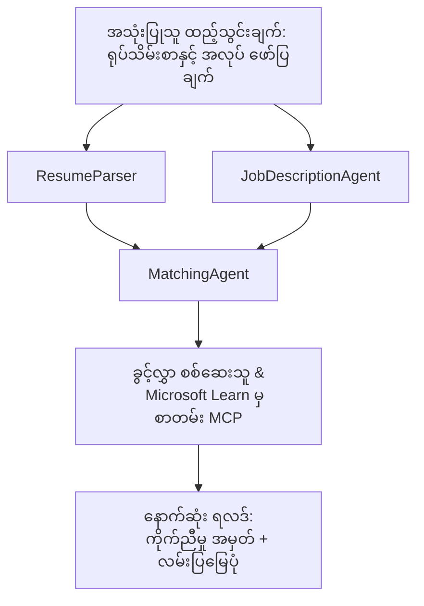

# PersonalCareerCopilot - သွင်းလျှောက်လွှာ → အလုပ်ကိုင်ရာထိ တွဲညီမှု အကဲဖြတ်သူ

သွင်းလျှောက်လွှာနဲ့ အလုပ်ဖေါ်ပြချက် တို့ရဲ့ တွဲညီမှုကို အကဲဖြတ်ပြီး၊ ဖြတ်မကျန်တဲ့ နေရာတွေကို ဘယ်လိုဖြည့်ဆည်းရမယ်ဆိုတာကို ကိုယ်ပိုင်သင်ယူရေး အစီအစဉ် ဖန်တီးပေးတဲ့ မျိုးစုံ ကိုယ်စားလှယ် စနစ်။

---

## ကိုယ်စားလှယ်များ

| ကိုယ်စားလှယ် | အခန်းကဏ္ဍ | ကိရိယာများ |
|--------------|------------|------------|
| **ResumeParser** | သွင်းလွှောက်လွှာစာသားမှ ဖွဲ့စည်းထားသော ကျွမ်းကျင်မှု၊ အတွေ့အကြုံ၊ လက်မှတ်များကို ဆွဲထုတ်သည် | - |
| **JobDescriptionAgent** | အလုပ်ဖေါ်ပြချက်မှ လိုအပ်/နှစ်မြှုပ်သော ကျွမ်းကျင်မှု၊ အတွေ့အကြုံ၊ လက်မှတ်များကို ဆွဲထုတ်သည် | - |
| **MatchingAgent** | ကိုယ်ရေးရာဇဝင်နှင့်လိုအပ်ချက်များကို နှိုင်းယှဉ် → တွဲညီမှု အမှတ် (0-100) + တွဲတယ်/မရှိတဲ့ ကျွမ်းကျင်မှုများ | - |
| **GapAnalyzer** | Microsoft Learn အရင်းအမြစ်များနှင့် ကိုယ်ပိုင်သင်ယူရေး လမ်းပြဇယားတည်ဆောက်သည် | `search_microsoft_learn_for_plan` (MCP) |

## လုပ်ငန်းစဉ်


---

## အမြန်စတင်ခြင်း

### 1. ပတ်ဝန်းကျင်ပြင်ဆင်ခြင်း

```powershell
cd workshop\lab02-multi-agent\PersonalCareerCopilot
python -m venv .venv
.\.venv\Scripts\Activate.ps1          # Windows PowerShell
# source .venv/bin/activate            # macOS / Linux
pip install -r requirements.txt
```

### 2. မှတ်ပုံတင်ချက်များ တပ်ဆင်ခြင်း

ဥပမာ env ဖိုင်ကူးယူပြီး သင့် Foundry စီမံကိန်း အသေးစိတ်ဖြည့်ပါ-

```powershell
cp .env.example .env
```

`.env` ကို တည်းဖြတ်ပါ -

```env
PROJECT_ENDPOINT=https://<your-account>.services.ai.azure.com/api/projects/<your-project>
MODEL_DEPLOYMENT_NAME=gpt-4.1-mini
```

| အတိုင်းအတာ | ဘယ်မှာ ရှာမလဲ |
|--------------|-----------------|
| `PROJECT_ENDPOINT` | VS Code မှာ Microsoft Foundry sidebar → သင့်စီမံကိန်းကို ညာသော့နှိပ်ပြီး → **Copy Project Endpoint** |
| `MODEL_DEPLOYMENT_NAME` | Foundry sidebar → စီမံကိန်း ကို ဆွဲချပြီး → **Models + endpoints** → deployment နာမည် |

### 3. ပုံမှန်အားဖြင့် အစကို ပြုလုပ်ခြင်း

```powershell
python -m debugpy --listen 127.0.0.1:5679 -m agentdev run main.py --verbose --port 8088
```

သို့မဟုတ် VS Code အလုပ်စီမံခန့်ခွဲမှုကို အသုံးပြုပါ - `Ctrl+Shift+P` → **Tasks: Run Task** → **Run Lab02 HTTP Server**။

### 4. ကိုယ်စားလှယ် စစ်ထုတ်ကိရိယာနှင့် စမ်းသပ်ခြင်း

Agent Inspector ဖြင့်သာစမ်း: `Ctrl+Shift+P` → **Foundry Toolkit: Open Agent Inspector**။

ဒီ စမ်းသပ် ဖော်ပြချက်ကို ကူးထည့်ပါ -

```
Resume:
Jane Doe
Senior Software Engineer with 5 years of experience in Python, Django, and AWS.
Built microservices handling 10K+ requests/second. Led a team of 4 developers.
Certifications: AWS Solutions Architect Associate.
Education: B.S. Computer Science, State University.

Job Description:
Senior Cloud Engineer at Contoso Ltd.
Required: Python, Azure, Kubernetes, Terraform, CI/CD pipelines.
Preferred: Go, monitoring (Prometheus/Grafana), cost optimization.
Experience: 5+ years in cloud infrastructure.
Certifications: Azure Solutions Architect Expert preferred.
```

**မျှော်လင့်ချက်:** တွဲညီမှု အမှတ် (0-100), တွဲတယ်/မရှိတဲ့ ကျွမ်းကျင်မှုများ၊ Microsoft Learn URL များပါ သင်ယူရေး လမ်းပြဇယား။

### 5. Foundry သို့ တင်သွင်းခြင်း

`Ctrl+Shift+P` → **Microsoft Foundry: Deploy Hosted Agent** → သင့်စီမံကိန်း ရွေးချယ် → အတည်ပြု။

---

## စီမံကိန်း ဖွဲ့စည်းမှု

```
PersonalCareerCopilot/
├── .env.example        ← Template for environment variables
├── .env                ← Your credentials (git-ignored)
├── agent.yaml          ← Hosted agent definition (name, resources, env vars)
├── Dockerfile          ← Container image for Foundry deployment
├── main.py             ← 4-agent workflow (instructions, MCP tool, WorkflowBuilder)
└── requirements.txt    ← Python dependencies
```

## အဓိက ဖိုင်များ

### `agent.yaml`

Foundry Agent Service အတွက် hosted agent ကို သတ်မှတ်ရာမှာ -
- `kind: hosted` - စီမံခန့်ခွဲထားသော container အဖြစ် chạy ပြေးသည်
- `protocols: [responses v1]` - `/responses` HTTP endpoint ကို ထုတ်ပြန်သည်
- `environment_variables` - `PROJECT_ENDPOINT` နှင့် `MODEL_DEPLOYMENT_NAME` ကို deploy အချိန်တွင် ထည့်သွင်းသည်

### `main.py`

အတွင်း -
- **Agent လမ်းညွှန်ချက်များ** - သုံးရသူ agent အလိုက် `*_INSTRUCTIONS` constant ၄ ခု
- **MCP ကိရိယာ** - `search_microsoft_learn_for_plan()` ဟာ Streamable HTTP ဖြင့် `https://learn.microsoft.com/api/mcp` ကို ခေါ်ဆိုသည်
- **Agent ဖန်တီးခြင်း** - `create_agents()` ကို `AzureAIAgentClient.as_agent()` နဲ့ context manager အသုံးပြုသည်
- **Workflow ပုံစံစာရင်း** - `create_workflow()` မှတစ်ဆင့် WorkflowBuilder အသုံးပြုပြီး agent များကို fan-out/fan-in/sequential ပုံစံဖြင့် ချိတ်ဆက်သည်
- **Server စတင်ပြေးခြင်း** - `from_agent_framework(agent).run_async()` ကို 8088 port တွင် အပြီးသတ်လုပ်ဆောင်သည်

### `requirements.txt`

| package | ဗားရှင်း | ရည်ရွယ်ချက် |
|---------|----------|-------------|
| `agent-framework-azure-ai` | `1.0.0rc3` | Microsoft Agent Framework အတွက် Azure AI ပေါင်းစပ်ခြင်း |
| `agent-framework-core` | `1.0.0rc3` | Core runtime (WorkflowBuilder ပါဝင်သည်) |
| `azure-ai-agentserver-agentframework` | `1.0.0b16` | Hosted agent server runtime |
| `azure-ai-agentserver-core` | `1.0.0b16` | Core agent server abstraction များ |
| `debugpy` | latest | Python debugging (VS Code မှာ F5 အသုံးပြုရန်) |
| `agent-dev-cli` | `--pre` | ဒေသဆိုင်ရာ တိုးတက်မှု CLI + Agent Inspector backend |

---

## ပြဿနာဖြေရှင်းခြင်း

| ပြဿနာ | ဖြေရှင်းနည်း |
|---------|--------------|
| `RuntimeError: Missing required environment variable(s)` | `.env` ဖိုင်ထဲမှာ `PROJECT_ENDPOINT` နှင့် `MODEL_DEPLOYMENT_NAME` ထည့်ပါ |
| `ModuleNotFoundError: No module named 'agent_framework'` | venv ဖွင့်ပြီး `pip install -r requirements.txt` ရိုက်ပါ |
| Microsoft Learn URL မတွေ့လျှင် | `https://learn.microsoft.com/api/mcp` ကို အင်တာနက်ချိတ်ဆက်မှုစစ်ပါ |
| Gap card တစ်ခုသာ (အပျက်) မြင်ရလျှင် | `GAP_ANALYZER_INSTRUCTIONS` ထဲမှာ `CRITICAL:` အပိုဒ်ပါဝင်မှုစစ်ပါ |
| Port 8088 သုံးနေခဲ့လျှင် | အခြား server များ ရပ်ပါ - `netstat -ano \| findstr :8088` |

အသေးစိတ် ပြဿနာဖြေရှင်းရန် [Module 8 - Troubleshooting](../docs/08-troubleshooting.md) ကို ကြည့်ပါ။

---

**တစ်ပြည့်တည်း လမ်းညွှန်:** [Lab 02 Docs](../docs/README.md) · **ပြန်သွားရန်:** [Lab 02 README](../README.md) · [Workshop Home](../../../README.md)

---

<!-- CO-OP TRANSLATOR DISCLAIMER START -->
**ဝန်ခံချက်**  
ဤစာတမ်းကို AI ဘာသာပြန်ခြင်းဝန်ဆောင်မှု [Co-op Translator](https://github.com/Azure/co-op-translator) ကိုအသုံးပြု၍ ဘာသာပြန်ထားသည်။ မှန်ကန်မှုအတွက် ကြိုးပမ်းပေမယ့် အလိုအလျောက် ဘာသာပြန်မှုတွင် အမှားများ သို့မဟုတ် မှားယွင်းချက်များပါဝင်နိုင်ကြောင်း သတိပေးပါသည်။ မူရင်းစာတမ်းကို မူရင်းဘာသာဖြင့်သာ ယုံကြည်စိတ်ချရသော အရင်းအမြစ်အဖြစ် ယူဆသင့်ပါသည်။ အရေးကြီးသော သတင်းအချက်အလက်များအတွက် သက်ဆိုင်ရာ ပရော်ဖက်ရှင်နယ် လူသားဘာသာပြန်ခြင်းကို အကြံပြုပါသည်။ ဤဘာသာပြန်မှုကို အသုံးချခြင်းကြောင့် ဖြစ်ပေါ်လာနိုင်သည့် နားမလည်မှုများ သို့မဟုတ် မှားယွင်းဖော်ပြမှုများအတွက် ကျွန်ုပ်တို့သည် တာဝန်မပေးချေပါ။
<!-- CO-OP TRANSLATOR DISCLAIMER END -->