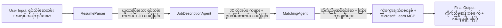

# PersonalCareerCopilot - ကိုယ်ရေးရာဇဝင် → အလုပ်သင့်တော်မှု အကဲဖြတ်သူ

ကိုယ်ရေးရာဇဝင်နှင့် အလုပ်အကြောင်းအရာ အညီမှန်မှုကို အကဲဖြတ်ပြီး၊ ချို့တဲ့နေရာများကို ပြည့်စုံစေမည့် ကိုယ်ပိုင်သင်ယူမှု ရွှေ့ပြောင်းလမ်းကြောင်းကို ဖန်တီးပေးသော workflow-ပထမ Multi-Agent အက်ပ်တစ်ခု။

---

## အေးဂျင့်များ

| အေးဂျင့် | အခန်းကဏ္ဍ | ကိရိယာများ |
|-------|------|-------|
| **ResumeParser** | ကိုယ်ရေးရာဇဝင်စာသားမှ ဖွဲ့စည်းထားသော ကျွမ်းကျင်မှုများ၊ အတွေ့အကြုံများ၊ အထောက်အထားများ ထုတ်ယူသည် | - |
| **JobDescriptionAgent** | အလုပ်အကြောင်းအရာမှ လိုအပ်/နှစ်သက်သော ကျွမ်းကျင်မှုများ၊ အတွေ့အကြုံများ၊ အထောက်အထားများ ထုတ်ယူသည် | - |
| **MatchingAgent** | ကိုယ်ရေးရာဇဝင်နှင့် လိုအပ်ချက်များကို နှိုင်းယှဉ် → ကိုက်ညီမှု အမှတ်(0-100) + ကိုက်ညီ/လိမ့်မကျကျွမ်းကျင်မှုများ | - |
| **GapAnalyzer** | Microsoft Learn နဲ့ ပတ်သက်မဲ့ သတင်းအချက်အလက်များကို အသုံးပြုကာ ကိုယ်ပိုင် သင်ယူမှု ရွှေ့ပြောင်းလမ်းကြောင်း ဖန်တီးသည် | `search_microsoft_learn_for_plan` (MCP) |

## Workflow


```mermaid
flowchart LR
    UserInput["User Input: ရုပ်သိမ်းစာတမ်း + အလုပ်အကြောင်းအရာ"] --> ResumeParser
    ResumeParser -- "ယူထားပြီးသော ရုပ်သိမ်းစာတမ်း + JD ပေးပို့ခြင်း" --> JobDescriptionAgent
    JobDescriptionAgent -- "JD လိုအပ်ချက်များ + ရုပ်သိမ်းစာတမ်း ပေးပို့ခြင်း" --> MatchingAgent
    MatchingAgent -- "ကိုက်ညီမှုအစီရင်ခံစာ + ကြားကွာချက်များ" --> GapAnalyzerMCP["ကြားကွာချက်စစ်စနစ် +\nMicrosoft Learn MCP"]
    GapAnalyzerMCP --> FinalOutput["Final Output:\nကိုက်ညီမှုဆန်းစစ်ချက် + လမ်းညွှန်ပြမြေပုံ"]
```

---

## လျင်မြန်စွာ စတင်ရန်

### 1. ပတ်ဝန်းကျင်ကို စီစစ်တပ်ဆင်ခြင်း

ဤဖိုင်ဖိုဒါသည် workflow-အခြေပြု Lab 02 scaffold ၏ ကိုးကားအကောင်အထည်ဖော်မှုဖြစ်သည်။ ၎င်း၏ `main.py` မှာ ရှိပြီးသား prompt block များနှင့် `WorkflowBuilder` ကို အသုံးပြုကာ အေးဂျင့်လေးဦးကို ဆက်သွယ်ထားသည်။

```powershell
cd workshop\lab02-multi-agent\PersonalCareerCopilot
python -m venv .venv
.\.venv\Scripts\Activate.ps1          # Windows PowerShell
# source .venv/bin/activate            # macOS / Linux
pip install -r requirements.txt
```

### 2. အသိအမှတ်ပြုချက်များကို ဖွဲ့စည်းခြင်း

ဤဖိုင်ဖိုဒါတွင် `.env` ဖိုင်တစ်ခု ဖန်တီးပါ။

```powershell
copy .env .env.bak 2>$null; echo $null > .env
```

`.env` ကိုပြင်ဆင်ပါ။

```env
FOUNDRY_PROJECT_ENDPOINT=https://<your-account>.services.ai.azure.com/api/projects/<your-project>
AZURE_AI_MODEL_DEPLOYMENT_NAME=gpt-4.1-mini
```

| တန်ဖိုး | မည်သည့်နေရာတွင် ရှာဖွေမည် |
|-------|------------------|
| `FOUNDRY_PROJECT_ENDPOINT` | Foundry Toolkit sidebar → သင့်ပရောဂျက်ကိုညာချက်နှိပ်ပြီး → **Copy Project Endpoint** |
| `AZURE_AI_MODEL_DEPLOYMENT_NAME` | Foundry sidebar → ပရောဂျက်ဖွင့်၍ → **Models + endpoints** → deployment name |

### 3. ဒေသအတွင်းတွင် ပြေးရန်

```powershell
python -m debugpy --listen 127.0.0.1:5679 main.py --port 8088
```

ဒါမှမဟုတ် VS Code task ကို အသုံးပြုပါ။ `Ctrl+Shift+P` → **Tasks: Run Task** → **Run Agent HTTP Server**။

F5 debugging အတွက် **Debug Local Agent HTTP Server** ကို အသုံးပြုပါ။

### 4. Agent Inspector ဖြင့် စမ်းသပ်ခြင်း

Agent Inspector ကို ဖွင့်ပါ။ `Ctrl+Shift+P` → **Foundry Toolkit: Open Agent Inspector**။

ဒီ စမ်းသပ် prompt ကို ကူးထည့်ပါ။

```
Resume:
Jane Doe
Senior Software Engineer with 5 years of experience in Python, Django, and AWS.
Built microservices handling 10K+ requests/second. Led a team of 4 developers.
Certifications: AWS Solutions Architect Associate.
Education: B.S. Computer Science, State University.

Job Description:
Senior Cloud Engineer at Contoso Ltd.
Required: Python, Azure, Kubernetes, Terraform, CI/CD pipelines.
Preferred: Go, monitoring (Prometheus/Grafana), cost optimization.
Experience: 5+ years in cloud infrastructure.
Certifications: Azure Solutions Architect Expert preferred.
```

**မျှော်မှန်းချက်:** ကိုက်ညီမှု အမှတ် (0-100), ကိုက်ညီသော / လိုအပ်သော ကျွမ်းကျင်မှုများ၊ Microsoft Learn URL များပါ ၀ င်သည့် ကိုယ်ပိုင် သင်ယူမှု ရွှေ့ပြောင်းလမ်းကြောင်း။

### 5. Foundry တွင် ဖြန့်ချိခြင်း

`Ctrl+Shift+P` → **Foundry Toolkit: Deploy Hosted Agent** → သင့်ပရောဂျက်ရွေးချယ်ပြီး → အတည်ပြုပါ။

---

## ပရောဂျက် ဖွဲ့စည်းမှု

```
PersonalCareerCopilot/
├── .env                ← Your credentials (git-ignored)
├── agent.yaml          ← Hosted agent definition (name, resources, env vars)
├── Dockerfile          ← Container image for Foundry deployment
├── main.py             ← 4-agent workflow (instructions, MCP tool, WorkflowBuilder)
└── requirements.txt    ← Python dependencies
```

## အဓိက ဖိုင်များ

### `agent.yaml`

Foundry Agent Service အတွက် hosted agent ကို သတ်မှတ်သည်။
- `kind: hosted` - managed container အဖြစ် ပြေးပါသည်။
- `protocols` - `responses` protocol နှင့် `version: 1.0.0` ကို အသုံးပြု၍ `/responses` HTTP endpoint ကို ဖော်ပြသည်။
- `environment_variables` - `AZURE_AI_MODEL_DEPLOYMENT_NAME` ကို ၎င်းတွင် ကြေညာထားသည်။ `FOUNDRY_PROJECT_ENDPOINT` ကို deploy ဝေငှခိုင်းစဥ် အလိုအလျောက် ထည့်သွင်းသည်။

### `main.py`

ပါဝင်မှုများ៖
- **Agent အညွှန်းများ** - အေးဂျင့် လေးဦးအတွက် `*_INSTRUCTIONS` constants လေးခု
- **MCP ကိရိယာ** - `search_microsoft_learn_for_plan()` သည် Streamable HTTP ဖြင့် `https://learn.microsoft.com/api/mcp` ကို ခေါ်ဆိုသည်။
- **အေးဂျင့်ဖန်တီးမှု** - အေးဂျင့်(၄) + `AgentExecutor()` instances များ တစ်ခုတည်း `FoundryChatClient` ကို မျှဝေသုံးသည်။
- **Workflow ဂရပ်ဖ်** - `WorkflowBuilder` က ResumeParser → JD Agent → MatchingAgent → GapAnalyzer အတိုင်း အစီအစဉ်တကျ အေးဂျင့်များ ဆက်သွယ်သည်။
- **ဆာဗာ စတင်ခြင်း** - `ResponsesHostServer` သည် port 8088 ပေါ်တွင် ပြေးနေသည်။

### `requirements.txt`

| Package | ရည်ရွယ်ချက် |
|---------|----------|
| `agent-framework-foundry` | မူလ runtime - `Agent`, `AgentExecutor`, `WorkflowBuilder`, `@tool`, `FoundryChatClient` |
| `agent-framework-foundry-hosting` | `ResponsesHostServer` + Foundry hosting ပေါင်းစည်းမှု |
| `mcp<2,>=1.24.0` | GapAnalyzer အတွက် MCP client (`streamable_http_client`) |
| `debugpy` | Python debugging (VS Code တွင် F5 မှာ) |

---

## ပြဿနာဖြေရှင်းခြင်း

| ပြဿနာ | ဖြေရှင်းနည်း |
|-------|-----|
| `KeyError: 'FOUNDRY_PROJECT_ENDPOINT'` သို့မဟုတ် `KeyError: 'AZURE_AI_MODEL_DEPLOYMENT_NAME'` | `.env` ဖိုင်တွင် `FOUNDRY_PROJECT_ENDPOINT` နှင့် `AZURE_AI_MODEL_DEPLOYMENT_NAME` ကြေညာပါ |
| `ModuleNotFoundError: No module named 'agent_framework'` | venv ကို စတင် ဖွင့်ပြီး `pip install -r requirements.txt` ကို အကောင်အထည်ဖော်ပါ |
| Microsoft Learn URL မပါရှိသော အထွက်များ | `https://learn.microsoft.com/api/mcp` သို့ အင်တာနက်ချိတ်ဆက်မှု ကို စစ်ဆေးပါ |
| gap card တစ်ခုတည်းသာ ( ဖြတ်တောက်ထား) | `GAP_ANALYZER_INSTRUCTIONS` တွင် `CRITICAL:` အပိုင်း ပါဝင်သည်ကို သေချာစစ်ဆေးပါ |
| Port 8088 ကို အသုံးပြုနေသည် | အခြားဆာဗာများကို ပိတ်ပါ။ `netstat -ano \| findstr :8088` |

အသေးစိတ် ပြဿနာဖြေရှင်းရန်အတွက် [Module 8 - Troubleshooting](../docs/08-troubleshooting.md) ကို ကြည့်ပါ။

---

**ပြည့်စုံ လမ်းညွှန်:** [Lab 02 Docs](../docs/README.md) · **ပြန်သွားရန်:** [Lab 02 README](../README.md) · [အက်လုပ်ရုံ မူလစာမျက်နှာ](../../../README.md)

---

<!-- CO-OP TRANSLATOR DISCLAIMER START -->
**ပြောကြားချက်**
ဤစာတမ်းကို AI ဘာသာပြန်ဝန်ဆောင်မှု [Co-op Translator](https://github.com/Azure/co-op-translator) အသုံးပြု၍ ဘာသာပြန်ထားပါသည်။ ကျွန်ုပ်တို့သည် တိကျမှန်ကန်မှုအတွက် ကြိုးပမ်းနေသော်လည်း၊ စက်ကိရိယာဘာသာပြန်ခြင်းများတွင် အမှားများ သို့မဟုတ် မှားယွင်းချက်များ ပါဝင်နိုင်ကြောင်း သတိပြုပါရန် လိုအပ်ပါသည်။ မူလစာတမ်းကို မူရင်းဘာသာဖြင့်သာ ယုံကြည်စိတ်ချရသော အချက်အလက်အဖြစ် သတ်မှတ်သင့်သည်။ အရေးကြီးသည့် သတင်းအချက်အလက်များအတွက် ပရော်ဖက်ရှင်နယ် လူသားဘာသာပြန်သူဝန်ဆောင်မှုကို အကြံပြုပါသည်။ ဤဘာသာပြန်ချက်ကို အသုံးပြုခြင်းမှ ဖြစ်ပေါ်လာသော နားလည်မှုကွာခြားမှုများ သို့မဟုတ် မမှန်ကန်သော အသုံးပြုမှုများအတွက် ကျွန်ုပ်တို့ တာဝန်မခံပါ။
<!-- CO-OP TRANSLATOR DISCLAIMER END -->