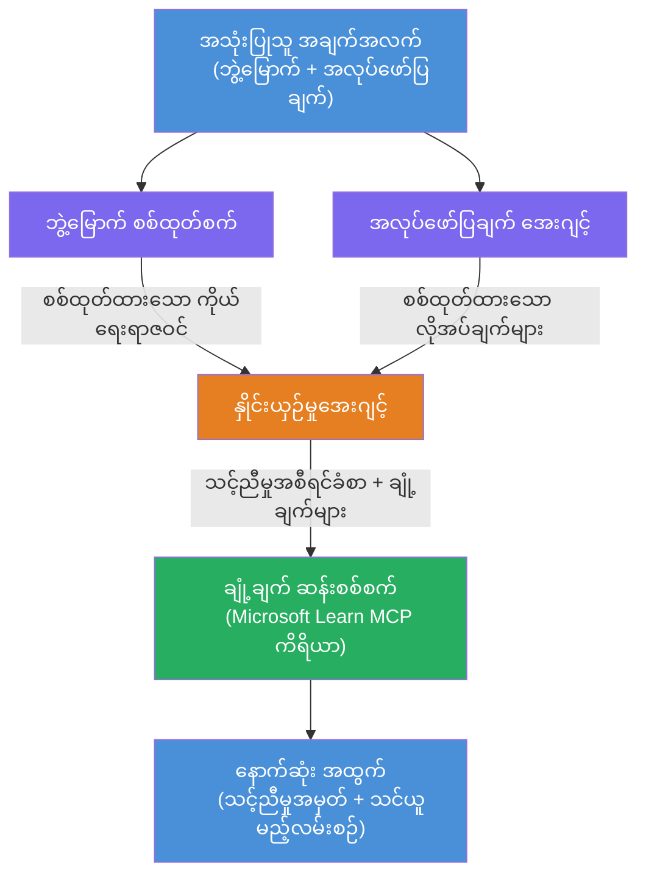

# Lab 02 - အမျိုးမျိုးသောအေဂျင့်လုပ်ငန်းစဉ်: ကိုယ်ရေးရာဇဝင် → အလုပ်လိုအပ်ချက်ကိုအကဲဖြတ်ခြင်း

---

## သင်တည်ဆောက်မယ့်အရာ

**ကိုယ်ရေးရာဇဝင် → အလုပ်လိုအပ်ချက်အပေါ် အကဲဖြတ်သူ** - တစ်ဦးချင်းစွမ်းဆောင်ပေးတဲ့ အေးဂျင့်လေးဦးပါဝင်တဲ့ လုပ်ငန်းစဉ်တစ်ခုဖြစ်ပြီး၊ လျှောက်ထားသူရဲ့ ကိုယ်ရေးရာဇဝင်ဟာ အလုပ်ဖော်ပြချက်နဲ့ ဘယ်ပြည့်စုံသလဲဆိုတာကို အကဲဖြတ်ခြင်း၊ ပြီးတော့ ချို့တဲ့ချက်တွေဖြည့်တင်းဖို့ ကိုယ်ပိုင် သင်ယူမှုလမ်းညွှန် ရှေ့ပြေးစီမံချက်တစ်ခု ဖန်တီးပေးပါမယ်။

### အေးဂျင့်များ

| အေးဂျင့် | အခန်းကဏ္ဍ |
|----------|------------|
| **ကိုယ်ရေးရာဇဝင် ပARSER** | ကိုယ်ရေးရာဇဝင် စာသားထဲက စွမ်းရည်တွေ၊ အတွေ့အကြုံတွေ၊ အသိအမှတ်ပြုလက်မှတ်တွေကို ဖော်ထုတ်သည် |
| **အလုပ်ဖော်ပြချက် အေးဂျင့်** | အလုပ်ဖော်ပြချက်ထဲက လိုအပ်သော/နှစ်သက်သော စွမ်းရည်များ၊ အတွေ့အကြုံများ၊ အသိအမှတ်ပြုလက်မှတ်များကို ဖော်ထုတ်သည် |
| **ကိုက်ညီမှု အေးဂျင့်** | ကိုယ်ရေးရာဇဝင်နှင့် လိုအပ်ချက်များကို နှိုင်းယှဉ် → ကိုက်ညီမှုအမှတ် (0-100) + ကိုက်ညီ/ပျောက်ကွယ်သော စွမ်းရည်များ |
| **အကွာအဝေး ခွဲခြမ်းစိတ်ဖြာသူ** | သင်ယူရန်ကိုယ်ပိုင်လမ်းညွှန်ချက်များ၊ အရင်းအမြစ်များ၊ အချိန်ဇယားများနှင့် အမြန်ရရှိနိုင်သော စီမံကိန်းများ ဖန်တီးသည် |

### သရုပ်ပြလုပ်ငန်းစဉ်

**ကိုယ်ရေးရာဇဝင် + အလုပ်ဖော်ပြချက်** တင်ပါ → **ကိုက်ညီမှုအမှတ် + ပျောက်ကွယ်သော စွမ်းရည်များ** ရပါမယ် → **ကိုယ်ပိုင် သင်ယူမှုလမ်းညွှန်ချက်** လက်ခံရယူပါ။

### လုပ်ငန်းစဉ်ပုံစံ

> မီးခိုးရောင် = အလားတူ အေးဂျင့်များ | လိမ္မော်ရောင် = စုစည်းပွဲနေရာ | အစိမ်းရောင် = အပြီးသတ်အေးဂျင့်နှင့် ကိရိယာများ။ အသေးစိတ်အတွက် [Module 1 - Understand the Architecture](docs/01-understand-multi-agent.md) နှင့် [Module 4 - Orchestration Patterns](docs/04-orchestration-patterns.md) ကို ကြည့်ပါ။

### ဖုံးလွှမ်းထားသော ခေါင်းစဉ်များ

- **WorkflowBuilder** ကို အသုံးပြုပြီး တစ်ဦးချင်းအေးဂျင့်လုပ်ငန်းစဉ် တည်ဆောက်ခြင်း
- အေးဂျင့် အခန်းကဏ္ဍများနှင့် ဆက်စပ် လုပ်ငန်းစဉ်ဖော်ပြမှု (အလားတူ + ထုိက်တန်စွာ)
- အေးဂျင့်အတွင်း ဆက်သွယ်ရေး ပုံစံများ
- Agent Inspector ဖြင့် ဒေသစိစစ်ခြင်း
- Foundry Agent Service သို့ တစ်ဦးချင်း အေးဂျင့်လုပ်ငန်းစဉ်များ တင်သွင်းခြင်း

---

## လိုအပ်ချက်များ

Lab 01 ကို အရင်ပြီးမြောက်ထားပါ:

- [Lab 01 - Single Agent](../lab01-single-agent/README.md)

---

## စတင်လိုက်ပါ

ပြည့်စုံသော စီမံချက်ညွှန်းနည်းများ၊ ကုဒ်လမ်းညွှန်များနှင့် စမ်းသပ်မှုအမိန့်များအတွက်:

- [Lab 2 Docs - Prerequisites](docs/00-prerequisites.md)
- [Lab 2 Docs - Full Learning Path](docs/README.md)
- [PersonalCareerCopilot run guide](PersonalCareerCopilot/README.md)

## ဆက်လက်ညှိနှိုင်းမှု ပုံစံများ (agentic alternatives)

Lab 2 တွင် မူလ **အလားတူ → စုစည်းသူ → စီမံကိန်းရေးဆွဲသူ** လုပ်ငန်းစဉ်ပါဝင်ပြီး၊ ဆက်စပ်စာတမ်းများမှာ ပိုမိုအစွမ်းထက်သော agentic လုပ်ဆောင်ချက်များကို ဖော်ပြရန် အခြားသော ပုံစံများကိုလည်း ဖော်ပြထားပါတယ်။

- **Fan-out/Fan-in weighted consensus အားဖြင့်**
- **နောက်ဆုံးလမ်းညွှန်ချက်မတိုင်မီ သုံးသပ်သူ/ဆန့်ကျင်သူ ဘက်မှ ထပ်ဆင့်စစ်ဆေးခြင်း**
- **အခြေအနေထိန်းချုပ်သူ** (ကိုက်ညီမှုအမှတ်နှင့် ပျောက်ကွယ်သော စွမ်းရည်များအပေါ်မှ များစွာသောလမ်းကြောင်း ရွေးချယ်ခြင်း)

သေချာကြည့်ရှုရန် [docs/04-orchestration-patterns.md](docs/04-orchestration-patterns.md) ကို ကြည့်ပါ။

---

**ပြီးခဲ့သည်:** [Lab 01 - Single Agent](../lab01-single-agent/README.md) · **နောက်သို့ပြန်သွားရန်:** [Workshop Home](../../README.md)

---

<!-- CO-OP TRANSLATOR DISCLAIMER START -->
**အကြောင်းကြားချက်**:  
ဤစာတမ်းကို AI ဘာသာပြန်မှုဝန်ဆောင်မှုဖြစ်သည့် [Co-op Translator](https://github.com/Azure/co-op-translator) ကို အသုံးပြု၍ ဘာသာပြန်ထားပါသည်။ ကျွန်ုပ်တို့သည် တိကျမှုကို ကြိုးပမ်းကြပေမယ့်၊ မော်တော်မောင်းဘာသာပြန်မှုများတွင် အမှားများ သို့မဟုတ် မှားယွင်းမှုများ ပါဝင်နိုင်သည့်အတွက် သတိပြုပါရန် မေတ္တာရပ်ခံအပ်ပါသည်။ မူလစာတမ်းကို မူရင်းဘာသာစကားဖြင့်သာ အတည်ပြုရမည့် အရင်းအမြစ်အဖြစ် သတ်မှတ်ရန် ဖြစ်ပါသည်။ အရေးကြီးသော သတင်းအချက်အလက်များအတွက် မူရင်းလူသုံးဖြင့်ဘာသာပြန်မှုကို အကြံပြုပါသည်။ ဤဘာသာပြန်မှုကို အသုံးပြုခြင်းမှ ဖြစ်ပေါ်သော နားလည်မှုမှားခြင်း သို့မဟုတ် မှားယွင်းသော နားလည်မှုများအတွက် ကျွန်ုပ်တို့မှာ တာဝန်မရှိပါ။
<!-- CO-OP TRANSLATOR DISCLAIMER END -->