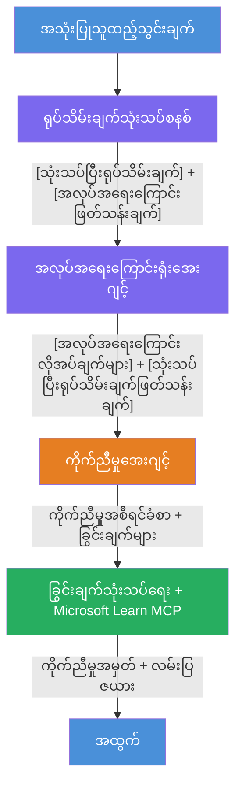

# စမ်းသပ်မှု 02 - မျိုးစုံအေဂျင့် လုပ်ငန်းစဉ်: ရုပ်သိမ်းစာတမ်း → အလုပ်နဲ့ ကိုက်ညီမှု အကဲဖြတ်သူ

## မျိုးမှာနားလည်မှု

ဤ လက်တွေ့လက်တွေ့လုပ်ငန်းတွင် Foundry Toolkit ကို VS Code မှာအသုံးပြု၍ **workflow-first multi-agent app** တစ်ခု တည်ဆောက်ပြီး Microsoft Foundry Agent Service သို့ ဖြန့်ချိသည်။

**သင်တည်ဆောက်မည့်အရာ:** ရုပ်သိမ်းစာတမ်းနှင့် အလုပ်ဖော်ပြချက်ကို ဖတ်ရှုကာ ကိုက်ညီမှုအကဲဖြတ်ချက်ပေးပြီး Microsoft Learn အရင်းအမြစ်များကို အသုံးပြုပြီး ကိုယ်ပိုင်သင်ယူမှုလမ်းပြမြေပုံကို ထုတ်ပေးသော Resume → Job Fit Evaluator ဖြစ်သည်။

---

## ဖွဲ့စည်းပုံ

```mermaid
flowchart TD
    A["အသုံးပြုသူထည့်သွင်းချက်"] --> B["ရုပ်သိမ်းချက်သုံးသပ်စနစ်"]
    B -->|"[သုံးသပ်ပြီးရုပ်သိမ်းချက်] + [အလုပ်အရေးကြောင်းဖြတ်သန်းချက်]"| C["အလုပ်အရေးကြောင်းရုံးအေးဂျင့်"]
    C -->|"[အလုပ်အရေးကြောင်းလိုအပ်ချက်များ] + [သုံးသပ်ပြီးရုပ်သိမ်းချက်ဖြတ်သန်းချက်]"| D["ကိုက်ညီမှုအေးဂျင့်"]
    D -->|ကိုက်ညီမှုအစီရင်ခံစာ + ခြွင်းချက်များ| E["ခြွင်းချက်သုံးသပ်ရေး + Microsoft Learn MCP"]
    E -->|ကိုက်ညီမှုအမှတ် + လမ်းပြဇယား| F["အထွက်"]

    style A fill:#4A90D9,color:#fff
    style B fill:#7B68EE,color:#fff
    style C fill:#7B68EE,color:#fff
    style D fill:#E67E22,color:#fff
    style E fill:#27AE60,color:#fff
    style F fill:#4A90D9,color:#fff
```

**လုပ်ဆောင်ပုံ:**
1. အသုံးပြုသူသည် ရုပ်သိမ်းစာတမ်းနှင့် အလုပ်ဖော်ပြချက်ကို ကပ်ထည့်သည်။
2. **ResumeParser** သည် ရုပ်သိမ်းစာတမ်းကို ဖတ်ရှုပြီး JD ကိုပေါင်းတည် `[JOB DESCRIPTION PASS-THROUGH]` အပိုင်းအဖြစ် မူလတည်းကအစ ကူးယူသွားသည်။
3. **JD Agent** သည် pass-through ထဲမှ ဖွဲ့စည်းထားသော လိုအပ်ချက်များကို ခွဲခြမ်းစိတ်ဖြာပြီး `[PARSED RESUME]` ကို `[PARSED RESUME PASS-THROUGH]` အဖြစ် ရှေ့ဆက် လွှဲပြောင်းသည်။
4. **MatchingAgent** သည် `[PARSED RESUME PASS-THROUGH]` နှင့် `[JD REQUIREMENTS]` ကို ယှဉ်ပြိုင်ကာ ကိုက်ညီမှုအဆင့်အတန်း ထုတ်ပေးသည်။
5. **GapAnalyzer** သည် တွေ့ရှိ gaps များကို လက်တွေ့ကောင်းမွန်သော လမ်းပြမြေပုံများပြုလုပ်ပြီး MCP ကနေ Microsoft Learn လင့်ခ်များကို ရယူသည်။

---

## ကြိုတင်လိုအပ်ချက်များ

အရင်ဆုံး Lab 01 ကို ပြီးစီးထားပါ:

- [Lab 01 - Single Agent](../lab01-single-agent/README.md)

---

## အပိုင်း ၁: မော်ဂျူးများကို လိုက်လံဖတ်ပါ

လေ့လာမှုလမ်းကြောင်းလုံးဝကို ကြည့်ရန်:

- [Lab 2 Docs - Prerequisites](docs/00-prerequisites.md)
- [Lab 2 Docs - Full Learning Path](docs/README.md)
- [PersonalCareerCopilot run guide](PersonalCareerCopilot/README.md)

---

## အပိုင်း ၂: လုပ်ငန်းစဉ်ကို တည်ဆောက်ပြီး စမ်းသပ်ပါ

1. Foundry Toolkit wizard ကို အသုံးပြုပြီး workflow-based project ကို စတင်ဖန်တီးပါ။
2. `PersonalCareerCopilot/main.py` မှ prompt blocks နှင့် workflow graph များကို မိမိလုပ်ငန်းဗဟိုသို့ ကူးယူထည့်သွင်းပါ။
3. Agent Inspector နှင့် နှစ်ခြိုက်၍ သတ်မှတ်ထားသော agent လေးဆယ်နှင့် MCP ကိရိယာတို့ကို ဒေသခံမှာ စမ်းသပ်ပါ။
4. ဒေသခံ စမ်းသပ်မှု အောင်မြင်လျှင် hosted agent ကို Foundry သို့ ဖြန့်ချိပါ။

---

## စီမံခန့်ခွဲမှု ပုံစံများ

Lab 02 တွင် မူရင်း **fan-out → fan-in → စဉ်ဆက်ဖြစ်စဉ်** အစဉ်အဆက်ထဲကပါရှိပြီး စာရွက်များတွင် စမ်းသပ်မှုအတွက် အခြား စီမံခန့်ခွဲမှု ပုံစံများကိုလည်း ဖော်ပြထားသည်။

- **အလေးချိန်ထည့်ထားသော fan-out/fan-in consensus**
- **နိဂုံးထုတ်မတိုင်မီ ပြန်လည်သုံးသပ်သူ/တိုက်ခိုက်သူ လမ်းကြောင်း**
- **ကိုက်ညီမှုဆိုင်ရာ စံနှုန်းနှင့် ပျောက်ကွယ်နေသောကျွမ်းကျင်မှုများအပေါ် မူတည်သော အခြေအနေ router**

ကြည့်ရန် [docs/04-orchestration-patterns.md](docs/04-orchestration-patterns.md)။

---

** ယခင်:** [Lab 01 - Single Agent](../lab01-single-agent/README.md) · **ပြန်သို့:** [Workshop Home](../../README.md)

---

<!-- CO-OP TRANSLATOR DISCLAIMER START -->
**ပြောကြားချက်**
ဤစာတမ်းကို AI ဘာသာပြန်ဝန်ဆောင်မှု [Co-op Translator](https://github.com/Azure/co-op-translator) အသုံးပြု၍ ဘာသာပြန်ထားပါသည်။ ကျွန်ုပ်တို့သည် တိကျမှန်ကန်မှုအတွက် ကြိုးပမ်းနေသော်လည်း၊ စက်ကိရိယာဘာသာပြန်ခြင်းများတွင် အမှားများ သို့မဟုတ် မှားယွင်းချက်များ ပါဝင်နိုင်ကြောင်း သတိပြုပါရန် လိုအပ်ပါသည်။ မူလစာတမ်းကို မူရင်းဘာသာဖြင့်သာ ယုံကြည်စိတ်ချရသော အချက်အလက်အဖြစ် သတ်မှတ်သင့်သည်။ အရေးကြီးသည့် သတင်းအချက်အလက်များအတွက် ပရော်ဖက်ရှင်နယ် လူသားဘာသာပြန်သူဝန်ဆောင်မှုကို အကြံပြုပါသည်။ ဤဘာသာပြန်ချက်ကို အသုံးပြုခြင်းမှ ဖြစ်ပေါ်လာသော နားလည်မှုကွာခြားမှုများ သို့မဟုတ် မမှန်ကန်သော အသုံးပြုမှုများအတွက် ကျွန်ုပ်တို့ တာဝန်မခံပါ။
<!-- CO-OP TRANSLATOR DISCLAIMER END -->