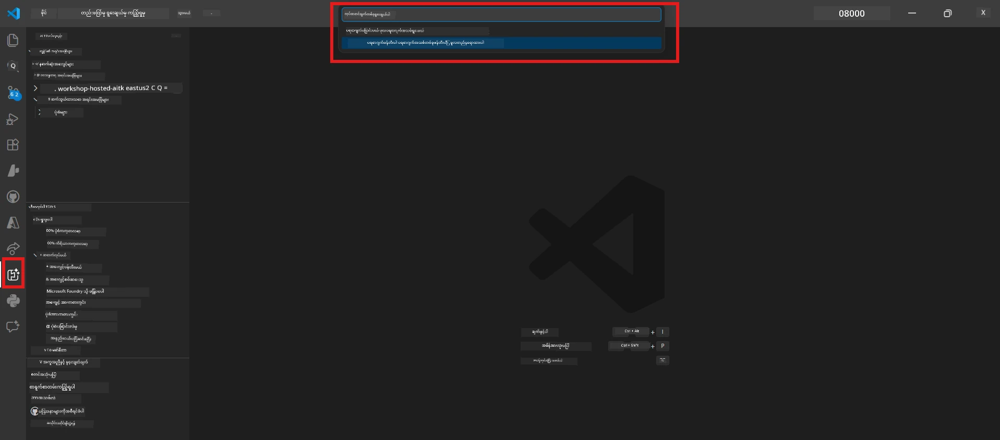

# Module 0 - မျှော်မှန်းချက်များ

Lab 02 ကို စတင်ရန်မတိုင်မီ၊ အောက်ဖေါ်ပြပါအချက်များ ပြီးစီးထားကြောင်း အတည်ပြုပါ။ ဒီ lab က Lab 01 ပေါ်မှာ တိုက်ရိုက်တည်ဆောက်ထားတာဖြစ်ပြီး Lab 01 ကို ကျော်လွှားမနေပါနှင့်။

---

## 1. Lab 01 ပြီးစီးထားခြင်း

Lab 02 သည် သင်သည် အောက်ဖေါ်ပါများ ပြီးစီးပြီးပြီဟု ထင်မြင်သည် -

- [x] [Lab 01 - Single Agent](../../lab01-single-agent/README.md) ၏ 8 modules အားလုံး ပြီးစီးခဲ့သည်
- [x] Single agent တစ်ခုကို Foundry Agent Service တွင် အောင်မြင်စွာ တပ်ဆင်ထားသည်
- [x] Agent သည် local Agent Inspector နှင့် Foundry Playground ကၽြောပြီး ပြိုင်ဆိုင်စစ်ဆေးထားသည်

Lab 01 ကို မပြီးစီးသေးလျှင် အခုသို့ ပြန်သွားပြီး ပြီးစီးပါ: [Lab 01 Docs](../../lab01-single-agent/docs/00-prerequisites.md)

---

## 2. အရင် Setup ကို အတည်ပြုခြင်း

Lab 01 တွင် အသုံးပြုသော ကိရိယာများအားလုံးလည်း ထပ်မံ ထည့်ထားပြီး အလုပ်လုပ်နေပါသလား စစ်ဆေးပါ။ အောက်ပါ စစ်ဆေးမှုများ ပြုလုပ်ပါ-

### 2.1 Azure CLI

```powershell
az account show --query "{name:name, id:id}" --output table
```

မျှော်မှန်းချက် - သင့် subscription name နှင့် ID ပြသပါသင့်သည်။ မအောင်မြင်လျှင် [`az login`](https://learn.microsoft.com/cli/azure/authenticate-azure-cli-interactively) ကို ပြန်လည် ဆောင်ရွက်ပါ။

### 2.2 VS Code extensions

1. `Ctrl+Shift+P` နှိပ်ပြီး → **"Microsoft Foundry"** ရိုက်ထည့်ပါ → command များ (ဥပမာ၊ `Microsoft Foundry: Create a New Hosted Agent`) မြင်နိုင်ကြောင်း အတည်ပြုပါ။
2. `Ctrl+Shift+P` နှိပ်ပြီး → **"Foundry Toolkit"** ရိုက်ထည့်ပါ → command များ (ဥပမာ၊ `Foundry Toolkit: Open Agent Inspector`) မြင်နိုင်ကြောင်း အတည်ပြုပါ။

### 2.3 Foundry project & model

1. VS Code Activity Bar တွင် **Microsoft Foundry** အချက်အလက်ကို နှိပ်ပါ။
2. သင့် project မှာ အမည်ပါဝင်သည်ဟု အတည်ပြုပါ (ဥပမာ၊ `workshop-agents`)။
3. Project ကို ချဲ့ထွင်ပြီး → တပ်ဆင်ထားသော model တစ်ခု ရှိပြီး **Succeeded** ဟု အခြေအနေ ပြထားသည်မှာ အတည်ပြုပါ (ဥပမာ၊ `gpt-4.1-mini`)။

> **သင့် model deployment ၏ သက်တမ်းကပ်လာပါက** : အခမဲ့ထပ်ဖြန်ဖြန် တပ်ဆင်မှုများသည် အလိုအလျောက် သက်တမ်းကုန်အောင်မြင်သည်။ [Model Catalog](https://learn.microsoft.com/azure/foundry/foundry-models/concepts/models-sold-directly-by-azure) မှ ပြန်လည် တပ်ဆင်ပါ (`Ctrl+Shift+P` → **Microsoft Foundry: Open Model Catalog**)။



### 2.4 RBAC roles

သင်၏ Foundry project တွင် **Azure AI User** ရှိကြောင်း အတည်ပြုပါ။

1. [Azure Portal](https://portal.azure.com) → သင်၏ Foundry **project** resource → **Access control (IAM)** → **[Role assignments](https://learn.microsoft.com/azure/foundry/concepts/rbac-foundry)** tab
2. သင့် နာမည်ကို ရှာဖွေပြီး → **[Azure AI User](https://aka.ms/foundry-ext-project-role)** ပါရှိကြောင်း အတည်ပြုပါ။

---

## 3. multi-agent အကြောင်းအရာများ နားလည်မှု (Lab 02 အတွက် အသစ်)

Lab 02 တွင် Lab 01 တွင် မပါဝင်သေးသော အဓိက အကြောင်းအရာများ ပါဝင်သည်။ နောက်တတ်ရန် မတိုင်မီ ကြည့်ရှု နားလည်ပါ။

### 3.1 multi-agent workflow ဆိုသည်မှာ?

Agent တစ်ခုတည်းဖြင့် အလုပ်အားလုံး ကိုင်တွယ်ခြင်းအစား၊ **multi-agent workflow** သည် အသေးစိတ် အထူးပြုထားသော agents အများစုကို လိုက်လျောညီထွေစွာ ဘယ်လိုလုပ်ဆောင်မည် ဆိုတာဖြစ်သည်။ Agent တစ်ဦးချင်းစီမှာ -

- ကိုယ်ပိုင် **အညွှန်းများ** (system prompt)
- ကိုယ်ပိုင် **တာဝန်** (တာဝန်ရှိတာ)
- ရွေးချယ်စရာ **ကိရိယာများ** (သုံးနိုင်စွမ်းရှိသော function များ)

Agents များသည် **orchestration graph** တစ်ခုမှတဆင့် ဒေတာ လှုပ်ရှားမှု ကို ကွဲပြားစွာ ဆက်သွယ်ကြသည်။

### 3.2 WorkflowBuilder

`agent_framework` မှ [`WorkflowBuilder`](https://learn.microsoft.com/agent-framework/workflows/agents-in-workflows) ခလုတ်သည် agents များကို ချိတ်ဆက် ဂရပ်ဖ်အဖြစ် ဆက်သွယ်ပေးသည် -

```python
from agent_framework import WorkflowBuilder

workflow = (
    WorkflowBuilder(
        name="MyWorkflow",
        start_executor=agent_a,
        output_executors=[agent_d],
    )
    .add_edge(agent_a, agent_b)
    .add_edge(agent_a, agent_c)
    .add_edge(agent_b, agent_d)
    .add_edge(agent_c, agent_d)
    .build()
)
```

- **`start_executor`** - အသုံးပြုသူ input ကို ပထမဆုံး လက်ခံသော agent
- **`output_executors`** - အဆုံးတွင် အဖြေ ဖြစ်လာမည့် agent(များ)
- **`add_edge(source, target)`** - `target` သည် `source` ရဲ့ output ကို လက်ခံရရှိသည်ဟု သတ်မှတ်ခြင်း

### 3.3 MCP (Model Context Protocol) tools

Lab 02 တွင် Microsoft Learn API ကို ခေါ်ယူခြင်းဖြင့် လေ့လာမှု အရင်းအမြစ်များ ရယူသည့် **MCP tool** ကို သုံးသည်။ [MCP (Model Context Protocol)](https://modelcontextprotocol.io/introduction) သည် AI မော်ဒယ်များကို ပြင်ပ ဒေတာအရင်းအမြစ်နှင့် ကိရိယာများ သို့ ချိတ်ဆက်ရန် စံချိန်စံညွှန်းပါ။

| စကားလုံး | အဓိပ္ပါယ် |
|------|-----------|
| **MCP server** | [MCP protocol](https://learn.microsoft.com/azure/foundry/agents/how-to/tools/model-context-protocol) မှတဆင့် ကိရိယာ/ အရင်းအမြစ်များ ပေးသော ဝန်ဆောင်မှု |
| **MCP client** | MCP server နှင့် ချိတ်ဆက်၍ ကိရိယာများကို ခေါ်ဆိုသည့် သင့် agent ကုဒ် |
| **[Streamable HTTP](https://learn.microsoft.com/agent-framework/agents/tools/hosted-mcp-tools)** | MCP server မှ ဆက်သွယ်ရာ သယ်ယူပို့ဆောင်မှု နည်းလမ်း |

### 3.4 Lab 02 နှင့် Lab 01 ၏ ကွာခြားချက်များ

| ပိုင်း | Lab 01 (Single Agent) | Lab 02 (Multi-Agent) |
|--------|----------------------|---------------------|
| Agents | 1 | 4 (အထူးပြု လုပ်ငန်းတာဝန်) |
| Orchestration | မရှိ | WorkflowBuilder (ပြိုင်ဆိုင် + အဆက်မပြတ်) |
| Tools | ရွေးချယ်နိုင်သော `@tool` function | MCP tool (ပြင်ပ API ခေါ်ယူမှု) |
| အသည်းအသန် | ရိုးရှင်း prompt → အဖြေ | Resume + JD → ကိုက်ညီမှုမှန်းခြေ → လမ်းညွှန်ချက် |
| Context လည်ပတ်မှု | တိုက်ရိုက် | Agent မှ agent သို့ လက်တွဲပေးခြင်း |

---

## 4. Lab 02 အတွက် Workshop repository ဖွဲ့စည်းမှု

Lab 02 ဖိုင်များ ဒေါင်းလုပ်ထားရာနေရာကို သိရှိထားပါ။

```
workshop/
└── lab02-multi-agent/
    ├── README.md                       ← Lab overview
    ├── docs/                           ← You are here
    │   ├── README.md                   ← Learning path index
    │   ├── 00-prerequisites.md         ← This file
    │   ├── 01-understand-multi-agent.md
    │   ├── ...
    │   └── 08-troubleshooting.md
    └── PersonalCareerCopilot/          ← The agent project
        ├── agent.yaml                  ← Agent definition
        ├── main.py                     ← 4-agent workflow code
        ├── Dockerfile                  ← Container configuration
        └── requirements.txt            ← Python dependencies
```

---

### စစ်ဆေးချက်

- [ ] Lab 01 ကို ပြီးပြည့်စုံစွာ ပြီးမြောက်ထားသည် (8 modules အားလုံး၊ agent တပ်ဆင်ပြီး စစ်ဆေးပြီး)
- [ ] `az account show` က သင့် subscription ပြန်ကြည့်ပြပါသည်
- [ ] Microsoft Foundry နှင့် Foundry Toolkit extensions များ တပ်ဆင်ပြီး တုံ့ပြန်မှုရှိသည်
- [ ] Foundry project တွင် တပ်ဆင်ထားသော model ရှိသည် (ဥပမာ `gpt-4.1-mini`)
- [ ] Project တွင် **Azure AI User** အခန်းကဏ္ဍ ရှိသည်
- [ ] အပေါ်တွင် ရေးထားသော multi-agent အကြောင်းအရာများကို ဖတ်ရှု နားလည်ပြီး WorkflowBuilder, MCP နှင့် agent orchestration ကို နားလည်သည်

---

**နောက်တတ်ရန်:** [01 - Understand Multi-Agent Architecture →](01-understand-multi-agent.md)

---

<!-- CO-OP TRANSLATOR DISCLAIMER START -->
**ခြွင်းချက်**:
ဤစာတမ်းကို AI ဘာသာပြန်ခြင်းဝန်ဆောင်မှုဖြစ်သော [Co-op Translator](https://github.com/Azure/co-op-translator) ဖြင့် ဘာသာပြန်ထားသည်။ ကျွန်ုပ်တို့သည် တိကျမှန်ကန်မှုအတွက် ကြိုးပမ်းကြပေမယ့်၊ အလိုအလျောက်ဘာသာပြန်ခြင်းတွင် မှားယွင်းချက်များ သို့မဟုတ် တိကျမှန်ကန်မှုမရှိမှုများပါဝင်နိုင်ကြောင်း သတိပြုရန်လိုအပ်ပါသည်။ မူလစာတမ်းသည် မူရင်းဘာသာဖြင့် အတည်ပြုနိုင်သော အရင်းအမြစ်ဖြစ်ကြောင်း သတ်မှတ်ပါ။ အရေးကြီးသော အချက်အလတ်များအတွက် ပရော်ဖက်ရှင်နယ် လူသားဘာသာပြန်သူ၏ ဘာသာပြန်မှုကို အကြံပြုပါသည်။ ဤဘာသာပြန်ချက်ကို အသုံးပြုမှုမှ ကြောင်းမမှန်ခြင်း သို့မဟုတ် မှားဖွယ်ရာ ဖော်ပြချက်များ ဖြစ်ပေါ်ခဲ့ပါက ကျွန်ုပ်တို့မှာ တာဝန်မရှိပါ။
<!-- CO-OP TRANSLATOR DISCLAIMER END -->