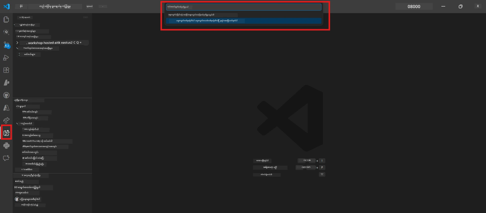

# Module 0 - စတင်အကြောင်း

⏱️ ~10 မိနစ်

> [!WARNING]
> **ကြိုတင်မြင့်မားခြင်းနှင့် ကန့်သတ်ချက်များ:** [Hosted Agents](https://learn.microsoft.com/azure/foundry/agents/concepts/hosted-agents) ကို လတ်တလောတွင် **အများပြည်သူကြိုတင်ကြည့်ရှုမှု** အဆင့်တွင်ရှိသည် - ထုတ်လုပ်ပုံလုပ်ငန်းများအတွက် မသင့်တော်ပါ။ ဒီသင်တန်းအတွင်းပြသသည့် လုပ်ဆောင်ချက်တချို့သည် အဆိုပါ ဝန်ဆောင်မှုသည် GA သို့ ရောက်ရှိသည်အထိ ပြောင်းလဲနိုင်ပါသည်။

## သင်တည်ဆောက်မည့်အရာ

ဒီလက်တွေ့သင်ကြားရေးတွင် သင် Lab 01 မှ တစ်ဦးတည်းသောလုပ်ဆောင်နိုင်မှုများကို တိုးချဲ့ပြီး **multi-agent workflow** တစ်ခုကို တည်ဆောက်ပါမည် - Resume → Job Fit Evaluator ဖြစ်သည်။

သင်သည် **resume** နှင့် **အလုပ်အကြောင်းဖော်ပြချက်** တို့ကို ကူးထည့်ပါမည်။ Agent အထူးတစ်ခုချင်းစီ လိုက်တိုက်စီမံကိန်းလုပ်ငန်းကို ဆက်ပြောလုပ်ပြီး ထို့နောက်ပြန်လည်ပေးပို့ပါမည် -
- သင့်တော်မှုမှတ်ပုံတင် (0–100 နှင့် စာရင်းခွဲခြင်း)
- ကျွမ်းကျင်မှုနှင့် လက်မှတ် ချို့ယွင်းချက်စာရင်း
- အဆိုပါ ချို့ယွင်းချက်များအတွက် Microsoft Learn မှ လက်တွေ့သင်ယူရန် လမ်းညွှန်အစီအစဉ်တစ်ခု

**Workflow သည် အသုံးပြုသည်**
- **Microsoft Agent Framework** - `WorkflowBuilder` ဖြင့် လိုက်နာပြီးစီမံခြင်း
- **Foundry Toolkit for VS Code** - scaffold ရေးဆွဲခြင်း၊ လေ့လာမှု သို့တည်းဖြတ်ခြင်း၊ ဖြန့်ချိခြင်း
- **AI မော်ဒယ်** (ဥပမာ `gpt-4.1-mini`) - Agent လေးယောက်အားလုံးမှ အသုံးပြုသည်
- **Microsoft Learn MCP စာကြည့်တိုက်** - တစ်ခုခြင်း Skill Gap များအတွက် လက်တွေ့ သင်ကြားမှု နေရာများပေးသည်

---

## သင့်လမ်းကြောင်းကို ရွေးချယ်ပါ

> ⚠️ **Lab 01 တွင် သုံးခဲ့သော လမ်းကြောင်းတူညီစွာ ဆက်လက်လုပ်ဆောင်ပါ။**

<details open>
<summary><strong>🅰️ လမ်းကြောင်း A - Azure cloud (Azure subscription လိုအပ်သည်)</strong></summary>

| | အသေးစိတ် |
|---|---|
| **အတွက်ဘယ်သူများ?** | သင်သည် Azure subscription ဖြင့် Lab 01 ကိုပြီးမြောက်ခဲ့သည် |
| **Model** | Azure OpenAI ผ่าน Foundry (ဥပမာ `gpt-4.1-mini`) |
| **ဖော်ပြမည့် Modules** | မော်ဒူးအားလုံး (00–09) |
| **Cloud သို့ Deployment လုပ်မလား?** | ✅ ဟုတ် - အပြည့်အစုံ deployment |

</details>

<details open>
<summary><strong>🅱️ လမ်းကြောင်း B - Foundry Local (Azure subscription မလိုအပ်ပါ)</strong></summary>

| | အသေးစိတ် |
|---|---|
| **အတွက်ဘယ်သူများ?** | သင်သည် Foundry Local ဖြင့် Lab 01 ကိုပြီးမြောက်ခဲ့သည် |
| **Model** | Foundry Local (အခမဲ့၊ ကိုယ့်စက်ပေါ်တွင် သွားဆောင်ကြတာ) |
| **ဖော်ပြမည့် Modules** | မော်ဒူး 00–05 (06–07 ကျော်၍ - deployment နှင့် cloud စစ်ဆေးမှု) |
| **Cloud သို့ Deployment လုပ်မလား?** | ❌ မဟုတ် - Agent Inspector ဖြင့် ဒေသခံ စမ်းသပ်မှုသာ |

</details>

---

## Lab 01 စစ်ဆေးမှု

Lab 02 သည် Lab 01 ကို ဒါရိုက်တိ တည်ဆောက်သည်။ ဒီမှာ စတင်မလုပ်ခင် Lab 01 ကို အစပိုင်းပြီးစုံစမ်းပါ။

Lab 01 မလုပ်ရသေးပါဘူးလား? ဒီမှာ စတင်ပါ: [Lab 01 - အကြောင်းအရာ](../../lab01-single-agent/docs/00-prerequisites.md)

<details open>
<summary><strong>🅰️ လမ်းကြောင်း A - Azure cloud</strong></summary>

```powershell
az account show --query "{name:name, id:id}" --output table
```

ဒီဟာလည်မရရင် `az login` ကိုဆောင်ရွက်ပါ။ VS Code ထဲမှာ စစ်ဆေးပါ -

1. `Ctrl+Shift+P` → **Foundry Toolkit** ဟူ၍ ရိုက်ထည့်ပါ → အမိန့်တွေ ပေါ်လာမှုကို အတည်ပြုပါ။
2. **Foundry Toolkit** ပုံသဏ္ဍာန်တင်ထားသော အိုင်ကွန်ကိုနှိပ်ပါ → သင့်ပရောဂျက်နှင့် deployment မော်ဒယ်များ **အောင်မြင်** ဟု ပြသည်။



> **RBAC:** သင်သည် Lab 01 တွင် **Foundry User** ကိုပေးသတ်မှတ်ထားသည်။ ပြန်လည် သတ်မှတ်ရန်လိုလျှင် [Lab 01, Module 1](../../lab01-single-agent/docs/01-setup.md#deploy-a-model--assign-rbac) တွင်ကြည့်ပါ။ ယခင်က ဒီခွင့်အမည်ကို **Azure AI User** ဟုပြောထားသည် - ခွင့်ပြုချက်တွေအတူတူ ဖြစ်ပါသည်။

</details>

<details open>
<summary><strong>🅱️ လမ်းကြောင်း B - Foundry Local</strong></summary>

```powershell
Invoke-WebRequest -Uri "http://localhost:5273/v1/health" -UseBasicParsing | Select-Object StatusCode
```

မျှော်လင့်သည်မှာ - `StatusCode: 200` ဖြစ်ရမည်။ မဖြစ်လျှင် Foundry Toolkit sidebar မှ Foundry Local ကို ပြန်စတင်ပါ။

> အားလုံးသော inference သည် ကိုယ့်စက်ပေါ်တွင်ပဲ လည်ပတ်သည်။ ထွက်ခေါ်သော ဆက်သွယ်မှု တစ်ခုတည်းမှာ MCP ကိရိယာမှ `https://learn.microsoft.com/api/mcp` ကိုသာဖြစ်သည်။

</details>

---

## Lab 02 တွင် အသစ်များ

| | Lab 01 | Lab 02 |
|--|--------|--------|
| Agent များ | 1 | 4 (WorkflowBuilder ဖြင့် လိုင်စင်စပ်ထား) |
| Scaffold ပုံစံ | အခြေခံ - Agent Framework | Workflow များ - Agent Framework |
| အထူး package | - | `mcp` |
| ပေါင်းစည်းခြင်း | တစ်ဦးတည်း စကားပြော Agent | လိုက်နာ၍ ဆက်တိုက် pipeline (WorkflowBuilder) |
| ကိရိယာအသစ် | - | `search_microsoft_learn_for_plan` (MCP) |

---

**နောက်တစ်ခု:** [01 - အင်ဂျင်နီယားဖွဲ့စည်းမှုကိုနားလည်ခြင်း →](01-understand-multi-agent.md)

---

<!-- CO-OP TRANSLATOR DISCLAIMER START -->
**ပြောကြားချက်**
ဤစာတမ်းကို AI ဘာသာပြန်ဝန်ဆောင်မှု [Co-op Translator](https://github.com/Azure/co-op-translator) အသုံးပြု၍ ဘာသာပြန်ထားပါသည်။ ကျွန်ုပ်တို့သည် တိကျမှန်ကန်မှုအတွက် ကြိုးပမ်းနေသော်လည်း၊ စက်ကိရိယာဘာသာပြန်ခြင်းများတွင် အမှားများ သို့မဟုတ် မှားယွင်းချက်များ ပါဝင်နိုင်ကြောင်း သတိပြုပါရန် လိုအပ်ပါသည်။ မူလစာတမ်းကို မူရင်းဘာသာဖြင့်သာ ယုံကြည်စိတ်ချရသော အချက်အလက်အဖြစ် သတ်မှတ်သင့်သည်။ အရေးကြီးသည့် သတင်းအချက်အလက်များအတွက် ပရော်ဖက်ရှင်နယ် လူသားဘာသာပြန်သူဝန်ဆောင်မှုကို အကြံပြုပါသည်။ ဤဘာသာပြန်ချက်ကို အသုံးပြုခြင်းမှ ဖြစ်ပေါ်လာသော နားလည်မှုကွာခြားမှုများ သို့မဟုတ် မမှန်ကန်သော အသုံးပြုမှုများအတွက် ကျွန်ုပ်တို့ တာဝန်မခံပါ။
<!-- CO-OP TRANSLATOR DISCLAIMER END -->