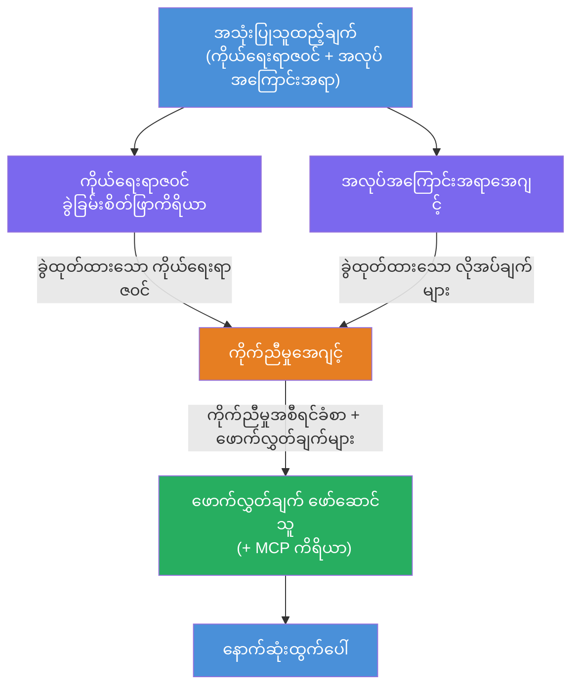
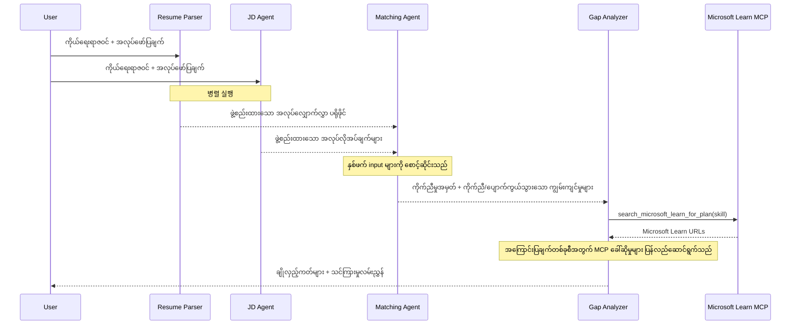
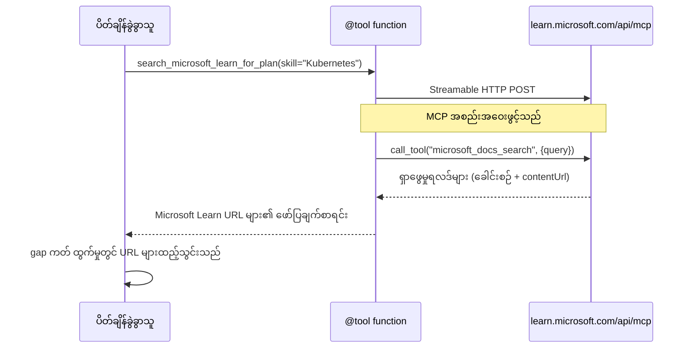

# Module 1 - မူလ Agent အဆောက်အအုံ ကိုနားလည်ပါ

ဤ module တွင် သင်သည် Resume → Job Fit Evaluator ၏ အဆောက်အအုံကို အဆိုပါကုဒ် မရေးသားမီ လေ့လာပါမည်။ Orchestration graph၊ agent ရဲ့ အခန်းကဏ္ဍများနှင့် data flow ကို နားလည်ခြင်းသည် [multi-agent workflows](https://learn.microsoft.com/azure/architecture/ai-ml/idea/multiple-agent-workflow-automation) ကို ပြဿနာဖြေရှင်းခြင်းနှင့် တိုးချဲ့ခြင်းအတွက် အရေးကြီးပါသည်။

---

## ဤပြဿနာ ဖြေရှင်းပုံ

Resume ကို job description နဲ့ မျှတစွာ တွဲဖက်ခြင်းသည် အတော်လေး ကွဲပြားသော အတတ်ပညာများ ပါဝင်ပါသည်-

1. **Parsing** - မဖွဲ့စည်းထားသော စာသား (resume) မှ ဖွဲ့စည်းထားသော ဒေတာ ခင်းကျင်းထုတ်ယူခြင်း
2. **Analysis** - Job description မှ လိုအပ်ချက်များ ခင်းကျင်းထုတ်ယူခြင်း
3. **Comparison** - နှစ်ခုအကြား တွဲဖက်မှု ရမှတ် ချမှတ်ခြင်း
4. **Planning** - ချွတ်ယွင်းချက်များ ဖြည့်ဆည်းရန် သင်ယူမည့် လမ်းပြမြေပုံ ဆောက်လုပ်ခြင်း

တစ်ဦးတည်းသော agent တစ်ခုမှာ ဤ လုပ်ငန်းများ လေးခုလုံးကို တစ်ချက်မှာ လုပ်သောကြောင့် သာမာန်အားဖြင့်-

- အပြည့်အစုံ မထုတ်ယူနိုင်ခြင်း (ရွှေ့လျားကြည့်ပြီး ရမှတ်သို့ လျင်မြန်စွာ ကျော်လွှားသွားခြင်း)
- နက်နဲသည့် ရမှတ်ခြုံငုံမရှိခြင်း (နောက်ခံ အထောက်အထားမပါ)
- အထူးသီးသန့် မဟုတ်သော လမ်းပြများ (ချွတ်ယွင်းချက်များကို မအာရုံစိုက်ခြင်း)

**လေးခု သီးသန့် Agent များ** သို့ ခွဲခြားခြင်းဖြင့်၊ ဟိုင်းကွဲလွင့် သင့်တာဝန်ကို ဦးတည်သတ်မှတ် ပေးပြီး အဆင့်တိုင်းတွင် အရည်အသွေးမြင့် output ကို ထုတ်ပေးနိုင်ပါသည်။

---

## လေးစုံ Agent များ

Agent တစ်ခုချင်းစီသည် `AzureAIAgentClient.as_agent()` ဖြင့် ဖန်တီးသော [Microsoft Foundry](https://learn.microsoft.com/azure/foundry/agents/concepts/hosted-agents) agent ဖြစ်သည်။ သူတို့သည် တူညီသော မော်ဒယ် deployment ကို မျှဝေသော်လည်း အညွှန်းအမိန့်များနှင့် (လိုအပ်ပါက) ကိရိယာ မတူကွဲပြားပါသည်။

| # | Agent အမည် | အခန်းကဏ္ဍ | ထည့်ရန် | ထုတ်ရန် |
|---|-----------|------|-------|--------|
| 1 | **ResumeParser** | Resume စာသားမှ ဖွဲ့စည်းထားသော ကိုယ်ရေးအကျဉ်း ထုတ်ယူသည် | အမူရင်း resume စာသား (အသုံးပြုသူမှ) | Candidate Profile, Technical Skills, Soft Skills, Certifications, Domain Experience, Achievements |
| 2 | **JobDescriptionAgent** | JD မှ ဖွဲ့စည်းထားသော လိုအပ်ချက်များ ခင်းကျင်းထုတ်ယူသည် | အမူရင်း JD စာသား (အသုံးပြုသူမှ ResumeParser ဖြင့် ရောက်ရှိ) | Role Overview, Required Skills, Preferred Skills, Experience, Certifications, Education, Responsibilities |
| 3 | **MatchingAgent** | အထောက်အထားအပေါ် မူတည်သော fit ရမှတ် ချမှတ်သည် | ResumeParser နှင့် JobDescriptionAgent ၏ ရလဒ် | Fit Score (0-100 ဖြင့်အသေးစိတ်), Matched Skills, Missing Skills, Gaps |
| 4 | **GapAnalyzer** | ကိုယ်ပိုင် သင်ယူမှု လမ်းပြမြေပုံ ဖန်တီးသည် | MatchingAgent ရလဒ် | Gap ကတ်များ (တစ်ခုချင်းစီ skill အတွက်), သင်ယူမှု အစီအစဉ်, အချိန်ဇယား, Microsoft Learn မှ အရင်းအမြစ်များ |

---

## Orchestration graph

Workflow သည် **parallel fan-out** နောက်တယ် **sequential aggregation** ကို အသုံးပြုသည်-


> **အဓိပ္ပာယ်။** Purple = parallel agent များ၊ Orange = aggregation point၊ Green = နောက်ဆုံး agent များ (ကိရိယာများပါရှိ)

### ဒေတာလည်ပတ်ပုံ


1. **အသုံးပြုသူမှ** resume နှင့် job description ပါဝင်သော message ကို ပို့သည်။
2. **ResumeParser** သည် အသုံးပြုသူ input အပြည့်အစုံကို လက်ခံပြီး ဖွဲ့စည်းထားသော candidate profile ထုတ်ယူသည်။
3. **JobDescriptionAgent** သည် parallel အနေနဲ့ အသုံးပြုသူ input ကို လက်ခံပြီး ဖွဲ့စည်းထားသောလိုအပ်ချက်များ ထုတ်ယူသည်။
4. **MatchingAgent** သည် ResumeParser နှင့် JobDescriptionAgent နှစ်ခုလုံး၏ ထွက်ရှိမှုများကို လက်ခံသည် (framework သည် နှစ်ခုကို ပြီးမြောက်မှ MatchingAgent ကို run ပြုလုပ်ပေးသည်)။
5. **GapAnalyzer** သည် MatchingAgent ရလဒ်ကို လက်ခံပြီး အတိအကျသင့်တော်မှုကြောင့် Microsoft Learn MCP tool ကို ခေါ်ယူ၍ ချွတ်ယွင်းချက်အသီးသီးအတွက် အမှန်တကယ် သင်ယူရမည့် အရင်းအမြစ်များ ရယူသည်။
6. **နောက်ဆုံးရလဒ်** သည် GapAnalyzer ရဲ့ တုံ့ပြန်ချက်ဖြစ်ပြီး၊ fit score၊ gap ကတ်များနှင့် ပြည့်စုံသော သင်ယူမှု လမ်းပြမြေပုံ ပါဝင်သည်။

### parallel fan-out အရေးကြီးမှု

ResumeParser နှင့် JobDescriptionAgent များသည် **parallel** ဖြင့် ပြုလုပ်သည်။ သို့ဖြစ်သောကြောင့် မည်သူ့ကိုမှမရပ်တန့်ပဲ လုပ်ဆောင်နိုင်သည့် လုပ်ငန်းများဖြစ်သည်။ ၎င်းသည်-
- စုစုပေါင်း စောင့်ဆိုင်းချိန် လျော့နည်းစေသည် (နှစ်ခုလုံး တပြိုင်နက် သာမန် အဆင့်လိုက် run ဖို့မဟုတ်)
- သာမာန်ခွဲခြားမှုတစ်ခု ဖြစ်သည် (resume parsing နှင့် JD parsing သည် လွတ်လပ်သောလုပ်ငန်းများ)
- သာမာန် multi-agent ပုံစံတစ်ခုဖြစ်သည်။ **fan-out → aggregate → act**

---

## WorkflowBuilder ကို ကုဒ်ထဲတွင်

အထက်၌ ပါရှိသော graph ကို [`WorkflowBuilder`](https://learn.microsoft.com/agent-framework/workflows/agents-in-workflows) API ခေါ်ဆိုမှုများနှင့် `main.py` တွင် မည်သို့ တစ်ဆက်တည်း တွဲသွားသည်ကို ဖော်ပြပါ-

```python
from agent_framework import WorkflowBuilder

workflow = (
    WorkflowBuilder(
        name="ResumeJobFitEvaluator",
        start_executor=resume_parser,       # အသုံးပြုသူ၏ထည့်သွင်းချက်ကို ပထမဆုံး လက်ခံသော အေးဂျင့်
        output_executors=[gap_analyzer],     # နောက်ဆုံး မျှဝေမည့် အေးဂျင့်
    )
    .add_edge(resume_parser, jd_agent)      # ResumeParser → အလုပ်လျှောက်လွှာဖော်ပြချက် အေးဂျင့်
    .add_edge(resume_parser, matching_agent) # ResumeParser → ကိုက်ညီမှု အေးဂျင့်
    .add_edge(jd_agent, matching_agent)      # အလုပ်လျှောက်လွှာဖော်ပြချက် အေးဂျင့် → ကိုက်ညီမှု အေးဂျင့်
    .add_edge(matching_agent, gap_analyzer)  # ကိုက်ညီမှု အေးဂျင့် → ခြားနားချက် စိစစ်သူ
    .build()
)
```

**ရေကြောင်း အဓိပ္ပာယ်များ-**

| Edge | အဓိပ္ပာယ် |
|------|-------------|
| `resume_parser → jd_agent` | JD Agent သည် ResumeParser ၏ output ကို လက်ခံသည် |
| `resume_parser → matching_agent` | MatchingAgent သည် ResumeParser ၏ output ကို လက်ခံသည် |
| `jd_agent → matching_agent` | MatchingAgent သည် JD Agent ၏ output ကိုလည်း လက်ခံသည် (နှစ်ခုလုံး ပြီးမှ) |
| `matching_agent → gap_analyzer` | GapAnalyzer သည် MatchingAgent ၏ output ကို လက်ခံသည် |

`matching_agent` သည် **incoming edge ၂ ခု** (`resume_parser` နှင့် `jd_agent`) ရှိသောကြောင့် framework က နှစ်ခု လုံး ပြီးမှ MatchingAgent ကို run ပါသည်။

---

## MCP tool

GapAnalyzer agent တွင် tool တစ်ခု ရှိသည်- `search_microsoft_learn_for_plan`။ ၎င်းသည် Microsoft Learn API ကို ခေါ်သုံးကာ သတ်မှတ်ထားသည့် သင်ယူမှု အရင်းအမြစ်များ ရယူပေးသော **[MCP tool](https://learn.microsoft.com/agent-framework/agents/tools/hosted-mcp-tools)** ဖြစ်သည်။

### လည်ပတ်ပုံ

```python
@tool
async def search_microsoft_learn_for_plan(
    skill: str, role: str = "", max_results: int = 5
) -> str:
    """Search Microsoft Learn MCP and return curated official links."""
    # Streamable HTTP မှတဆင့် https://learn.microsoft.com/api/mcp ဆက်သွယ်သည်
    # MCP ဆာဗာပေါ်တွင် 'microsoft_docs_search' ကိရိယာကို ခေါ်ဆိုသည်
    # Microsoft Learn URL များ၏ ဖော်မတ်ထားသောစာရင်းကို ပြန်ပေးသည်
```

### MCP call ရွေ့လျားပုံ


1. GapAnalyzer သည် "Kubernetes" ကဲ့သို့ skill တစ်ခုအတွက် သင်ယူမှုအရင်းအမြစ် မလိုပုံကို ဆုံးဖြတ်သည်
2. Framework သည် `search_microsoft_learn_for_plan(skill="Kubernetes")` ကို ခေါ်သည်
3. function သည် [Streamable HTTP](https://learn.microsoft.com/agent-framework/agents/tools/hosted-mcp-tools) ချိတ်ဆက်မှုကို `https://learn.microsoft.com/api/mcp` သို့ ဖွင့်သည်
4. `microsoft_docs_search` tool ကို [MCP server](https://learn.microsoft.com/azure/foundry/agents/how-to/tools/model-context-protocol) တွင် ခေါ်သည်
5. MCP server သည် ရလဒ်များ (ခေါင်းစဉ် + URL) ပြန်လည်ပေးပို့သည်
6. function သည် ရလဒ်များကို ဖော်မတ် ပြုလုပ်၍ string အနေနဲ့ ပြန်ပေးသည်
7. GapAnalyzer သည် ပြန်လာသော URLs များကို gap card output တွင် အသုံးပြုသည်

### MCP logs မျှင်

tool run မှာ အောက်ပါ log များမြင်ရမည်-

```
GET https://learn.microsoft.com/api/mcp → 405 (Method Not Allowed)
POST https://learn.microsoft.com/api/mcp → 200
DELETE https://learn.microsoft.com/api/mcp → 405 (Method Not Allowed)
```

**ဤသည်များ သာမာန်ဖြစ်သည်။** MCP client သည် GET နှင့် DELETE ဖြင့် initialization တွင် probe လုပ်ပြီး 405 ပြန်လာခြင်းမှာ မဆိုကောင်းသောအပြုအမူ ဖြစ်သည်။ စစ်မှန် tool ခေါ်ချက်မှာ POST ဖြင့် ဆောင်ရွက်ပြီး 200 ပြန်မည်။ POST call မအောင်မြင်ပါကသာ စိုးရိမ်ရမည်။

---

## Agent ဖန်တီးပုံ

Agent တစ်ခုချင်းစီကို **[`AzureAIAgentClient.as_agent()`](https://learn.microsoft.com/python/api/overview/azure/ai-agents-readme) async context manager** ဖြင့် ဖန်တီးသည်။ သည် Foundry SDK pattern ဖြစ်ပြီး agents များ အလိုအလျောက် သန့်ရှင်းစေသည်-

```python
async with (
    get_credential() as credential,
    AzureAIAgentClient(
        project_endpoint=PROJECT_ENDPOINT,
        model_deployment_name=MODEL_DEPLOYMENT_NAME,
        credential=credential,
    ).as_agent(
        name="ResumeParser",
        instructions=RESUME_PARSER_INSTRUCTIONS,
    ) as resume_parser,
    # ... ကော်မြူးတစ်ယောက်ချင်းစီအတွက် ထပ်မံသုံးပါ ...
):
    # ဤနေရာတွင် ကော်မြူး ၄ ယောက်လုံး ရှိသည်
    workflow = create_workflow(resume_parser, jd_agent, matching_agent, gap_analyzer)
```

**အကြောင်းအရာ အဓိကမှု-**
- Agent တစ်ခုစီသည် `AzureAIAgentClient` instance ကို ထိန်းသိမ်းထားသည် (SDK သည် agent အမည်ကို client နှင့် scoped ဖြစ်ရန် လိုသည်)
- Agent များအားလုံးသည် တူညီသော `credential`, `PROJECT_ENDPOINT`, နှင့် `MODEL_DEPLOYMENT_NAME` ကို မျှဝေသည်
- `async with` block သည် server ပိတ်ချိန်တွင် agents များအားလုံး အလိုအလျောက် သန့်ရှင်းသည်ကို ဂရုစိုက်သည်
- GapAnalyzer သည် ထို့အပြင် `tools=[search_microsoft_learn_for_plan]` ကိုလည်း လက်ခံသည်

---

## Server စတင်ခြင်း

Agents များ ဖန်တီးပြီး workflow တည်ဆောက်ပြီးနောက် စာဝန်ဆောင်မှု ပြုလုပ်သည်-

```python
from azure.ai.agentserver.agentframework import from_agent_framework

agent = create_workflow(resume_parser, jd_agent, matching_agent, gap_analyzer)
await from_agent_framework(agent).run_async()
```

`from_agent_framework()` သည် workflow ကို HTTP server အဖြစ် ထုပ်ပိုးထားပြီး `/responses` endpoint ကို port 8088 တွင် ထုတ်ပေးသည်။ ၎င်းသည် Lab 01 နှင့် တူညီသော ပုံစံ ဖြစ်သော်လည်း "agent" သည် လက်ရှိမှာ စုံလင်သော [workflow graph](https://learn.microsoft.com/agent-framework/workflows/as-agents) ဖြစ်သည်။

---

### စစ်ဆေးချက်

- [ ] မူလ ၄-အေဂျင့် အဆောက်အအုံ နှင့် agent တစ်ခုချင်း၏ အခန်းကဏ္ဍကို နားလည်ပါသည်
- [ ] ဒေတာလည်ပတ်မှုကို လမ်းကြောင်းလိုက် နားလည်သည်- အသုံးပြုသူ → ResumeParser → (parallel) JD Agent + MatchingAgent → GapAnalyzer → ထုတ်ပေးမှု
- [ ] MatchingAgent သည် ResumeParser နှင့် JD Agent နှစ်ခုလုံး ပြီးမှ စောင့်ဆိုင်းရန် ကျွမ်းကျင်သည် (incoming edge ၂ခု)
- [ ] MCP tool ကို နားလည်သည် - ၎င်း၏လုပ်ဆောင်ပုံ၊ ခေါ်ဆိုပုံ၊ GET 405 log များ သာမာန်ဖြစ်မှု
- [ ] `AzureAIAgentClient.as_agent()` pattern နှင့် agent တစ်ခုချင်း client instance သီးသန့် ပိုင်ဆိုင်မှုကို နားလည်သည်
- [ ] `WorkflowBuilder` ကုဒ်ကို ဖတ်၍ visual graph နှင့် တွဲဖက် နားလည်နိုင်သည်

---

**ယခင်အကြောင်းအရာ:** [00 - Prerequisites](00-prerequisites.md) · **နောက်တစ်ခါ စာမျက်နှာ:** [02 - Scaffold the Multi-Agent Project →](02-scaffold-multi-agent.md)

---

<!-- CO-OP TRANSLATOR DISCLAIMER START -->
**သတိပြုရန်**  
ဒီစာရွက်စာတမ်းကို AI ဘာသာပြန်ဝန်ဆောင်မှု [Co-op Translator](https://github.com/Azure/co-op-translator) ဖြင့် ဘာသာပြန်ထားပါသည်။ ကျွန်ုပ်တို့သည် တိကျမှုအတွက် ကြိုးပမ်းရာတွင် ဖြစ်ပေမယ့် စက်ရုပ်ဘာသာပြန်မှုများတွင် အမှားများ သို့မဟုတ် မမှန်ကန်မှုများ ပါရှိနိုင်သောကြောင့် သတိပြုပါ။ မူလစာရွက်စာတမ်းကို မိန့်ဆိုဘာသာစကားဖြင့်သာ တရားဝင်အချက်အလက်အဖြစ် မှတ်ယူသင့်သည်။ အရေးကြီးသော အချက်အလက်များအတွက် လူကျွမ်းကျင်သော ဘာသာပြန်သူမှ ဘာသာပြန်ခြင်းကို အကြံပြုပါသည်။ ဤဘာသာပြန်ချက်ကို အသုံးပြုရာမှ ဖြစ်ပေါ်မည့် မသိမြင်မှုများ သို့မဟုတ် အမှားဖြစ်ပေါ်မှုများအတွက် ကျွန်ုပ်တို့ တာဝန်မရှိပါ။
<!-- CO-OP TRANSLATOR DISCLAIMER END -->