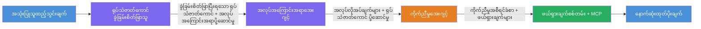

# Module 1 - ဖွဲ့စည်းပုံအားနားလည်ခြင်း

⏱️ ~5 မိနစ်

ကုဒ်မရေးခင်မှာ၊ မင်းဆောက်နေတဲ့အရာနဲ့ အဲဒါဘယ်လိုအလုပ်လုပ်တာဆိုတာအကြောင်း အကျဉ်းချုပ်ပြောပြချင်ပါတယ်။

---

## မင်းဆောက်နေတဲ့အရာ

မင်းက **အလုပ်မှတ်တမ်း(Resume)** နဲ့ **အလုပ်ဖော်ပြချက်(Job Description)** ကို တစ်ပြိုင်တည်းတင်ပေးတယ်။ workflow က ပြန်ပေးတယ်:

- ကိုက်ညီမှုအဆင့်(0–100 ပြင် ခွဲခြမ်းစိတ်ဖြာချက်ပါ)
- ကျွမ်းကျင်မှုနဲ့ အသိအမှတ်ပြုလက်မှတ်ကွစ်ကွာချက်စာရင်း
- Microsoft Learn link တွေ ပါဝင်တဲ့ ကိုယ်တိုင်လေ့လာမှုလမ်းပြချက်တစ်ခု

---

## လုပ်ကိုင်မယ့် အေးဂျင့်လေးယောက်

တစ်ယောက်တည်း အေးဂျင့်တစ်ခုက parse, score နဲ့ plan လုပ်မယ့်အခါမှာ အလျင်စလိုပြီး output ပြောသွားတတ်တယ်။ အလုပ်ကို အေးဂျင့် ၄ ယောက်ကို အထူးပြုခွဲဘို့က ပိုကောင်းသလောက်ရလဒ်ဖြစ်တယ်။

| အေးဂျင့် | ဘာလုပ်လဲ |
|-------|-------------|
| **ResumeParser** | အလုပ်မှတ်တမ်းကို parse လုပ်တယ်၊ JD ကို 그대로 `[JOB DESCRIPTION PASS-THROUGH]` ထဲကူးတယ် downstream အေးဂျင့်တွေဖို့ |
| **JobDescriptionAgent** | Pass-through ကနေ JD လိုအပ်ချက်တွေထုတ်ယူတယ်၊ `[PARSED RESUME]` ကို `[PARSED RESUME PASS-THROUGH]` အဖြစ် ရှေ့ကိုပို့တယ် |
| **MatchingAgent** | တို့လက်မှတ်တန်းကို နှိုင်းယှဉ်တယ်၊ 0–100 fit score နဲ့ gap စာရင်းထုတ်တယ် |
| **GapAnalyzer** | လေ့လာမှုလမ်းပြချက်တစ်ခု ဖန်တီးတယ်၊ Microsoft Learn ကို gap တစ်ခုစီရှာတယ် |

---

## ပေါင်းစည်းမှု ရှုထောင့်မြင်ကွင်း

Workflow က `စဉ်လိုက်တန်းလိုက် pipeline` ပါ - အေးဂျင့်တိုင်း output ကို နောက်ထပ်အေးဂျင့်ထံပို့တယ်။


```mermaid
flowchart LR
    A["အသုံးပြုသူထည့်သွင်းချက်"] --> B["ရုပ်သံဇာတ်ကောင်ခွဲခြမ်းစိတ်ဖြာသူ"]
    B -- "ခွဲခြမ်းစိတ်ဖြာပြီးရသော ရုပ်သံဇာတ်ကောင် + အလုပ်အကြောင်းအရာပို့ဆောင်မှု" --> C["အလုပ်အကြောင်းအရာအေးဂျင့်"]
    C -- "အလုပ်လိုအပ်ချက်များ + ရုပ်သံဇာတ်ကောင် ပို့ဆောင်မှု" --> D["ကိုက်ညီမှုအေးဂျင့်"]
    D -- "ကိုက်ညီမှုအစီရင်ခံစာ + ဖယ်ရှားချက်များ" --> E["ဖယ်ရှားချက်စစ်တမ်း + MCP"]
    E --> F["နောက်ဆုံးထုတ်ပိုးချက်"]

    style A fill:#4A90D9,color:#fff
    style B fill:#7B68EE,color:#fff
    style C fill:#7B68EE,color:#fff
    style D fill:#E67E22,color:#fff
    style E fill:#27AE60,color:#fff
    style F fill:#4A90D9,color:#fff
```

1. **ResumeParser** က အသုံးပြုသူ input ကို လက်ခံပြီး အလုပ်မှတ်တမ်းကို parse လုပ်ပြီး JD ကို `[JOB DESCRIPTION PASS-THROUGH]` ထဲကူးထည့်တယ်။
2. **JD Agent** က စနစ်တကျလိုအပ်ချက်တွေကိုထုတ်ပြီး `[PARSED RESUME PASS-THROUGH]` ကိုရှေ့ဆက်ပို့တယ်။
3. **MatchingAgent** က နှိုင်းယှဉ်ပြီး fit score နဲ့ gap စာရင်းထုတ်တယ်။
4. **GapAnalyzer** က လမ်းပြချက် ဖန်တီးပြီး skill gap တစ်ခုချင်းစီအတွက် Microsoft Learn MCP tool ကိုခေါ်တယ်။

---

## ဒီဟာကို ဘယ်လို code နဲ့ချိတ်ဆက်မလဲ

`main.py` မှာ ဒီ graph ကို `WorkflowBuilder` နဲ့ ဖေါ်ပြတယ်။

```python
workflow_agent = (
    WorkflowBuilder(
        start_executor=resume_executor,       # ပထမဦးဆုံးအေးဂျင့်သည် အသုံးပြုသူ၏အချက်အလက်ကိုလက်ခံသည်
        output_executors=[gap_executor],      # နောက်ဆုံးအေးဂျင့် - ၎င်း၏ထွက်ရှိချက်သည် တုံ့ပြန်ချက်ဖြစ်သည်
    )
    .add_edge(resume_executor, jd_executor)       # ResumeParser → JD Agent
    .add_edge(jd_executor, matching_executor)     # JD Agent → MatchingAgent
    .add_edge(matching_executor, gap_executor)    # MatchingAgent → GapAnalyzer
    .build()
    .as_agent()
)
```

`Agent` တစ်ခုချင်းစီကို `AgentExecutor` နဲ့ ထုပ်ပိုးထားတယ်။ `add_edge()` ကို အသုံးပြုပြီး strictly sequential pipeline တစ်ခုကို သတ်မှတ်တယ် - အေးဂျင့်တိုင်းက သူ့နောက်က အေးဂျင့်ရဲ့ output ကိုသာ လက်ခံတယ်။

> `context_mode="last_agent"` ဆိုတာက executor တစ်ခုချင်းစီက သူ့တိုက်ရိုက် မတိုင်ခင် အေးဂျင့်ရဲ့ output ကိုသာမြင်တယ်။ ResumeParser နဲ့ JD Agent က data ကို labeled sections တွေဖြင့် ရှေ့ဆက်ပို့ လိုအပ်ချက်အတိုင်း downstream အေးဂျင့်တွေ ပြီးပြည့်စုံစေဖို့။

---

## MCP tool

GapAnalyzer မှာ tool တစ်ခုရှိတယ် - `search_microsoft_learn_for_plan`။ `https://learn.microsoft.com/api/mcp` ကိုချိတ်ဆက်ပြီး skill gap တစ်ခုချင်းစီအတွက် Microsoft Learn လင့်ခ်တွေပြန်ပေးတယ်။

Tool တက်တာကို တွေ့ရင် ဒီလို logs တွေမြင်မှာပါ - အားလုံး မှန်ကန်တယ်။

```
GET  https://learn.microsoft.com/api/mcp → 405   ← connection probe, normal
POST https://learn.microsoft.com/api/mcp → 200   ← actual tool call
DELETE https://learn.microsoft.com/api/mcp → 405 ← cleanup probe, normal
```

`POST` က error ပြန်လာရင်ပဲ စိုးရိမ်ပါ။

---

**ရှေ့က:** [00 - ပြင်ဆင်ရန် လိုအပ်ချက်များ](00-prerequisites.md) · **နောက်တစ်ခု:** [02 - စီမံကိန်းကို Scaffold လုပ်ခြင်း →](02-scaffold-multi-agent.md)

---

<!-- CO-OP TRANSLATOR DISCLAIMER START -->
**ပြောကြားချက်**
ဤစာတမ်းကို AI ဘာသာပြန်ဝန်ဆောင်မှု [Co-op Translator](https://github.com/Azure/co-op-translator) အသုံးပြု၍ ဘာသာပြန်ထားပါသည်။ ကျွန်ုပ်တို့သည် တိကျမှန်ကန်မှုအတွက် ကြိုးပမ်းနေသော်လည်း၊ စက်ကိရိယာဘာသာပြန်ခြင်းများတွင် အမှားများ သို့မဟုတ် မှားယွင်းချက်များ ပါဝင်နိုင်ကြောင်း သတိပြုပါရန် လိုအပ်ပါသည်။ မူလစာတမ်းကို မူရင်းဘာသာဖြင့်သာ ယုံကြည်စိတ်ချရသော အချက်အလက်အဖြစ် သတ်မှတ်သင့်သည်။ အရေးကြီးသည့် သတင်းအချက်အလက်များအတွက် ပရော်ဖက်ရှင်နယ် လူသားဘာသာပြန်သူဝန်ဆောင်မှုကို အကြံပြုပါသည်။ ဤဘာသာပြန်ချက်ကို အသုံးပြုခြင်းမှ ဖြစ်ပေါ်လာသော နားလည်မှုကွာခြားမှုများ သို့မဟုတ် မမှန်ကန်သော အသုံးပြုမှုများအတွက် ကျွန်ုပ်တို့ တာဝန်မခံပါ။
<!-- CO-OP TRANSLATOR DISCLAIMER END -->