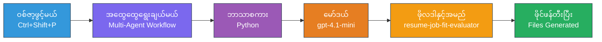
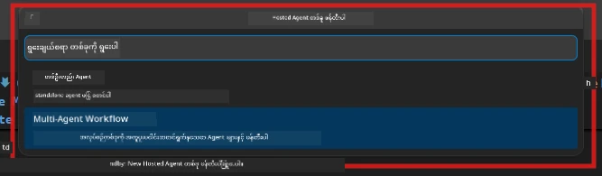

# Module 2 - မူလတန်း အေးဂျင့် များ ပါဝင်သော Project ဖွဲ့တည်ခြင်း

ဤ module တွင် သင်သည် [Microsoft Foundry extension](https://marketplace.visualstudio.com/items?itemName=TeamsDevApp.vscode-ai-foundry) ကို အသုံးပြုပြီး **မူလတန်း အေးဂျင့် များ ပါဝင်သော workflow project ကို ဖွဲ့တည်မည်**။ ဤ extension မှာ အကြောင်းအရာအစုံဖြစ်သည့် project ဖွဲ့စည်းမှုများ - `agent.yaml`, `main.py`, `Dockerfile`, `requirements.txt`, `.env`, နှင့် debug configuration များကို ဖန်တီးပေးပါသည်။ ထိုကလောက်တွင် သင်သည် Modules 3 နှင့် 4 တွင် ဤဖိုင်များကို စိတ်ကြိုက်ပြင်ဆင်နိုင်ပါသည်။

> **သတိပေးချက်:** ဤ lab တွင်ပါဝင်သည့် `PersonalCareerCopilot/` ဖိုင်ဒါ သည် စိတ်ကြိုက်ပြင်ဆင်ပြီး အသုံးပြုနိုင်သော မူလတန်း အေးဂျင့် ပရောဂျက် စမ်းသပ်နည်း အပြည့်အစုံ များကို ပါဝင်ထားသည်။ သင်သည် project အသစ်ကို ဖန်တီးပြီး စတင်လေ့လာနိုင်သလို (သင်ယူရန် အကြံပြုသည်) သို့မဟုတ် ရှိပြီးသား ကုဒ်ကို တိုက်ရိုက်လေ့လာနိုင်ပါသည်။

---

## အဆင့် ၁: Create Hosted Agent wizard ကို ဖွင့်ပါ


1. `Ctrl+Shift+P` ကို ခလုတ်နှိပ်ပြီး **Command Palette** ကိုဖွင့်ပါ။
2. ရိုက်ထည့်ပါ: **Microsoft Foundry: Create a New Hosted Agent** နှင့် ရွေးချယ်ပါ။
3. Hosted agent ဖန်တီးမှု wizard သည် ဖွင့်လှစ်ပါမည်။

> **အခြားနည်းလမ်း:** Activity Bar တွင်ရှိသည့် **Microsoft Foundry** icon ကို နှိပ်ပြီး → **Agents** အောက်တွင်ရှိသည့် **+** ဆုတံခါးကို နှိပ် → **Create New Hosted Agent** ကိုရွေးချယ်ပါ။

---

## အဆင့် ၂: Multi-Agent Workflow template ကို ရွေးပါ

Wizard သည် template ရွေးချယ်ရန် မေးမြန်းပါသည်။

| Template | ဖော်ပြချက် | အသုံးပြုချိန် |
|----------|-------------|-------------|
| Single Agent | တစ်ဦးတည်း အေးဂျင့်နှင့် အညွှန်းများ၊ ရွေးချယ်စရာ tools များ | Lab 01 |
| **Multi-Agent Workflow** | အေးဂျင့် အများအပြား WorkflowBuilder မှတဆင့် ပူးပေါင်းဆောင်ရွက်ခြင်း | **ဤ lab (Lab 02)** |

1. **Multi-Agent Workflow** ကို ရွေးပါ။
2. **Next** ကို နှိပ်ပါ။



---

## အဆင့် ၃: Programming language ကို ရွေးချယ်ပါ

1. **Python** ကို ရွေးချယ်ပါ။
2. **Next** ကို နှိပ်ပါ။

---

## အဆင့် ၄: သင့်မော်ဒယ်ကို ရွေးချယ်ပါ

1. Wizard သည် သင့် Foundry project တွင် တပ်ဆင်ပြီး မော်ဒယ်များကို ပြသပါမည်။
2. Lab 01 တွင် သုံးခဲ့သော မော်ဒယ်တူညီသော မော်ဒယ်ကို ရွေးချယ်ပါ (ဥပမာ၊ **gpt-4.1-mini**။
3. **Next** ကို နှိပ်ပါ။

> **အကြံပြုချက်:** [`gpt-4.1-mini`](https://learn.microsoft.com/azure/foundry/foundry-models/concepts/models-sold-directly-by-azure#gpt-41-series) သည် ဖွံ့ဖြိုးတိုးတက်မှုအတွက် အကြံပြုထားသော မော်ဒယ်ဖြစ်ပြီး မြန်ဆန်၍ စျေးနှုန်းသက်သာပြီး မူလတန်း အေးဂျင့် workflow များကို သန့်ရှင်းစွာ ကွန်ဖြစ်စေရန် မည့်နေရာမှာမဆို လွယ်ကူစွာ အသုံးပြုနိုင်သည်။ အဆင့်မြင့် ထုတ်လုပ်မှုအတွက် output ပိုမိုကောင်းမွန်စေချင်လျှင် `gpt-4.1` သို့ ပြောင်းရွှေ့နိုင်သည်။

---

## အဆင့် ၅: ဖိုင်ဒါ တည်နေရာနှင့် အေးဂျင့်အမည် ရွေးချယ်ပါ

1. ဖိုင် ဖိုင်ဒါ စနစ် ဖွင့်ထားသည်။ ရွေးချယ်ရန် ဖိုင်ဒါတစ်ခုကို တစ်ခုရွေးပါ -
   - Workshop repo နဲ့ တွဲလျှောက်မတက်နေပါက: `workshop/lab02-multi-agent/` ကို သွားပြီး သစ်ဖိုလ်ဒါ အသစ် ဖန်တီးပါ။
   - အသစ် စတင်နေပါက: မည်သည့်ဖိုလ်ဒါကိုမဆို ရွေးချယ်နိုင်ပါသည်။
2. Hosted agent အတွက် **အမည်** တစ်ခု ထည့်ပါ (ဥပမာ၊ `resume-job-fit-evaluator`)။
3. **Create** ကို နှိပ်ပါ။

---

## အဆင့် ၆: ဖွဲ့စည်းမှု ပြီးမြောက်ရန် စောင့်ဆိုင်းပါ

1. VS Code သည် project ဖွဲ့စည်းမှုနှင့် အတူ တစ်ခုခု ပြောင်းလဲထားသည့် ပွင့်လင်းသော window အသစ် (သို့) လက်ရှိ window ကို ဖွင့်ပေးပါမည်။
2. သင်သည် ဖိုင် စနစ်ကို အောက်တွင် ပြလိုက်သော အတိုင်း မြင်ရပါမည် -

```
resume-job-fit-evaluator/
├── .env                ← Environment variables (placeholders)
├── .vscode/
│   └── launch.json     ← Debug configuration
├── agent.yaml          ← Agent definition (kind: hosted)
├── Dockerfile          ← Container configuration
├── main.py             ← Multi-agent workflow code (scaffold)
└── requirements.txt    ← Python dependencies
```

> **Workshop မှတ်ချက်:** Workshop repository တွင် `.vscode/` ဖိုလ်ဒါသည် **workspace root** တွင် ရှိပြီး မျှဝေထားသော `launch.json` နှင့် `tasks.json` ပါရှိသည်။ Lab 01 နှင့် Lab 02 အတွက် debug configurations နှစ်ခု စည်းဝေးထားသည်။ F5 ကို နှိပ်သောအခါ **"Lab02 - Multi-Agent"** ကို dropdown မှ ရွေးချယ်ပါ။

---

## အဆင့် ၇: ဖန်တီးထားသော ဖိုင်များကို နားလည်ပါ (multi-agent အတွက် အထူးပြုလုပ်ထားသည်)

Multi-agent scaffold သည် single-agent scaffold နှင့် တိုက်ဆိုင်ထားသည့် အချက်အလက် အဓိက မတူသည်များရှိပါသည် -

### 7.1 `agent.yaml` - အေးဂျင့် သတ်မှတ်ချက်

```yaml
kind: hosted
name: resume-job-fit-evaluator
description: >
  A multi-agent workflow that evaluates resume-to-job fit.
metadata:
  authors:
    - Microsoft
  tags:
    - Multi-Agent Workflow
    - Resume Evaluator
protocols:
  - protocol: responses
    version: v1
environment_variables:
  - name: PROJECT_ENDPOINT
    value: ${PROJECT_ENDPOINT}
  - name: MODEL_DEPLOYMENT_NAME
    value: ${MODEL_DEPLOYMENT_NAME}
```

**Lab 01 နှင့် ကွာခြားချက် အဓိက:** `environment_variables` အပိုင်းတွင် MCP endpoints သို့မဟုတ် အခြား tool ဖွဲ့စည်းမှုများအတွက် များစွာသော variable များ ထည့်သွင်းထားနိုင်သည်။ `name` နှင့် `description` သည် မူလတန်း အေးဂျင့် အသုံးပြုမှုကို ဖေါ်ပြသည်။

### 7.2 `main.py` - Multi-agent workflow ကုဒ်

Scaffold တွင်ပါရှိသည် အရာများမှာ -
- **အေးဂျင့် အတန်းအစား Instruction strings များစွာ** (အေးဂျင့်တိုင်းအတွက် const တစ်ခုစီ)
- **အေးဂျင့်တိုင်းအတွက် [`AzureAIAgentClient.as_agent()`](https://learn.microsoft.com/python/api/overview/azure/ai-agents-readme) context managers များစွာ**
- **အေးဂျင့်များကို ချိတ်ဆက်ပေးရန်အတွက် [`WorkflowBuilder`](https://learn.microsoft.com/agent-framework/workflows/agents-in-workflows)**
- **workflow ကို HTTP endpoint အဖြစ်ဝန်ဆောင်မှု ထားရန် `from_agent_framework()`**

```python
from agent_framework import WorkflowBuilder, tool
from agent_framework.azure import AzureAIAgentClient
from azure.ai.agentserver.agentframework import from_agent_framework
```

Lab 01 နှင့် နှိုင်းယှဉ်ပါက အသစ်ထည့်သွင်းထားသော import သည် [`WorkflowBuilder`](https://learn.microsoft.com/agent-framework/workflows/agents-in-workflows) ဖြစ်ပါသည်။

### 7.3 `requirements.txt` - ထပ်မံလိုအပ်သော dependencies များ

Multi-agent project သည် Lab 01 တွင် အသုံးပြုထားသော base packages များအပြင် MCP နှင့်ဆက်နွယ်သော package များပါ ပါဝင်သည် -

```
agent-framework-azure-ai==1.0.0rc3
agent-framework-core==1.0.0rc3
azure-ai-agentserver-agentframework==1.0.0b16
azure-ai-agentserver-core==1.0.0b16
debugpy
agent-dev-cli --pre
```

> **အရေးကြီးသော ဗားရှင်းမှတ်ချက်:** `agent-dev-cli` package သည် သုံးဆွဲရန် `requirements.txt` တွင် `--pre` flag ထည့်သားရမည်ဖြစ်ပြီး။ ၎င်းသည် Agent Inspector နှင့် `agent-framework-core==1.0.0rc3` သင့်တော်သော အဆင့်ဆင့် ဖြစ်စေရန်လိုအပ်ပါသည်။ ဗားရှင်းအသေးစိတ်အတွက် [Module 8 - Troubleshooting](08-troubleshooting.md) ကိုကြည့်ပါ။

| Package | ဗားရှင်း | ရည်ရွယ်ချက် |
|---------|---------|---------|
| [`agent-framework-azure-ai`](https://learn.microsoft.com/agent-framework/overview/) | `1.0.0rc3` | Microsoft Agent Framework အတွက် Azure AI ပေါင်းစပ်မှု |
| [`agent-framework-core`](https://learn.microsoft.com/agent-framework/overview/) | `1.0.0rc3` | Core runtime (WorkflowBuilder ပါဝင်သည်) |
| `azure-ai-agentserver-agentframework` | `1.0.0b16` | Hosted agent server runtime |
| `azure-ai-agentserver-core` | `1.0.0b16` | Core agent server အခြေခံအရာများ |
| `debugpy` | latest | Python debugging (VS Code မှာ F5 နှိပ်၍ အသုံးပြုသည်) |
| `agent-dev-cli` | `--pre` | တိုက်ရိုက် ဖွံ့ဖြိုးရေး CLI နှင့် Agent Inspector backend |

### 7.4 `Dockerfile` - Lab 01 နှင့် တူညီသည်

Dockerfile သည် Lab 01 နှင့် တူညီပြီး - ဖိုင်များကို ကူးယူ၊ `requirements.txt` မှာရှိသော dependencies များကို ထည့်သွင်း၊ port 8088 ကို ဖွင့်လှစ်ပြီး `python main.py` ကို run လုပ်သည်။

```dockerfile
FROM python:3.14-slim
WORKDIR /app
COPY ./ .
RUN pip install --upgrade pip && \
    if [ -f requirements.txt ]; then \
        pip install -r requirements.txt; \
    else \
      echo "No requirements.txt found" >&2; exit 1; \
    fi
EXPOSE 8088
CMD ["python", "main.py"]
```

---

### စစ်ဆေးရန် အချက်များ

- [ ] Scaffold wizard ပြီးဆုံးသည် → project ဖွဲ့စည်းမှု အသစ်ကို မြင်ရပါပြီ။
- [ ] အားလုံးသောဖိုင်များကို မြင်နိုင်ပါသည် - `agent.yaml`, `main.py`, `Dockerfile`, `requirements.txt`, `.env`
- [ ] `main.py` တွင် `WorkflowBuilder` import ပါသည် (multi-agent template ရွေးချယ်ထားသည်ကို အတည်ပြု)
- [ ] `requirements.txt` တွင် `agent-framework-core` နှင့် `agent-framework-azure-ai` နှစ်ခုလုံး ပါဝင်သည်။
- [ ] Multi-agent scaffold နှင့် single-agent scaffold တို့ နှိုင်းယှဉ်နိုင်ပြီး ကွာခြားချက်များကို နားလည်သည်။ (အေးဂျင့်များစွာ, WorkflowBuilder, MCP tools)

---

**မတိုင်မီ:** [01 - Understand Multi-Agent Architecture](01-understand-multi-agent.md) · **နောက်ဆက်တွဲ:** [03 - Configure Agents & Environment →](03-configure-agents.md)

---

<!-- CO-OP TRANSLATOR DISCLAIMER START -->
**အဆိုပြုချက်**  
ဤစာရွက်သည် AI ဘာသာပြန်မှု ဝန်ဆောင်မှုဖြစ်သော [Co-op Translator](https://github.com/Azure/co-op-translator) ကို အသုံးပြု၍ ဘာသာပြန်ထားခြင်း ဖြစ်သည်။ ကျွန်ုပ်တို့သည် တိကျမှုအတွက် ကြိုးပမ်းပါသည်၊ သို့သော် အလိုအလျောက် ဘာသာပြန်မှုများတွင် အမှားများ သို့မဟုတ် မှားယွင်းချက်များ ပါဝင်နိုင်ကြောင်း သတိပြုပါရန် တောင်းဆိုအပ်ပါသည်။ မူရင်းစာရွက်ကို မူရင်းဘာသာဖြင့်သာ အတည်ပြုရမည့် အချက်အလက်အဖြစ် ထည့်သင့်ပြီး အရေးကြီးသော အချက်အလက်အတွက်မှာ လူ့ပရော်ဖက်ရှင်နယ် ဘာသာပြန်မှုကို အကြံပြုပါသည်။ ဤဘာသာပြန်မှုအသုံးပြုခြင်းကြောင့် ဖြစ်ပေါ်နိုင်သော မှားယွင်းချက်များ သို့မဟုတ် မို့မမှန်သဘောထားများအတွက် ကျွန်ုပ်တို့သည် တာဝန်မခံပါ။
<!-- CO-OP TRANSLATOR DISCLAIMER END -->