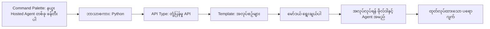
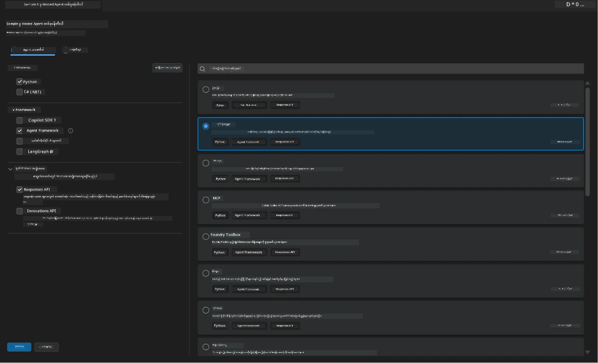
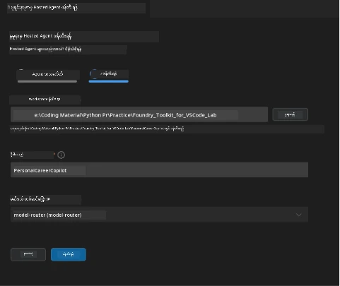

# မော်ဂျူး ၂ - မလျှာအေးဂျင့်စီမံကိန်း ဖန်တီးခြင်း

⏱️ ~၅ မိနစ်

ဤမော်ဂျူးတွင် သင်သည် [Foundry Toolkit for VS Code](https://aka.ms/foundrytk) ကို အသုံးပြု၍ **မလျှာအေးဂျင့်စီမံကိန်းတစ်ခု ဖန်တီးခြင်း** ကို ဆောင်ရွက်ပါမည်။ မေးစပ်က `agent.yaml`, `main.py`, `Dockerfile`, `requirements.txt`, `.env` နှင့် VS Code debug ဖန်တီးမှုများ ရေးဆွဲပေးပြီး မော်ဂျူး ၃ တွင် ၄-အေးဂျင့် ဝန်းလုံးဆွဲကို အာရုံစိုက်နိုင်ရန် အလွယ်တကူဖြစ်စေသည်။

> **အဓိကအယူအဆ:** မေးစပ်သည် အေးဂျင့် တစ်ဦး ဖြင့် လုပ်ဆောင်လျက်ရှိသော စတတ်ဘ် ဖြစ်သည်။ မော်ဂျူး ၃ တွင် `WorkflowBuilder` ကိုယ်ရေးအုပ်စု နှင့် အစားထိုးမည်ဖြစ်ပြီး မူလကပုံစံကို သင့်တော်စွာ မရေးကြပါက မဟုတ်ပါ။

> **နမူနာအကောင်အထည်:** [`PersonalCareerCopilot/`](../../../../../workshop/lab02-multi-agent/PersonalCareerCopilot) သည် ပြီးပြည့်စုံသော လုပ်ငန်းနမူနာ ဖြစ်သည်။ သင်၏ လုပ်ငန်းနှင့် နှိုင်းယှဉ်ရန် အသုံးပြုပါ။

### မေးစပ် ကိန်းတော့လမ်းကြောင်း


```mermaid
flowchart LR
    A[Command Palette: နယူး Hosted Agent တစ်ခု ဖန်တီးပါ] --> B[ဘာသာစကား: Python]
    B --> C[API Type: တုံ့ပြန်မှု API]
    C --> D[Template: အလုပ်စဉ်များ]
    D --> E[မော်ဒယ် ရွေးချယ်ပါ]
    E --> F[အလုပ်လုပ်ရန် ဖိုလ်ဒါနှင့် Agent အမည်]
    F --> G[ထုတ်လုပ်ထားသော ပရောဂျက်]
```

---

## အဆင့် ၁ - Create Hosted Agent မေးစပ် ဖွင့်ခြင်း

၁။ `Ctrl+Shift+P` ကိုနှိပ်ကာ **Command Palette** ကို ဖွင့်ပါ။
၂။ ရိုက်ထည့်ပါ - **Foundry Toolkit: Create a New Hosted Agent** အား ရွေးချယ်ပါ။
၃။ မေးစပ်သည် **Agent Details** တက်ဘ်တွင် ဖွင့်ပါလိမ့်မည်။

> **အခြားနည်းလမ်း:** Activity Bar တွင် **Foundry Toolkit** အိုင်ကွန်ကို နှိပ်ပါ → **Hosted Agents** ဘယ်ဘက်ရှိ **+** အိုင်ကွန်ကို နှိပ်ပါ → **Create New Hosted Agent** ကို ရွေးချယ်ပါ။

---

## အဆင့် ၂ - ဆက်တင်များ ရွေးချယ်ခြင်း



၁။ ဘယ်ဘက် ပုံစံရွေးချယ်မှုတွင် အောက်ပါများကို ရွေးချယ်ပါ။

| မီနူး | ရွေးချယ်မှု | မှတ်ချက်များ |
|--------|-----------|-------|
| **ဘာသာစကား** | Python | C# (.NET) လည်း ထောက်ခံသည် |
| **ဖရိamework** | Agent Framework | `Agent`, `AgentExecutor`, `WorkflowBuilder` များ ပေးသည် |
| **API အမျိုးအစား** | Response API | `POST /responses` - စီမံခန့်ခွဲထားသော မှတ်တမ်း၊ streaming ထောက်ခံမှု |
| **ပုံစံ** | **Workflows** | အေးဂျင့်များစဉ်ဆက် လုပ်ဆောင်ရန် ဆုပ်ကိုင်သည် |

၂။ ရွေးပြီးလျှင် **Next** ဖိပါ



၃။ နောက်ထပ်ပြတင်းပေါက်တွင် အောက်ပါများကို ရွေးချယ်ပါ။

| မီနူး | ရွေးချယ်မှု | မှတ်ချက်များ |
|--------|-----------|-------|
| **အလုပ်လုပ်ရန်ဖိုဒါ** | ရွေးချယ်ရန် browse လုပ်ပါ | ဥပမာ - ဒီ repo ထဲမှ `workshop/lab02-multi-agent/` |
| **အေးဂျင့်အမည်** | `PersonalCareerCopilot` | စီမံကိန်းဒိုင်ရေးတွင် ဘာသာဖြစ်မည် |
| **Model Deployment** | သင့်ထည့်ထားသော မော်ဒယ် ရွေးချယ်ပါ | မှတ်တမ်း ၁ မှ `gpt-4.1-mini` ကဲ့သို့ |

၄။ **Create** ကို နှိပ်ကာ စီမံကိန်းကို ဖန်တီးပါ။ VS Code သည် ဖိုင်များ ကို ထုတ်ပေးပြီး ဖိုဒါကို ဖွင့်ပါလိမ့်မည်။

> **အကြံပြုချက်:** [`gpt-4.1-mini`](https://learn.microsoft.com/azure/foundry/foundry-models/concepts/models-sold-directly-by-azure#gpt-41-series) သည် မလျှာအေးဂျင့် ဖွံ့ဖြိုးမှုအတွက် အမြန်နှုန်းနှင့် အရည်အသွေးကို သင့်တော်စွာ ဖြည့်ဆည်းပေးသည်။

---

## အဆင့် ၃ - ဖန်တီးပြီးသော စီမံကိန်းကို ကြည့်ရှုခြင်း

ဖန်တီးမှုပြီးဆုံးသည်နောက် Explorer (`Ctrl+Shift+E`) တွင် အောက်ပါ ဖိုင်များ တွေ့ရမည်။

```
📂 <your-agent-name>/
├── .azdignore          ← Files excluded from Azure Developer CLI deployments
├── .dockerignore       ← Files excluded from Docker builds
├── .env                ← Environment variables (placeholders - fill in Module 3)
├── .vscode/
│   ├── launch.json     ← Debug config (F5 → run + Agent Inspector)
│   └── tasks.json      ← VS Code task definitions
├── agent.yaml          ← Agent definition (kind: hosted, protocol: responses)
├── Dockerfile          ← Container config for deployment
├── main.py             ← Stub agent entry point (replace with WorkflowBuilder in Module 3)
└── requirements.txt    ← Python dependencies
```

> **အရေးကြီးချက်:** ဒီဖန်တီးထားသော ဖိုဒါကို VS Code မှာတိုက်ရိုက်ဖွင့်၍ `.vscode/launch.json` နှင့် `tasks.json` များမှ F5 debugging အတွက် မှန်ကန်စွာ လုပ်ဆောင်နိုင်စေရန်ဖြစ်သည်။

### အဓိကဖိုင်များ ရှင်းလင်းချက်

| ဖိုင် | ရည်ရွယ်ချက် |
|------|---------|
| `agent.yaml` | `kind: hosted` ထုတ်ဖေါ်၊ အတ်မှတ်ချိတ်ဆက်၊ `/responses` ဆက်သွယ်ရေးပုံစံ သတ်မှတ်သည် |
| `main.py` | စတတ်ဘ် - တစ်ခုတည်းသော `FoundryChatClient` → `Agent` → `ResponsesHostServer` ဖြစ်သည်။ မော်ဂျူး ၃ တွင် ၄ အေးဂျင့် နှင့် `WorkflowBuilder` ဖြင့် အစားထိုးမည် |
| `Dockerfile` | `python:3.12-slim`, `requirements.txt` တပ်ဆင်ပြီး port 8088 ဖော်ပြ၊ `python main.py` ကို chạy စေသည် |
| `requirements.txt` | `agent-framework-foundry`, `agent-framework-foundry-hosting`, `mcp<2,>=1.24.0`, `debugpy` များပါ၀င်သည် |

> **ရင်းမြစ်:** ပြီးပြည့်စုံသော ဖန်တီးမှုအကြောင်းအရာကို [`PersonalCareerCopilot/agent.yaml`](../../../../../workshop/lab02-multi-agent/PersonalCareerCopilot/agent.yaml) နှင့် [`PersonalCareerCopilot/requirements.txt`](../../../../../workshop/lab02-multi-agent/PersonalCareerCopilot/requirements.txt) တွင် ကြည့်ရှုနိုင်သည်။

---

### ✅ စစ်ဆေးချက်

- [ ] မေးစပ် ကိန်းတော့ပြီးစီး - Explorer တွင် စီမံကိန်း ဖိုဒါအသစ် တွေ့ရသည်
- [ ] မျှော်လင့်သော ဖိုင်များ ပြည့်စုံသည် - `agent.yaml`, `main.py`, `Dockerfile`, `requirements.txt`, `.env`
- [ ] `agent.yaml` တွင် `kind: hosted` နှင့် `protocol: responses` ပြသည်
- [ ] `main.py` တွင် `Agent`, `FoundryChatClient`, `ResponsesHostServer` ကို import ပြုလုပ်သည်
- [ ] ဖန်တီးထားသော ဖိုဒါသည် VS Code အလုပ်လုပ်ရာ မျဉ်းကြောင်း ဦးရိုးအဖြစ် ဖွင့်ထားသည်
- [ ] သင်သည် `main.py` သည် စတတ်ဘ်ဖြစ်ပြီး - `WorkflowBuilder` ကို မော်ဂျူး ၃ တွင် ထည့်သွင်းမည်ဟု နားလည်ထားသည်

---

**မတိုင်ခင်:** [01 - Understand Multi-Agent Architecture](01-understand-multi-agent.md) · **နောက်တစ်ခု:** [03 - Configure Agents & Environment →](03-configure-agents.md)

---

<!-- CO-OP TRANSLATOR DISCLAIMER START -->
**ပြောကြားချက်**
ဤစာတမ်းကို AI ဘာသာပြန်ဝန်ဆောင်မှု [Co-op Translator](https://github.com/Azure/co-op-translator) အသုံးပြု၍ ဘာသာပြန်ထားပါသည်။ ကျွန်ုပ်တို့သည် တိကျမှန်ကန်မှုအတွက် ကြိုးပမ်းနေသော်လည်း၊ စက်ကိရိယာဘာသာပြန်ခြင်းများတွင် အမှားများ သို့မဟုတ် မှားယွင်းချက်များ ပါဝင်နိုင်ကြောင်း သတိပြုပါရန် လိုအပ်ပါသည်။ မူလစာတမ်းကို မူရင်းဘာသာဖြင့်သာ ယုံကြည်စိတ်ချရသော အချက်အလက်အဖြစ် သတ်မှတ်သင့်သည်။ အရေးကြီးသည့် သတင်းအချက်အလက်များအတွက် ပရော်ဖက်ရှင်နယ် လူသားဘာသာပြန်သူဝန်ဆောင်မှုကို အကြံပြုပါသည်။ ဤဘာသာပြန်ချက်ကို အသုံးပြုခြင်းမှ ဖြစ်ပေါ်လာသော နားလည်မှုကွာခြားမှုများ သို့မဟုတ် မမှန်ကန်သော အသုံးပြုမှုများအတွက် ကျွန်ုပ်တို့ တာဝန်မခံပါ။
<!-- CO-OP TRANSLATOR DISCLAIMER END -->