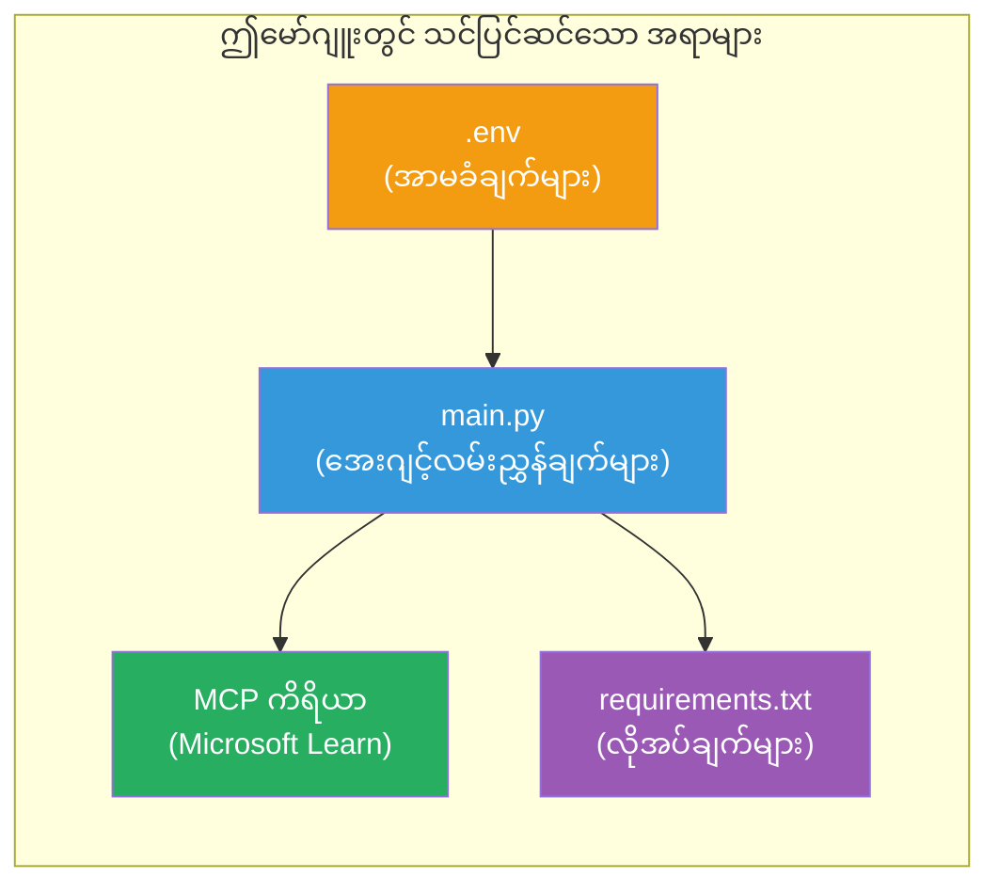

# Module 3 - ကိုယ်စားလှယ်များ၊ MCP အကိရိယာနှင့် ပတ်ဝန်းကျင် စည်းမျဉ်းစနစ် ပြုလုပ်ခြင်း

ဤမော်ဂျူးမှာ သင်သည် ရှယ်ယာမြှောက်ထားသော များစွာသော ကိုယ်စားလှယ်ကြီးစီမံကိန်းကို စိတ်ကြိုက်ပြင်ဆင်မည်ဖြစ်သည်။ ကိုယ်စားလှယ်လေးဦး၏ ထည့်သွင်းသတ်မှတ်ချက်များရေးသားပြီး Microsoft Learn အတွက် MCP ကိရိယာကို တပ်ဆင်ကာ ပတ်ဝန်းကျင် အပြောင်းအလဲများပြုလုပ်ခြင်းနှင့် လိုအပ်သော အရင်းအမြစ်များကို ထည့်သွင်းပါမည်။


> **ရင်းမြစ်:** ပြည့်စုံမူရင်းလည်ပတ်သောကုဒ်ကို [`PersonalCareerCopilot/main.py`](../../../../../workshop/lab02-multi-agent/PersonalCareerCopilot/main.py) တွင် တွေ့ရှိနိုင်သည်။ ကိုယ်ပိုင်ဆောက်လုပ်မှုအတွက် ဤကို ကိုးကားပါ။

---

## အဆင့် ၁: ပတ်ဝန်းကျင် သတ်မှတ်ချက်များ ပြုလုပ်ခြင်း

1. ချိတ်ဆက်ထားသည့် ပရောဂျက် အမည်ဖြင့် **`.env`** ဖိုင်ကို ဖွင့်ပါ။
2. သင့် Foundry ပရောဂျက်အသေးစိတ်များ ဖြည့်သွင်းပါ-

   ```env
   PROJECT_ENDPOINT=https://<your-account>.services.ai.azure.com/api/projects/<your-project>
   MODEL_DEPLOYMENT_NAME=gpt-4.1-mini
   ```

3. ဖိုင်ကို သိမ်းဆည်းပါ။

### ဤတန်ဖိုးများကို မည်သို့ ရှာမည်နည်း

| တန်ဖိုး | မည်သို့ ရှာမည်နည်း |
|---------|------------------|
| **Project endpoint** | Microsoft Foundry ဘေးပြား → သင့်ပရောဂျက်ကိုနှိပ် → အသေးစိတ်ကြည့်ရှုမှုတွင် endpoint URL |
| **Model deployment name** | Foundry ဘေးပြား → ပရောဂျက်တိုးချဲ့ → **Models + endpoints** → မော်ဒယ် name ထည့်သွင်းထားသောနေရာ |

> **လုံခြုံရေး:** `.env` ကို version control တွင် မတင်သွင်းသင့်ပါ။ မရှိသေးလျှင် `.gitignore` ထဲ ထည့်ပေးပါ။

### ပတ်ဝန်းကျင် သတ်မှတ်ချက် မျှဝေမှု

multi-agent `main.py` တွင် စံနမူနာနှင့် workshop အထူး env var နာမည်များကို ဖတ်ရှုသည်-

```python
PROJECT_ENDPOINT = os.getenv("AZURE_AI_PROJECT_ENDPOINT") or os.getenv("PROJECT_ENDPOINT")
MODEL_DEPLOYMENT_NAME = os.getenv(
    "AZURE_AI_MODEL_DEPLOYMENT_NAME",
    os.getenv("MODEL_DEPLOYMENT_NAME", "gpt-4.1-mini"),
)
MICROSOFT_LEARN_MCP_ENDPOINT = os.getenv(
    "MICROSOFT_LEARN_MCP_ENDPOINT", "https://learn.microsoft.com/api/mcp"
)
```

MCP endpoint ကို အဖြစ်သတ်မှတ်ထားသည့် default တန်ဖိုး ရှိသဖြင့် `.env` တွင် မထည့်သွင်းရပါ။

---

## အဆင့် ၂: ကိုယ်စားလှယ် ထည့်သွင်းချက်များ ရေးသားခြင်း

ဤအဆင့်မှာ အရေးအကြီးဆုံး ဖြစ်သည်။ ကိုယ်စားလှယ်တိုင်းသည် ၎င်း၏ အခန်းကဏ္ဍ၊ ထွက်ရှိမည့် ပုံစံနှင့် စည်းကမ်းချက်များ သတ်မှတ်ထားသော ဖော်ပြချက်များ လိုအပ်သည်။ `main.py` ဖိုင်ကို ဖွင့်ကာ instruction constant များ ပြုလုပ်ပါ။

### ၂.၁ ရှင်စီးတင်ချက် သုံးစွဲရေး ကိုယ်စားလှယ်

```python
RESUME_PARSER_INSTRUCTIONS = """\
You are the Resume Parser.
Extract resume text into a compact, structured profile for downstream matching.

Output exactly these sections:
1) Candidate Profile
2) Technical Skills (grouped categories)
3) Soft Skills
4) Certifications & Awards
5) Domain Experience
6) Notable Achievements

Rules:
- Use only explicit or strongly implied evidence.
- Do not invent skills, titles, or experience.
- Keep concise bullets; no long paragraphs.
- If input is not a resume, return a short warning and request resume text.
"""
```

**ဤအပိုင်းများကို ဘာကြောင့်အသုံးပြုသလဲ?** MatchingAgent သည် စနစ်တကျ ကျက်သရေရှိသော ဒေတာများလိုအပ်သည်။ တစ်ကိုယ်စားလှယ်မှတစ်ကိုယ်စားလှယ် သို့ လက်ခံပို့ဆောင်မှု တိကျမှုရှိစေရန် အပိုင်းများ သာမန်ထားပါ။

### ၂.၂ အလုပ်လိုအပ်ချက် ကိုယ်စားလှယ်

```python
JOB_DESCRIPTION_INSTRUCTIONS = """\
You are the Job Description Analyst.
Extract a structured requirement profile from a JD.

Output exactly these sections:
1) Role Overview
2) Required Skills
3) Preferred Skills
4) Experience Required
5) Certifications Required
6) Education
7) Domain / Industry
8) Key Responsibilities

Rules:
- Keep required vs preferred clearly separated.
- Only use what the JD states; do not invent hidden requirements.
- Flag vague requirements briefly.
- If input is not a JD, return a short warning and request JD text.
"""
```

**လိုအပ်ချက် နှင့် ဦးစားပေးချက် မတူဟု ရွေးချယ်ခြင်းအကြောင်း** MatchingAgent သည် အတင်းအကန့်အရ ဖြင့် အဓိက = ၄၀ နံပါတ်၊ ဦးစားပေး = ၁၀ နံပါတ်အဖြစ် အသုံးပြုသည်။

### ၂.၃ ကိုက်ညီမှု ကိုယ်စားလှယ်

```python
MATCHING_AGENT_INSTRUCTIONS = """\
You are the Matching Agent.
Compare parsed resume output vs JD output and produce an evidence-based fit report.

Scoring (100 total):
- Required Skills 40
- Experience 25
- Certifications 15
- Preferred Skills 10
- Domain Alignment 10

Output exactly these sections:
1) Fit Score (with breakdown math)
2) Matched Skills
3) Missing Skills
4) Partially Matched
5) Experience Alignment
6) Certification Gaps
7) Overall Assessment

Rules:
- Be objective and evidence-only.
- Keep partial vs missing separate.
- Keep Missing Skills precise; it feeds roadmap planning.
"""
```

**မူရင်း အမှတ်ပေးခြင်း အရေးကြီးချက်။** ပြန်လည်တူညီမှု ရှိစေရန်နဲ့ အမှားရှာဖွေရန် ရှင်းလင်းသော အမှတ်ပေးကိန်းသည် အလွယ်တကူ နားလည်နိုင်စေနိုင်သည်။

### ၂.၄ ပမာဏ ရှာဖွေမှု ကိုယ်စားလှယ်

```python
GAP_ANALYZER_INSTRUCTIONS = """\
You are the Gap Analyzer and Roadmap Planner.
Create a practical upskilling plan from the matching report.

Microsoft Learn MCP usage (required):
- For EVERY High and Medium priority gap, call tool `search_microsoft_learn_for_plan`.
- Use returned Learn links in Suggested Resources.
- Prefer Microsoft Learn for free resources.

CRITICAL: You MUST produce a SEPARATE detailed gap card for EVERY skill listed in
the Missing Skills and Certification Gaps sections of the matching report. Do NOT
skip or combine gaps. Do NOT summarize multiple gaps into one card.

Output format:
1) Personalized Learning Roadmap for [Role Title]
2) One DETAILED card per gap (produce ALL cards, not just the first):
   - Skill
   - Priority (High/Medium/Low)
   - Current Level
   - Target Level
   - Suggested Resources (include Learn URL from tool results)
   - Estimated Time
   - Quick Win Project
3) Recommended Learning Order (numbered list)
4) Timeline Summary (week-by-week)
5) Motivational Note

Rules:
- Produce every gap card before writing the summary sections.
- Keep it specific, realistic, and actionable.
- Tailor to candidate's existing stack.
- If fit >= 80, focus on polish/interview readiness.
- If fit < 40, be honest and provide a staged path.
"""
```

**"အရေးပေါ်" အာရုံစိုက်မှု မရှိမဖြစ် အရေးကြီးသည်။** အားလုံး ပါဝင်သော gap card များအား ထုတ်ပေးရန် အတိအကျဖော်ပြမှု မရှိပါက မော်ဒယ်သည် card ၁-၂ ချက်တည်းထုတ်ပေးပြီး အခြားများကို စုစည်းပြောကြားလေ့ရှိသည်။ "အရေးပေါ်" မျက်နှာဖုံးက ထိုကန့်သတ်မှုကို ရှောင်ရှားသည်။

---

## အဆင့် ၃: MCP ကိရိယာ သတ်မှတ်ခြင်း

GapAnalyzer သည် [Microsoft Learn MCP server](https://learn.microsoft.com/azure/foundry/agents/how-to/tools/model-context-protocol) ကို ခေါ်သုံးသော ကိရိယာတစ်ခု အသုံးပြုသည်။ `main.py` တွင် ဤအတိုင်း ထည့်သွင်းပါ-

```python
import json
from agent_framework import tool
from mcp.client.session import ClientSession
from mcp.client.streamable_http import streamable_http_client

@tool
async def search_microsoft_learn_for_plan(
    skill: str, role: str = "", max_results: int = 5
) -> str:
    """Search Microsoft Learn MCP and return curated official links for roadmap planning."""
    query = " ".join(part for part in [skill, role, "learning path module"] if part).strip()
    query = query or "job skills learning path"

    try:
        async with streamable_http_client(MICROSOFT_LEARN_MCP_ENDPOINT) as (
            read_stream, write_stream, _,
        ):
            async with ClientSession(read_stream, write_stream) as session:
                await session.initialize()
                result = await session.call_tool(
                    "microsoft_docs_search", {"query": query}
                )

        if not result.content:
            return (
                "No results returned from Microsoft Learn MCP. "
                "Fallback: https://learn.microsoft.com/training/support/catalog-api"
            )

        payload_text = getattr(result.content[0], "text", "")
        data = json.loads(payload_text) if payload_text else {}
        items = data.get("results", [])[:max(1, min(max_results, 10))]

        if not items:
            return f"No direct Microsoft Learn results found for '{skill}'."

        lines = [f"Microsoft Learn resources for '{skill}':"]
        for i, item in enumerate(items, start=1):
            title = item.get("title") or item.get("url") or "Microsoft Learn Resource"
            url = item.get("url") or item.get("link") or ""
            lines.append(f"{i}. {title} - {url}".rstrip(" -"))
        return "\n".join(lines)
    except Exception as ex:
        return (
            f"Microsoft Learn MCP lookup unavailable. Reason: {ex}. "
            "Fallbacks: https://learn.microsoft.com/api/mcp"
        )
```

### ကိရိယာ စနစ်လုပ်ဆောင်ပုံ

| အဆင့် | ဖြစ်ပွားမှု |
|---------|-------------|
| ၁ | GapAnalyzer သည် ကျွမ်းကျင်မှုတစ်ခု (ဥပမာ "Kubernetes") အတွက်ရင်းမြစ်လိုအပ်ကြောင်းဆုံးဖြတ်သည်။ |
| ၂ | Framework သည် `search_microsoft_learn_for_plan(skill="Kubernetes")` ကိုခေါ်သည်။ |
| ၃ | Function သည် [Streamable HTTP](https://learn.microsoft.com/agent-framework/agents/tools/hosted-mcp-tools) ချိတ်ဆက်မှုကို `https://learn.microsoft.com/api/mcp` သို့ဖွင့်သည်။ |
| ၄ | [MCP server](https://learn.microsoft.com/azure/foundry/agents/how-to/tools/model-context-protocol) တွင် `microsoft_docs_search` ကိုခေါ်သည်။ |
| ၅ | MCP server သည် ရှာဖွေမှုပေါင်းစုံ (ခေါင်းစဉ် + URL) ပြန်ပေးသည်။ |
| ၆ | Function သည် ရလဒ်များကို နံပါတ်ထိုးစာရင်းအဖြစ် ဖော်ပြသည်။ |
| ၇ | GapAnalyzer သည် URL များကို gap card တွင် ထည့်သွင်းသည်။ |

### MCP မှ အရင်းအမြစ်များ

MCP client libraries များကို [`agent-framework-core`](https://learn.microsoft.com/agent-framework/overview/) မှ တဆင့် ထည့်သွင်းပေးသည်။ `requirements.txt` တွင် ထပ်မပြီး ထည့်သွင်းရန် မလိုအပ်ပါ။ Import အမှားရှိရင် အောက်ပါအချက်များကို စစ်ဆေးပါ-

```powershell
pip list | Select-String "mcp"
```

မျှော်မှန်းသည်- `mcp` package ကို (ထောက်ခံမှု 1.x ထက်မသေး) ထည့်သွင်းထားသည်။

---

## အဆင့် ၄: ကိုယ်စားလှယ်များ နှင့် လုပ်ငန်းစဥ် ကို ချိတ်ဆက်ခြင်း

### ၄.၁ context managers ဖြင့် ကိုယ်စားလှယ်များ ဖန်တီးခြင်း

```python
from contextlib import asynccontextmanager

@asynccontextmanager
async def create_agents():
    async with (
        get_credential() as credential,
        AzureAIAgentClient(
            project_endpoint=PROJECT_ENDPOINT,
            model_deployment_name=MODEL_DEPLOYMENT_NAME,
            credential=credential,
        ).as_agent(
            name="ResumeParser",
            instructions=RESUME_PARSER_INSTRUCTIONS,
        ) as resume_parser,
        AzureAIAgentClient(
            project_endpoint=PROJECT_ENDPOINT,
            model_deployment_name=MODEL_DEPLOYMENT_NAME,
            credential=credential,
        ).as_agent(
            name="JobDescriptionAgent",
            instructions=JOB_DESCRIPTION_INSTRUCTIONS,
        ) as jd_agent,
        AzureAIAgentClient(
            project_endpoint=PROJECT_ENDPOINT,
            model_deployment_name=MODEL_DEPLOYMENT_NAME,
            credential=credential,
        ).as_agent(
            name="MatchingAgent",
            instructions=MATCHING_AGENT_INSTRUCTIONS,
        ) as matching_agent,
        AzureAIAgentClient(
            project_endpoint=PROJECT_ENDPOINT,
            model_deployment_name=MODEL_DEPLOYMENT_NAME,
            credential=credential,
        ).as_agent(
            name="GapAnalyzer",
            instructions=GAP_ANALYZER_INSTRUCTIONS,
            tools=[search_microsoft_learn_for_plan],
        ) as gap_analyzer,
    ):
        yield resume_parser, jd_agent, matching_agent, gap_analyzer
```

**အဓိက အချက်များ:**
- ကိုယ်စားလှယ်တိုင်းသည် သူ့ကိုယ်ပိုင် `AzureAIAgentClient` instance ရှိသည်
- GapAnalyzer သာ `tools=[search_microsoft_learn_for_plan]` ရရှိသည်
- `get_credential()` သည် Azure တွင် [`ManagedIdentityCredential`](https://learn.microsoft.com/python/api/overview/azure/identity-readme#managed-identity-support) ကို၊ ဒေသတွင်းတွင် [`DefaultAzureCredential`](https://learn.microsoft.com/azure/developer/python/sdk/authentication/credential-chains#defaultazurecredential-overview) ကို ပြန်ပေးသည်

### ၄.၂ လုပ်ငန်းစဥ် ဖန်တီးခြင်း

```python
def create_workflow(resume_parser, jd_agent, matching_agent, gap_analyzer):
    workflow = (
        WorkflowBuilder(
            name="ResumeJobFitEvaluator",
            start_executor=resume_parser,
            output_executors=[gap_analyzer],
        )
        .add_edge(resume_parser, jd_agent)
        .add_edge(resume_parser, matching_agent)
        .add_edge(jd_agent, matching_agent)
        .add_edge(matching_agent, gap_analyzer)
        .build()
    )
    return workflow.as_agent()
```

> `.as_agent()` ပုံစံကို နားလည်ရန် [Workflows as Agents](https://learn.microsoft.com/agent-framework/workflows/as-agents) ကို ကြည့်ပါ။

### ၄.၃ ဆာဗာ စတင်ခြင်း

```python
async def main() -> None:
    validate_configuration()
    async with create_agents() as (resume_parser, jd_agent, matching_agent, gap_analyzer):
        agent = create_workflow(resume_parser, jd_agent, matching_agent, gap_analyzer)
        from azure.ai.agentserver.agentframework import from_agent_framework
        await from_agent_framework(agent).run_async()

if __name__ == "__main__":
    asyncio.run(main())
```

---

## အဆင့် ၅: virtual environment ဖန်တီးခြင်း နှင့် ဖွင့်လှစ်ခြင်း

### ၅.၁ environment ဖန်တီးခြင်း

```powershell
cd workshop\lab02-multi-agent\PersonalCareerCopilot
python -m venv .venv
```

### ၅.၂ ဖွင့်လှစ်ခြင်း

**PowerShell (Windows):**
```powershell
.\.venv\Scripts\Activate.ps1
```

**macOS/Linux:**
```bash
source .venv/bin/activate
```

### ၅.၃ အားကိုးအပ်သော အရင်းအမြစ်များ ထည့်သွင်းခြင်း

```powershell
pip install -r requirements.txt
```

> **မှတ်ချက်။** `requirements.txt` တွင် `agent-dev-cli --pre` အတန်းသည် နောက်ဆုံးကြိုဆိုမှုဗားရှင်းသို့ တပ်ဆင်ရန် သေချာစေသည်။ `agent-framework-core==1.0.0rc3` နှင့် ကိုက်ညီမှုအတွက် လိုအပ်ပါသည်။

### ၅.၄ ထည့်သွင်းမှု စစ်ဆေးခြင်း

```powershell
pip list | Select-String "agent-framework|agentserver|agent-dev"
```

မျှော်မှန်း ဩတ္တရ်-
```
agent-dev-cli                  0.0.1b260316
agent-framework-azure-ai       1.0.0rc3
agent-framework-core            1.0.0rc3
azure-ai-agentserver-agentframework 1.0.0b16
azure-ai-agentserver-core      1.0.0b16
```

> **`agent-dev-cli` သည် မကြာသေးခင် ဗားရှင်းဟောင်း (ဥပမာ `0.0.1b260119`) ပြရန်၊ Agent Inspector သည် 403/404 အမှားဖြင့် ယှဉ်ပြိုင်မှု မရပါ။ ကြားဖြတ်: `pip install agent-dev-cli --pre --upgrade`**

---

## အဆင့် ၆: အတည်ပြုချက် စစ်ဆေးခြင်း

Lab 01 မှ auth စစ်ဆေးမှုကို ထပ်မံလုပ်ဆောင်ပါ-

```powershell
az account show --query "{name:name, id:id}" --output table
```

ထိုကဲ့သို့ မအောင်မြင်ပါက [`az login`](https://learn.microsoft.com/cli/azure/authenticate-azure-cli-interactively) ကို ပြေးပါ။

multi-agent workflows တွင် ကိုယ်စားလှယ်လေးဦး လုံးကြီး အတူတကွ credential မျှဝေပေးသည်။ တစ်ယောက် အောင်မြင်ပါက အားလုံးအောင်မြင်သည်။

---

### စစ်ဆေးချက်

- [ ] `.env` တွင် မှန်ကန်သော `PROJECT_ENDPOINT` နှင့် `MODEL_DEPLOYMENT_NAME` တန်ဖိုးများ ရှိနေပါစေ
- [ ] `main.py` တွင် ကိုယ်စားလှယ် instruction constant များလေးခု ထည့်သွင်းပြီး (ResumeParser, JD Agent, MatchingAgent, GapAnalyzer)
- [ ] `search_microsoft_learn_for_plan` MCP ကိရိယာကို ပြုလုပ်ပြီး GapAnalyzer တွင် မှတ်ပုံတင်ထားသည်
- [ ] `create_agents()` သည် ကိုယ်ပိုင် `AzureAIAgentClient` instance ဖြင့် ကိုယ်စားလှယ်လေးဦးကို ဖန်တီးသည်
- [ ] `create_workflow()` သည် `WorkflowBuilder` ဖြင့် မှန်ကန်သော နည်းဇယား တည်ဆောက်သည်
- [ ] Virtual environment ဖန်တီးပြီး ဖွင့်လှစ်ထားသည် (`(.venv)` မြင်ရပါမည်)
- [ ] `pip install -r requirements.txt` မတားတား အောင် ပြီးစီးသည်
- [ ] `pip list` တွင် မျှော်မှန်းသည့် packages များနှင့် အသစ်ဆုံးဗားရှင်းများ (rc3 / b16) ပြသသည်
- [ ] `az account show` သည် သင့် subscription ကို ပြသသည်

---

**အရင်:** [02 - Scaffold Multi-Agent Project](02-scaffold-multi-agent.md) · **နောက်တစ်ခု:** [04 - Orchestration Patterns →](04-orchestration-patterns.md)

---

<!-- CO-OP TRANSLATOR DISCLAIMER START -->
**တရားဝင်ပယ်ချခြင်း**:
ဤစာရွက်စာတမ်းကို AI ဘာသာပြန်ဝန်ဆောင်မှု [Co-op Translator](https://github.com/Azure/co-op-translator) အသုံးပြု၍ ဘာသာပြန်ထားပါသည်။ ကျွန်ုပ်တို့သည် တိကျမှန်ကန်မှုအတွက် ကြိုးပမ်းနေသော်လည်း၊ အလိုအလျောက်ဘာသာပြန်ချက်များတွင် အမှားများ သို့မဟုတ် မှားယွင်းချက်များ ပါဝင်နိုင်ကြောင်း သတိပြုပါ။ မူလစာရွက်စာတမ်း၏ မူလဘာသာဖြင့်ဖတ်ရှုအပ်ပါသည်။ အရေးကြီးသောအချက်အလက်များအတွက် ကျွမ်းကျင်သော လူသားဘာသာပြန်မှ ဘာသာပြန်ခြင်းကို အကြံပြုပါသည်။ ဤဘာသာပြန်ချက်ကို အသုံးပြု၍ ဖြစ်ပေါ်လာနိုင်သည့် နားမလည်မှုများ သို့မဟုတ် မှားယွင်းနားလည်မှုများအတွက် ကျွန်ုပ်တို့သည် တာဝန်မရှိပါ။
<!-- CO-OP TRANSLATOR DISCLAIMER END -->